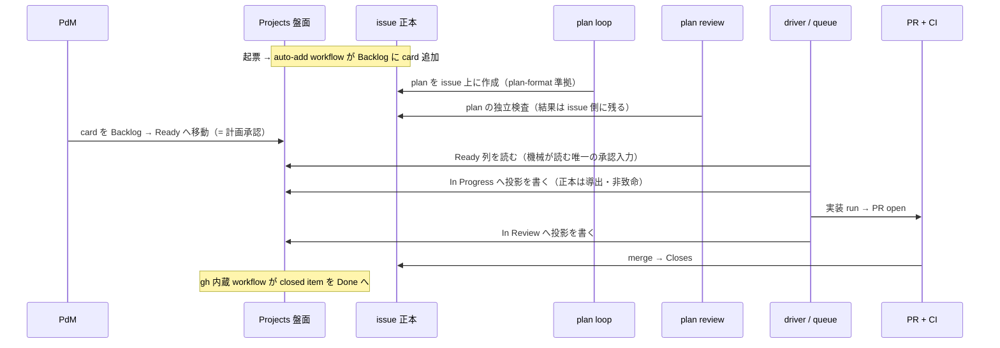
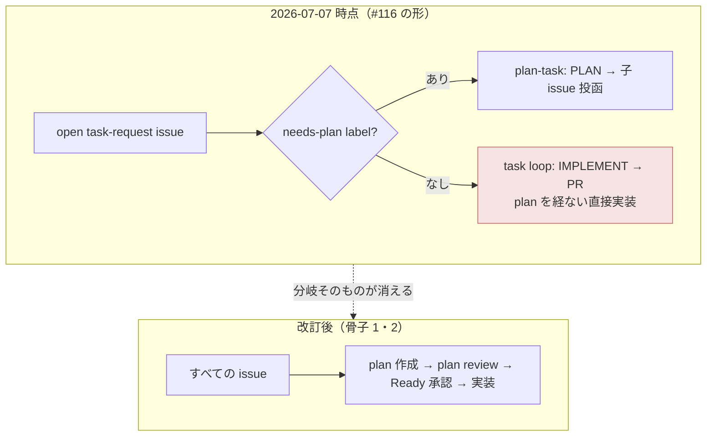

# issue #180 解説 — task ライフサイクルの全面改訂（plan 必須・Projects kanban 承認）

目次: [1. Background](#1-background) ／ [2. Intuition](#2-intuition) ／ [3. Code](#3-code) ／ [4. Quiz](#4-quiz)

この教材の対象は issue #180（`needs-explain` label 起点・主経路）。対象は diff ではなく **task ライフサイクルの全面改訂という PdM 裁定（2026-07-07）の理解**である。骨子は issue #180 本文に確定済みなので、この教材の仕事は「改訂後の世界を一枚で正確に組み立てて見せる」こと——統一ライフサイクルの全状態遷移、誰が動かすか、機械が何を読み何を書くか、現行実装（issue #116）からの差分、ADR 0031 §4 の修正点、issue #170／#178 の吸収、label 棚卸しの候補——を、ADR 0030／0031／0034・`design/plan-format.md`・`design/loops.md`・現行コード（`scripts/inner-loop-core.mjs`・`scripts/inner-queue-decisions.mjs`・`scripts/inner-queue.mjs`）・repo の label 実体（`gh label list` 2026-07-07 実測）に接地して描く。

> [!IMPORTANT]
> 本教材は骨子（issue #180 本文の「決定済みの骨子」6 項）の**展開**であって、新たな設計判断を含まない。骨子に書かれていない点（plan loop の起動機構・label 個別の採否・失敗時の盤面表現など）はすべて「未決」と明記する。実装の詳細は教材承認後の plan（ADR 0035 起草を含む）に委ねられている。

読者は Discussion #154（md 描画忠実度・receipt→CI）・#159（backlog 廃止・issue = task、ADR 0031）・#164（task loop 縮退・plan-task 導入、issue #116）・#174（plan review の欠落、issue #170）を既読とする。既出の背景はその都度参照に切り替える。

## 1. Background

### 1.1 前提の再掲（参照のみ）

- **task の基盤**: issue がそのまま task（TASK-N = issue #N・採番 = GitHub・却下なし、ADR 0031）。plan = issue body・裁定 = comment・needs-plan／escalation／優先度 = label。状態は保存せず導出する。詳細は Discussion #159。
- **task loop の縮退**: ローカル段は IMPLEMENT → PR 作成のみ。needs-plan label 付き issue は plan-task（終端 = plan 確定＋子 issue 投函）。issue #116 は 2026-07-07 時点で **merge 済み（closed）**であり、この形が現行実装である。詳細は Discussion #164。
- **plan review の欠落**: plan-task には生成された plan の内容を独立検査する段が無い（issue #170）。詳細は Discussion #174。
- **2 ゲート原則**: 系の強制点は入口（issue 作成 = 登記）と出口（PR + CI）の 2 つ（ADR 0030 §0）。

### 1.2 現行のライフサイクル — issue #116 が実装した形（2026-07-07 時点のコード）

現行の機械は 2 箇所で issue を読む。

**(a) run 型の選択** — `scripts/inner-loop-core.mjs` の `selectRunType`。読むのは label 名の配列だけである。

```js
export function selectRunType(labelNames) {
  const names = Array.isArray(labelNames) ? labelNames : [];
  return names.some((name) => String(name).toLowerCase() === NEEDS_PLAN_LABEL) ? 'plan-task' : 'task';
}
```

`needs-plan` あり → plan-task（PLAN → FILE_CHILDREN | ASK_PDM）。**なし → 実装 task（IMPLEMENT → LAND）**。つまり「label 無し = plan を経ず直接実装」が現行の機械の動作である。

**(b) 着手判定** — `scripts/inner-queue.mjs`＋`inner-queue-decisions.mjs`。open な `task-request` issue を列挙し、次をすべて導出で判定して着手する（保存しない、ADR 0031 §2）:

| 条件 | 導出元 |
|---|---|
| 依存が解決済み | body の `blocked-by #N` 参照先 issue がすべて closed |
| In Progress でない | その issue を参照する open PR（`Closes #N` または `inner/issue-<n>` branch）が無い |
| 裁定 loop の材料でない | `escalation` label が無い（ADR 0030 追記 E） |
| ローカルで走っていない | `inner-issue-<n>` worktree が無い |
| 変更範囲が重ならない・容量内 | body の `Touches:` 行と `--max` |

状態の導出は 3 値である: **To Do** = open issue／**In Progress** = 参照 PR open／**Done** = merge で issue close（ADR 0031 §2）。

**(c) 盤面** — GitHub Projects v2 は「同じ issue 群へのビュー」であり、ADR 0031 §4 の原文はこう規定する:

> 盤面のフィールド操作（列・優先度・milestone）は PdM の triage 空間であり、**機械は labels と issue 状態のみを読む**（Projects フィールドを機械の入力にしない）。

### 1.3 承認の操作面が分散している実像

「PdM が何かを承認する」操作は 2026-07-07 時点で複数の面に散っている。

| 承認 | 操作面 | 機械化の状態 |
|---|---|---|
| plan が必要かの振り分け | 起票者が `needs-plan` label を付ける（ADR 0030 追記 A） | 実装済み（`selectRunType`） |
| 教材を読んだ上での実装開始承認 | 教材 Discussion の **close**（ADR 0034 追記。当初 THUMBS_UP リアクション案から変更） | **未実装**（issue #178 が正規の実装単位・open） |
| 優先度・採否の triage | Projects 盤面（ビュー。機械は読まない） | 機械の入力ではない |
| plan-task の「PdM に諮る」 | ASK_PDM 終端（ADR 0030 追記 E） | 実装済み（正常終端の一つ） |

issue #180 の問題文はこの分散を指す:「承認の操作面が label / Discussion close 等に分散しており、PdM の作業面を GitHub Projects kanban に一元化したい」。

### 1.4 読み違いの構造 — ADR 0030 追記 A と「label 無し = 直接実装」

ADR 0030 追記 A の原文:

> 起票者が issue に `needs-plan` label を付けたか否かだけで決まる: label あり → plan-task（plan loop が走る）、**なし → 実装 task**。intake は label の有無という機械的事実のみを見る。

issue #116 はこれを「label 無し issue は plan を経ずそのまま IMPLEMENT へ」と実装した（§1.2 (a) のコードがその実体）。issue #180 本文はこれを「PdM の意図と異なる」とし、追記 A を「読み違いの元」と位置づける（関連欄:「ADR 0030 追記 A（読み違いの元）」）。PdM の意図は:

> **実装専用 issue は存在しない**——全ての実装は plan に依存し、plan は review され、PdM に承認されて初めて issue が実装可能になる。

つまり追記 A の「なし → 実装 task」は起票時の**振り分け**の話であって「plan 不要」を含意しない、というのが 2026-07-07 の PdM 裁定の読みである。現行実装は含意する側で作られている——このずれの解消が issue #180 の第一の仕事である。

## 2. Intuition

### 2.1 改訂後の世界を一枚で — 統一ライフサイクル（全 issue 共通）

骨子 1 の全状態遷移。列名は Projects の Team backlog テンプレに対応する（Backlog / Ready / In Progress / In Review / Done）。

```mermaid
flowchart LR
    subgraph BL["Backlog 列"]
        filed["未計画"] -->|"plan loop が issue 上に plan 作成"| planned["plan あり"]
        planned -->|"plan review が独立検査"| reviewed["plan 検査済み"]
    end
    create["issue 起票"] -->|"auto-add workflow が card 化"| filed
    reviewed -->|"PdM が Ready へ移動 = 計画承認"| ready["Ready 列"]
    ready -->|"driver が拾って着手"| prog["In Progress 列"]
    prog -->|"PR open"| rev["In Review 列"]
    rev -->|"merge で issue close"| done["Done 列"]
    classDef pdm fill:#fdf3d1,stroke:#c9a227,color:#333333
    classDef machine fill:#e3edf7,stroke:#5b8bc9,color:#333333
    class ready pdm
    class prog,rev,done machine
```



同じ一巡を、誰が読み・誰が書くかまで含めて時系列で描く。



### 2.2 誰が動かすか・機械は何を読み何を書くか

| 遷移 | 動かす主体 | 機械の読み書き |
|---|---|---|
| 起票 → Backlog | 起票者（PdM・loop の起票・escalation 投函）＋ **auto-add workflow（機械）** | 書き: card 追加（Projects 内蔵機構） |
| Backlog 内: plan 作成 | **plan loop（機械）** が issue 上に plan を作成（plan-format 準拠） | 書き: issue body（plan） |
| Backlog 内: plan review | **plan review（独立検査・機械）**。issue #170 の欠落がここで埋まる | 読み: plan。書き: 検査結果 |
| Backlog → Ready | **PdM のみ**。この移動が「計画承認」の唯一の操作 | 読み: **driver / queue が Ready 列を読む**（承認入力） |
| Ready → In Progress | driver が拾って着手 | 書き: **In Progress への投影**（正本は導出のまま・非致命） |
| In Progress → In Review | PR open | 書き: **In Review への投影**（同上） |
| In Review → Done | merge で issue close | 書き: **gh 内蔵 workflow**（closed → Done） |

読み書きの差分を before/after で並べる。

| | 2026-07-07 時点（#116 の形） | 改訂後（骨子） |
|---|---|---|
| 機械が**読む**もの | labels（`task-request`・`needs-plan`・`escalation`）＋ issue 状態＋ body（blocked-by・Touches）。**Projects は読まない**（ADR 0031 §4） | 上記に加えて **Ready 列だけ**を承認入力として読む |
| 機械が**書く**もの | issue（plan-task の子 issue・comment）・PR。盤面には書かない | 加えて **In Progress / In Review の投影**を盤面に書く |
| 状態の正本 | 導出（open / 参照 PR open / close） | **導出のまま**。盤面の列は投影であり、書き込み失敗は非致命 |
| 承認の操作面 | label（needs-plan）・Discussion close（ADR 0034 追記・未機械化）・ASK_PDM | **Projects の Ready 移動に一元化**（issue/PR/Discussion への到達も盤面から） |
| card | —（盤面は任意のビュー） | **issue のみ**。PR は issue card の状態遷移に反映（盤面を二重化しない、骨子 3） |

### 2.3 toy 例 — trivial バグ修正の一巡（before / after）

架空の例。ID・sha は実形式の架空値である。issue #301「ingest の retry が同一 event を二重登録する」（明白なバグ・数行修正）が `task-request` で起票されたとする。

**before（#116 の形）**: `needs-plan` が無いので `selectRunType` は `'task'` を返す。queue は blocked-by なし・open PR なしを確認して即着手。IMPLEMENT → branch `inner/issue-301`（HEAD `a3f92c1`）→ PR #305（`Closes #301`）→ CI GREEN → auto-merge → close。**この一巡のどこにも plan を読む工程が無い**。PdM が変更を知るのは事後である。

**after（骨子）**: 同じ issue #301 は起票直後に Backlog へ card 化される。trivial でも例外はない（骨子 2）——plan loop が plan-format の trivial scale で数行 plan を issue 上に作る:

```markdown
## 問題
ingest の retry が同一 event を二重登録する（events.id 重複、run_7f3a2c9e で観測）
## 修正方針
apps/web/lib/ingest の upsert 条件に event_uuid を追加
## 検証
unit: 同一 event_uuid を 2 回投入して 1 行。pnpm preflight --fast GREEN
```

plan review が独立検査 → PdM が盤面で card の plan を読み、Backlog → Ready へ動かす（= 承認）→ driver が Ready を読んで着手（In Progress 投影）→ PR #305 open（In Review 投影）→ merge で close（gh 内蔵 workflow が Done へ）。**変わるのは着手前に「plan を書く・検査する・PdM が読む」の 3 工程が必ず挟まること**であり、レール自体は 1 本のままである。

> [!NOTE]
> `design/plan-format.md`（2026-07-05 採用）のスケール規則は trivial 行に「**承認不要**」と書いている。骨子 2 の「例外を作らず同じレールに乗せる」はこの行と整合しない（trivial も Ready 承認を経る）。plan-format.md の追随改訂は issue #180 の実装スコープに明記されておらず、扱いは**未決**である。

### 2.4 ADR 0031 §4 の何がどう修正されるか

§1.2 (c) に引いた原文の 2 つの規定が、骨子 4 でそれぞれ部分修正される。

| ADR 0031 §4 原文 | 骨子 4 による修正 | 変わらないもの |
|---|---|---|
| 「機械は labels と issue 状態のみを読む（Projects フィールドを機械の入力にしない）」 | **Ready 列だけは機械が読む承認入力**になる（動かせるのは PdM のみ） | Ready 以外の列・優先度・milestone は引き続き機械の入力ではない |
| 「盤面は同じ issue 群へのビューであり同期が存在しない」 | **In Progress / In Review は機械が書く投影**になる（同期の書き込みが発生する） | **正本は導出のまま**。投影の書き込み失敗は非致命——ADR 0025 で問題になった「帳簿の二重記録」には戻らない（帳簿なら書き込み失敗は事故、投影なら表示遅延である） |

「原則ビュー」は維持され、例外が 2 種（読む例外 = Ready・書く例外 = 投影）だけ穿たれる、というのが修正の形である。この修正の正文は ADR 0035（実装スコープ内で起草）が担う。

### 2.5 骨子の外 — 未決事項の一覧

骨子に書かれておらず、この教材が答えを持たないもの:

- **plan loop の起動機構**: 「未計画の issue」を何が検出して plan loop を走らせるか（現行は `needs-plan` label が trigger。改訂後の trigger は未定）
- **plan-task 型（子 issue 分解）の去就**: 大きな主題を子 issue 群に割る終端（FILE_CHILDREN）が統一ライフサイクルでどう位置づくか
- **plan review の実体**: 検査者・PASS/FAIL の表現・FAIL 時の戻り先（issue #170 の設計は本改訂に吸収される「見込み」であり確定裁定ではない）
- **ADR 0034 の承認意味論の改訂内容**: Discussion close = 実装開始承認のシグナルが Ready 移動に置換された後、close の意味と agent の close 禁止（承認シグナル汚染防止）がどう書き直されるか
- **escalation・ASK_PDM の盤面表現**: 失敗系・相談系の遷移が列としてどう見えるか
- **label 個別の採否**: §3.4 の棚卸しは候補整理であり、廃止の決定は 1 つも下りていない（骨子 5 は「方針」）

## 3. Code — 骨子と現行実装・関連 issue の対応

### 3.1 issue #180 本文のウォークスルー

骨子 6 項を接地先と対応させる。

| # | 骨子 | 接地先・現行との差分 |
|---|---|---|
| 1 | 統一ライフサイクル（起票 → plan → plan review → Ready 承認 → In Progress → In Review → Done） | §2.1 の図。現行 3 値導出（ADR 0031 §2）が 5 列に細分化され、承認 2 工程（review・Ready）が新設される |
| 2 | trivial も例外なく trivial scale plan で同じレール | §2.3 の toy 例。`selectRunType` の「なし → 直接実装」分岐が消える |
| 3 | card は issue のみ（PR は issue card の遷移に反映） | 盤面の二重化防止。In Review は「PR card の出現」でなく「issue card の列移動」で表す |
| 4 | ADR 0031 §4 修正: Ready = 機械が読む承認入力・In Progress / In Review = 機械が書く投影（正本は導出・非致命） | §2.4 の対応表 |
| 5 | label 整理（意味重複の棚卸し・gh default と Projects 列で表現できるものは廃止する方針） | §3.4 の候補表 |
| 6 | PdM の操作面は Projects に一元化（issue/PR/Discussion への到達も盤面から） | §1.3 の分散表がこの一枚に畳まれる |

### 3.2 現行コードのどこが変わるか

実装スコープ（issue #180「実装が含むもの」）を現行コードに対応させる。

```
Projects 作成（Team backlog テンプレ・auto-add・close→Done workflow）
  → 新規（gh 側の設定。repo コードではない）
driver・queue の着手条件を「Ready」読み取りに変更
  → scripts/inner-queue.mjs / inner-queue-decisions.mjs
     現行: open task-request + blocked-by + PR 導出 + escalation label（§1.2 (b)）
     追加: Projects の Ready 列という新しい入力面（GraphQL ProjectV2）
  → scripts/inner-loop-core.mjs selectRunType
     「needs-plan 無し → 即 task」の意味が変わる（§1.4）
In Progress・In Review の投影書き込み
  → 新規（driver / review engine から盤面への書き込み。非致命設計）
ADR 0035 起草
  → adr/0035（§2.4 の修正の正文）
既存 open issue の盤面移行
  → 一回性の移行作業
```

これらは「教材承認後に plan へ」であり、2026-07-07 時点でどれも未着手である。

### 3.3 issue #170・#178 の吸収

issue #180 関連欄は両者を「本改訂に吸収される見込み」とする。

- **#170（plan review の欠落）**: Discussion #174 が整理した「plan-task の成果物は両ゲートの検査対象にならない」という構造欠落は、統一ライフサイクルの **plan review 段（骨子 1 の第 3 工程）**として埋まる。#170 側で独立に設計する代わりに、本改訂のレール上の 1 段になる——which 位置に挟むかという #174 §3.3 の選択肢整理は、骨子が「plan 作成の直後・Ready 承認の前」と答えた形である（検査の実体は未決、§2.5）
- **#178（教材承認ゲートの機械化）**: ADR 0034 追記の「`done-explain` 付き issue は教材 Discussion が closed でなければ着手不可」を driver / queue に実装する task だったが、**着手判定の承認入力が Ready 列に一元化される**なら、Discussion close を機械が読む必要はなくなる（PdM は教材を読んでから card を Ready に動かせばよい——読了確認と着手承認が 1 操作に畳まれる）。なお #178 本文の needs-explain = 着手不可（教材待ち）という前段の意味論がどう残るかは ADR 0035 起草時の論点である（未決）

どちらも「見込み」であり、吸収の確定は plan／ADR 0035 で下りる。

### 3.4 label 棚卸しの候補表

骨子 5 の「意味重複の棚卸し」の材料。repo の label 実体（`gh label list` 2026-07-07 実測・19 個）と機械参照（同日のコード grep）に接地する。**採否はすべて未決**——「代替候補」列は骨子 5 の観点（gh default / Projects 列で表現できるか）の当てはめである。

| label | 今日の役割（接地） | 機械参照（2026-07-07） | 代替候補 | 備考 |
|---|---|---|---|---|
| `task-request` | task 登記の印（ADR 0027 → 0031。queue の列挙条件） | `inner-queue.mjs` が読む | Projects card の存在（auto-add）で代替し得る | 登記 = 入口ゲートの実体。移行順序に注意 |
| `needs-plan` | plan-task 振り分け（ADR 0030 追記 A） | `selectRunType` が読む | 全 issue が plan を持つなら「未計画」は **Backlog 列内の位置**で表現し得る | 読み違いの元（§1.4）。plan loop の新 trigger 設計と連動（未決） |
| `escalation` | 裁定 loop の起動条件（ADR 0030 追記 E）。queue が skip 判定に読む | `inner-queue-decisions.mjs`（`ESCALATION_LABEL`） | 列（失敗系レーン）での表現は骨子に無い | **label 実体が repo に未作成**（コード参照だけが先行） |
| `needs-explain` | 解説 loop の依頼キュー（ADR 0032/0033） | 参照なし（#178 未実装） | 骨子に個別言及なし | ライフサイクル状態でなく横断キュー |
| `done-explain` | 解説済み・`label:done-explain` で全量検索 | 参照なし | 検索性は Projects で代替しにくい | #178 吸収後の意味論は ADR 0035 論点（§3.3） |
| 優先度（該当 label なし） | ADR 0031 §2 は「優先度 = label」と規定するが、priority 系 label は未作成 | 参照なし | Projects の Priority フィールド | 規定と実体が既に乖離している例 |
| `pending-approval`・`plan-approved`・`auto-ok` | 旧 plan-loop GATE の遺物（#116 で機構ごとコード削除・label 実体は残置・説明文なし） | 参照なし | **Ready 列が承認を表すため廃止候補の筆頭** | 「承認を label で表す」前世代の痕跡 |
| `intake-rejected`・`needs-pdm` | 旧 intake Action の遺物（ADR 0031 §3 で intake 廃止。却下ゼロ原則により intake-rejected は意味を失っている） | 参照なし | 廃止候補 | |
| `inner-loop` | 説明文は「inner-queue の実行対象」だが、現行 queue は `task-request` を読む | 参照なし | 廃止候補 | 説明と実装が既に乖離 |
| gh default 9 種（`bug` `documentation` `duplicate` `enhancement` `good first issue` `help wanted` `invalid` `question` `wontfix`） | 分類 metadata | 参照なし | 骨子 5 の「gh default で表現できるもの」の受け皿側 | 機械は読まない・保持前提（未決） |

棚卸しから見える構図: **機械が読む label は 3 つだけ**（`task-request`・`needs-plan`・`escalation`）で、うち 2 つは本改訂で読み先が変わる候補、1 つは実体が未作成。残る 16 個のうち 6 個は既に参照ゼロの遺物である。「label が状態機械の主面だった時代」から「列が主面・label は横断属性」への移行が骨子 5 の実質と言える——ただし個別の採否は 1 つも確定していない。

### 3.5 レールの前後比較（現行の分岐の消滅）



## 4. Quiz

中難度の 5 問。実質を理解していないと解けないが、ひっかけではない。

**Q1. 改訂後、card を Backlog から Ready へ動かせる主体は？**

- a. driver（plan review PASS を検出したら自動で動かす）
- b. plan review agent（検査 PASS の書き込みとして動かす）
- c. PdM のみ
- d. 起票者なら誰でも

<details><summary>答えと解説</summary>

**c**。Ready への移動は「計画承認」そのものであり、PdM だけが動かす（骨子 1・4）。機械にとって Ready 列は**読む**対象（承認入力）であって書く対象ではない——機械が書くのは In Progress / In Review の投影だけである。a や b を許すと、承認シグナルに機械の書き込みが混ざり、ADR 0034 が THUMBS_UP リアクションで直面した「agent の操作が PdM の操作と区別できない」問題（承認意味論の汚染）を列で再演することになる。
</details>

**Q2. 「明白な 1 行バグ修正」の issue（needs-review 無し）は改訂後どう扱われるか？**

- a. 従来どおり plan なしで直接実装される（trivial は例外）
- b. plan-format の trivial scale の数行 plan と機械 plan review を経た後、**Ready を待たずに実装まで自動で進む**（人手ゼロ）
- c. harness-hotfix 経路に回る
- d. PdM が Ready へ動かすまで待機する

<details><summary>答えと解説</summary>

**b**（骨子 v2 反映改訂・2026-07-07）。人間分岐は needs-review label であり、**無印の issue は plan → 機械 plan review → 実装 → PR まで人手ゼロで自動消化される。Ready 移動は不要**——Ready 承認を要するのは needs-review 付きのみで、「Ready 待ち = 重要で教材付きの needs-review だけ」が PdM の認知モデル（issue #180 骨子 v2）。ただし plan を書くこと自体は省かれない（「実装専用 issue は存在しない」原則）。d は needs-review 付きの場合の挙動。c の hotfix は「gate 自体の故障」専用の別 loop（`design/loops.md`）。plan-format.md trivial 行との整合は未決注記のまま。
</details>

**Q3. driver が着手時に In Progress への投影書き込みに失敗した。何が起きるか？**

- a. run が abort し、issue は Ready に戻る
- b. escalation issue が投函される
- c. 実行は続く。盤面の表示が一時的に古くなるだけで、状態の正本（導出）は影響を受けない
- d. PdM の承認が無効になり、Ready 移動のやり直しが要る

<details><summary>答えと解説</summary>

**c**。骨子 4 が In Progress / In Review を「機械が書く投影（正本は導出のまま・非致命）」と規定する。状態の正本は ADR 0031 §2 の導出（参照 PR open = In Progress 等）のままなので、投影の失敗は表示遅延であって帳簿事故ではない。これが「帳簿の二重記録」（ADR 0031 が廃止した構造。Discussion #159）に戻らない理由である——帳簿なら書き込み失敗は不整合という事故だが、投影なら再描画すれば済む。
</details>

**Q4. issue #178（`done-explain` 付き issue は教材 Discussion が closed でなければ着手不可、の機械化）は本改訂でどうなる見込みか？**

- a. 予定どおり独立に実装される（Ready 承認と二段構えになる）
- b. 本改訂に吸収される見込み。着手の承認入力が Ready 列に一元化されるため、Discussion close を機械が読む必要がなくなる
- c. 既に実装済みで、本改訂で削除される
- d. CI の status check に昇格する

<details><summary>答えと解説</summary>

**b**。issue #180 関連欄が #178 を「吸収される見込み」とする。PdM は教材を読んでから card を Ready へ動かせばよく、読了確認と着手承認が 1 操作に畳まれる（§3.3）。c は誤り——#178 は 2026-07-07 時点で open・未実装であり、コードに `needs-explain` / `done-explain` の参照は無い（grep 実測）。「見込み」であって確定でない点、および needs-explain = 教材待ちの前段の意味論の扱いが ADR 0035 の論点として残る点も含めて b が正確である。
</details>

**Q5. ADR 0031 §4「機械は labels と issue 状態のみを読む（Projects フィールドを機械の入力にしない）」は、骨子 4 でどう修正されるか？**

- a. 撤回され、Projects の全フィールドが機械の入力になる
- b. 維持されたまま、例外として Ready 列だけが機械の読む承認入力になり、In Progress / In Review は機械が書く投影になる
- c. labels が機械の入力から外れ、Projects 列に全面移行する
- d. 修正されない。Ready の読み取りは labels 経由で実装される

<details><summary>答えと解説</summary>

**b**。骨子 4 の原文は「Projects は原則ビューのままだが、Ready 列だけは機械が読む承認入力（PdM のみが動かす）。In Progress / In Review は機械が書く投影（正本は導出のまま・非致命）」。原則は生きたまま、読む例外 1 つ・書く例外 1 種が穿たれる（§2.4）。a と c は原則の放棄であり誤り。d は現行実装の延長（承認を label で表す = `pending-approval` 系の前世代の形）であり、まさに骨子が離れようとしている面である。正文化は ADR 0035 起草（実装スコープ）が担う。
</details>

---

接地資料: issue #180（本文・2026-07-07 PdM 裁定）／ADR 0030（§0・追記 A・追記 E）／ADR 0031（§2・§3・§4）／ADR 0034（＋追記）／`design/plan-format.md`（スケール規則）／`design/loops.md`／`scripts/inner-loop-core.mjs`（`selectRunType`・`NEEDS_PLAN_LABEL`・landing 純関数）／`scripts/inner-queue.mjs`・`scripts/inner-queue-decisions.mjs`（着手判定・`ESCALATION_LABEL`）／`gh label list`（2026-07-07 実測・19 label）／issue #116（closed・現行実装）・#170・#178（open）／Discussion #154・#159・#164・#174。

本教材は explain loop（`.claude/skills/explain-diff/SKILL.md`・ADR 0032/0033）の成果物である。正本は `explains/2026-07-07-issue180-task-lifecycle-overhaul.md`、配信は GitHub Discussion。publish 後は不変であり、追補はスレッド comment で行う。

