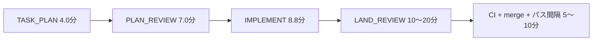

# #189 裁定用 — 実装粒度の規範化（4 論点の材料と推奨）

issue: https://github.com/yutaro0915/lathe/issues/189 ／教材: `explains/` の #189 解説
提起: 「1 つの agent が数十分 task を抱える構造自体を避けたい」（#116 実測 41 分・423k tokens）

## まず実測 — 粒度議論の前提になる数字

本日 #229 が統一ライフサイクルを 1 周した実測です。

- **task 1 件の固定 overhead（plan・review・着地・CI）≈ 25〜40 分**。implement 本体はわずか 9 分でした
- つまり「40 分の implement を 4 分割」すると、implement は 10 分×4 になっても **overhead が 4 倍（+75〜120 分）** つきます
- 一方、blocked-by の無い子は並列実行されるため（本日 #231/#232/#239 が 3 本同時）、壁時計時間はある程度隠れます

**含意**: 「実行時間の上限で分割を強制する」規範は、現行の overhead 構造では逆効果になりえます。粒度規範と overhead 削減はセットで扱う必要があります。

## 論点 1 — 規範: 粒度を何で測るか

- 選択肢: (a) 理解可能性のみ（現行 ADR 0030 §5）／(b) 実行時間上限を追加／(c) diff 規模（行数・ファイル数）を追加
- **推奨**: §5 の理解可能性は維持しつつ、**plan の見積り欄（diff 規模・想定 implement 分数）を必須化**する。時間「上限」による分割**義務**は課さない — 上の実測より、上限強制は overhead 支配を招くため。超過は義務でなく観測対象にします（論点 2）

## 論点 2 — rubric: どこで機械検査するか

- 選択肢: (a) 機械 plan review の検査項目（分割判断の審査）／(b) 実測 gate（超過 → finding/escalation）／(c) 両方
- **推奨**: **(c) 両方、ただし段階導入**。(a) は即時 — plan review に「見積り欄の妥当性・分割判断の審査」を追加。(b) は**非 blocking の meta finding から** — 分布データが無いうちに blocking 閾値を置くと誤爆します

## 論点 3 — 実現方法

- 事実: **stage ごとの duration_ms と cost は既に run manifest に記録済み**です（#229 の実測もそこから）。計測の新設は不要で、**lathe への telemetry ingest（分布の可視化）だけが未配線**
- **推奨**: ① plan-format に見積り欄必須化 ② driver は超過時「警告 + manifest 記録」のみ（中断はしない — 中断・resume はコスト増）③ run duration telemetry を lathe に ingest し分布ダッシュボード化（機能 1 の観測思想と同型）

## 論点 4 — 適正レンジをどう決めるか

- **推奨**: implement 段 **5〜15 分を仮置き**し、telemetry の分布が溜まった時点（例: 2 週間後）で再校正。並行して overhead 側の削減（LAND_REVIEW を diff 規模でスケールさせる等）を別 task 化 — 分割の「単価」を下げれば適正粒度は自然に細かくできます

## 裁定の反映方法

この Discussion に返信ください（**@claude で応答 agent を呼べます**）。方向が固まり次第、裁定を #189 のコメントに転記し、escalation label を外して plan-task レールに戻します。
