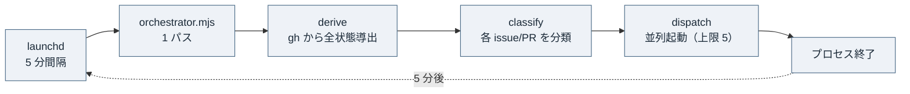
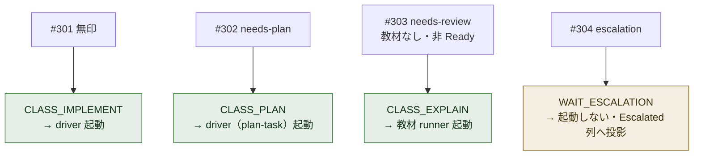
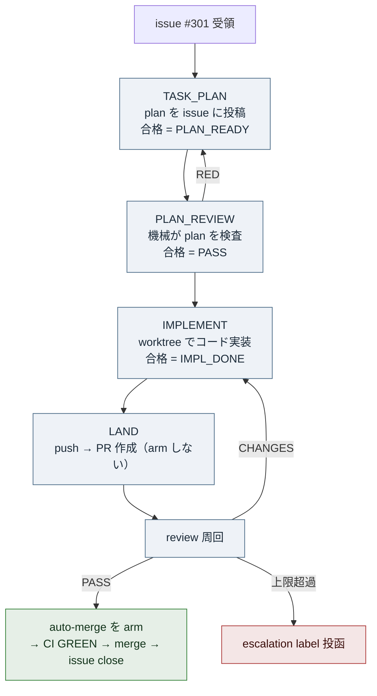
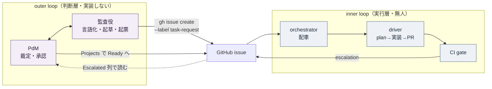

# inner loop と outer loop の現行 as-is（2026-07-07 再編後）— 誰が何を回し・どこで止まり・PdM は何をするか

目次: [1. Background](#1-background) ／ [2. Intuition](#2-intuition) ／ [3. Code](#3-code) ／ [4. Quiz](#4-quiz)

この教材の対象は、特定の PR や issue ではなく、**lathe を開発する agent 体制そのものの現在形**である。2026-07-07 の #201 再編（loop 台帳の全面改訂）と ADR 0030〜0036 の着地により、体制は「outer loop（人間 PdM ＋監査役の判断層）」と「inner loop（無人で実装を main へ届ける実行層）」の 2 層に整理された。本教材は、この 2 層について **誰が何を回し・どの段で何が起き・どこで止まり・人間（PdM）は何をするか** を、`design/loops.md`（現行台帳・正本）と `scripts/orchestrator*.mjs`・`scripts/inner-loop*.mjs` の現物、`ops/launchd/` の常駐設定に接地して示す。旧世界（`merge.mjs`・receipt・`backlog/`）は「どこから変わったか」の対比としてのみ触れ、as-is としては描かない。

## 1. Background

### 1.1 lathe の 2 つの層

lathe はハーネスエンジニアリングプラットフォームである。ここで「ハーネス」とは、コーディング agent のセッションを ingest して観測・分析するための道具立てを指す。lathe というリポジトリには、性質の異なる 2 つの層が同居している。

| 層 | 中身 | このリポジトリでの置き場所 |
|---|---|---|
| **製品層** | agent セッションを ingest・観測・分析する Web アプリ本体 | `apps/web`（Next.js + Postgres） |
| **体制層** | lathe 自身を開発する agent の仕組み（配車・実装 driver・CI・統治文書） | `scripts/`・`design/`・`adr/`・`rubrics/`・`ops/` |

本教材が扱う「inner loop と outer loop」は **体制層の話**である。製品層のコードには触れない。体制層は「誰が lathe のコードを書き・誰が承認し・どうやって main へ着地するか」という、開発そのもののプロセスを機械化した部分である。

### 1.2 登場する主体（前提知識を仮定しない）

読者は Discussion #154／#159／#181 を読んでいる前提だが、主体の役割はここで一度すべて明示する。この教材の全体像は「この表の主体が、どの順で・どこで止まるか」に尽きる。

| 主体 | 何をするか | なんのために存在するか | 実体 |
|---|---|---|---|
| **PdM** | 人間。方針を裁定し、承認を出し、escalation の判断を書く | 価値判断の最終責任者。機械に委ねない唯一の点 | 人間（cherie） |
| **outer loop（監査役）** | PdM と対話し、問題を言語化し、統治文書（`loops.md`・ADR・rubric）を起草し、issue を起票する。**終端に実装は無い** | 「何をやるべきか」の判断と、体制の記述の管理 | このセッション類の Claude Code |
| **orchestrator（配車）** | 5 分ごとに GitHub の全状態を導出し、各 issue/PR を分類し、実装 driver・教材 runner・review engine を並列に起動する | 無人の配車。人間が dispatch を回さなくても loop が進む | `scripts/orchestrator.mjs`（launchd 常駐） |
| **driver（inner loop の実行体）** | 1 つの issue を受け取り、plan → plan review → 実装 → PR 作成 → review 周回を回して main へ着地させる | 判断済みの bounded な作業を人手ゼロで届ける | `scripts/inner-loop.mjs`（＋ pure logic の `inner-loop-core.mjs`） |
| **task loop** | driver の実装 run 型。`TASK_PLAN → PLAN_REVIEW → IMPLEMENT → LAND` を回す | 1 つの変更を main へ着地させる | driver の run type |
| **plan-task** | driver の分解 run 型（`needs-plan` label）。plan を立て、子 issue を投函し、親を close | 大きい issue を規準内の子 issue 群へ割る | driver の run type |
| **explain runner（教材）** | 対象に接地した教材を生成し、Discussion（Explain）へ投稿する | 「理解」を生産する。needs-review の PdM へ読み物を先に渡す | `claude -p`（orchestrator が最小権限で dispatch） |
| **review engine（記録）** | 非 driver 産の PR に reviewer を当て、記録コメントを残す | 人間が出した PR にも review 記録を付ける（non-blocking） | `scripts/review-engine.mjs` |
| **meta loop（感知）** | ingest 済みの run を監査し finding を出す | 系の健全性の事後観測。**実走実績ゼロ・未通電** | `scripts/meta-loop.mjs`（`design/loops.md`） |
| **CI（出口ゲート）** | PR の `gate` チェックを回し、GREEN でなければ main へ入れない | main への唯一の機械強制点 | GitHub Actions ＋ branch protection |

> [!NOTE]
> 「inner」「outer」は**層の総称（family 名）**である。inner 層の中に task loop・plan-task・感知（meta）という個別ループがある。outer 層は監査役と PdM の判断ループである。「model ≠ role」——opus はモデル名であって役割名ではない（ADR 0005/0009）。同じ opus が outer の監査役にも inner の driver 内 agent にもなる。役割を分けるのは**セッションと権限**であって、モデルではない。

### 1.3 系の背骨 — ゲートは 2 つだけ（ADR 0030）

現行体制の設計思想は ADR 0030 の「2 ゲート原則」である。強制点は 2 つしかない。

- **入口ゲート = 登記**: `gh issue create --label task-request` による issue 投函。これが新しい仕事の唯一の発生点。却下ゼロ・判断ゼロの登記機械。
- **出口ゲート = PR + CI**: PR を作り、CI の `gate` チェックが GREEN になることが、main への唯一の入口。branch protection が強制する。

この 2 点の間の作業単位はすべて「task」であり、loop の種類とは task の型のことである。強制はこの 2 つの機械（GitHub の issue／Actions／branch protection）に集約し、中間段に独自の強制機構を作らない。これが「シンプルに（機構は追加より削除）」（`loops.md` 原則）の具体である。

### 1.4 状態は保存しない — GitHub から導出する（ADR 0031）

もう 1 つの背骨が「状態を保存しない」である。task の正本は GitHub issue そのもので、issue 番号がそのまま task ID（TASK-N = issue #N）。進捗 status はどこにも書かず、GitHub の状態から**毎回導出**する。

| 導出される状態 | 導出の根拠 |
|---|---|
| To Do | open issue（`task-request` label 付き） |
| In Progress | その issue を参照する PR が open |
| Done | PR が merge され issue が close（GitHub が自動） |

人間の入力面は **GitHub Projects の盤面**に一元化される（ADR 0035）。盤面は `Backlog → Approval → Ready → In progress → In review → Escalated → Done` の列を持つが、**機械が承認入力として読むのは Ready 列だけ**で、他の列は導出結果の投影である。

### 1.5 どこから変わったか（旧世界との対比）

現行 as-is を理解するには、消えたものを知っておくとよい。以下は **もう存在しない**（対比のためだけに挙げる）。

| 旧世界の機構 | 何だったか | なぜ消えたか | 現行の代替 |
|---|---|---|---|
| `merge.mjs` | receipt を検査して main へ merge する backstop | 中間段の独自強制。2 ゲート原則に反する | driver の LAND が push・PR 作成・auto-merge arm を直接行い、強制は CI に一本化（ADR 0030 §3） |
| receipt | 各段の完了を証明する成果物 | 中間強制機構。穴が多く保守コスト高 | 廃止。強制は入口 issue と出口 CI のみ（ADR 0030） |
| `backlog.md`／`backlog/` | task 台帳を file で持つ | status 書き込みに帳簿 PR が要り、worktree 間で同期問題 | GitHub issue が正本・status は導出（ADR 0031） |
| `.escalation.md` | escalation を file で表す | file 同期の脆さ | `escalation` label ＋ issue comment（ADR 0030 追記 E） |

これらは現行コードには残っていない（`merge.mjs` は disposable worktree の中にだけ痕跡がある）。本教材の以降は、この対比を前提に **現行だけ**を描く。

## 2. Intuition

現行体制の核心は 3 つの直感に分解できる。

### 2.1 orchestrator は「無状態の配車シェル」である

orchestrator は常駐サーバーではない。launchd が 5 分ごとに 1 回だけプロセスを起こし、そのプロセスは「GitHub の全状態を読む → 各 issue/PR を分類する → 動かすべきものを起動する → 終わる」だけをして即死ぬ。状態はプロセス内に持たず、次の 5 分後にはまた GitHub からゼロから読み直す。



*図 1: orchestrator は 5 分ごとに起きて derive→classify→dispatch を 1 回やって死ぬ。状態を持たないので「どこまで進んだか」の帳簿を持つ必要がない——毎回 GitHub が正本。*

「今この issue は実行中か」だけは GitHub から導出できないので、driver が起動時に **live マーカー**（`.lathe/runs/live-<CLASS>-<番号>.json`。中身は `{pid, kind, number}`）を置き、終了時に消す。orchestrator は次のパスでこのファイルを見て、さらに `kill(pid, 0)` で PID の生存を確認し、生きていれば「実行中（skip）」、死んでいれば stale として掃除する。

### 2.2 分類は「決定的な振り分け」である

orchestrator の心臓は分類（classify）である。導出した各 issue/PR を、label と状態だけを見て**決定的に**クラスへ振り分ける。判断の余地はない——同じ入力なら常に同じクラスになる。

toy な例で見る。今、GitHub に次の 4 つの issue があるとする（すべて架空）。

```text
#301  task-request                              （無印）
#302  task-request, needs-plan                  （分解して欲しい大きい issue）
#303  task-request, needs-review                 （教材まだ無し・盤面 Backlog）
#304  task-request, escalation                   （裁定待ち）
```

orchestrator はこれを次のように振り分ける。



*図 2: 分類は label だけで決まる。無印は即実装、needs-plan は分解、needs-review × 教材なしは「PdM が読む教材を先に作る」、escalation は起動せず盤面へ投影して PdM の裁定を待つ。*

ここで重要なのは、**#303 が「すぐに実装されない」**ことである。`needs-review` は「人間が承認するまで実装するな」という堰である。orchestrator はまず教材を作り（CLASS_EXPLAIN）、PdM がそれを読み、Projects で **Backlog → Ready へ動かす**と、次のパスで初めて CLASS_IMPLEMENT になる。Ready 列への移動が、機械が読む唯一の「承認入力」である。

### 2.3 inner loop（driver）は「段を進む状態機械」である

driver は 1 つの issue を受け取り、決まった段（stage）を順に進める。実装 run（task loop）の段は `TASK_PLAN → PLAN_REVIEW → IMPLEMENT → LAND` である。各段には合格 verdict があり、合格しないと再試行するか、上限を超えれば escalation する。



*図 3: driver の段。TASK_PLAN と PLAN_REVIEW は repo root（read-only）、IMPLEMENT だけが worktree で走る。PLAN_REVIEW の RED は TASK_PLAN へ戻して再試行（上限 2）。LAND の review は PASS で初めて auto-merge を arm し、CHANGES なら IMPLEMENT へ差し戻す（上限 2 周）。上限超過は escalation。*

この状態機械の要点は 3 つある。第一に、**PR を作った瞬間には merge を予約（arm）しない**——review が PASS して初めて `gh pr merge --auto` で予約する。第二に、**唯一の機械強制点は CI** で、review はローカルで回る記録＋差し戻し判断であって main を守る門ではない。第三に、**止まる先は 2 つだけ**——正常なら「CI GREEN → merge → issue 自動 close」、詰まれば「escalation label を投函して人間へ渡す」。driver 自身は判断で止まらない。

### 2.4 outer loop は「実装しない判断層」である

対して outer loop（監査役 ＋ PdM）は、コードを main へ着地させない。監査役は PdM と対話して問題を言語化し、統治文書を起草し、issue を起票する。PdM は承認・裁定・優先度づけをする。**outer の終端に実装は無い**——実装がしたくなったら issue 起票へ回し、inner loop に渡す。



*図 4: outer は GitHub issue を通じてしか inner に触れない（起票と Ready 承認）。inner が詰まると escalation label で GitHub へ返し、それが盤面 Escalated 列に投影されて PdM が読む。両層の接点は GitHub 一枚だけである。*

PdM の作業は具体的には 4 つに集約される——(1) needs-review の issue に付いた教材を読み、承認するなら Projects で Ready へ動かす、(2) escalation label の issue を Escalated 列で読み、裁定を comment に書く、(3) 教材 Discussion を close する（needs-explain の承認シグナル、ADR 0034）、(4) harness 改修のような版レベルの設計を一括承認する（ADR 0036）。

## 3. Code

現物に接地して、上の直感を裏づける。理解できる順（配車 → 分類 → driver → 分解 → 常駐）にグループ化する。

### 3.1 loop 台帳 — `design/loops.md`（正本）

全ての会話・run は台帳の 1 つであり、その loop の唯一の終端でだけ終わる。抜粋すると、inner/outer に関わる行は次の通り。

```md
| loop | 回す者 | 起動条件 | やること | 唯一の終端 |
| orchestrator（配車） | launchd（5 分間隔） | 常駐 cadence | gh 全状態を導出 → 分類 → 並列 dispatch（上限 5） | 1 パス完了 |
| 実装（task loop） | driver inner-loop.mjs <n> | open task-request | TASK_PLAN → PLAN_REVIEW → IMPLEMENT → LAND → review 周回 | CI GREEN → merge → issue close、または escalation |
| plan-task（分解） | 同 driver（needs-plan） | needs-plan 付き issue | PLAN → 子 issue 投函 → 親 close | 子の投函＋親 close |
| 前進（outer 対話） | 監査役 | PdM との対話 | 問題の言語化・選択肢の提示 | 起票 or 記録された不起票判断 |
```

台帳自体が「outer の終端に実装は無い」を明文化している（前進 loop の終端 = 起票 or 不起票判断）。この教材の直接要求もこの「前進（outer 対話）」loop の一つであり、終端は教材の起票・記録である。

### 3.2 分類ロジック — `scripts/orchestrator-classify.mjs`

クラスは 3 群に分かれる。dispatch される 4 クラス、待機する 5 クラス、skip する 4 クラスである。

```js
// dispatch されるクラス（何かを起動する）
export const CLASS_PLAN = 'PLAN';         // driver（plan-task）
export const CLASS_EXPLAIN = 'EXPLAIN';   // 教材 runner
export const CLASS_IMPLEMENT = 'IMPLEMENT'; // driver（task loop）
export const CLASS_PR_REVIEW = 'PR_REVIEW'; // review engine

// 待機（起動しない）
export const WAIT_ESCALATION = 'WAIT_ESCALATION'; // PdM 裁定待ち
export const WAIT_RUNNING = 'WAIT_RUNNING';       // 実行中
export const WAIT_PR = 'WAIT_PR';                 // In Progress
export const WAIT_DEP = 'WAIT_DEP';               // blocked-by open
export const WAIT_APPROVAL = 'WAIT_APPROVAL';     // 教材あり × 非 Ready
```

issue の振り分けは `classifyIssue` が上から順に評価する。**順序が意味論**である。

```js
export function classifyIssue(issue, ctx) {
  // 1. task-request が無ければ対象外
  //    → SKIP_NON_TASK
  // 2. escalation label → WAIT_ESCALATION（故障と数えない）
  // 3. live マーカー/worktree で実行中 → WAIT_RUNNING
  // 4. open PR が参照 → WAIT_PR（In Progress）
  // 5. blocked-by が open → WAIT_DEP
  // 6. needs-plan → CLASS_PLAN（driver が plan-task）
  // 7. needs-review × 盤面 Ready → CLASS_IMPLEMENT（承認済み）
  // 8. needs-review × 教材なし → CLASS_EXPLAIN（PdM が読む教材を先に）
  // 9. needs-review × 教材あり × 非 Ready → WAIT_APPROVAL（PdM が読む番）
  // 10. 無印 → CLASS_IMPLEMENT（plan review PASS は run 内で強制）
}
```

7 と 9 の対比が承認ゲートの実体である。同じ `needs-review` でも、盤面が Ready なら実装（7）、Ready でなく教材があるなら待機（9）。**Ready 列への移動＝ PdM の承認**が、この分岐を跨がせる唯一のトリガーである。8 の「教材なし → CLASS_EXPLAIN」が「needs-review なら読み物を先に作る」（ADR 0035）を実装する。

PR 側の分類（`classifyPr`）も同型で、driver 産の PR（branch 名 `inner/issue-<n>`）は `SKIP_DRIVER_PR`——task loop の landing 経路なので review engine は触らない。非 driver 産（＝人間が出した PR）で review 記録が無いものだけが `CLASS_PR_REVIEW` になる。

分類結果は盤面へ投影される。`WAIT_ESCALATION → Escalated 列`、`WAIT_APPROVAL → Approval 列`。ここが「機械が status を書き込む」数少ない場所だが、これは**導出結果の投影であって status の保存ではない**（失敗しても warning のみで非致命）。

### 3.3 driver の段 — `scripts/inner-loop-core.mjs`

段の定義と合格 verdict、再試行上限はすべて pure な定数として export される（test 可能にするため）。

```js
// ADR 0035 §1: 全 task が TASK_PLAN → PLAN_REVIEW → IMPLEMENT を通る。
export const TASK_LOOP_STAGES = ['TASK_PLAN', 'PLAN_REVIEW', 'IMPLEMENT'];
const TASK_LOOP_OK_VERDICTS = { TASK_PLAN: 'PLAN_READY', PLAN_REVIEW: 'PASS', IMPLEMENT: 'IMPL_DONE' };

export const MAX_PLAN_REVIEW_RETRIES = 2;        // PLAN_REVIEW RED → TASK_PLAN 再試行の上限
export const MAX_LAND_REVIEW_REWORK_ROUNDS = 2;  // LAND review CHANGES 差し戻しの上限
export const MAX_UNPARSABLE_STAGE_RETRIES = 1;   // verdict が parse 不能なときの再試行

// IMPLEMENT だけが worktree で走る。TASK_PLAN / PLAN_REVIEW は repo root（read-only）。
export function isWorktreeStage(stage) {
  return stage === 'IMPLEMENT';
}
```

`TASK_PLAN` は plan-task の `PLAN` とは別物である点に注意——`TASK_PLAN` は現在の issue に plan comment を投稿する（子 issue は作らない）。worktree 隔離は IMPLEMENT だけで、plan と plan review は読むだけなので repo root で走る。worktree の準備は `git worktree add <path> -b inner/issue-<n> main` ＋ `pnpm install` で、この branch 名が orchestrator の「実行中」補助信号にもなる。

### 3.4 LAND — `scripts/inner-loop-land.mjs`（review 前置）

LAND は driver の action（段ではない）で、旧 `merge.mjs` の「push → 無条件で auto-merge arm」を**分解**したものである。冒頭コメントが as-is と旧世界の差を明記する。

```js
// 旧 LAND（push → gh pr create → 無条件で auto-merge arm）を再構成する:
//   push → gh pr create（arm しない）→ reviewer spawn（PR diff＋plan 照合）
//     PASS    → gh pr merge --auto --squash（ここで初めて arm）
//     CHANGES → 所見を IMPLEMENT へ差し戻し（同一 worktree 追い commit → push で PR 更新）
//     超過・不正 verdict → 失敗を返し、driver が projectEscalation で issue へ投影
```

分岐は pure function に切り出されて test される。

```js
export function decideLandReviewAction({ verdict, reworkRoundsUsed, maxReworkRounds = MAX_LAND_REVIEW_REWORK_ROUNDS }) {
  if (verdict === 'PASS') return { action: 'arm' };
  if (verdict === 'CHANGES') {
    if (reworkRoundsUsed >= maxReworkRounds)
      return { action: 'escalate', reason: `CHANGES after ${maxReworkRounds} rework round(s) — 修正周回上限超過` };
    return { action: 'rework' };
  }
  // 不正 verdict → escalate
}
```

`arm` になって初めて `gh pr merge --auto --squash` が呼ばれる。ここが「PR を作っても即 merge 予約しない」（2.3）の実装である。PR は既に open のものがあれば再利用し、無ければ `gh pr create` する（重複 PR を作らない）。各周回の review 所見は marker 付き PR comment として残り、escalation レポートも PR を指すので、周回の全履歴が PR の comment 列に保持される。

### 3.5 plan-task の分解 — `scripts/inner-loop-plan-task.mjs`

`needs-plan` の issue は driver の plan-task run になる。PLAN 段で `design/plan-format.md` を注入した plan を立て、plan block を parse して各 block を子 issue として投函する。

```text
親 #302（needs-plan, PLAN 段で plan 確定）
  ├─ gh issue create --label task-request  → 子 #310（Touches: apps/web/a.ts, blocked-by なし）
  ├─ gh issue create --label task-request  → 子 #311（blocked-by #310）
  └─ 親 #302 に blocked-by #310, #311 を張り、close comment（children map）で close
```

終端は「子の投函＋親 close」である。ただし PLAN の verdict が `ASK_PDM` のときは escalation ではなく**正常終端**として親を open のまま残し、PdM の comment を促す（分解に PdM 判断が要る場合、ADR 0030 追記 E）。「故障（escalation）」と「PdM 判断が要る（ASK_PDM）」は別物である。

### 3.6 常駐 — `ops/launchd/com.lathe.orchestrator.plist`

無人配車の実体は launchd の 1 定義である。

```xml
<key>ProgramArguments</key>
<array>
  <string>/opt/homebrew/bin/node</string>
  <string>/Users/cherie/LLMWiki/projects/lathe/scripts/orchestrator.mjs</string>
  <string>--max</string><string>5</string>
</array>
<key>StartInterval</key><integer>300</integer>   <!-- 5 分間隔 -->
<key>RunAtLoad</key><false/>
```

`StartInterval 300` が図 1 の「5 分ごと」、`--max 5` が「並列 dispatch 上限 5」である。`RunAtLoad false` なので load 時には走らず、次の 300 秒後から回り始める。orchestrator は常駐しないため lock（`.lathe/orchestrator.lock`）で二重起動だけ防ぐ。plist が絶対パスと PATH を明示するのは、launchd が login shell を継がず（node/gh/pnpm/claude の実パスが解決されない）、相対パスだと `orchestrator.mjs` の `isMain` 判定が偽になって main が走らないためである。

### 3.7 harness 改修は inner に流さない（ADR 0036）

最後に、この体制の「自己改修」の扱い。loop 本体・ゲート・配車の意味論に触る改修（＝ inner/outer の定義そのものを変える改修）は、**走行中の loop に食わせない**（ADR 0036）。通常 task として driver に流すのではなく、監査役 ＋ PdM が版として scope を全確定し、bootstrap 編成（worktree 隔離 subagent の波状並列）で一括実装する。各着地は PR＋前置 review＋CI を通り、全スライス着地後に常駐を再読込して機械検証する。2026-07-07 の #201 再編そのものが、この harness-release loop の実例である。

> [!IMPORTANT]
> 「loop を loop で改修しない」が ADR 0036 の核心である。もし配車や driver の定義変更を通常 task として同じ driver に流すと、改修中の driver が自分の定義を書き換えながら走ることになり、どの版で何が起きたか切り分け不能になる。だから改修は版として括り、走行系（製品 task）とは別編成で一括着地させる。

## 4. Quiz

実質を理解していれば解ける 5 問。選択肢は各 1 つが正解。

**Q1. orchestrator が「状態を保存しない無状態のプロセス」であることの直接の帰結として正しいのはどれか。**

- a) 5 分ごとに GitHub の全状態をゼロから導出し直すので、進捗を記録する独自の台帳ファイルを持たない
- b) 一度分類した結果をメモリに保持し続け、次のパスで差分だけ更新する
- c) 常駐サーバーとして起動しっぱなしになり、落ちると状態を失う
- d) 状態を `.lathe/` の JSON に永続化し、それを正本とする

<details><summary>答えと解説</summary>

**a**。§2.1・§3.6 のとおり、launchd が 5 分ごとに 1 パスだけ起こし、プロセスは derive→classify→dispatch をして即死ぬ。状態は GitHub が正本で、毎回導出し直す（ADR 0031）。b は「メモリに保持し続ける」が誤り——プロセスは死ぬ。c は「常駐サーバー」が誤り——常駐せず lock で二重起動を防ぐだけ。d は「JSON を正本とする」が誤り——保存する状態は live マーカー（実行中判定用）のみで、task の正本は GitHub issue。

</details>

**Q2. `needs-review` label が付いた issue が、教材はあるが盤面が Ready でないとき、orchestrator はどう分類するか。**

- a) CLASS_IMPLEMENT — すぐ driver で実装する
- b) CLASS_EXPLAIN — 教材をもう一度作る
- c) WAIT_APPROVAL — 起動せず、PdM が読んで Ready へ動かすのを待つ
- d) WAIT_ESCALATION — 裁定待ちとして Escalated 列へ

<details><summary>答えと解説</summary>

**c**。§3.2 の `classifyIssue` の 9 番目——`needs-review × 教材あり × 非 Ready → WAIT_APPROVAL`。教材があるので CLASS_EXPLAIN（教材を作る）にはならず（b が誤り）、盤面が Ready でないので CLASS_IMPLEMENT にもならない（a が誤り）。Ready 列への移動＝ PdM 承認が、7 番目（CLASS_IMPLEMENT）へ跨がせる唯一のトリガー。d は escalation label が無いので誤り。

</details>

**Q3. driver の LAND で、reviewer が PASS を返すまで `gh pr merge --auto` が呼ばれないのはなぜか。**

- a) PR 作成と同時に arm するとレビュー前に merge されてしまうため、PASS で初めて auto-merge を arm する設計だから
- b) CI が review を兼ねているため、review は不要だから
- c) auto-merge 機能が GitHub で無効化されているから
- d) merge は監査役が手動でのみ行うから

<details><summary>答えと解説</summary>

**a**。§2.3・§3.4 のとおり、旧 LAND は「push → 無条件で arm」だったが、現行は `decideLandReviewAction` が `PASS` のときだけ `{action:'arm'}` を返し、そこで初めて `gh pr merge --auto --squash` を呼ぶ。CHANGES なら IMPLEMENT へ差し戻す（2 周まで）。b は誤り——review はローカルで別に回る記録＋差し戻し判断。c・d は本文に根拠がない（merge は driver が arm し、CI GREEN で GitHub が自動 merge する）。

</details>

**Q4. plan-task run で PLAN の verdict が `ASK_PDM` になったとき、driver は何をするか。**

- a) escalation label を投函して故障として扱う
- b) 親 issue を open のまま残し、PdM の判断を促す comment を投稿する（正常終端）
- c) 子 issue を投函してから親を close する
- d) 無条件で親を close する

<details><summary>答えと解説</summary>

**b**。§3.5 のとおり、`ASK_PDM` は escalation（故障）ではなく正常終端で、分解に PdM 判断が要る場合に親を open のまま残して comment を促す（ADR 0030 追記 E）。a は「故障として扱う」が誤り——「故障」と「PdM 判断が要る」は別物。c は通常の分解成功時（子投函＋親 close）の挙動で、ASK_PDM のときではない。d も誤り——ASK_PDM では close しない。

</details>

**Q5. 「outer loop の終端に実装は無い」とはどういう意味か、最も正確なのはどれか。**

- a) 監査役はコードを書く能力がないという意味
- b) 監査役（outer）は問題の言語化・統治文書の起草・issue 起票までで終わり、コードの main 着地は inner loop（driver）に委ねるという役割分担
- c) outer loop は存在せず、すべて inner loop が行うという意味
- d) PdM が実装を禁止されているという意味

<details><summary>答えと解説</summary>

**b**。§1.2・§2.4・§3.1 のとおり、outer（監査役 ＋ PdM）は判断層で、「前進（outer 対話）」loop の終端は「起票 or 記録された不起票判断」（`loops.md`）。実装がしたくなったら issue 起票へ回し、inner loop（driver）が plan→実装→PR→CI で main へ着地させる。a は「能力がない」が誤り——役割分担であって能力の話ではない（model ≠ role）。c は outer の存在を否定していて誤り。d は主体を PdM に取り違えている（終端の話は監査役 loop の話）。

</details>

---

接地資料: `design/loops.md`（現行 loop 台帳・正本・2026-07-07 #201 再編）／ADR 0030（2 ゲート原則・`merge.mjs` 解体・追記 E の ASK_PDM/escalation intake）／ADR 0031（issue=task 基盤・status 導出・`backlog/` 廃止）／ADR 0032・0033（explain loop・md ネイティブ化）／ADR 0034（教材承認ゲート・reaction/close 禁止）／ADR 0035（統一 task ライフサイクル・needs-review 単一キュー・Projects Ready ＝承認入力）／ADR 0036（harness-release loop・loop を loop で改修しない）／`scripts/orchestrator.mjs`（1 パス・live マーカー `.lathe/runs/live-*.json`・PID 生存確認・並列 dispatch 上限）／`scripts/orchestrator-classify.mjs`（`CLASS_*`/`WAIT_*`/`SKIP_*`・`classifyIssue`/`classifyPr`・盤面投影）／`scripts/inner-loop-core.mjs`（`TASK_LOOP_STAGES`・`TASK_LOOP_OK_VERDICTS`・`MAX_PLAN_REVIEW_RETRIES`/`MAX_LAND_REVIEW_REWORK_ROUNDS`/`MAX_UNPARSABLE_STAGE_RETRIES`・`isWorktreeStage`）／`scripts/inner-loop-land.mjs`（`decideLandReviewAction`・PASS で arm・CHANGES 差し戻し）／`scripts/inner-loop-plan-task.mjs`（子 issue 投函・親 close・ASK_PDM 終端）／`ops/launchd/com.lathe.orchestrator.plist`（`StartInterval 300`・`--max 5`・`RunAtLoad false`・PATH 明示）（いずれも 2026-07-07 時点の main）。旧世界（`merge.mjs`・receipt・`backlog/`・`.escalation.md`）は現行コードに存在せず、対比参照としてのみ言及した。未確認と明記すべき箇所は本文に無い（すべて現物に接地）。
