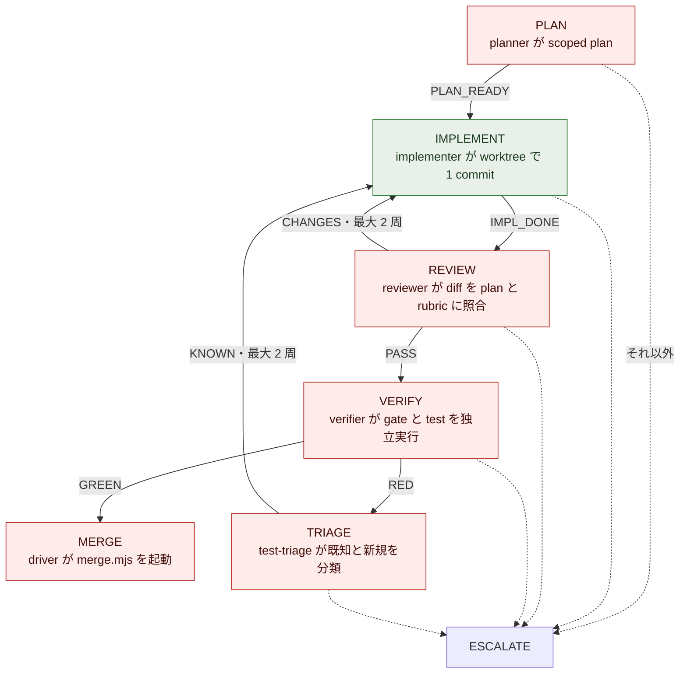
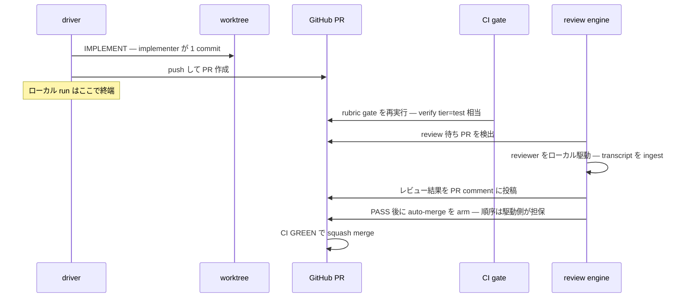
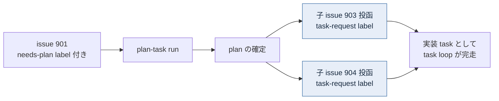

# issue #116 解説 — task loop の縮退（PLAN／TRIAGE 段の削除と plan-task 型の導入）

目次: [1. Background](#1-background) ／ [2. Intuition](#2-intuition) ／ [3. Code](#3-code) ／ [4. Quiz](#4-quiz)

この教材の対象は issue #116（`needs-explain` label 起点）。対象は merge 済みの diff ではなく、**issue 上の plan** である——ADR 0030 の実装分割 ③「task loop の縮退」を、issue 本文・スレッド上の scope 追記・ADR 0030（追記 A〜E 込み）・現行コード（`scripts/inner-loop.mjs` ほか）に接地して解説する。2026-07-07 時点で issue は open・未実装であり、実装が着地した時点で細部はこの教材と乖離し得る。

## 1. Background

### 1.1 lathe と、この issue が触る層

lathe はハーネスエンジニアリングプラットフォームである。コーディング agent のセッションを ingest して観測・分析するアプリ本体（`apps/web`、Next.js + Postgres）と、**lathe 自身を開発する agent 体制**（driver・named agents・CI・統治文書）の 2 層からなる。issue #116 が変更するのは後者——「1 つの task を人間の介在なしに main へ届ける機械」である task loop の**形そのもの**である。

### 1.2 登場する主体

| 主体 | 何をするか | なんのために存在するか |
|---|---|---|
| **PdM** | 人間。壁打ちで方針を裁定し、task の優先度・採否を triage する | 価値判断の最終責任者 |
| **outer loop（監査役）** | PdM と対話するセッション。監視・task 起票・rubric 管理・escalation への裁定 | 「何をやるべきか」の判断。outer の終端に実装は存在しない（`design/loops.md`） |
| **driver `scripts/inner-loop.mjs`** | 1,906 行の状態機械。task を 1 つ受け取り、段ごとに named agent を `claude -p` / `codex exec` で起動し、verdict を parse して遷移する | 判断済みの bounded な作業の自律完走。**本 issue の主対象** |
| **named agents**（planner / implementer / reviewer / verifier / test-triage） | 各段の実作業。skill（`.claude/skills/plan|implement|review|verify|test-triage`）に従う | 段ごとの役割分離。model ≠ role（ADR 0005/0009） |
| **`scripts/merge.mjs`** | push → `gh pr create` → auto-merge arm を実行する 399 行の CLI。driver が MERGE 段で起動する | 着地の実行系。**issue #115 で解体予定**（残る 3 操作は driver 直呼びへ） |
| **CI（status check `gate`）** | PR の diff に対して `rubrics/run.mjs` を GitHub 側で再実行する | main に入る唯一の道 = PR + CI GREEN（ADR 0026）。branch protection で物理強制 |
| **review engine**（issue #128・新規予定） | review 待ちの PR を拾い、reviewer をローカルで自動駆動して結果を PR comment に残す | PR 上 review の実行系。ローカル実行の目的は transcript の保存 = lathe への ingest（gh 上のホスト実行では観測面に載らない。ADR 0030 追記 B） |
| **登記（旧 intake）** | `task-request` label 付き issue の作成そのものが登記。TASK-N = issue #N（ADR 0031。写し Action・採番 writer は 2026-07-05 の PR #146 で撤去済み） | task の唯一の発生点（入口ゲート） |

### 1.3 現行の task loop — 6 段 1 本

driver は task 1 つを **PLAN → IMPLEMENT → REVIEW → VERIFY → (RED なら TRIAGE) → MERGE** の 1 本で完走する。段の列は `scripts/inner-loop.mjs` に定数として実在する。

```js
// scripts/inner-loop.mjs
export const IMPL_LOOP_STAGES = ['PLAN', 'IMPLEMENT', 'REVIEW', 'VERIFY', 'TRIAGE', 'MERGE'];
export const IMPL_LOOP_STAGES_AFTER_PLAN = ['IMPLEMENT', 'REVIEW', 'VERIFY', 'TRIAGE', 'MERGE'];
export const MAX_CYCLES = 2;
```

各段は named agent への prompt（`scripts/inner-loop-prompts.mjs`）として実装され、agent は最終行に `VERDICT: <TOKEN>` を出力する。driver がそれを parse して遷移する。



*図 1: 現行 task loop の状態機械。赤 = issue #116 でローカル段から消えるもの（PLAN・TRIAGE は削除、REVIEW・VERIFY・MERGE は PR 側へ移る）、緑 = 残るもの。*

段の途中成果物は run manifest（`.lathe/runs/`）と transcript だけであり、系の外から見える中間地点が無い。この「1 本の長さ」が本 issue の直接の動機である。

### 1.4 もう 1 本の loop — issue 起点の plan-loop

driver は `needs-plan` label の issue に対して別系統の loop も持つ。

```js
// scripts/inner-loop.mjs
export const PLAN_LOOP_STAGES = ['RESEARCH', 'PLAN', 'PLAN_REVIEW', 'GATE', 'ISSUE_CREATE', 'CLOSE_SOURCE'];
```

調査 → 計画 → 計画レビュー → 承認ゲート → 実装 issue の直接起票 → 元 issue の close、という流れで、終端の ISSUE_CREATE は `backlog task create` を直接呼ぶ（ADR 0016）。つまり **plan が 2 箇所にある**——task loop 内の PLAN 段と、この独立 plan-loop。さらに plan-loop の直接起票は「起票の単一経路 = issue 投函」（ADR 0027/0029）に対する例外経路でもあった。

### 1.5 ADR 0030 が確認した問題のうち、本 issue が解くもの

ADR 0030（2026-07-05 PdM 裁定）は as-is レビューで 9 個の問題を確認した。issue #116 が直接解くのはこの 3 つである。

1. **plan が二重に存在する**——plan-loop（issue 起点）と task loop 内 PLAN 段が重複（背景 2）
2. **1 run が長すぎる**——6 段を 1 本で完走。途中成果物がログしかなく、失敗の切り分けが困難で、比較実験ができない粒度（背景 3）
3. **escalation 判断の分散**——判断主体が agent verdict／driver チェック／TRIAGE の 3 箇所に散る。TRIAGE 段はその分散点の 1 つ（背景 5）

原則は ADR 0030 §0 の 2 ゲート——系の強制点は**入口 = 登記**と**出口 = PR + CI** の 2 つだけで、その間の中間段に独自の強制機構を作らない。

### 1.6 実装分割と本 issue の位置（2026-07-07 時点）

ADR 0030 の実装は 6 つの issue に分割されている。issue #116 スレッドの整合照合 comment（2026-07-05）が記録する推奨順に並べる。

| 順 | issue | 内容 | 状態 |
|---|---|---|---|
| ① | #113 | intake 拡張と起票一本化（plan-loop の ISSUE_CREATE 廃止の**決定**を含む） | closed |
| ② | #115 | merge.mjs 解体——push / pr create / auto-merge arm を driver 直呼びへ | open |
| ⑥ | #128 | review engine——review 待ち PR を拾い reviewer をローカル自動駆動 | open |
| ③ | **#116（本対象）** | **task loop 縮退——PLAN／TRIAGE 段削除・plan-task 型導入** | open |
| ④ | #117 | escalation の intake 統一（`escalation` label 投函・関門規則の設定集約） | open |
| ⑤ | #118 | 設定集約・粒度規準の明文化・loops.md 改訂 | open |

順序の理由: 本 issue はローカル REVIEW 段を消して「review は PR 上で engine 駆動」に置き換えるため、**#128 が先に無いと review そのものが系から消失する**（スレッド comment 2026-07-05 の申し送り第 1 項）。

> [!IMPORTANT]
> 同 comment の第 2 項はもう 1 つの現況を記録している: backlog/ 帳簿の削除（PR #146・ADR 0031）以降、`inner-loop.mjs` の backlog CLI 結線（26 箇所）は参照先の実体を失っており、**本 issue の issue 結線への書き換えが着地するまで driver は起動不能**である。つまり本 issue は「縮退」であると同時に、driver を再起動可能にする修復でもある。

## 2. Intuition

核心は 1 つ——**「1 本の長い同期 run」を「短いローカル区間 + PR 上の非同期区間」に割り、中間成果物を run のログから PR という公共物に変える**。

架空の task で before/after を並べる。issue #901「ingest の retry 上限を設定ファイルへ移す」という実装 task が登記されたとする（ID・sha・JSON はすべて架空だが実形式）。

### 2.1 before — 1 run が全部を抱える

現行 driver は issue #901 に対して 1 つの run を起こし、6 段を順に回す。run manifest には段の履歴だけが積まれる。

```json
{
  "issue": 901,
  "stages": [
    { "stage": "PLAN",      "verdict": "PLAN_READY", "ts": "2026-07-07T02:10:44Z", "backend": "claude" },
    { "stage": "IMPLEMENT", "verdict": "IMPL_DONE",  "ts": "2026-07-07T02:31:02Z", "headSha": "3f9c2ab" },
    { "stage": "REVIEW",    "verdict": "CHANGES",    "ts": "2026-07-07T02:44:18Z", "headSha": "3f9c2ab" },
    { "stage": "IMPLEMENT", "verdict": "IMPL_DONE",  "ts": "2026-07-07T03:02:55Z", "headSha": "8d41e0c" },
    { "stage": "REVIEW",    "verdict": "PASS",       "ts": "2026-07-07T03:15:31Z", "headSha": "8d41e0c" },
    { "stage": "VERIFY",    "verdict": "GREEN",      "ts": "2026-07-07T03:28:07Z", "headSha": "8d41e0c" },
    { "stage": "MERGE",     "verdict": null,          "ts": "2026-07-07T03:29:44Z" }
  ]
}
```

PR が生まれるのは最後の MERGE 段（`merge.mjs` が push → `gh pr create` → auto-merge arm）であり、それまでの約 80 分間、系の外から見える中間地点は無い。REVIEW の 2 周目で失敗しても、VERIFY で失敗しても、切り分けの材料は同じ 1 本の run ログの中にある。段構成を変えた実験をしようにも、6 段全体を 1 単位でしか走らせられない。

### 2.2 after — run は「PR を作るまで」で終わる

縮退後、同じ issue #901 の流れはこうなる。



*図 2: 縮退後の流れ。driver のローカル区間は IMPLEMENT → PR 作成のみ。review と verify は PR という公共の中間地点の上で非同期に進む。*

段がどこへ行ったかを対応表にする。

| 現行の段 | 縮退後の行き先 | 根拠 |
|---|---|---|
| PLAN | **削除**。plan は task が生まれる時点で issue 本文に存在する（「すべての task は plan を持って生まれる」）。plan 無しの issue は plan-task へ | ADR 0030 §2 |
| IMPLEMENT | **残る**（唯一のローカル段）。直後に driver が PR を作る | ADR 0030 §3 |
| REVIEW | **PR 上へ**。review engine（#128）が reviewer をローカル駆動し、結果を PR comment に残す | ADR 0030 §3・追記 B |
| VERIFY（tier=test） | **CI へ**。status check `gate` が PR head sha に対して実行（heavy 検証 = e2e・judge はローカル宿題のまま維持） | ADR 0030 §3 |
| TRIAGE | **削除**。escalation 判断は駆動側の関門（driver の A・engine の B/C）に一元化——受け皿の実装は #117 | ADR 0030 §4・追記 E |
| MERGE | **段としては消える**。push / `gh pr create` / auto-merge arm は driver が直接実行（merge.mjs 解体 = #115） | ADR 0030 §3 |

### 2.3 plan-task — 「plan を作ること」自体を task にする

issue #901 が plan 無しで登記されたら（起票者が `needs-plan` label を付けたら）、それは実装 task ではなく **plan-task** である。振り分けは label の有無という機械的事実だけで決まる——issue 本文の構造チェック案は「判断ゼロ原則からの逸脱」として廃案になった（ADR 0030 追記 A）。



*図 3: plan-task の還流。終端は「plan の確定 + 子 issue の投函」であり、実装・main への着地は終端に含まれない。子 issue の作成そのものが登記である（ADR 0031 で写し Action は廃止済み）。*

これで 1.4 節の独立 plan-loop（RESEARCH→…→ISSUE_CREATE）と task loop 内 PLAN 段は**両方**消える。plan は「loop の 1 段」でも「別系統の loop」でもなく、**task の 1 つの型**になる。plan-task が PdM 判断を要する選択肢に到達した場合は escalation ではなく正常終端の一つ「PdM に諮る」として扱う（ADR 0030 追記 E 末尾）。

### 2.4 なぜ「短くする」が「速くする」より重要か

縮退の利得は速度ではない。ADR 0030 §5 の粒度規準（task は「人間が数分で完全に理解できる範囲」）と §6 の比較実験（rubric 改訂の前後を同一 task 集合で走らせる）は、**run が短く・中間成果物が公共物である**ことを前提条件にしている。6 段 1 本の run では「どの段の変更が効いたか」を切り分けられず、実験の単位にならない。PR という中間地点は、失敗の切り分け点であると同時に、比較実験の観測点でもある。

## 3. Code

対象は plan（未実装）なので、ウォークスルーの対象は「削除・置換される現行コード」である。issue 本文とスレッド追記が名指しする箇所を、理解できる順に見る。

### 3.1 消える分岐 — 状態遷移表 `nextState`

driver の中核は 1 つの純関数である（`scripts/inner-loop.mjs`）。

```js
export function nextState(state, verdict, cycles = 0, context = {}) {
  if (verdict === null) return { next: 'ESCALATE', cycles };
  switch (state) {
    case 'PLAN':
      return verdict === 'PLAN_READY' ? { next: 'IMPLEMENT', cycles } : { next: 'ESCALATE', cycles };
    case 'IMPLEMENT':
      return verdict === 'IMPL_DONE' ? { next: 'REVIEW', cycles } : { next: 'ESCALATE', cycles };
    case 'REVIEW':
      if (verdict === 'PASS') return { next: 'VERIFY', cycles };
      if (verdict === 'CHANGES') {
        const next = cycles + 1;
        return next > MAX_CYCLES ? { next: 'ESCALATE', cycles: next } : { next: 'IMPLEMENT', cycles: next };
      }
      return { next: 'ESCALATE', cycles };
    case 'VERIFY':
      if (verdict === 'GREEN') return { next: 'MERGE', cycles };
      if (verdict === 'RED') return { next: 'TRIAGE', cycles };
      return { next: 'ESCALATE', cycles };
    case 'TRIAGE':
      if (verdict === 'KNOWN') {
        if (context.nonImplementableKnown) return { next: 'ESCALATE', cycles };
        const next = cycles + 1;
        return next > MAX_CYCLES ? { next: 'ESCALATE', cycles: next } : { next: 'IMPLEMENT', cycles: next };
      }
      return { next: 'ESCALATE', cycles };
    default:
      return { next: 'ESCALATE', cycles };
  }
}
```

縮退後にローカル遷移として意味を持つのは `IMPLEMENT` の成否だけである。`PLAN`・`REVIEW`・`VERIFY`・`TRIAGE` の各 case、REVIEW⇄IMPLEMENT／TRIAGE→IMPLEMENT の差し戻し周回（`MAX_CYCLES = 2`）、TRIAGE 専用の `nonImplementableKnown` 迂回（Codex sandbox EPERM の実装不能 KNOWN を検出する `isCodexSandboxEpermTriageResult`、約 20 行）——これらはすべて対象から消えるか、PR 側の機構（engine の修正 run 上限 = ADR 0030 追記 E の「設定ファイルの上限回数」）に置き換わる。

PLAN 段の削除は付随機構も削除対象にする。ADR 0016 が入れた「承認済み plan マーカーがあれば PLAN を skip する」機構——

```js
export const APPROVED_PLAN_HEADING = '## Plan (approved)';
```

——は、「すべての task は plan を持って生まれる」が構造で保証されると **skip ではなく常態**になり、分岐として存在する理由が無くなる。

### 3.2 消える loop 丸ごと — plan-loop と、その代替 plan-task

1.4 節の `PLAN_LOOP_STAGES` と、その遷移表 `nextPlanLoopState`、および各段の prompt builder（`buildResearchPrompt`・`buildPlanReviewPrompt` と `buildPlanPrompt` の plan-loop mode）が削除対象である（issue 本文「issue 起点の独立 plan-loop コードは削除」。①#113 の残 scope としてスレッド comment 2026-07-06 で本 issue に包含）。

代替の plan-task 型について、issue が確定している設計は 2 点。

1. **終端 = plan 確定 + 子 issue 投函**（intake へ還流。実装は終端に含まない）
2. **prompt には `design/plan-format.md` を fail-closed で注入する**（#142 吸収・スレッド comment 2026-07-06）。fail-closed = md が不在・読取失敗なら黙って旧 prompt に落ちず run を止める。skill や agent 定義への複製ではなく driver の実行時読み込みにする理由は 7 点の論証（#142 の Implementation Notes）に記録されている——要点は、到達性が backend 選択に依存しないこと（`codex exec` は `.claude/skills` を読まない）、正本 md との写し drift を作らないこと、prompt に何が入ったかが session/manifest に残り監査に載ること

plan-format.md（正本、2026-07-05 adopted）が要求する骨格は「問題／選択肢／方針／契約／検証」の 5 セクション + スケール規則（trivial は 3 行の軽量形で可）である。plan-task の成果物 = 子 issue の本文がこの形式を持つことで、後段の実装 task は「plan を持って生まれる」。

### 3.3 過渡形の撤去 — `LATHE_REVIEW_BODY_FILE`

現行の順序では REVIEW 段が PR 作成（MERGE 段）より**前**にある。TASK-16 が「review 結果を PR に残す」を実現したとき、この順序のねじれを、review 本文を一時ファイルに退避して MERGE 段で後貼りする形で迂回した。実物は 2 箇所。

```js
// scripts/inner-loop.mjs — MERGE 段の環境変数受け渡し
if (reviewBodyFile) mergeEnv.LATHE_REVIEW_BODY_FILE = reviewBodyFile;
```

```js
// scripts/merge.mjs — PR 作成直後の後貼り
const reviewBodyFile = process.env.LATHE_REVIEW_BODY_FILE;
if (reviewBodyFile) {
  const prReviewResult = spawnSync('gh', buildPrReviewArgs({ branch, bodyFile: reviewBodyFile }), {
    stdio: 'inherit',
    cwd,
    env: { ...process.env, LATHE_MERGE: '1' },
  });
  if (prReviewResult.status !== 0) {
    process.stdout.write(`merge: warning: gh pr review --comment failed for ${branch} (non-fatal)\n`);
  }
}
```

縮退は implement → PR → review-on-PR へ並べ替える。review が PR の**後**に来れば、engine が結果を直接 PR comment に書けばよく、退避 → 後貼りという迂回の存在理由が消える。スレッド comment（PdM 確認済み 2026-07-06）が「実装時に退避機構も撤去すること」と明記する。

### 3.4 merge.mjs との分担 — #115 が先、#116 が受ける

`scripts/merge.mjs`（399 行）の現在の仕事は、push → `gh pr create`（先頭 commit message を PR title/body に）→ `gh pr merge --auto --squash`（arm 不能時は checks-then-merge の fallback）である。receipt 検査は ADR 0026 で既に除去済み。#115 がこのファイルを解体し、残る 3 操作を driver 直呼びにする。本 issue はその前提の上で、縮退後の driver が IMPLEMENT 完了直後にこれらを直接実行する形に組む——ただし auto-merge の arm は **reviewer PASS 後**の順序を駆動側が担保する（issue 本文。単一アカウントでは required review にできないため、機械でなく駆動順序で守り、逸脱は meta が検出する = ADR 0030 §3）。

### 3.5 ADR 0031 残骸の除去 — backlog 結線の gh 置換

1.6 節の「driver 起動不能」の実体がここにある。driver と queue には Backlog.md CLI への結線が残っている。代表 3 箇所:

- `fetchTask`（`inner-loop.mjs`）— `backlog task view <id> --plain` で task 本文を取得
- `markTaskDoneInWorktree`（`inner-loop.mjs`）— MERGE 前に worktree 内で `backlog task edit --status Done` を commit
- `inner-queue.mjs` の dependency-ready 判定 — `backlog sequence list --plain` の Sequence 1 所属で依存充足を読む

これらの参照先（`backlog/` 帳簿・Backlog.md CLI）は PR #146 が削除済みであり、本 issue が gh 結線（issue 参照・`blocked-by` 解決）へ書き換える（スレッド comment 2026-07-05「ADR 0031 移行の残置分」）。加えて `scripts/intake-register.sh`（旧 intake Action の補助・dead code）も削除する。

### 3.6 吸収 scope の全量

issue #116 の実効 scope は本文 + スレッド追記の合算である。転記漏れを防ぐため一覧にする。

| 出所 | scope |
|---|---|
| 本文 | PLAN／TRIAGE 段削除・IMPLEMENT→PR 作成への縮退・review-on-PR の正式化・plan-task 型導入・独立 plan-loop コード削除 |
| comment 2026-07-05（ADR 0031 移行） | backlog CLI 結線（fetchTask / markTaskDone / inner-queue の backlog sequence）の gh 置換 |
| comment 2026-07-05（同・追記） | `scripts/intake-register.sh` の削除 |
| comment 2026-07-06（PdM 確認済み） | `LATHE_REVIEW_BODY_FILE` 退避機構の撤去 |
| comment 2026-07-06（issue 管理裁定） | #113 残 scope = plan-loop コード廃止の包含／#142 吸収 = plan-task prompt への plan-format.md fail-closed 注入 |

検証（issue 本文）: plan-task の実走一巡（plan 無し issue → plan-task → 子 issue 投函 → 登記）と、実装 task の実走完走（IMPLEMENT→PR→CI→PR review→着地）。

> [!NOTE]
> 本 issue が**触らない**もの: heavy 検証（e2e・judge）はローカル宿題のまま（CI 昇格は別系 #69 で再訪）。escalation の受け皿（`escalation` label 投函・上限回数の設定化）は #117。サイクル上限等の設定ファイル集約は #118。review engine 本体は #128。

## 4. Quiz

実質を理解していれば解ける 5 問。選択肢は各 1 つが正解。

**Q1. 縮退後、driver のローカル run に残る段構成はどれか。**

- a) PLAN → IMPLEMENT → PR 作成
- b) IMPLEMENT → PR 作成
- c) IMPLEMENT → REVIEW → PR 作成
- d) IMPLEMENT → VERIFY → PR 作成

<details><summary>答えと解説</summary>

**b**。ADR 0030 §3「ローカル段は IMPLEMENT → PR 作成のみ」。PLAN は削除（plan は task が生まれる時点で存在する）、REVIEW は PR 上で engine 駆動（#128）、VERIFY（tier=test）は CI が担う。c・d は「ローカルに 1 段だけ検査を残す」折衷に見えるが、それは 2 ゲート原則（強制点は入口と PR+CI だけ・中間段に独自の強制機構を作らない = ADR 0030 §0）に反する。

</details>

**Q2. 実装 task と plan-task の振り分けは何で決まるか。**

- a) issue 本文が plan-format の必須節を備えているかの構造チェック
- b) 起票者が issue に `needs-plan` label を付けたか否か
- c) 登記時に LLM が本文を読んで判定する
- d) PdM が Projects 盤面で振り分ける

<details><summary>答えと解説</summary>

**b**。ADR 0030 追記 A。初版 §2 は a の構造チェック案だったが、「それは判断ゼロ原則からの逸脱だった」として廃案になり、label の有無という機械的事実だけを見る形に修正された。c は 2026-07-05 に実在しないテンプレを理由に issue を却下した事例（判断主体を登記に置くと規則を発明する）が示すとおり最初から排除されている。

</details>

**Q3. 実装順で #116 の前に #128（review engine）が必要な理由はどれか。**

- a) CI の実行時間が review の分だけ長くなるから
- b) engine が無いと PR の auto-merge を arm できないから
- c) ローカル REVIEW 段を消した時点で、review を実行する主体が系から消失するから
- d) engine が plan-task の子 issue を投函するから

<details><summary>答えと解説</summary>

**c**。#116 は「review は PR 上」を前提にローカル REVIEW 段を削除する。その受け皿である engine（review 待ち PR を拾い reviewer をローカル駆動）が先に存在しなければ、review が誰にも実行されない期間が生まれる。スレッドの整合照合 comment（2026-07-05）が推奨実行順 ①#113 → ②#115 → ⑥#128 → ③#116 → ④#117 → ⑤#118 として明記している。

</details>

**Q4. `LATHE_REVIEW_BODY_FILE` の退避機構が #116 で消える根本理由はどれか。**

- a) 一時ファイル経由の受け渡しがセキュリティ上の問題だから
- b) 「REVIEW が PR 作成より前」という現行の順序のねじれを迂回するための過渡形であり、implement → PR → review-on-PR への並べ替えで存在理由そのものが無くなるから
- c) merge.mjs が #115 で解体されるため、環境変数を受け取るプロセスが無くなるから
- d) review 本文が長すぎて PR comment に収まらないから

<details><summary>答えと解説</summary>

**b**。スレッド comment（PdM 確認済み 2026-07-06）の文言どおり「本 issue（③ 縮退 = implement → PR → review-on-PR への並べ替え）で存在理由ごと消える」。c は事実として merge.mjs が解体されることと整合するが根本理由ではない——並べ替えが無ければ後貼りの仕事自体は driver 直呼び側に移植する必要があった。機構の削除理由を「実装の置き場所」でなく「順序の設計」に求めるのがこの plan の読み方である。

</details>

**Q5. plan-task の「唯一の終端」はどれか。**

- a) 子 issue がすべて実装され main に着地すること
- b) plan の確定と子 issue の投函
- c) PdM の承認
- d) PR の作成

<details><summary>答えと解説</summary>

**b**。ADR 0030 §2「plan-task の終端は『plan の確定＋子 issue の投函』（intake へ還流）。実装・main への着地は終端に含まれない」。なお PdM 判断を要する選択肢に到達した場合は escalation ではなく**正常終端の一つ**「PdM に諮る」として扱う（追記 E 末尾）——c は常に要る終端条件ではなく、条件付きで現れるもう 1 つの正常終端である。

</details>

---

接地資料: issue #116（本文 + comments 2026-07-05〜2026-07-06）／ADR 0030（追記 A〜E 込み）／ADR 0031／`design/loops.md`／`design/plan-format.md`／issue #142／`scripts/inner-loop.mjs`・`scripts/inner-loop-prompts.mjs`・`scripts/inner-queue.mjs`・`scripts/merge.mjs`（いずれも 2026-07-07 時点の main）。本教材は plan の解説であり、実装の着地後は当該 PR の diff が事実の正本である。
