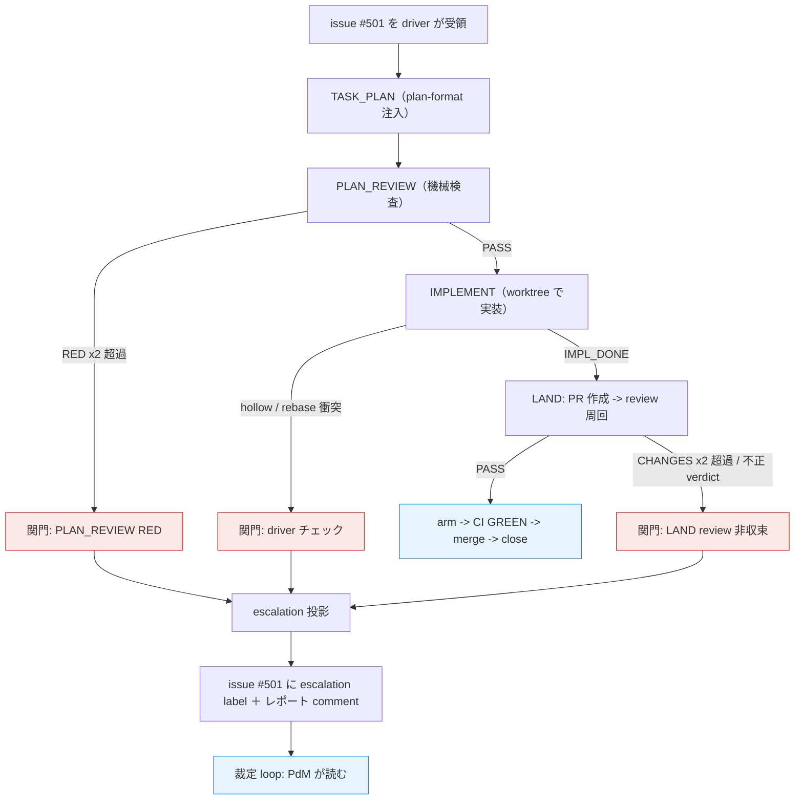
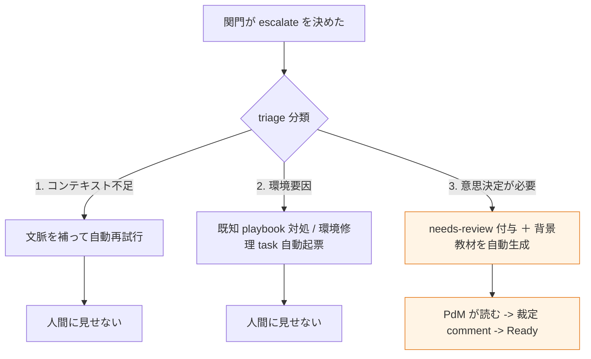
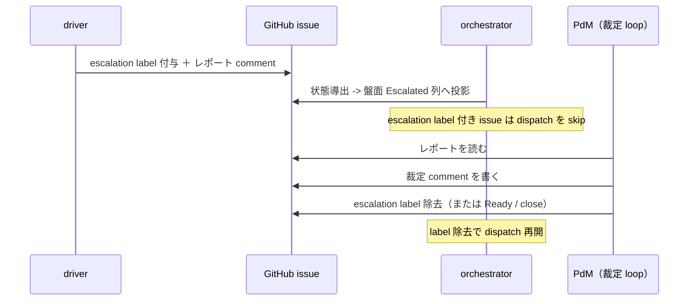

# issue #117 解説 — escalation の intake 統一（3 箇所分散から関門集約へ、そして triage 三分岐への再定義）

目次: [1. Background](#1-background) ／ [2. Intuition](#2-intuition) ／ [3. Code](#3-code) ／ [4. Quiz](#4-quiz)

この教材の対象は issue #117（「ADR 0030 ④: escalation の intake 統一 — escalation label 投函（run リンク）＋関門規則の設定集約」）。対象は diff ではなく **plan の理解**である。より正確には、この issue の plan は**確定しておらず読み替えが進行中**であり、その変遷そのものが理解対象になる。ADR 0030 §4（初版）→ ADR 0030 追記 E → ADR 0031 → ADR 0035 §4 という 4 段の読み替えを、`design/loops.md`・現行コード（`scripts/inner-loop-escalation.mjs` ほか）に接地して整理する。

> [!IMPORTANT]
> 本教材は裁定ではない。「triage 三分岐をどう実装すべきか」の推奨は書かない。それは issue #117 の再定義（現在 `needs-review` で PdM の Ready 待ち）に委ねられている。事実は ADR・`design/loops.md`・コード・issue #117 のコメント列に接地する。不明な点は「未確認」と明記する。

## 1. Background

前提知識を仮定しない。登場するすべての主体について「何をするのか・なんのために存在するのか」を先に説明する。

### 1.1 lathe の task 実行の世界（登場主体）

lathe は「既存 agent の観測・改善・評価」のためのハーネスプラットフォームである。その一部として、issue を task とみなして自動的に実装まで走らせる仕組みを持つ。issue #117 はこの中の **escalation（エスカレーション）** に関する。周辺の主体を列挙する。

| 主体 | 何をするか | なんのために存在するか |
|---|---|---|
| **issue = task** | GitHub issue そのものが task の正本。issue 番号 = task ID | 状態を repo 内ファイルに二重記録しないため（ADR 0031）。採番・直列化は GitHub が担う |
| **driver（task loop）** | `scripts/inner-loop.mjs <n>`。1 issue を PLAN → PLAN_REVIEW → IMPLEMENT → LAND（PR 作成・review 周回）と worktree 内で駆動する状態機械 | issue を「人手ゼロで PR まで」進める実行本体 |
| **engine（review engine）** | `scripts/review-engine.mjs`。driver 由来でない PR を拾い reviewer をローカル spawn して PR コメントに記録 | review の transcript をローカル実行で lathe に載せるため（ADR 0030 追記 B） |
| **agent verdict** | driver が spawn した agent が返す判定文字列（`IMPL_DONE`・`PASS`・`CHANGES`・かつては `ESCALATE`） | 段の結果を driver に伝える。driver が parse して次状態を決める |
| **CI（ゲート）** | PR の status check `gate`（`rubrics/run.mjs` 再実行）。branch protection で必須化 | main の唯一の機械強制点（ADR 0026 §1） |
| **escalation** | 自動処理が行き詰まったとき人間（PdM）の判断を仰ぐため処理を止めて申し送る機構 | 自力で解けない問題を勝手に着地させず人間へ渡すため |
| **escalation.md** | かつての escalation 成果物ファイル（`.lathe/runs/*.escalation.md`） | 裁定者が状況を読む資料（現在は廃止済み） |
| **lathe ingest** | run の manifest / transcript を lathe（Postgres + MCP）へ取り込む処理 | 裁定者が run リンクから全て辿れるようにするため |
| **関門（gate）** | driver / engine が escalate するか否かを判定するチェックポイント（段の verdict 判定点と CI 結果） | 「いつ人間を呼ぶか」の規則の置き場。ここに集約するのが issue #117 の主眼 |
| **裁定 loop（escalation 対応）** | PdM（＋監査役補助）が escalation を読んで裁定を issue に書く loop | 止まった task に判断を注入して再開・却下・別処理へ振り分ける |
| **TRIAGE（旧段）** | かつて driver 内にあった失敗分類段。ADR 0030 §3 で廃止 | 現在は存在しない。3 箇所分散の 1 つとして挙げられた |

> [!NOTE]
> 「driver」と「engine」を混同しないこと。driver は 1 issue を PLAN→LAND まで進める本体、engine は「driver 産でない PR」を review する別コンポーネントである。escalation の関門は両方に分かれて存在する。

### 1.2 「escalate 判断が 3 箇所に分散」とは何だったか

issue #117 本文の「問題」は次のとおり。

> escalate 判断が 3 箇所（agent verdict／driver チェック／TRIAGE）に分散。escalation.md は状態ダンプのみで、裁定側の調査コストが高い（ブラックボックス）。

ADR 0030 の as-is レビュー（`.lathe/reports/dev-machinery-as-is-2026-07-05.html`、§背景 5）が数えた 3 箇所の内訳。

| # | 判断の置き場 | 何をしていたか | 問題 |
|---|---|---|---|
| 1 | **agent verdict** | agent が自発的に `ESCALATE` verdict を返せた。agent 自身が「人間に上げるべき」と判断 | 規則が agent の内側に分散し driver から一望できない |
| 2 | **driver チェック** | サイクル上限超過・rebase 衝突・hollow completion 等を driver が検出して escalate | 規則が driver コードに散在 |
| 3 | **TRIAGE 段** | 失敗を分類する専用段。ここにも escalate 相当の分岐 | 段そのものが独自の判断機構。§3 で廃止対象 |

加えて成果物 `escalation.md` は**状態ダンプのみ**（分類も調査結果も無い）で、裁定者はブラックボックスを 1 から読み解く必要があった。判断が多いこと自体でなく、判断の主体が複数あることが問題である。

### 1.3 ADR 0030 §4（初版）が出した最初の方針

ADR 0030 §4（初版・issue #117 本文の「方針」に対応）は次を決めた。

- escalate するか否かの規則は**駆動側の関門（段の verdict 判定点と CI 結果）だけ**が持つ。
- agent の自発 `ESCALATE` verdict は**廃止**し、成否＋**定型調査書**（何を試したか／何が失敗したか／仮説／切り分けの次の一手）の返却に統一する。
- escalation.md = 状態ダンプ＋調査書とし、**lathe に ingest**して裁定 loop の一次資料にする。
- 依存: ADR 0030 ③（段構成の確定が先）。

初版方針は「関門 1 箇所に集約」＋「調査書という定型成果物」＋「escalation.md を ingest」の 3 点だった。**この 3 点は後で読み替えられる**。

### 1.4 この issue の plan は「確定でなく読み替えが進行中」

issue #117 の重要な特徴は、**plan が確定していない**ことである。コメント列と関連 ADR が示す読み替えの連鎖を時系列（絶対参照のみ）で並べる。

| 時点 | 出所 | 何が起きたか |
|---|---|---|
| 2026-07-05 | ADR 0030 §4（初版） | §1.3 の初版方針（関門集約＋定型調査書＋escalation.md ingest） |
| 2026-07-05 | ADR 0030 追記 C | §4 の「どの関門にどう挟むか」の設計が未了と判断し**保留**（旧 TASK-32 は実装に流さない） |
| 2026-07-05 | ADR 0030 追記 E | 保留を解除。escalation も **issue 投函**（`task-request` + `escalation` label、本文 = run リンク＋PR リンク＋関門＋verdict）に統一。**escalation.md 独自伝達路と定型調査書は廃案** |
| 2026-07-05 | ADR 0031 | task の正本を GitHub issue へ。状態は保存せず導出。`backlog/` 廃止。**「本 issue #117 がそのまま task（旧 TASK-32）」** |
| 2026-07-07 | ADR 0035 §4 | escalation を **triage 三分岐**として**再定義待ち**。旧 plan のまま自動実装させないため `needs-review` を付与（PdM の Ready で解禁） |

現在（2026-07-07）の issue #117 の label は `task-request`, `needs-review`、state は OPEN である。

> [!WARNING]
> 「escalation.md を ingest する」という初版方針（§1.3）は ADR 0030 追記 E で**廃案**になっている。issue #117 本文は初版のまま残るが、本文と ADR 追記が食い違う場合は追記が上書きする（追記冒頭「本追記が §2／§3／§4／§6 の該当部分を上書きする」）。読者はこのズレに注意すること。

### 1.5 ADR 0035 §4 の triage 三分岐（現在の再定義先）

ADR 0035 §4 は escalation 経路を次の 3 分岐に再定義した。issue #117 はこれを実装する「スライス ③」として再定義待ちである（ADR 0035 §実装・置換）。

1. **コンテキスト不足** → 文脈を補って自動再試行（人間に見せない）。
2. **環境要因** → 既知 playbook 対処 or 環境修理 task の自動起票（人間に見せない）。
3. **意思決定が必要** → `needs-review` 付与＋背景教材を自動生成（状況の接地＋選択肢の中立整理・推奨なし・規模は scale 原則）→ PdM が読む → 裁定 comment → Ready。

「escalation = 常に人間を呼ぶ」ではなく、**まず 3 種に分類し、人間に見せるのは 3 番目だけ**にする再定義である。

## 2. Intuition

核心を toy データで追う。ID・sha・issue 番号は実形式の架空値である。

### 2.1 escalation の位置 — task loop のどこで発火するか



3 つの関門（PLAN_REVIEW RED・driver チェック・LAND review 非収束）はいずれも駆動側の判定点であり、1 つの投影処理（escalation label ＋ comment）に合流する。これが「関門 1 箇所に集約」の実体である。

### 2.2 before / after — agent 自発 ESCALATE の廃止

**before（3 箇所分散）**: agent が自分で「これは人間案件」と判断して verdict を返せた。

```jsonc
// agent が返す envelope（before）
{ "verdict": "ESCALATE", "result": "外部 API の仕様が不明で判断できません" }
```

escalate 規則が agent の prompt / 内部判断に埋め込まれ driver から見えない。

**after（関門集約）**: agent は成否だけを返す。escalate は driver / engine の関門が決める。

```jsonc
// agent が返す envelope（after）
{ "verdict": "CHANGES", "result": "外部 API の仕様が不明で判断できません" }
```

```text
driver 側の関門判定:
  LAND review 周回 = 3 回目、上限 = 2  -> 非収束 -> escalate（driver が決める）
```

判断主体が driver / engine の 1 系統に集約され grep で追える形になった。

### 2.3 escalation.md 独自路 → issue 投函（追記 E の読み替え）

**before（初版方針・§1.3）**: escalation.md というファイルに調査書を書き lathe に ingest。

```markdown
<!-- .lathe/runs/issue-501.escalation.md（初版方針・現在は廃案） -->
# escalation
## 試したこと / 失敗したこと / 仮説 / 切り分けの次の一手
- 401 が返る → token scope の不足 → token 再発行して /v1 で確認
```

裁定者はこのファイルを（ingest 経由で）読む。独自の伝達路（outer がファイルを見に行く形）が必要だった。

**after（追記 E・現行実装）**: escalation.md を廃止し **issue そのものに投影**する。本文は run リンク中心でよい（transcript は既に ingest 済みで run リンクから辿れる）。

```text
issue #501 の変化:
  label:  task-request  ->  task-request, escalation
  comment（新規投稿）:
    # escalation — issue #501
    stage: IMPLEMENT / verdict: ESCALATE / ts: 2026-07-07T09:30:00.000Z
    ## result excerpt
    外部 API の仕様が不明で判断できません
```

独自の伝達路が消え、状態は gh から導出できる（ADR 0031）。裁定 loop は盤面の Escalated 列でこれを読む。

### 2.4 triage 三分岐 — 現在の再定義先



issue #117 が実装する「スライス ③」はこの分類ロジックである。**2026-07-07 時点で triage 三分岐は未実装であり、issue #117 は再定義待ち（`needs-review`）**である。

### 2.5 裁定 loop の再開手順（現行の label 意味論）



escalation label が付いている間、orchestrator は dispatch を skip する（機械が勝手に再試行しない）。PdM が裁定して label を外すと再開する。これが「escalation label = 裁定待ちキュー」の意味論である。

## 3. Code

接地資料を「3 箇所分散 → 関門集約」「escalation.md 独自路 → issue 投函」「ADR 0030→0031→0035 の読み替え」の 3 軸で追う。

### 3.1 軸 1: 現状の escalation 実装 = issue 投影（`scripts/inner-loop-escalation.mjs`）

**初版方針（escalation.md ＋ 定型調査書 ＋ ingest）はすでに廃案・置換済み**であり、追記 E の「issue 投影」が実装されている。冒頭コメントが経緯を明記する。

```javascript
// inner-loop-escalation.mjs — escalation の issue 化 (#201 分解 6). ESCALATE 終端は
//   escalation label（無ければ gh label create で新設）＋レポート全文の comment に一本化。
// ローカル .lathe/runs/*.escalation.md は廃止（状態は gh から導出 = ADR 0031）。
// escalation label 付き issue は queue が skip（SKIP_ESCALATION, ADR 0030 追記 E）。
// driver（task loop）と plan-task の両経路がここを通る単一の出口。
```

投影本体 `projectEscalation` は「label 付与（無ければ作成して 1 回 retry）＋ レポート全文 comment」だけを行い、**失敗は非致命**（warn して続行）である。

```javascript
export function projectEscalation({ issueNumber, stage, verdict, resultExcerpt, runType }, deps = {}) {
  const addLabel = () => run('gh', ['issue', 'edit', String(issueNumber), '--add-label', ESCALATION_LABEL], /* ... */).status === 0;
  let labelOk = addLabel();
  if (!labelOk) { run('gh', ['label', 'create', ESCALATION_LABEL, /* ... */]); labelOk = addLabel(); }
  if (!labelOk) logFn(`warning: could not add ${ESCALATION_LABEL} label to issue #${issueNumber} (continuing)`);
  const cr = run('gh', ['issue', 'comment', String(issueNumber), '--body-file', '-'], { /* input: report */ });
  const commentOk = cr.status === 0;
  return { ok: labelOk && commentOk, labelOk, commentOk };
}
```

レポート本文 `buildEscalationMarkdown` は run リンク相当（stage / verdict / ts / result excerpt）だけを含む。追記 E の「本文は run リンク＋関門＋verdict でよい・定型調査書は不要」を反映する。

> [!NOTE]
> テスト `scripts/inner-loop-escalation.test.mjs` が「レポート全文が comment（パス参照ではない）」「`.escalation.md` を含まない」ことを検証する（`assert.ok(!commentBody.includes('.escalation.md'))`）。初版の escalation.md 路が廃止済みであることがテストで固定されている。

### 3.2 軸 1（続き）: 3 つの関門が 1 つの出口に合流（`scripts/inner-loop.mjs`）

driver 本体で escalate を呼ぶ箇所は、複数の関門から `escalateIssue`（= `projectEscalation` のラッパ）という**単一の出口**に合流する。

```javascript
// scripts/inner-loop.mjs
function escalateIssue(issueNumber, stage, verdict, resultExcerpt) {
  projectEscalation({ issueNumber, stage, verdict, resultExcerpt }, { log });
}
// 呼び出し点（すべて同じ関数を通る）:
//   REBASE_CONFLICT（driver チェック） / verdict===null 不正（driver チェック）
//   PLAN_REVIEW RED after MAX_PLAN_REVIEW_RETRIES（関門 A） / hollow completion（driver チェック）
```

LAND（PR review 周回）の非収束は `scripts/inner-loop-land.mjs` の純関数 `decideLandReviewAction` が判定し、`escalate` を返したものを driver が同じ `escalateIssue` に流す。

```javascript
// scripts/inner-loop-land.mjs
export function decideLandReviewAction({ verdict, reworkRoundsUsed, maxReworkRounds = MAX_LAND_REVIEW_REWORK_ROUNDS }) {
  if (verdict === 'PASS') return { action: 'arm' };
  if (verdict === 'CHANGES') {
    if (reworkRoundsUsed >= maxReworkRounds)
      return { action: 'escalate', reason: `CHANGES after ${maxReworkRounds} rework round(s) — 修正周回上限超過` };
    return { action: 'rework' };
  }
  return { action: 'escalate', reason: `invalid review verdict: ${verdict ?? '(none/unparsable)'}` };
}
```

これが ADR 0030 追記 E の「関門は 3 つ: A = IMPLEMENT 完了判定（driver・ローカル）／B = CI RED（engine）／C = review CHANGES 非収束（engine）」に対応する。**判断の主体は driver と engine だけ**であり、agent 自発 `ESCALATE` は driver 側で「不正 verdict」として escalate に落ちるのみで、agent が能動的に選ぶ verdict ではなくなっている。

> [!NOTE]
> 「B = CI RED」は engine（PR 監視点）が拾う関門だが、CI RED からの自動修正 run → 上限超過 escalation の全結線が engine（issue #128）側でどこまで実装済みかは本教材の grep 範囲では**未確認**である。driver 側（A・C 相当）の投影は上記のとおり実装されている。

### 3.3 軸 3: 設定の集約（ADR 0030 §8・追記 E「上限は設定ファイル」）

「関門規則の設定集約」（issue #117 タイトル後半）は、上限回数のハードコードをやめ 1 箇所に集める話。現状の上限値は定数として `scripts/inner-loop-core.mjs` に集約されている。

```javascript
// scripts/inner-loop-core.mjs
export const ESCALATION_LABEL = 'escalation';
export const NEEDS_REVIEW_LABEL = 'needs-review';
export const MAX_PLAN_REVIEW_RETRIES = 2;       // PLAN_REVIEW RED の retry 上限
export const MAX_LAND_REVIEW_REWORK_ROUNDS = 2; // LAND CHANGES 差し戻しの周回上限
```

ADR 0030 §8 は「単一の設定ファイルに集約する」と述べる。現状は module 定数への集約であり、**独立ファイルへの外出しがどこまで進んでいるかは未確認**である。「grep 可能な形で 1 箇所」という issue #117 の検証条件は、これら定数が 1 モジュールに集まっている点で部分的に満たされている。

### 3.4 軸 2: escalation.md → issue 投函の読み替え（ADR 0030 §4 → 追記 E）

初版 §4（issue #117 本文と同内容）を追記 E が上書きする。

```markdown
### 4.（初版）escalation.md は現行の状態ダンプに調査書を加えた形とし、lathe に ingest して裁定 loop の一次資料にする。
### E.（上書き）escalation に独自の伝達路（.lathe/runs/*.escalation.md）を持たせない。issue 投函 → intake 登記に統一。
  本文は run リンク（＋PR リンク・どの関門か・verdict）だけでよい ... 定型調査書（旧 §4 案）は不要（廃案）。
  agent の自発 ESCALATE verdict は廃止。裁定 loop の起動条件を「escalation label の task の到着」と規定。
```

**読み替えの要点**: 初版の「escalation.md ＋ 定型調査書 ＋ ingest」は追記 E で「issue 投函（run リンクだけ）」に**縮約**された。理由は ADR 0031 の「状態は保存せず gh から導出」——transcript は run リンク経由で ingest 済みなので、ファイルに調査書を二重に書く必要が無い。§3.1 のコードはこの追記 E を実装している。

### 3.5 軸 3: ADR 0031 が「本 issue #117 = task」にした（コメント列）

issue #117 のコメント列（gh 実測）を読み替え順に並べる。

```text
[2026-07-05 github-actions] 登記完了: TASK-32 として backlog に登録（intake action・判断なし）。
[2026-07-05 yutaro0915 OWNER] ADR 0031 移行: 本 issue がそのまま task（旧 TASK-32）。
  (1) escalation は issue 投函（task-request + escalation label、本文 = run/PR リンク＋関門＋verdict）に統一。
      escalation.md 独自伝達路と定型調査書は廃案
  (2) 関門 = driver の IMPLEMENT 完了判定 ＋ engine の CI RED / CHANGES 非収束（上限は設定ファイル）
  (3) agent 自発 ESCALATE 廃止  (4) 修正 run は毎回新 run。依存: #116（縮退）と #128（engine）
[2026-07-07 yutaro0915 OWNER] ADR 0035 §4 により triage 三分岐（スライス ③）として再定義待ち。
  旧 plan（escalation label 投函のみ）のまま自動実装させないため needs-review を付与（PdM の Ready で解禁）。
```

最初の「TASK-32 として backlog に登録」は ADR 0031 以前の intake 機構の名残であり、次のコメントで「backlog ではなく issue #117 がそのまま task」に読み替えられている（ADR 0031 §3 で `backlog/` 廃止）。

### 3.6 軸 3（続き）: ADR 0035 §4 が triage 三分岐へ再定義（現在の停止点）

```markdown
### 4. escalation 経路（triage 三分岐）
1. コンテキスト不足 → 文脈を補って自動再試行（人間に見せない）
2. 環境要因 → 既知 playbook 対処 or 環境修理 task の自動起票（人間に見せない）
3. 意思決定が必要 → needs-review 付与＋背景教材を自動生成（... 推奨なし ...）→ PdM が読む → 裁定 comment → Ready
## 置換・吸収 : #117（escalation の intake 統一）→ triage 三分岐として再定義
```

ADR 0035 §5 は関連する RED plan の扱いも定める（planner 修正周回上限 2 → なお RED なら `needs-review` ＋ `escalation` label で人間キューへ）。これは §3.2 の PLAN_REVIEW 関門と `needs-review` 付与に対応する（`scripts/inner-loop.mjs` で PLAN_REVIEW RED 時に `NEEDS_REVIEW_LABEL` を付けてから escalate する結線が存在する）。

**現在の停止理由**: 追記 E までで「issue 投函」の形は実装された（§3.1）。しかし ADR 0035 §4 は「escalation を投函する前に 3 分岐で triage する」段を新たに要求する。この triage 三分岐（スライス ③）が未実装・未確定であり、issue #117 は `needs-review` で PdM の Ready 待ちである。旧 plan（escalation label 投函のみ）を自動実装させない歯止めとして `needs-review` が機能する（ADR 0035 §1: needs-review 有りは Ready まで実装が発火しない）。

### 3.7 loop 台帳での位置づけ（`design/loops.md`）

`design/loops.md` は escalation を 2 つの loop に接地する。

```markdown
| escalation 対応 | PdM（＋監査役の補助） | escalation label（機械が投函・レポートは comment） |
  盤面 Escalated 列で読む → 裁定を issue に書く | 裁定 comment → label 除去（または Ready／close） |
| orchestrator（配車） | ... escalation は故障と数えない breaker |
```

orchestrator（`scripts/orchestrator-classify.mjs`）は escalation label 付き issue を `WAIT_ESCALATION` に分類し、盤面 Escalated 列へ投影し、dispatch しない。

```javascript
// scripts/orchestrator-classify.mjs — WAIT_ESCALATION — escalation label（裁定 loop 材料。故障と数えない）
return { class: WAIT_ESCALATION, reason: 'escalation label — PdM 裁定待ち（裁定 loop 材料）' };
```

これが §2.5 の「escalation label 付き issue は dispatch を skip」の実装である。

### 3.8 まとめ — 何が済み・何が待ちか

| 論点 | 初版方針（§1.3） | 現在の到達点 | 状態 |
|---|---|---|---|
| escalate 判断の集約 | 関門（駆動側）だけが持つ | driver / engine の関門に集約（§3.2）。agent 自発 ESCALATE 廃止 | 実装（driver 側） |
| escalation の成果物 | escalation.md ＋ 定型調査書 ＋ ingest | issue 投影（label ＋ run リンク comment）。escalation.md 廃止 | 追記 E で読み替え・実装済み |
| 上限の設定集約 | ハードコードをやめ設定ファイルへ | core モジュールに定数集約 | 部分（独立設定ファイル化は未確認） |
| triage 三分岐 | （初版に無し） | ADR 0035 §4 で新規要求。issue #117 = スライス ③ | 未実装・再定義待ち（needs-review） |

## 4. Quiz

中難度 5 問。答えを開く前に自分の言葉で理由を言えるか確かめること。

### Q1. issue #117 が挙げる「escalate 判断の 3 箇所分散」の 3 箇所として、ADR 0030 の as-is レビューが数えたものはどれか。

- A. agent verdict ／ driver チェック ／ TRIAGE 段
- B. planner ／ implementer ／ reviewer
- C. CI ／ branch protection ／ PR review
- D. Backlog.md ／ Projects ／ label

<details><summary>答えと解説</summary>

**A**。issue #117 本文および ADR 0030 §背景 5 が挙げるのは「agent verdict／driver チェック／TRIAGE」の 3 つである。判断主体が複数に分散していたことが問題であり、これを駆動側の関門 1 系統に集約するのが方針である。B は driver が spawn する agent の種類、C は出口ゲートの機械、D は task 帳簿の話で、いずれも escalate 判断の 3 箇所ではない。
</details>

### Q2. ADR 0030 §4（初版）にあった「escalation.md ＋ 定型調査書 ＋ lathe ingest」という方針は、その後どうなったか。

- A. そのまま実装され、現行コードの中核である
- B. ADR 0030 追記 E で廃案になり、「issue 投函（run リンク中心）」に読み替えられた
- C. ADR 0031 で完全に削除され、escalation 機構自体が廃止された
- D. ADR 0035 §5 の RED plan 扱いに統合された

<details><summary>答えと解説</summary>

**B**。ADR 0030 追記 E が「escalation に独自の伝達路（`.lathe/runs/*.escalation.md`）を持たせない」「定型調査書（旧 §4 案）は不要（廃案）」と明記し、issue 投函（`task-request` + `escalation` label、本文は run リンク中心）に読み替えた。理由は ADR 0031 の「状態は gh から導出」＋「transcript は run リンクで ingest 済み」であり、ファイルへの二重記録が不要になったため。現行コード `scripts/inner-loop-escalation.mjs` はこの追記 E を実装しており、テストが `.escalation.md` を含まないことを固定している。C は誤り（escalation 機構は存続）、D は別論点。
</details>

### Q3. ADR 0030 追記 E で「agent の自発 ESCALATE verdict」はどう扱われたか。

- A. 強化され、agent が escalate を主導する
- B. 廃止され、escalate するか否かは driver / engine の関門だけが決める
- C. reviewer だけが ESCALATE を返せるよう限定された
- D. CI の status check に移された

<details><summary>答えと解説</summary>

**B**。追記 E は「agent の自発 ESCALATE verdict は廃止（規則の置き場は設定 1 箇所・判断主体は driver と engine のみ）」とする。目的は escalate 規則を 1 系統に集約し grep で追える形にすること。現行コードでは agent が返す `ESCALATE` は driver 側で「不正 verdict」として escalate に落ちるのみで、agent が能動的に選ぶ正規の verdict ではない（`decideLandReviewAction` は PASS / CHANGES 以外を escalate 扱いにする）。
</details>

### Q4. escalation label が付いた issue に対して orchestrator はどう振る舞うか。

- A. 直ちに close する
- B. dispatch を skip し、盤面 Escalated 列へ投影する（故障と数えない breaker）
- C. 自動で修正 run を無制限に再試行する
- D. needs-review label に付け替える

<details><summary>答えと解説</summary>

**B**。`scripts/orchestrator-classify.mjs` は escalation label を `WAIT_ESCALATION` に分類し、盤面 Escalated 列へ投影して dispatch を skip する（`design/loops.md` の「escalation は故障と数えない breaker」）。裁定 loop で PdM が裁定 comment を書き escalation label を除去（または Ready / close）すると dispatch が再開する。A は誤り（close は裁定の結果であって自動ではない）、C は「escalate = 止める」の趣旨に反する、D は自動では起きない。
</details>

### Q5. 2026-07-07 時点で issue #117 が `needs-review` を付けられ、実装が発火しない理由として最も正確なものはどれか。

- A. escalation 機構がまだ 1 行も実装されていないから
- B. 「issue 投函」の形は実装済みだが、ADR 0035 §4 の triage 三分岐（スライス ③）として再定義待ちで、旧 plan のまま自動実装させないため
- C. CI が RED でマージできないから
- D. PdM が issue を close したから

<details><summary>答えと解説</summary>

**B**。ADR 0030 追記 E までの「issue 投函（escalation label ＋ run リンク comment）」は現行コードで実装済みである（§3.1）。しかし ADR 0035 §4 は escalation を投函する前に「コンテキスト不足／環境要因／意思決定が必要」の 3 分岐で triage する段を新たに要求し、issue #117 をそのスライス ③として再定義した。旧 plan（escalation label 投函のみ）のまま driver に自動実装させないため、PdM が `needs-review` を付与した。ADR 0035 §1 により needs-review 有りの issue は Projects の Ready へ移動されるまで実装が発火しない。A は誤り（投影は実装済み）、C・D は事実に反する（issue は OPEN、CI RED の話ではない）。
</details>
