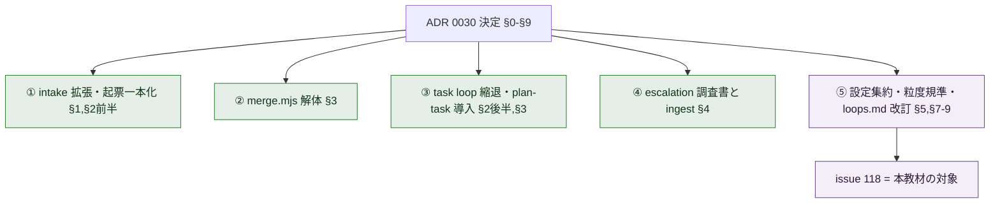
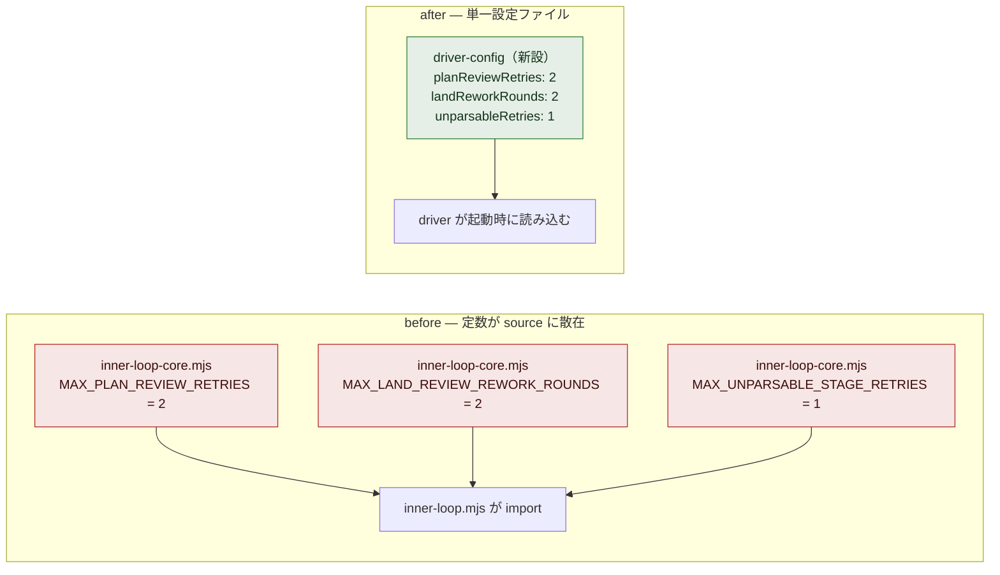
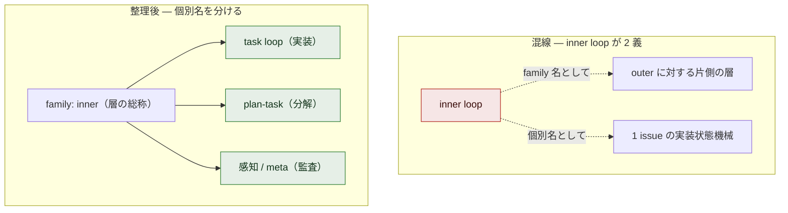

# issue #118 解説 — ADR 0030 実装リスト⑤（設定集約・粒度規準の明文化・hotfix 同形化・命名整理）

目次: [1. Background](#1-background) ／ [2. Intuition](#2-intuition) ／ [3. Code](#3-code) ／ [4. Quiz](#4-quiz)

この教材の対象は issue #118（`task-request` + `needs-review` label）である。対象は merge 済みの diff ではなく、**issue 上に立てられた plan（未確定・未着手）** である——ADR 0030 の実装リスト⑤に相当する「4 つの独立した文書・設定改訂の束」を、設定集約（§8）・粒度規準の明文化（§5）・hotfix 同形化（§7）・命名整理（§9）の 4 論点に分けて示す。2026-07-07 時点で #118 は open・未着手であり、ADR 0035 §8（label 整理・文書追随）と scope が重なるため `needs-review` で堰き止められ、分割の裁定を待っている。本教材は「各改訂が、現在のコード・設計文書のどこに着地しうるか」を接地して示すものであり、決定の記録ではない。

## 1. Background

### 1.1 lathe と、この issue が触る層

lathe はハーネスエンジニアリングプラットフォームである。コーディング agent のセッションを ingest して観測・分析するアプリ本体（`apps/web`、Next.js + Postgres）と、**lathe 自身を開発する agent 体制**（driver・named agents・CI・統治文書）の 2 層からなる。issue #118 が触るのは後者だけである——driver が読む設定・plan の粒度を規定する散文・loop 台帳の記述、という「体制の記述と設定」であって、アプリ本体（`apps/web`）のコードには触れない。

### 1.2 登場する主体

前提知識を仮定しないため、この改訂に関与する主体をすべて挙げる。

| 主体 | 何をするか | なんのために存在するか |
|---|---|---|
| **PdM** | 人間。壁打ちで方針を裁定し、needs-review キューを読んで承認する | 価値判断の最終責任者 |
| **outer loop（監査役）** | PdM と対話するセッション。統治文書（loops.md・plan-format.md・ADR）の起草を担う。**終端に実装は無い**（`design/loops.md`） | 「何をやるべきか」の判断と統治文書の管理 |
| **driver** | `scripts/inner-loop.mjs`（＋ pure logic の `scripts/inner-loop-core.mjs`）。1 つの issue を受け取り、段の遷移・verdict parse・worktree 管理・PR 作成を回すプログラム | 判断済みの bounded な作業を人手ゼロで main へ届ける実行系 |
| **task loop** | driver の実装 run 型。TASK_PLAN → PLAN_REVIEW → IMPLEMENT → LAND を回す | 1 つの bounded な変更を main へ着地させる |
| **plan-task** | driver の分解 run 型（`needs-plan` label）。PLAN → 子 issue 投函 | 大きい issue を規準内の子 issue 群に割る |
| **orchestrator** | `scripts/orchestrator.mjs`（launchd 5 分間隔）。gh 全状態を導出 → 分類 → driver を dispatch | 常駐の配車 |
| **meta loop（感知）** | `scripts/meta-loop.mjs`（read-only）。ingest された run を監査し finding を出す | 系の健全性の事後観測。**実走実績ゼロ・未通電**（`design/loops.md`） |
| **harness-hotfix（緊急路）** | 監査役 ＋ PdM 同期承認。gate/loop 自体の故障時の最小修正 | 系が回らなくなったときの復旧路 |
| **設定定数** | `MAX_PLAN_REVIEW_RETRIES` 等。現在は `scripts/inner-loop-core.mjs` に `export const` で散在 | driver の運行パラメータ。**§8 の改訂対象** |
| **plan-format（`design/plan-format.md`）** | PLAN 段の成果物規約。scale 規則（trivial/standard）と完全形 5 セクションを定める散文 | plan が PdM の判断材料であることを担保する。**§5 の着地先** |
| **loops.md（`design/loops.md`）** | loop 台帳。全会話・run が下表の 1 つであると規定する正本 | loop の名前・起動条件・終端の単一正本。**§7/§9 の着地先** |
| **ADR 0030** | 2 ゲート原則と loop 再編の決定。実装リスト①〜⑤を持つ | 本 issue の親決定 |

### 1.3 ゲートは 2 つだけ、という設計思想（ADR 0030 §0）

ADR 0030 §0 が系の背骨である。強制点は**入口 = 登記（issue 投函 `task-request`）** と**出口 = PR + CI GREEN** の 2 つだけで、その間の作業単位はすべて task、loop の種類とは task の型のことである。強制はこの 2 点の機械（Action / CI / branch protection）に集約し、中間段に独自の強制機構（旧 receipt 類）を作らない。

この思想が #118 の 4 論点すべてを制約する。設定を集約するなら（§8）「どこで読むか」は 2 ゲートの間の driver 内である。hotfix を同形化するなら（§7）緊急路も入口・出口の 2 ゲートを通る同じ形に畳む。§0 は「例外経路を作らない」という圧力そのものである。

### 1.4 実装リスト①〜④が着地した後の残 scope ＝⑤

ADR 0030 の決定は 9 条（§0〜§9）だが、実装は依存順に 5 本の task-request へ分けられた。



*図 1: ①〜④は「機構を消す・作る」実装であり順次着地した。⑤（#118）は残る「文書・設定の追随」の束であり、実態が着地した後に文書を整合させる位置にある。*

### 1.5 #118 は 4 つの独立した改訂の束

#118 本文の「方針」節は 4 つの独立した改訂を並べる。互いに依存せず、着地先も別々である。

| 論点 | ADR 0030 の条 | 内容 | 着地先（層） |
|---|---|---|---|
| 設定集約 | §8 | 散在する driver 定数を単一設定ファイルへ | `scripts/` のコード＋新設ファイル |
| 粒度規準の明文化 | §5 | 「数分で理解できる範囲」を plan-format の分割規準として明文化 | `design/plan-format.md`（散文） |
| hotfix 同形化 | §7 | 緊急路を issue→intake→task→PR+CI の同形に | `design/loops.md`（台帳の記述） |
| 命名整理 | §9 | 「inner loop」を family 名と個別名に兼用しない | `design/loops.md`／`design/agent-workflow.md`（記述） |

### 1.6 現況 — needs-review で堰き止め・scope 再定義待ち

#118 は TASK-31 として 2026-07-05 に backlog 登記され（`github-actions` の登記 comment）、ADR 0031 移行で「issue がそのまま task（旧 TASK-31）」となった。その後 2026-07-07 に PdM が次の comment を付けた。

> [!NOTE]
> 「ADR 0035 §8（label 整理・文書追随）と重なるため**スコープ再定義待ち**。loops.md 等の統治文書改訂は監査役起草の領分であり inner に流さない — 分割の裁定まで needs-review で堰き止め。」

つまり #118 の 4 論点は、統治文書の起草（監査役の領分）と inner loop（driver）の実装が混在しており、ADR 0035 §8 と重複する部分をどう切り分けるかの裁定を待っている。本教材はその裁定のための「読み物」であり、論点の中立整理である。

## 2. Intuition

4 論点はそれぞれ独立した核心の直感を持つ。順に示す。

### 2.1 設定集約（§8）— 散らばった定数を 1 箇所に

現状、driver の運行パラメータ（リトライ上限・修正周回上限など）は `scripts/inner-loop-core.mjs` に `export const` として並び、そこから `scripts/inner-loop.mjs` が import して使う。「値を変えるには source を編集する」状態であり、比較実験（ADR 0030 §6）で「上限を変えて前後を走らせる」ときに source diff が要る。§8 は「値と実装を分離し、値を 1 つの設定ファイルに集約する」。



*図 2: before は値が複数の `export const` に散る。after は 1 つの設定ファイルに集約し、driver が起動時に読む。設定ファイルの正確な形式（JSON か YAML か・置き場所）は #118 では未確定である。*

架空の設定ファイル（形式は例示、実在しない）。

```yaml
# driver-config.yaml（架空・#118 未確定）
task_loop:
  plan_review_retries: 2      # 現 MAX_PLAN_REVIEW_RETRIES
  land_rework_rounds: 2       # 現 MAX_LAND_REVIEW_REWORK_ROUNDS
  unparsable_stage_retries: 1 # 現 MAX_UNPARSABLE_STAGE_RETRIES
```

### 2.2 粒度規準の明文化（§5）— 文章はあるが plan-format に無い

ADR 0030 §5 に「task は人間が数分（理想 1 分）で完全に理解できる範囲に閉じる」という規準が**既に文章として存在する**。しかしこの規準の正本の着地先である `design/plan-format.md` の scale 規則には、trivial/standard の 2 クラスがあるだけで、この分割規準が明記されていない。§5 は「ADR の文章を plan-format.md に明文化し、plan-task がこの規準まで分割してから子を出す」ことを plan-format 側に固定する。

なお、規準は既に plan-task の PLAN prompt には注入されている（§3.2）。したがって §5 の残 scope は「prompt に入れる」ことではなく、「散文正本 plan-format.md の scale 表に規準を明記する」ことである。

### 2.3 hotfix 同形化（§7）— 緊急路を通常 task と同じ形に

現状の緊急路 harness-hotfix は、loops.md 台帳の 1 行として「gate/loop 自体の故障 → 監査役＋PdM 同期承認 → 最小修正 → 生きているゲートを全て通した着地＋記録」と定義されている。ADR 0030 §7 は「ここに定型の成果物（調査・計画の記録）が無く、よくわからないものが緊急路から着地し得る穴がある」ことを問題とし、緊急路を **issue → intake → task → PR+CI の同形**に畳む。通常 task との差分は「優先 label と PdM の同期承認だけ」に縮める。


*図 3: before は緊急路が独自の形で着地する（成果物が定型でない）。after は緊急路も通常 task と同じ issue→intake→task→PR+CI を通り、差分は優先 label と PdM 同期承認だけになる。ただし「gate 自体が故障している間、その PR+CI をどう通すか」の整合は #118 では未確定である（§3.3）。*

### 2.4 命名整理（§9）— inner loop が 2 つの意味を兼ねる

「inner loop」という語が、体制の**片側の層の総称**（outer loop に対する inner loop）と、**個別の実装ループ**（1 issue を回す状態機械）の両方に使われている。ADR 0030 §9 は「family 名と個別名を兼用しない。個別 loop 名 = task loop／plan-task／感知（meta）」と決めた。loops.md は既にこの個別名で台帳を書いている（§3.4）が、`design/agent-workflow.md` は旧世界の記述で「inner loop」を両義に使い続けている。



*図 4: 混線状態では「inner loop」1 語が層と個別ループを兼ねる。整理後は個別ループに固有名（task loop／plan-task／感知）を与え、family 名との兼用をやめる。*

### 2.5 4 論点の独立性 — 束ではあるが依存はない

4 論点は同じ issue にまとまっているが、互いに依存しない。設定集約はコード、粒度規準は plan-format.md、hotfix と命名は loops.md、と着地先が別々である。#118 が「スコープ再定義待ち」なのは、この 4 つのうち loops.md 改訂（§7/§9）が監査役の統治領分であり、設定集約（§8）が inner の実装領分である、という**担い手の混在**が理由である。

## 3. Code

対象は plan（未確定）なので、ウォークスルーの対象は「現在、設定がどこにハードコードされ・粒度規準が文章のどこにあり・loops.md の記述がどう混線し・hotfix がどう定義されているか」である。論点ごとに実ファイルを接地する。

### 3.1 設定集約（§8）— 定数は inner-loop-core.mjs に散在・専用設定ファイルは未確認

driver の運行パラメータはすべて `scripts/inner-loop-core.mjs` に `export const` として並ぶ。専用の設定ファイルを `git ls-files | grep -iE 'config|settings'` で探すと、ヒットするのは `.claude/settings.json`（harness 設定）・`agent/settings.json`（中身は `{}` の空）・各 `tsconfig.json`・`jsconfig.json` のみで、**driver の運行パラメータ用の設定ファイルは存在しない（未整備）**。

```js
// scripts/inner-loop-core.mjs — 運行パラメータの現状（散在）
export const MAX_UNPARSABLE_STAGE_RETRIES = 1;

// Maximum PLAN_REVIEW RED-verdict retries before labelling needs-review +
// escalation and stopping (ADR 0035 §5).
export const MAX_PLAN_REVIEW_RETRIES = 2;

// LAND review 前置 (#201 分解 11-12 / #188): CHANGES 差し戻しの修正周回上限
export const MAX_LAND_REVIEW_REWORK_ROUNDS = 2;
```

これらは `scripts/inner-loop.mjs` の冒頭で import されて使われる。

```js
// scripts/inner-loop.mjs — import 側
import {
  MAX_PLAN_REVIEW_RETRIES, NEEDS_REVIEW_LABEL,
  MAX_LAND_REVIEW_REWORK_ROUNDS,
  // ...
} from './inner-loop-core.mjs';
```

> [!NOTE]
> ADR 0030 §6 の as-is レビューは「MAX_CYCLES 等が driver 内に散在」と記述するが、2026-07-07 時点の `scripts/inner-loop.mjs`・`scripts/inner-loop-core.mjs` を grep しても `MAX_CYCLES` という名の定数は見当たらない。#116 の task loop 縮退（ADR 0030 §3）で段構成が変わった結果、現存する運行上限は上記 3 つ（`MAX_PLAN_REVIEW_RETRIES`／`MAX_LAND_REVIEW_REWORK_ROUNDS`／`MAX_UNPARSABLE_STAGE_RETRIES`）である。「MAX_CYCLES」は ADR 執筆時点の定数名であり、現行と一対一で対応しない可能性が高い（未確認）。

§8 の着地先は「新設の設定ファイル（形式・置き場所は未確定）＋ `inner-loop-core.mjs` の定数を設定読み込みへ差し替え」である。設定ファイルの単一正本化により、比較実験（§6）で「値だけ変えて前後を走らせる」ことが source diff なしで可能になる。

### 3.2 粒度規準（§5）— plan prompt には注入済み・plan-format.md には未明記

ADR 0030 §5 の規準は `scripts/inner-loop-prompts.mjs` の `buildPlanTaskPrompt`（plan-task の PLAN 段）に**既に注入されている**。

```js
// scripts/inner-loop-prompts.mjs — buildPlanTaskPrompt の出力契約
'各 task は「人間が数分（理想 1 分）で完全に理解できる範囲」に閉じるまで分割してください',
'（ADR 0030 §5。分離して意味が保てる最小単位まで。1 行単位まで刻む趣旨ではありません）。',
```

一方、この規準の散文正本であるべき `design/plan-format.md` の scale 規則には、**分割規準としての明文がない**。trivial/standard の 2 クラスがあるだけである。

```markdown
## スケール規則（過剰形式化の禁止）
| クラス | 例 | 要求 |
|---|---|---|
| **trivial** | 明確なバグ修正・数行・契約/構造に触れない | 軽量形: 問題 / 修正方針 / 検証 の3行〜。承認不要 |
| **standard** | 機能追加・複数ファイル・契約/構造に触れる | 完全形（5セクション）＋ needs-approval なら PdM 承認 |
```

§5 の残 scope は「prompt に入れる」ことではなく、`plan-format.md` の scale 規則に「plan-task はこの規準まで分割してから子 issue を出す」を**散文正本として明記**することである。plan-format.md の冒頭原則「plan は『何を・なぜ』まで。『どうやって』の詳細は implement の仕事」との整合が要る（規準は分割の目安であって手順の詳細ではない）——この整合の書き方は未確定である。

### 3.3 hotfix 同形化（§7）— loops.md では別形のまま

`design/loops.md` の loop 一覧では、harness-hotfix は依然として独自の終端を持つ 1 行である。

```md
| **harness-hotfix（緊急路）** | 監査役＋PdM 同期承認 | gate/loop 自体の故障 | 最小修正 | **生きているゲートを全て通した着地＋記録** |
```

これは ADR 0026 §92 が「gate 自体の故障でループが回らない時の正規経路」として一級定義した形をそのまま引いている。ADR 0030 §7 が求める「issue → intake → task → PR+CI の同形」には**まだ改訂されていない**。§7 を着地させると、この行の起動条件・やること・終端が「通常 task と同じ（差分は優先 label と PdM 同期承認のみ）」に書き換わる。

> [!IMPORTANT]
> 「gate 自体が故障している間、その修正 PR の CI（= gate）をどう通すか」という循環が §7 の本質的な難所である。ADR 0026 §92 の旧定義は「それでもゲートは通す」と書くが、gate 故障時にどう通すかの具体手順は #118 の loops.md 改訂で決める必要があり、現時点では未確定である。

### 3.4 命名整理（§9）— loops.md は整理済み・agent-workflow.md は混線のまま

`design/loops.md`（2026-07-07 #201 再編）の loop 一覧は、既に個別名（実装＝task loop／plan-task／感知＝meta-loop）で書かれている。§9 の意図はここでは着地している。

```md
| **実装（task loop）** | driver `scripts/inner-loop.mjs <n>` | ... |
| **plan-task（分解）** | 同 driver（needs-plan label） | ... |
| 感知（meta-loop） | `scripts/meta-loop.mjs` | ... |
```

一方 `design/agent-workflow.md` は冒頭に「本文は歴史的記述（2026-07-04 以前の世界）」のバナーを持ちつつ、本文で「inner loop」を family 名（outer に対する層）と個別名（1 issue の実装ループ）の両方に使い続けている。

```md
> - **outer loop（監督の役割）**: ... inner loop へ渡す。...
> - **inner loop（1 issue の実装ループ）**: named agent が
>   PLAN → RESEARCH → IMPLEMENT → REVIEW → VERIFY →（RED なら test-triage）→
>   MERGE（`scripts/merge.mjs` receipt ゲート）を回し 自律で完走。
```

この記述は段構成（RESEARCH/REVIEW/VERIFY/MERGE）も旧世界（merge.mjs は §3 で解体済み）であり、§9 の命名整理は「loops.md の個別名に揃える」文書追随として、agent-workflow.md の記述にも及ぶ。ただし agent-workflow.md は既に「歴史的記述」とバナーで封じられているため、§9 が agent-workflow.md 本文を書き換えるのか、バナーで足りるとするのかは未確定である（ADR 0035 §8 の「文書追随」と重複する部分）。

### 3.5 論点別の着地先まとめ

| 論点 | ADR 0030 の条 | 着地しうる場所（接地） | 現況 |
|---|---|---|---|
| 設定集約 | §8 | 新設設定ファイル（形式未定）＋ `scripts/inner-loop-core.mjs` の `export const` を設定読み込みへ | 定数は core.mjs に散在・専用設定ファイルは未整備 |
| 粒度規準の明文化 | §5 | `design/plan-format.md` の scale 規則に分割規準を明記 | plan prompt には注入済み・plan-format.md には未明記 |
| hotfix 同形化 | §7 | `design/loops.md` の harness-hotfix 行を issue→intake→task→PR+CI へ改訂 | loops.md では独自終端のまま・gate 故障時の CS 通過手順は未確定 |
| 命名整理 | §9 | `design/loops.md`（整理済み）／`design/agent-workflow.md`（混線） | loops.md は個別名で整理済み・agent-workflow.md は旧記述で兼用のまま |

> [!IMPORTANT]
> 本 issue は `needs-review` label を持つ（ADR 0035）。統一ライフサイクルでは、needs-review 付き issue は plan 完了後に**教材が自動生成され、PdM が読んで Projects で Ready に動かすまで実装は発火しない**。本教材はその「読み物」であり、論点の中立整理（推奨なし）である。とりわけ本 issue は ADR 0035 §8（label 整理・文書追随）と scope が重なり、どの論点を #118 で・どの論点を ADR 0035 側で処理するかの**分割の裁定を待っている**。どう切り分けるかは PdM が決める決定であって、本教材は決定しない。

## 4. Quiz

実質を理解していれば解ける 5 問。選択肢は各 1 つが正解。

**Q1. issue #118 が ADR 0030 の実装リストのどこに位置づくか、最も正確なのはどれか。**

- a) ①〜④とは無関係な独立した新機能の追加である
- b) ①〜④（intake 一本化・merge.mjs 解体・task loop 縮退・escalation 調査書）が着地した後に残る、文書・設定の追随（§5/§7/§8/§9）の束である
- c) ①の intake 拡張の一部であり、単独では意味を持たない
- d) ADR 0030 の決定を覆す reverting task である

<details><summary>答えと解説</summary>

**b**。§1.4・§1.5 のとおり、ADR 0030 の実装は依存順に①〜⑤へ分けられ、⑤（#118）が「設定集約・粒度規準の明文化・loops.md 改訂（hotfix 同形化・命名整理）」という 4 つの独立した文書・設定改訂の束である。a は誤り——⑤は ADR 0030 の決定に含まれ、実態が着地した後の文書追随として位置づく。c も誤り——4 論点は互いに依存せず着地先も別である。d は誤り——決定は不変で、文書と設定を実態に整合させる作業である。

</details>

**Q2. 設定集約（§8）の現状として、コードに接地した記述はどれか。**

- a) 運行パラメータは既に単一の JSON 設定ファイルに集約されている
- b) 運行パラメータは `scripts/inner-loop-core.mjs` に `export const`（`MAX_PLAN_REVIEW_RETRIES` 等）として散在し、専用の設定ファイルは未整備である
- c) 運行パラメータは環境変数からのみ読まれ、ソースには存在しない
- d) ADR が言う `MAX_CYCLES` 定数が現行コードにそのまま存在する

<details><summary>答えと解説</summary>

**b**。§3.1 のとおり、`MAX_PLAN_REVIEW_RETRIES`／`MAX_LAND_REVIEW_REWORK_ROUNDS`／`MAX_UNPARSABLE_STAGE_RETRIES` は `inner-loop-core.mjs` に `export const` で並び、`inner-loop.mjs` が import する。`git ls-files | grep -iE 'config|settings'` で見つかる設定ファイルは harness・tsconfig 系のみで、driver 運行パラメータ用は無い。a・c は事実に反する。d も誤り——`MAX_CYCLES` は ADR 執筆時点の名で、#116 の縮退後の現行定数と一対一で対応しない（未確認）。

</details>

**Q3. 粒度規準の明文化（§5）の残 scope として正しいのはどれか。**

- a) 規準をどこにも書かず、reviewer の裁量に任せる
- b) 規準を plan-task の PLAN prompt に注入する（これがまだ未着手）
- c) 規準は既に plan prompt に注入済みで、残るのは散文正本 `design/plan-format.md` の scale 規則に分割規準を明記することである
- d) 規準を CI の機械 check として rubric 化する

<details><summary>答えと解説</summary>

**c**。§2.2・§3.2 のとおり、「数分で理解できる範囲まで分割」の規準は `buildPlanTaskPrompt` に既に注入されている。§5 の残 scope は prompt ではなく、その散文正本である plan-format.md の scale 規則に分割規準を明記すること。b は誤り——prompt 注入は既に済んでいる。a は §5 の趣旨に反する。d は plan-format.md 末尾が「再発が防げない場合の次段」として言及するが、§5 の直接の着地先ではない。

</details>

**Q4. hotfix 同形化（§7）が塞ごうとしている穴はどれか。**

- a) 緊急路が遅すぎて gate 故障の修復が間に合わない
- b) 緊急路が定型の成果物（調査・計画の記録）を残さず、よくわからないものが緊急路から着地し得る
- c) 緊急路が PdM 承認を要求しすぎて硬直している
- d) 緊急路が存在せず、gate 故障時に系が完全に停止する

<details><summary>答えと解説</summary>

**b**。ADR 0030 §7（§2.3）のとおり、現状の harness-hotfix は「調査・計画の記録なしに着地し得る緊急路」であり、通常 task と違う形で着地するため「よくわからないものが緊急路から着地する」穴がある。§7 はこれを issue→intake→task→PR+CI の同形に畳み、差分を優先 label と PdM 同期承認だけにする。a・c は本文に根拠が無い。d は誤り——緊急路は loops.md に一行として既に定義されている（別形ではあるが存在する）。

</details>

**Q5. 命名整理（§9）の現状として正しいのはどれか。**

- a) loops.md も agent-workflow.md も既に個別名（task loop 等）に統一済みである
- b) loops.md は個別名（task loop／plan-task／感知）で整理済みだが、agent-workflow.md は旧記述で「inner loop」を family 名と個別名に兼用したままである
- c) どの文書も「inner loop」を family 名と個別名に兼用しており、§9 は未着手である
- d) §9 は命名ではなく設定ファイルの命名規則を定めるものである

<details><summary>答えと解説</summary>

**b**。§2.4・§3.4 のとおり、loops.md（2026-07-07 #201 再編）は既に個別名（実装＝task loop／plan-task／感知＝meta-loop）で台帳を書いている。一方 agent-workflow.md は「歴史的記述」バナー付きだが本文で「inner loop」を層の総称と個別ループの両方に使い続け、段構成も旧世界（merge.mjs）のままである。a は agent-workflow.md を見落としている。c は loops.md の整理を見落としている。d は §9 の対象（loop 名）を取り違えている。

</details>

---

接地資料: issue #118（本文・comments＝TASK-31 登記 / ADR 0031 移行 / 2026-07-07 scope 再定義待ち・`task-request`+`needs-review` label）／ADR 0030（特に §0 2 ゲート・§5 粒度規準・§7 hotfix 同形化・§8 設定集約・§9 命名整理・実装リスト⑤）／ADR 0031（issue=task 基盤・#118 の TASK-31 からの移行）／ADR 0035（§8 label 整理・文書追随・#118 統合・重複による scope 再定義の原因）／ADR 0026（§92 harness-hotfix の一級定義）／`design/loops.md`（loop 台帳・harness-hotfix 行・個別名整理）／`design/plan-format.md`（scale 規則・完全形 5 セクション・時間/行数上限なし）／`design/agent-workflow.md`（inner loop 兼用の混線・歴史的記述バナー）／`scripts/inner-loop-core.mjs`（`MAX_PLAN_REVIEW_RETRIES`・`MAX_LAND_REVIEW_REWORK_ROUNDS`・`MAX_UNPARSABLE_STAGE_RETRIES` の散在）／`scripts/inner-loop.mjs`（定数 import）／`scripts/inner-loop-prompts.mjs`（`buildPlanTaskPrompt` への §5 規準注入・`buildPlanReviewPrompt` の検査項目）（いずれも 2026-07-07 時点の main）。本教材は plan（未確定・未着手）の解説であり、決定は PdM の Ready 承認による。未確認と明記した箇所（設定ファイルの形式・置き場所／`MAX_CYCLES` と現行定数の対応／gate 故障時の hotfix PR の CI 通過手順／plan-format 冒頭原則と粒度規準の整合の書き方／agent-workflow.md 本文を書き換えるか否か・ADR 0035 §8 との切り分け）は設計が確定していない。
