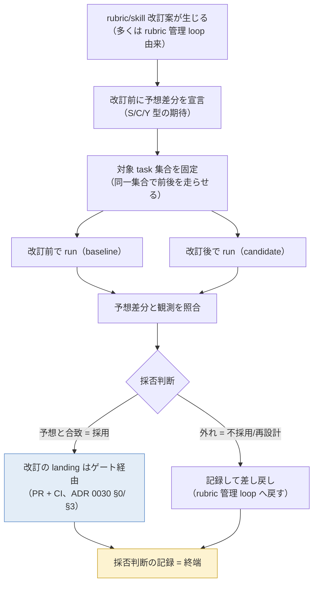
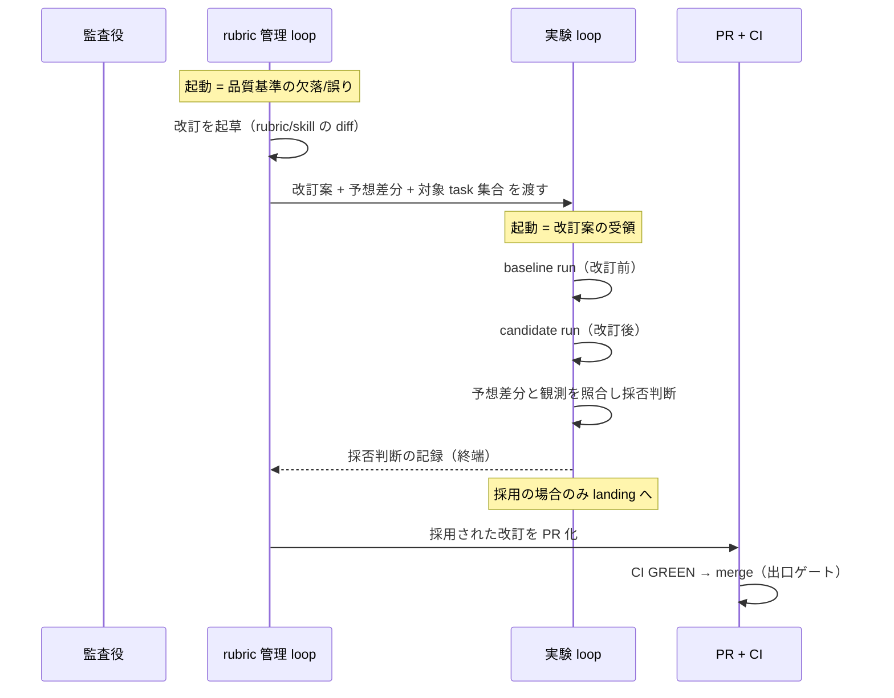
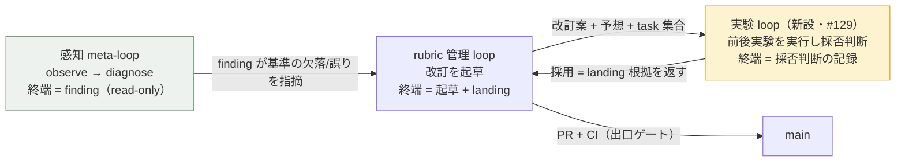

# issue #129 解説 — 実験 loop（rubric/skill 改訂の比較実験を実行し評価・採否判断まで行う）

目次: [1. Background](#1-background) ／ [2. Intuition](#2-intuition) ／ [3. Code](#3-code) ／ [4. Quiz](#4-quiz)

この教材の対象は issue #129（`task-request` + `needs-review` label 起点）。対象は実装 diff ではなく、issue 本文に載った **plan の理解**である。plan は「ADR 0030 §6 と追記 D で決まった専用の実験 loop を新設し、`design/loops.md` の loop 台帳に行を追加する」ことを提案している。この教材の仕事は、実験 loop が何を入力に取り・何を終端に持ち・なぜ既存の rubric 管理 loop と別に必要なのかを、ADR 0030（§6・追記 D・関連する §0/§5/追記 E）・`design/loops.md`・`design/outer-loop-family.md`・`evals/` の思想（`evals/eval-format-v1.md`・ADR 0019）に接地して一枚に組み立てることである。

> [!IMPORTANT]
> 実験 loop は 2026-07-07 時点で `design/loops.md` の loop 台帳に**まだ存在しない**。issue #129 はその追加を提案する plan であって、実装済みの機構の解説ではない。本教材が「未決」と記す箇所（loop の driver 実体・評価の判定形式・記録の置き場など）は、plan が答えを確定していない点である。推測では埋めない。

## 1. Background

読者の前提知識は仮定しない。実験 loop が置かれる系（lathe の開発ハーネス）の周辺主体を、先に一つずつ「何をするのか・なんのために存在するのか」で並べる。

### 1.1 2 ゲート原則（ADR 0030 §0）

lathe の開発系には、強制点（機械が必ず通す関門）が **2 つだけ**ある。

- **入口 = intake**: task が発生する唯一の点。`task-request` label 付き issue の作成そのものが登記であり、これ以外の経路で task は生まれない（ADR 0031 で intake は「issue 作成そのもの」に縮退した）。
- **出口 = PR + CI**: main（正本ブランチ）へ入る唯一の入口。PR を作り CI が GREEN になることだけが merge の条件で、例外はない（ADR 0026 §1）。

この 2 点の間にある作業単位は**すべて task** であり、「loop の種類」とは task の型のことである、というのが §0 の宣言である。強制は入口・出口の機械（GitHub Action / CI / branch protection）に集約し、中間段に独自の強制機構を作らない。実験 loop も、この 2 ゲートの外側に別の強制点を作ってはならない——後述するとおり、採用時の改訂の着地は必ず出口ゲート（PR+CI）を経る。

### 1.2 intake（登記）

`task-request` label 付きの issue が作られると、それがそのまま task になる（TASK-N = issue #N・採番は GitHub・却下ゼロ、ADR 0031）。intake は判断をしない登記機械であり、issue に何が書かれていても差し戻さない。issue #129 自身も `task-request` を持つ 1 個の task である。

### 1.3 task と loop 台帳（`design/loops.md`）

`design/loops.md` は **loop 台帳**である。その冒頭はこう宣言する。

> 全てのセッション（人間との会話・agent の run を問わず）は、下表のいずれか 1 つの loop であり、その loop の唯一の終端でだけ終わる。

つまり「何をしている会話か」は必ず台帳のどれか 1 行に対応し、その行が定める**唯一の終端**でだけ終わる。定義外の状態（途中で止めて他者が代わりに完走する等）は存在しない。台帳に現在ある loop は以下である（各行の「唯一の終端」が要点）。

| loop | 誰が回すか | 唯一の終端 |
|---|---|---|
| inner（task） | driver `scripts/inner-loop.mjs` + named agents | ゲート経由の merge、または escalation |
| 前進（plan） | outer（PdM 対話・問題提起） | task 起票 |
| escalation 対応（ACT） | outer（監査役） | 裁定の記録 |
| **rubric 管理（ACT）** | outer（監査役が起草） | **改訂の起草 + ゲート経由の landing** |
| 感知（meta-loop） | driver `scripts/meta-loop.mjs`（read-only） | finding + 判断記録 |
| harness-hotfix（緊急路） | outer（監査役）+ PdM | PdM 承認 → 事後 incident 記録付きの着地 |
| intake（登記） | 廃止（issue 作成そのもの、ADR 0031） | issue 作成の完了 |
| 解説（explain） | explain-diff skill を読める任意のセッション | 正本保存 + Discussion 投稿 |

issue #129 が提案するのは、この表に **実験 loop の行を 1 つ足す**ことである（§9「命名整理」・追記 D「loops.md に行を追加する」）。

### 1.4 rubric

`rubrics/` は lathe のコード規範と監査ゲートを機械検査可能な形で持つディレクトリである（merge は `run.mjs` が判定）。rubric は「どの変更集合に・どの検査を・どの層まで（cmd/test/heavy）かけるか」を宣言し、tsc/unit/e2e/storybook/integration/judge を scoped+tiered に走らせる。rubric の改訂とは、この検査基準そのものを書き換える行為である。**skill**（`skills/` 配下、agent の手順書）も同様に、改訂すると agent の振る舞いが変わる。

rubric や skill の改訂は「基準を変える」ため、変更が意図どおりの効果を出したかを事後に確かめる術が要る。ここが issue #129 の起点である——ADR 0030 の背景 8 が指摘した穴が、まさに「rubric 改訂に検証プロトコルが無い」だった。

### 1.5 evals の思想（`evals/` ・ADR 0019）

`evals/` は「系にぶつける**負荷**（挑戦の装置）」を宣言するディレクトリである。1 本の eval は S/C/Y の 3 要素で書かれる。

- **S**（状態）: 出発点の状態。
- **C**（条件）: その下で課す条件・負荷。
- **Y**（観測可能な結果）: 成立を判定できる観測。

ADR 0019 §4 が明文化した核心は「**eval は負荷の宣言であって記録ではない**」——実行の裏付け（gate で回る、または当該前線がその負荷を実行する計画）を持たない eval を書いてはならない、というものである。実験 loop はこの思想の延長にある: 改訂の効果を「事前に宣言した予想（＝負荷に対して期待する Y）」として書き、実際に走らせて照合する。ADR 0030 §6 が「evals/ の思想の延長」と明記しているのはこの接続を指す。

### 1.6 rubric 管理 loop と meta-loop（実験 loop の隣人）

- **rubric 管理 loop**（loops.md の ACT 系 1 行）: 品質基準の欠落・誤りを受けて、監査役が rubric / skill / 統治文書の改訂を**起草**し、ゲート経由で landing する。終端は「改訂の起草 + ゲート経由の landing」。**この loop には「改訂が意図どおり効いたかを前後比較で確かめる」段が無い**。
- **感知（meta-loop）**: 開発システム（rubric/eval/skill/harness と loop 運行）が効いているかを観測・診断し、**finding を出すまで**が仕事（read-only）。改訂・起票・実行はしない（`design/outer-loop-family.md` §2–3）。meta は「効果測定」を自分の仕事から切り離しており、その行き先を outer-loop-family.md は「Assurance 運用（eval の回帰検出）」に置いている。

実験 loop は、この 2 つの隙間（起草はするが効果検証しない rubric 管理 loop と、診断はするが実行しない meta-loop の間）に落ちていた「改訂の前後比較実験を**実行して採否まで判断する**」役割を担う新設 loop である。

### 1.7 merge.mjs 解体（ADR 0030 §3）

背景として、ADR 0030 は task loop を「ローカル段は IMPLEMENT → PR 作成のみ」に縮退させ、旧来の `merge.mjs`（receipt 検査・backstop・landing lock）を解体して push / `gh pr create` / auto-merge arm を driver 直呼びにした。強制点を 2 ゲートに集約する（§0）帰結である。実験 loop の「採用時の改訂 landing はゲート経由」という規定は、この解体後の世界——「main への着地は PR+CI だけ」——を前提にしている。

### 1.8 task の粒度規準（ADR 0030 §5）

ADR 0030 §5 は task を「人間が数分（理想 1 分）で完全に理解できる範囲」に閉じると定め、`design/plan-format.md` の分割規準に明文化する。§5 本文はこう続ける。

> 粒度の細かさは §6 の比較実験・失敗切り分け・レビュー精度の**前提条件**である。

つまり実験 loop（§6）が機能するには、対象 task 集合が十分細かく切られている必要がある。issue #129 本文が「粒度規準（ADR 0030 §5）が前提条件のため、着手は TASK-29/33 の後が望ましい」と書くのはこのためである（TASK-29/33 = 粒度規準の明文化系の先行 task）。

## 2. Intuition

### 2.1 核心の直感

実験 loop の本質は 1 文である。

> **同一 task 集合で改訂前後を走らせ、事前宣言した予想差分と観測を照合し、採否まで判断して記録する。**

「事前宣言」が効く理由は evals の思想と同じで、後から結果を見て「効いた」と言うのを禁じるためである。改訂前に「何がどう変わるはず」を書き、走らせ、宣言と観測を突き合わせる。合致すれば採用、外れれば不採用または再設計——そこまでを 1 つの loop の終端（採否判断の記録）に含める。

### 2.2 全体像（flowchart）



図の要点は 2 つ。第 1 に、**改訂の landing（main への着地）は loop の内側にはない**——採用と判断されても、実際に main へ入るのは出口ゲート（PR+CI）を通ってである。第 2 に、**loop の唯一の終端は「採否判断の記録」**であり、採用・不採用のどちらでも記録に至る。

### 2.3 rubric 管理 loop との時系列の並置（sequenceDiagram）

なぜ rubric 管理 loop の中に畳まず、別 loop にするのか。両者の終端が違うことを時系列で示す。



rubric 管理 loop の終端は「起草 + ゲート経由の landing」だが、その「landing してよいか」の判断根拠を作るのが実験 loop である。実験 loop の終端は「採否判断の記録」であって landing 自体ではない。両者は入力（改訂案）を共有するが、終端が異なるため別 loop になる（§3.2 で詳述）。

### 2.4 toy 例 — 架空の rubric 改訂を 1 巡

以下はすべて架空だが実形式の値である。

**改訂案の diff**（`rubrics/apps/no-inline-style/rubric.json` を厳格化し、`style={{...}}` を warning から error に上げる、という架空の改訂）:

```diff
--- a/rubrics/apps/no-inline-style/rubric.json
+++ b/rubrics/apps/no-inline-style/rubric.json
@@
-      "severity": "warn",
-      "scope": ["apps/web/components/**"]
+      "severity": "error",
+      "scope": ["apps/web/components/**", "apps/web/app/**"]
```

**事前宣言した予想差分**（S/C/Y 型で書く）:

```yaml
S: 現行 rubric は inline style を warn 扱い・scope は components のみ
C: severity を error に上げ scope に app/ を追加した改訂後で、同一 task 集合を走らせる
Y（予想）:
  - baseline で PASS だった #142 / #145 の 2 task が candidate で RED になる
    （両 task が app/ 配下に inline style を含むため）
  - #150 は両方で PASS のまま（inline style を含まない）
  - false RED（inline style を含まない task の新規 RED）は 0 件
```

**対象 task 集合**（同一集合で前後を走らせる。架空の issue 番号）:

```
#142, #145, #150
```

**改訂前後の run 結果（before / after）**:

| task | baseline（改訂前） | candidate（改訂後） | 予想と一致? |
|---|---|---|---|
| #142 | PASS | RED（app/ の inline style を検出） | 一致 |
| #145 | PASS | RED（app/ の inline style を検出） | 一致 |
| #150 | PASS | PASS | 一致 |

宣言した Y（#142/#145 が RED 化・#150 不変・false RED 0）が観測と合致した。したがって**採用**と判断し、その記録を loop の終端とする。採用後、改訂の diff は rubric 管理 loop 側で PR 化され、出口ゲート（PR+CI）を通って main へ入る。

もし candidate で #150 まで RED になっていたら（宣言外の RED = 予想差分の外れ）、**不採用または再設計**として記録し、rubric 管理 loop に差し戻す。「効いた気がする」で採用しないのが、事前宣言と照合の眼目である。

> [!NOTE]
> この toy 例の「run」が具体的に何を回すか（`rubrics/run.mjs` を対象 task の変更集合に当てるのか、task を実際に inner-loop で再実行するのか）は issue #129 の plan では確定していない。**未確認**。plan は「同一 task 集合で改訂前後を走らせる」という要件を述べるにとどまる。

### 2.5 実験 loop・rubric 管理 loop・meta-loop の関係（flowchart）

3 者の役割境界を一枚に。



meta-loop は「効いていない/誤りがある」と**診断**するだけ（read-only）。rubric 管理 loop は改訂を**起草**する。実験 loop は改訂を**実行して前後比較し採否を判断**する。実行と判断が要るがゆえに read-only の meta にも起草止まりの rubric 管理にも畳めない、というのが分離の根拠である。

## 3. Code

対象は plan（文書）なので、コードではなく接地文書を「理解できる順」にグループ化して要点を引く。

### 3.1 issue #129 本文のウォークスルー

issue #129 の本文はそのまま plan である。全文と接地先の対応を示す。

```markdown
## 問題
rubric/skill 改訂に検証プロトコルが無く、効果を予想と照合できない（ADR 0030 背景 8）。

## 方針（ADR 0030 §6＋追記 D）
- 専用の実験 loop を新設: 入力 = 改訂案＋事前宣言の予想差分＋対象 task 集合
- 同一 task 集合で改訂前後を走らせ、結果を評価し、採否判断まで loop が行う
  （終端 = 採否判断の記録。採用時の改訂 landing はゲート経由）
- loops.md に実験 loop の行を追加（TASK-31 の loops.md 改訂と調整）
- 粒度規準（ADR 0030 §5）が前提条件のため、着手は TASK-29/33 の後が望ましい

## 検証
- 実 rubric 改訂 1 件で、予想差分の宣言→前後実験→評価→採否記録の一巡が回ること
```

| plan の句 | 接地先 | 意味 |
|---|---|---|
| 「検証プロトコルが無く…（背景 8）」 | ADR 0030 背景 8 | この plan の存在理由。改訂の効果を予想と照合する仕組みの不在 |
| 「入力 = 改訂案＋事前宣言の予想差分＋対象 task 集合」 | ADR 0030 §6 | 3 入力。§2.4 の toy 例が 3 つとも埋めた形 |
| 「結果を評価し、採否判断まで loop が行う」 | 追記 D | 実行だけでなく評価・採否まで含む（§3.3） |
| 「終端 = 採否判断の記録」 | 追記 D | loop の唯一の終端。landing ではない（§3.4） |
| 「採用時の改訂 landing はゲート経由」 | ADR 0030 §0/§3 | 2 ゲート原則。着地は PR+CI のみ（§3.5） |
| 「loops.md に実験 loop の行を追加」 | ADR 0030 §9・追記 D | 台帳への 1 行追加（§1.3） |
| 「着手は TASK-29/33 の後が望ましい」 | ADR 0030 §5 | 粒度規準が前提（§3.6） |

### 3.2 なぜ rubric 管理 loop と別に実験 loop が要るのか

`design/loops.md` の rubric 管理 loop 行:

```
| rubric 管理（ACT） | outer（監査役が起草） | … |
| 改訂の起草 + ゲート経由の landing（直接 main 書き込み特権は無い） | inner への起草委譲 |
```

この行の「やること」は **起草**であり、終端は「起草 + landing」である。**改訂が意図どおり効いたかを前後比較で確かめる段は存在しない**。ADR 0030 の背景 8（「rubric 改訂に検証プロトコルが無い」）と追記 D（「比較実験は専用 loop」）が言うのは、この欠落を rubric 管理 loop の中に足すのではなく**別 loop として新設する**という判断である。

分離の根拠を 3 点で整理する。

1. **終端が違う**: rubric 管理 loop の終端 = 起草 + landing。実験 loop の終端 = 採否判断の記録（landing を含まない）。loops.md は「1 loop = 1 終端」を宣言する（§1.3）ため、終端が違えば別 loop になる。
2. **実行を含む**: 実験 loop は前後を実際に走らせる（実行）。rubric 管理 loop は起草止まり、meta-loop は read-only。実行という副作用を持つ段は、起草・診断のどちらにも属さない。
3. **判断を含む**: 採否は judge を要する（evals の受容主張の判定に対応）。この判断結果が rubric 管理 loop の landing の根拠になる。判断の生成と landing を同じ loop に置くと、「効いた気がする」で採用する余地が残る（事前宣言 → 照合を独立段にする意味が薄れる）。

### 3.3 終端 = 採否判断の記録（追記 D の核心）

ADR 0030 追記 D の原文:

> rubric／skill 改訂の比較実験は**専用の実験 loop** として新設する。loop は同一 task 集合での前後実験の実行だけでなく、**結果の評価と採否判断まで**を行い、判断を記録する（終端 = 採否判断の記録。採用の場合は改訂の landing はゲート経由)。loops.md に行を追加する。

「実行だけでなく」が効いている——実験を回すだけで終わりにせず、評価（予想と観測の照合）と採否判断まで 1 loop に含める。これが meta-loop（診断まで・read-only）との差である。meta は「効いていない」と finding を出すが採否は判断しない。実験 loop は採否を判断してその記録で終わる。

### 3.4 採用時の landing はゲート経由

追記 D の括弧書き「採用の場合は改訂の landing はゲート経由」は、2 ゲート原則（§1.1）と merge.mjs 解体（§1.7）の帰結である。実験 loop が「採用」と判断しても、それ自体は main への書き込み権限を持たない——採用された改訂は rubric 管理 loop 側で PR 化され、出口ゲート（PR + CI GREEN）を通ってのみ main へ入る。loops.md が rubric 管理 loop に「直接 main 書き込み特権は無い」と注記するのと同じ規律が、実験 loop にも及ぶ。実験 loop の終端はあくまで**記録**であり、着地は別（ゲート）である。

### 3.5 TASK-29/33 の粒度規準が前提

issue #129 の「着手は TASK-29/33 の後が望ましい」は、ADR 0030 §5 の一文に接地する。

> 粒度の細かさは §6 の比較実験・失敗切り分け・レビュー精度の前提条件である。

対象 task 集合が粗い（1 task が「人間が数分で理解できる範囲」を超える）と、前後の run 結果の差分を「どの変更が効いたか」に帰属できない。§2.4 の toy 例で #142/#145 が RED 化した原因を「app/ 配下の inline style」と特定できたのは、各 task が十分細かかったからである。粒度規準（TASK-29/33 で明文化）が入って初めて実験 loop の照合が意味を持つ、という依存順である。

### 3.6 loops.md への追加 —「まだ無い」ことの確認

2026-07-07 時点の `design/loops.md` の loop 一覧（§1.3 の表）に **実験 loop の行は無い**。台帳末尾の「この台帳の変更」節はこう規定する。

> 本ファイルは統治文書（外部空間）。改訂の起草は監査役、landing はゲート経由、loop の追加・削除・終端の変更は PdM 承認を要する。

したがって issue #129 の「loops.md に行を追加」は、それ自体が PdM 承認を要する統治文書の改訂であり、rubric 管理 loop（＝統治文書の改訂を起草する loop）を経てゲート着地する。plan はこの追加を「TASK-31 の loops.md 改訂と調整」と書いており、命名整理・hotfix 同形化などをまとめる TASK-31 と行の追加を整合させる意図である（TASK-31 の実体は本 plan のスコープ外・**未確認**）。

## 4. Quiz

中難度の 5 問。実質を理解していないと解けないが、ひっかけではない。

**Q1. 実験 loop の「唯一の終端」は次のどれか。**

- a. 採用された改訂の main への merge
- b. 採否判断の記録
- c. 予想差分の宣言
- d. finding の提出

<details><summary>答えと解説</summary>

**b**。ADR 0030 追記 D が「終端 = 採否判断の記録」と明記する。a は誤り——採用時でも main への着地は実験 loop の外（出口ゲート PR+CI 経由）であり、loop の終端に landing は含まれない（§3.4）。c は入力段であって終端ではない。d は meta-loop の終端であり、実験 loop は診断でなく前後実験と採否判断を行う（§2.5）。

</details>

**Q2. rubric 改訂の効果を「改訂後に走らせてみて、良くなっていたら採用」と判断するのは、実験 loop の規律に照らして何が欠けているか。**

- a. 対象 task 集合の固定
- b. 事前の予想差分の宣言
- c. 出口ゲートの通過
- d. 何も欠けていない（それが実験 loop である）

<details><summary>答えと解説</summary>

**b**。実験 loop の核心は「**事前に**宣言した予想差分と観測を照合する」ことである（ADR 0030 §6・§2.1）。これは evals の思想（eval は負荷の宣言であって記録ではない、ADR 0019 §4）の延長で、後から結果を見て「効いた」と言うのを禁じる。d は誤り——事前宣言なしの事後判断は、まさに実験 loop が避けようとしている形である。a も必要だが、「良くなっていたら採用」という記述が最も直接に欠いているのは事前宣言である。

</details>

**Q3. なぜ比較実験を rubric 管理 loop の中に段として足さず、別 loop として新設したのか。最も的確なものは。**

- a. rubric 管理 loop は監査役が回すが、実験 loop は inner の named agent が回すため主体が違う
- b. rubric 管理 loop の終端は「起草 + landing」で、実験 loop の終端は「採否判断の記録」であり、loops.md は 1 loop = 1 終端を宣言するため
- c. rubric 管理 loop は read-only で実験ができないため
- d. 実験 loop は 2 ゲート原則の外に独自の強制点を持つ必要があるため

<details><summary>答えと解説</summary>

**b**。loops.md は「1 loop = 1 つの唯一の終端」を宣言し（§1.3）、終端が違えば別 loop になる。rubric 管理 loop の終端は「起草 + ゲート経由の landing」、実験 loop の終端は「採否判断の記録」で、landing を含まない（§3.2）。加えて実験 loop は前後の実行と採否判断という副作用・判断を持ち、起草止まりの rubric 管理にも read-only の meta にも畳めない。a は誤り——実験 loop の driver 実体は plan で未確定（§2.4 の未確認注記）であり、「named agent が回す」は本文に接地しない。c は誤り（read-only なのは meta-loop）。d は 2 ゲート原則の逆——実験 loop は独自の強制点を持たず、採用時の landing はゲート経由である（§3.4）。

</details>

**Q4. 実験 loop が「採用」と判断した改訂は、その後どうやって main に入るか。**

- a. 実験 loop が採用判断と同時に main へ直接 commit する
- b. rubric 管理 loop 側で PR 化され、出口ゲート（PR + CI GREEN）を通って merge される
- c. 実験 loop が採用ラベルを付けると driver が自動 merge する
- d. meta-loop が finding として採用を報告し、intake が起票する

<details><summary>答えと解説</summary>

**b**。ADR 0030 追記 D の括弧書き「採用の場合は改訂の landing はゲート経由」と、2 ゲート原則（§0）・merge.mjs 解体（§3）の帰結である。実験 loop の終端は採否判断の**記録**であって着地ではなく、main への唯一の入口は PR+CI（出口ゲート）である（§3.4）。a は 2 ゲート原則違反（main への直接書き込みは存在しない）。c も同様に、採用判断が即 merge を発火させることは無い。d は主体が違う（採用判断は実験 loop が下す。meta は診断まで）。

</details>

**Q5. issue #129 が「着手は TASK-29/33 の後が望ましい」と書くのはなぜか。**

- a. TASK-29/33 が実験 loop の driver を実装するため、それが無いと走らせられない
- b. ADR 0030 §5 の粒度規準が前提条件で、task 集合が細かく切れていないと前後 run の差分を特定の変更に帰属できないため
- c. TASK-29/33 が loops.md への行追加を含むため、順序を守らないと台帳が壊れるため
- d. TASK-29/33 が出口ゲート（PR + CI）を新設するため

<details><summary>答えと解説</summary>

**b**。ADR 0030 §5 が「粒度の細かさは §6 の比較実験・失敗切り分け・レビュー精度の前提条件である」と明記する（§3.5）。task が粗いと、改訂前後の run 結果の差分を「どの変更が効いたか」に帰属できず、予想差分との照合が意味を失う。§2.4 の toy 例で RED 化の原因を特定できたのは各 task が十分細かかったからである。a は誤り——実験 loop の driver 実体は plan で未確定（未確認）で、TASK-29/33 がそれを実装するとは本文に無い。c・d も誤りで、TASK-29/33 は粒度規準の明文化系であり、行追加（TASK-31 と調整）や出口ゲート新設ではない。

</details>

---

接地資料: issue #129（本文・`task-request`+`needs-review`）／ADR 0030（§0・§3・§5・§6・追記 D、関連 追記 E）／`design/loops.md`（loop 台帳・rubric 管理 loop 行・「この台帳の変更」節）／`design/outer-loop-family.md`（meta-loop の read-only 境界・効果測定の分離）／`evals/eval-format-v1.md`・ADR 0019（eval = 負荷の宣言・S/C/Y）／ADR 0031（intake = issue 作成そのもの）／ADR 0026（単一着地ゲート）。実験 loop の driver 実体・評価の判定形式・記録の置き場・TASK-31 の実体は 2026-07-07 時点で未確認（plan は要件のみを述べる）。

本教材は explain loop（`.claude/skills/explain-diff/SKILL.md`・ADR 0032/0033）の成果物である。正本は `explains/2026-07-07-issue129-experiment-loop.md`、配信は GitHub Discussion。publish 後は不変であり、追補はスレッド comment で行う。