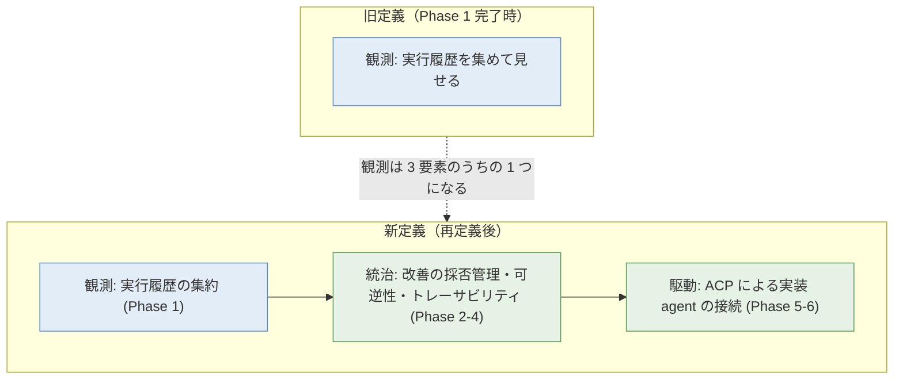
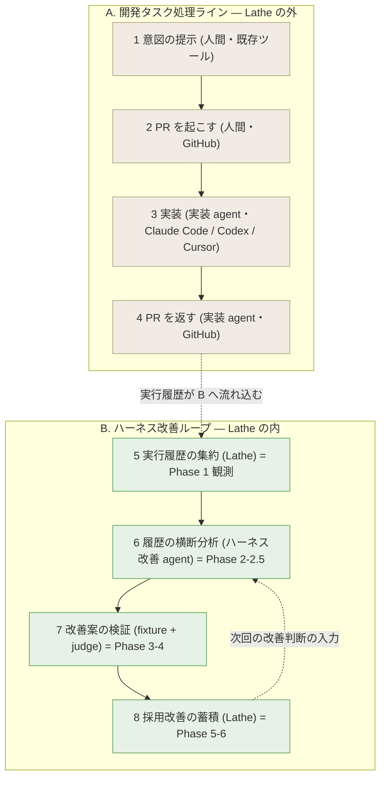
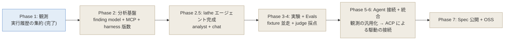
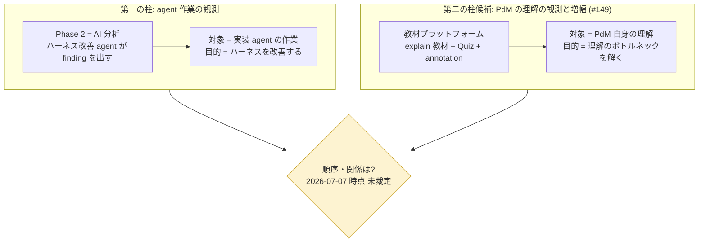

# issue #141 解説 — lathe 製品再定義: 観測ツールから「統治された開発ループのハーネス」へ

目次: [1. Background](#1-background) ／ [2. Intuition](#2-intuition) ／ [3. Code](#3-code) ／ [4. Quiz](#4-quiz)

この教材の対象は issue #141「lathe 製品再定義の vision 骨子を壁打ちで固める」。対象は diff ではなく、lathe を「単なる観測ツール」から「**統治された開発ループのハーネス（駆動・統治・観測の統合）**」へ再定義する構想（2026-07-04 の壁打ちで発見）の理解である。issue #141 の本文はまだ「壁打ちで固める」段階であり、この教材の仕事は「再定義後に lathe が何であって何でないかを一枚で正確に組み立てて見せる」ことである。接地は issue #141 本文・comment（2026-07-06 の #149 議題追加）、`ROADMAP.md`、福岡未踏 2026 提案書（`../fukuoka-mitou-2026/work/proposal-ohno-draft-plain.md`）、`design/loops.md`、`AGENTS.md` の Status 節、issue #149（closed・ADR 0033 で解体）に置く。

> [!IMPORTANT]
> 本教材は issue #141 の「再定義の骨子」の**展開**であって、新たな設計判断を含まない。壁打ちの中心議題（第一の柱=agent 作業の観測 と 第二の柱候補=PdM の理解の観測、の順序・関係）は 2026-07-07 時点で**未裁定**であり、この教材は答えを持たない。骨子に書かれていない点はすべて「未確認」「未決」と明記する。

読者に前提知識を仮定しない。登場する全主体（Lathe / ハーネス / 実装 agent / Claude Code / Codex / PR / ACP / outer-inner loop / dogfood 等）について「何をするか・なんのために在るか」を Background で定義する。

## 1. Background

### 1.1 ハーネスとは何か — この再定義の中心語

近年、コードを書く AI エージェント（GitHub Copilot / Cursor / Cline / Devin / Claude Code / OpenAI Codex 等）が実用に乗りつつある。**エージェント = モデル + ハーネス**という分解が本再定義の出発点である（提案書 §0.1）。

- **モデル**: 言語モデル本体（Claude / GPT / Gemini 等）。能力は API として共通化されつつある。
- **ハーネス**: モデルに「何を・どう動くか」を与える仕組み。具体的には **プロンプト（指示文）・スキル（サブタスク用の手順とツールの束）・フック（動作の節目に決定的に挿入する処理）・作業フロー・ジャッジ（採点機）・レビュー規約・エスカレーション条件** などの組み合わせ。エージェントの振る舞いの差は、モデルが同じでもハーネスから生まれる。同一モデルを異なるハーネスで動かしてベンチマーク上のスコアで 20〜25 点の差が出た事例が報告されている（提案書 §0.1・脚注 [1]）。

ハーネス工学 ⊃ コンテキスト工学 ⊃ プロンプト工学という包含関係で整理される（提案書 §0.2）。ハーネス工学はこのうち最も外側=エージェント全体の設計と運用を指す。

> [!NOTE]
> Lathe（旋盤）という名は、このハーネスを旋盤で部品を削り出すように定量的な計測と改善反復で仕上げる工程を含意する（提案書 §1）。サブタイトルは「ハーネスエンジニアリングを職人芸から定量工学へ」。

### 1.2 登場する主体の定義（前提知識ゼロの読者向け）

| 主体 | 何をするか | なんのために在るか | Lathe の内/外 |
|---|---|---|---|
| **実装 agent（task agent）** | 開発タスクのコード実装を担う。PR の意図を解釈し、計画・実装・自己検証する | 人間の代わりに実装を進める | **外**（Claude Code / Codex / Cursor 等） |
| **Claude Code / Codex / Cursor** | 実装 agent が動く既存ツール。コード編集・agent 駆動の場 | 開発者が普段使う道具 | **外** |
| **PR（プルリクエスト）** | GitHub 上の変更提案単位。差分（コード）を含められる | 意図を実装 agent へ渡し、実装を返す器 | ホスティングは外・**履歴は Lathe が集約** |
| **ハーネス改善 agent（harness agent）** | 蓄積された実行履歴を横断分析し、ハーネスの改善案を出す | ハーネスを継続的に磨く | **内**（Lathe エージェント） |
| **judge（自動採点機）** | ハーネスの出力を採点基準（rubric）に沿って採点する | 改善前後を機械的に比較する | **内** |
| **fixture（検証用入出力セット）** | 固定された入力と期待結果の組 | 改善案を同一条件で検証する | **内** |
| **archive（実行記録）** | 1 実行分の全情報（意図・計画・差分・対話・判断・採点・PR 参照）をまとめた JSON | 改善プロセスを成果物として永続化する | **内** |
| **ACP** | Agent Client Protocol。エージェントを外部から駆動・接続するための protocol（Phase 5-6 で「駆動」を汎用化する接続手段の候補） | 実装 agent を一般化して接続する | 接続の界面 |
| **dogfood** | 開発者自身が自作ツールを実運用して回すこと | 実運用フィードバックで基盤を固める | 運用方針 |
| **outer / inner loop** | lathe 自身の開発体制。outer=監督（監査・issue 化・rubric 管理・エスカレーション対応）、inner=task ごとに実装を自律完走し PR+CI で main へ着地 | lathe を統治のもとで開発する仕組み | lathe の**開発体制**（後述 §1.4 の注意点あり） |

### 1.3 旧定義 — 「観測ツール」としての Phase 1

lathe は 2026-06-11 に **Phase 1（観測）完了**している（`AGENTS.md` Status 節・`ROADMAP.md`）。この時点で提供している機能は「観測」に集約される。

- **turn-first transcript**: Claude Code / Codex のローカル transcript を取り込み、ターン単位で表示・分析する。
- **Git 差分**: transcript とコード差分を双方向リンク（どの発話がどの hunk を生んだか）。
- **統計 / コスト**: cost = 実トークン × 実モデル単価。cost 検証で Opus 4.5+ の 3 倍過大計上を発見・修正した（G9 の前提）。
- **コスト異常検知（G9）**: baseline から外れた過大トークンを検知する。
- **PR 連携（G1）**: session と PR を紐付ける（ADR 0006 = commit SHA 主 + branch 補）。

つまり旧定義の lathe は「既存 agent が残した実行履歴を集めて見せる」道具である。これは提案書のループでいう **⑤ 実行履歴の集約** に相当し、全体像（①〜⑧）のうち 1 段だけが実装された状態にあたる。

### 1.4 「統治」— outer / inner loop という lathe 自身の開発体制

再定義の「統治」には 2 つの層があり、混同しないことが重要である。

**(a) lathe 自身の開発体制の統治**（`design/loops.md`）。全てのセッションは規定された loop の 1 つであり、その唯一の終端でだけ終わる。

- **outer loop（監督）**: 監査（meta-audit）・issue 化・rubric 管理・エスカレーション対応。**outer の終端に実装は無い**。
- **inner loop（実装）**: task ごとに worktree で実装を自律完走し、**PR + CI（単一着地ゲート、ADR 0026）**で main へ着地する。
- 機械の強制点は入口（issue 作成 = 登記）と出口（PR + CI）の 2 ゲート。状態は保存せず gh から導出する（ADR 0031）。

**(b) 製品としての Lathe が顧客に提供する統治**（提案書 §3.0）。ハーネス改善の採否管理・可逆性（採用しなかった改善を取り消せる経路の常時確保）・トレーサビリティ（改善の経緯を archive として永続化）。

> [!WARNING]
> (a) は lathe を**開発する**体制、(b) は Lathe が**製品として提供する**統治である。issue #141 の再定義でいう「統治された開発ループのハーネス」の「統治」は、主に (b) の製品側を指す（ハーネス改善に採否・可逆性・トレーサビリティを持ち込む）。(a) は dogfood でその製品思想を lathe 自身の開発に適用した実例、という関係にある。両者の厳密な対応づけは issue #141 本文に明示されておらず**未確認**である。

### 1.5 提案書の境界（§3.0）— 何を担い、何を担わないか

再定義の骨格は、この境界表である（`ROADMAP.md` の「設計境界（変えない）」・提案書 §3.0）。

| 担う（Lathe の内） | 担わない（Lathe の外） |
|---|---|
| 実行履歴の集約・永続化 | 実装意図の作成 UI（モック・スケッチエディタ等） |
| ハーネス自体の編集・改善・採否管理 | コード編集環境 / IDE 相当 |
| 改善前後の隔離検証 + 並走比較 | PR ホスティング機能（GitHub に任せる） |
| 改善ノウハウの構造化された成果物化 | 実装エージェントそのもの |

**なぜこの境界か**: 提案書 §1 の「未踏性」は、Lathe が IDE・agent 実行環境・agent フレームワーク・評価系（Inspect AI 等）と**競合しない**ことにある。これらは「コードを編集する場」「agent にタスクを依頼する場」「実装ライブラリ」「1 回の評価実行」を既に担っている。Lathe はその一段上の「ハーネス自体を成果物として継続開発・改善する」レイヤーを担う。既存ツールを置き換えず、その上に足場を載せる非侵襲な接続がこの境界の狙いである。

## 2. Intuition

### 2.1 再定義の核 — 「観測」から「駆動・統治・観測の統合」へ

issue #141 本文の一文がこの再定義の核である。

```text
lathe＝単なる観測ツールでなく『統治された開発ループのハーネス』
（駆動・統治・観測を統合／コーディング agent 本体・エディタ・PR ホストは外）
という再定義（2026-07-04 の壁打ちで発見）。
```

3 語を分解する。



- **観測**: 実行履歴の集約（Phase 1・既完）。旧定義の全てが、新定義では 3 要素の 1 つに縮む。
- **統治**: ハーネス改善の採否・可逆性・トレーサビリティ（Phase 2-4）。改善案を出し、隔離検証し、採点し、採否を記録し、取り消せる。
- **駆動**: 実装 agent を接続して動かす部分（Phase 5-6）。**Lathe が実装 agent を作るのではなく**、ACP 等で既存 agent を接続して汎用化する。

「観測ツール」という自己認識では Phase 1 で製品が完結して見えてしまうが、再定義は「観測は改善ループを回すための入口であり、統治と駆動を伴って初めてハーネスを定量工学化する基盤になる」と位置づけ直す。

### 2.2 A/B 2 ラインループ — 起点が issue でなく PR である理由

提案書 §3.3 のループは 2 本のラインからなる（`ROADMAP.md` に引用）。



- **A ライン（外）**: 既存ツールで実行される。Lathe は各段階の情報を集約するが、段階そのものを内部に再実装しない。
- **B ライン（内）**: Lathe の内側で回る。集約（⑤）→ 分析（⑥）→ 検証（⑦）→ 蓄積（⑧）→ 次の分析、というハーネス改善のループ。

**起点が issue でなく PR である理由**（提案書 §3.3・`ROADMAP.md`）: issue は自然言語が主体になりやすいが、**PR は差分（コード）を含められる**。これにより「雑な実装として書き起こしたコード」も意図の一部として実装 agent に渡せる。意図の表現を自然言語に縛らず、コード・HTML・図・イラストを同じ単位で扱うため、A ラインの起点を PR に置く。

> [!NOTE]
> ここでの「PR 起点」は A ライン（Lathe が観測する開発タスク処理）の話である。§1.4 で述べた lathe 自身の開発体制（loops.md）では「issue = task」が起点であり（ADR 0031）、両者は別の話である。混同しないこと。

### 2.3 toy 例 — B ラインが 1 周する具体（架空）

架空の例。ID は実形式の架空値である（提案書 §3.5 の状況設定を toy 化）。

あるチームが API 改修タスク 50 件を実装 agent に依頼し、各実行が archive として蓄積されているとする。

**⑤ 集約**: 50 件の archive（例: `archive_a3f92c1` 〜 `archive_7f3a2c9`）が Lathe に貯まる。各 archive は意図・計画・差分・transcript・judge 採点・PR レビュー結果を含む JSON。

**⑥ 分析**: ハーネス改善 agent が横断分析し、finding を出す。

```json
{
  "finding_id": "fnd_18pct_redo",
  "type": "failure_loop",
  "observation": "API 設計を含むタスクで PR が 2 回以上差し戻された割合 = 18%",
  "root_cause": "ドメインモデル整合性確認を経ずに実装着手（判断履歴から抽出）",
  "proposal": "実装着手前にドメインモデルを参照するスキルをハーネスに追加",
  "evidence_links": ["archive_a3f92c1#turn_7", "archive_7f3a2c9#pr_305"]
}
```

**⑦ 検証**: baseline（既存ハーネス）と candidate（スキル追加後）で同一 fixture（過去に差し戻された 12 件）を並走。judge が採点する。

```text
                         baseline   candidate
仕様忠実性(平均)             6.5    →    7.8
差し戻し率                  17%    →     5%
トークン/タスク           21,000  →   24,500 (許容範囲内)
```

**⑧ 蓄積**: 開発者が「採用 + 理由一言」で採否判定（オラクル）。採用されると archive に改善が追加され、次回の⑥の入力になる。副作用が後で判明したら `git revert` 相当で取り消せる（可逆性）。

この 1 周が「ハーネスを職人芸から定量工学へ」の実体である。finding をクリックすると Phase 1 の観測（transcript の turn・差分の hunk）へジャンプできる（evidence_links がその紐付け）。

### 2.4 Phase 遷移 — 観測の汎用化から駆動の接続へ

再定義後の Phase は、B ラインの各段を段階的に埋める（`ROADMAP.md` Phase 別スコープ）。



**Phase 5-6 の再定義が「駆動」の合流点**（issue #141 本文が名指しする箇所）。

- **Phase 5（Agent 接続）**: 「コーディングエージェント自体は作らない」原則（提案書 §2.2）を守りつつ、既存 agent との統合を汎用化する。各 provider（Claude Code / Codex / Cursor / Devin / Aider）を同じ interface で扱い、plugin が `discover()` + `build()` + `apply(改善案)` の 3 メソッドを持つ。**観測（Phase 1 の provider 抽象）を汎用化し、その先で「駆動」を接続する**のがこのフェーズの本質。
- **Phase 6（統合）**: Phase 1-5 を 1 つの運用ループとして接続し、改善履歴を成果物として永続化する。

issue #141 本文はこう指定する。

```text
ROADMAP の Phase 5-6 再定義（観測の汎用化→ACP による駆動の接続）・
未踏提案書（fukuoka-mitou-2026 §3.0）との整合確認・
最初に画面化する部品の優先順位。
cloud 実行（executor backend としての Claude Code cloud・mini-PC 購入後）も
この設計に合流させる。
```

**ACP（Agent Client Protocol）** は「駆動」を接続する protocol 候補である。観測（過去の実行履歴を受け取る）に留まらず、Lathe が実装 agent を**駆動**（apply(改善案) → 実装を走らせて検証）できるようになる。**cloud 実行**（executor backend としての Claude Code cloud・mini-PC 購入後）もこの駆動設計に合流する——ハーネス改善の検証（⑦）を隔離環境で走らせる実行基盤としての合流である。

> [!NOTE]
> ACP の具体的な仕様・採否・cloud 実行の実装形は issue #141 本文で「合流させる」という方針が示されるのみで、詳細は**未確認**である。Phase 5 開始ゲートでハーネス意味論の一般化とともに確定する（`ROADMAP.md` 論点 #14）。

### 2.5 第二の柱候補 — #149「PdM の理解の観測と増幅」

issue #141 の 2026-07-06 comment（PdM 構想）が、壁打ちの中心議題の 1 つを追加する。

```text
vision 議題の追加（2026-07-06 PdM 構想）: #149 教材プラットフォーム
（explain HTML の配信・Quiz テレメトリ・節単位 annotation 解説＝常駐 CC 応答）。
「agent の作業の観測（Phase 2 = AI 分析）」に対し「PdM の理解の観測と増幅」
という第二の柱の候補。両者の順序・関係の裁定が本壁打ちの中心議題の一つ。
```

2 本の柱を対比する。



- **第一の柱（agent 作業の観測）**: これまで見てきた B ライン。実装 agent が何をしたかを観測し、ハーネスを改善する。
- **第二の柱候補（PdM の理解の観測と増幅）**: #149 の教材プラットフォーム。explain 教材（この教材自身がその一例）を配信し、Quiz で理解の弱点を観測し、節単位の annotation で常駐 Claude Code が追加解説する。**観測対象が「agent の作業」でなく「PdM 自身の理解」である**点が第一の柱との差である。

> [!IMPORTANT]
> 両者の**順序・関係の裁定が本壁打ち（issue #141）の中心議題の 1 つ**であり、2026-07-07 時点で**未裁定**である。この教材はどちらを先にすべきかの答えを持たない。

### 2.6 #149 の顛末 — 構想は生きたが構築対象は消えた

第二の柱候補 #149 自体は 2026-07-07 に **ADR 0033 で解体 close** された（issue #149 comment）。ただし「PdM の理解の観測と増幅」という柱の思想が消えたわけではなく、**実装方法**が変わった。

| #149 当初の 4 層構想 | ADR 0033 後の帰結 |
|---|---|
| 配信: apps/web に /reports route + DB ingest | Discussions（有効化済み・追加基盤ゼロ） |
| カタログ: 過去教材一覧 | explains/ と Discussions 一覧 |
| 理解テレメトリ: Quiz 回答収集 → 傾向ビュー | **非目標として放棄**（ADR 0033 §5） |
| annotation 解説: 節単位の常駐 CC 応答 | Discussions ネイティブスレッド |

描画忠実度実験（Discussion #154）の結果、教材は GFM ネイティブに確定し、独自プラットフォームを構築する対象が消滅した。つまり第二の柱は「専用プラットフォームを作る」形ではなく「Discussions + explain-diff skill」という既存基盤で成立する形に畳まれた。柱としての vision（issue #141 の議題）は生き、構築物としての #149 は解体された、という関係である。

## 3. Code — 設計文書・ROADMAP・提案書のウォークスルー

本件は diff ではないため、接地資料（設計文書・ROADMAP・提案書・issue）を理解できる順にグループ化して引用する。

### 3.1 issue #141 本文 — 再定義の骨子

issue #141 の Description（ADR 0031 移行で旧 TASK-12 から転記）。

```text
lathe＝単なる観測ツールでなく『統治された開発ループのハーネス』
（駆動・統治・観測を統合／コーディング agent 本体・エディタ・PR ホストは外）
という再定義（2026-07-04 の壁打ちで発見）。

やること:
  - 境界表の確定
  - ROADMAP の Phase 5-6 再定義（観測の汎用化→ACP による駆動の接続）
  - 未踏提案書（fukuoka-mitou-2026 §3.0）との整合確認
  - 最初に画面化する部品の優先順位

cloud 実行（executor backend としての Claude Code cloud・mini-PC 購入後）も
この設計に合流させる。
旧 WBS ローカルタスク vision-kokkuchi の移送。
```

「やること」4 項が壁打ちで固めるべき骨子である。うち「境界表」は既に `ROADMAP.md` に確定済み（§1.5・§3.2）、「Phase 5-6 再定義」は方針のみ（§2.4）、「最初に画面化する部品の優先順位」は**未確認**（issue 本文に列挙なし）。

issue #141 の label は `task-request`（task 登記）と `needs-review`（人間キュー: PdM が読み Ready に動かすまで実装は発火しない、ADR 0035）。つまりこの issue は**まだ実装段階に入っていない壁打ち対象**である。

### 3.2 ROADMAP.md — 境界表とループの正本

`ROADMAP.md` TL;DR の目標と境界（§1.5 で表として展開済み）。

```text
目標: 提案書の全ビジョン（Phase 1-7）を完成させ、「ハーネス開発を職人芸から
      定量工学へ引き上げる開発基盤」をループとして動かす。
アプローチ: dogfood-first。当面は自身がセルフホストで全 Phase を回す。
境界: 実装意図の作成 UI / コード編集環境 / PR ホスティングは Lathe の外。
      入力 = 既存ツールが残した実行履歴、出力 = ハーネス改善案・採否履歴・スコア推移。
```

「設計境界（変えない）」の表がこの再定義の骨格であり、**この境界は Phase 7 完成まで守る。境界が膨らみ始めたら Phase 設計を見直す**（`ROADMAP.md`）と明記されている。境界の恒常性が再定義の要である。

### 3.3 提案書 §3.3 — A/B 2 ラインと PR 起点

提案書 §3.3 のライン定義（§2.2 で図として展開済み）。B ラインの各段。

```text
[ B. ハーネス改善ループ — Lathe の内側 ]
  5 実行履歴の集約 (Lathe)             既存ツール側の計画書・編集差分・
                                       トランスクリプト・判断履歴・PR メタデータを
                                       1 件の実行記録にまとめる
  6 履歴の横断分析 (ハーネス改善 agent)  蓄積された実行記録から改善余地を抽出
  7 改善案の検証 (ハーネス改善 agent)    検証用入出力セットを改善前後で並走実行、
                                       自動採点機で比較
  8 採用改善の蓄積 (Lathe)             採用された改善を履歴に追加
```

PR 起点の根拠（提案書 §3.3）。

```text
ライン全体の起点として issue ではなく PR を採用している。
issue は自然言語が主体になりやすいが、PR は差分（コード）を含めることができる。
これにより、雑な実装として書き起こしたコードも「意図の一部」として
実装エージェントに渡せる。
```

### 3.4 提案書 §3.0 — 担う/担わない境界の原文

`ROADMAP.md` の境界表の出典（提案書 §3.0）。

```text
Lathe が担うのは、それらの一段上に位置する以下のレイヤーである。
  - 開発タスクの実行履歴の集約と永続化
  - ハーネス自体の継続的な編集・改善・採否管理
  - 改善前後の隔離検証と並走比較
  - 蓄積された改善ノウハウの構造化された成果物化

逆に、以下は Lathe が担わない。
  - 実装意図の作成・編集 UI
  - 実装エージェントによるコード編集の実行環境や IDE 相当の機能
  - GitHub などの PR ホスティング機能
```

未踏提案書 §3.0 との整合確認は issue #141 の「やること」の 1 つであり、`ROADMAP.md` の境界表は提案書 §3.0 をそのまま踏襲している（両者は既に整合）。

### 3.5 Phase 5-6 の原文 — 「駆動」の接続

`ROADMAP.md` Phase 5 スコープ（§2.4 で展開済み）。

```text
Phase 5 — Agent 接続（実装エージェント観測の汎用化）
目的: 8 の前半。提案書 §2.2 の「コーディングエージェント自体は作らない」原則を
      守りつつ、既存 agent サービスとの統合を汎用化する。
スコープ:
  - Plugin 経由で各 provider の transcript と PR 履歴を抽象化
  - Claude Code / Codex / Cursor / Devin / Aider 等を同じ interface で扱う
  - 各 plugin は discover() + build() + apply(改善案) の 3 メソッドを持つ
```

`apply(改善案)` の存在が「観測（discover / build）」から「駆動（apply）」への拡張点である。observe だけの旧定義に対し、改善案を実際に適用して PR 化する能力が加わる（Phase 5 完了の定義: 「Claude Code に対して apply(CLAUDE.md 改訂案) で改訂が PR 化される」）。

### 3.6 loops.md — 統治（開発体制側）の接地

`design/loops.md` の outer/inner 分離（§1.4 で展開済み）。

```text
実装（task loop）: driver が TASK_PLAN → PLAN_REVIEW → IMPLEMENT（worktree）
  → LAND = PR 作成 → review 周回。
  唯一の終端 = CI GREEN → merge → issue close、または escalation label 投函

前進（outer 対話）: 監査役。問題の言語化・選択肢の提示。
  loop 外の起票は PdM の明示承認が必須。
  唯一の終端 = 起票 or 記録された不起票判断
```

この教材が回っているのも規定 loop の 1 つ（**教材（explain）loop**: needs-review × 読み物なし → skill で教材生成 → Discussion 投稿 → done-explain 付与 → explains/ 正本の自動 PR。終端 = publish）。issue #141 に付いた `needs-review` label が、この教材生成の起点である。

## 4. Quiz

中難度の 5 問。実質を理解していないと解けないが、ひっかけではない。

**Q1. issue #141 の再定義で、旧定義（観測ツール）は新定義の中でどう位置づけ直されるか？**

- a. 廃止され、観測機能は Phase 5 で作り直される
- b. 「駆動・統治・観測」の 3 要素のうちの 1 つ（観測 = Phase 1）に縮み、統治と駆動が加わる
- c. 統治に吸収され、独立した観測機能はなくなる
- d. そのまま維持され、駆動と統治は別プロダクトになる

<details><summary>答えと解説</summary>

**b**。再定義は「観測ツール」を否定するのではなく、観測を 3 要素（駆動・統治・観測）の 1 つに位置づけ直す（§2.1）。旧定義の全て（turn-first transcript / Git 差分 / 統計 / G9 / G1）は新定義では「観測 = Phase 1」として生き残り、その上に統治（Phase 2-4 の採否・可逆性・トレーサビリティ）と駆動（Phase 5-6 の ACP 接続）が積まれる。a は誤り——観測は作り直さず、Phase 5 は観測を**汎用化**する。d は誤り——3 要素は 1 つの統合された基盤である。
</details>

**Q2. A/B 2 ラインループで、A ライン（開発タスク処理）の起点が issue でなく PR なのはなぜか？**

- a. GitHub の API が PR しか提供していないため
- b. PR は差分（コード）を含められ、雑な実装コードも「意図の一部」として実装 agent に渡せるため
- c. issue は Lathe の外部にあり観測できないため
- d. PR の方が lathe 自身の開発体制（loops.md）と一致するため

<details><summary>答えと解説</summary>

**b**。提案書 §3.3 は「issue は自然言語が主体になりやすいが、PR は差分（コード）を含められる。これにより雑な実装として書き起こしたコードも意図の一部として実装 agent に渡せる」とする（§2.2・§3.3）。意図の表現を自然言語に縛らず、コード・HTML・図・イラストを同じ単位で扱うための選択である。d は逆の混同——lathe 自身の開発体制（loops.md）は「issue = task」起点であり（ADR 0031）、A ラインの PR 起点とは別の話である（§2.2 の NOTE）。
</details>

**Q3. Phase 5-6 の「ACP による駆動の接続」は、Phase 1 の観測と何が違うか？**

- a. 観測は過去履歴を受け取るだけだが、駆動は実装 agent を接続して apply(改善案) で実際に走らせて検証できる
- b. ACP は観測を高速化する protocol で、機能的な差はない
- c. 駆動は Lathe が独自の実装 agent を作ることを意味する
- d. 駆動は cloud 専用で、ローカルでは観測しかできない

<details><summary>答えと解説</summary>

**a**。Phase 5 の plugin は `discover()` + `build()` + `apply(改善案)` の 3 メソッドを持ち、`apply` が「駆動」の実体である（§2.4・§3.5）。観測（過去 transcript を受け取る）に対し、駆動は改善案を実際に適用して PR 化・検証できる。c は誤り——提案書 §2.2 の「コーディングエージェント自体は作らない」原則を守り、Lathe は**既存 agent を接続**するだけで自前 agent を作らない。d は誤り——cloud 実行は駆動の検証を隔離環境で走らせる実行基盤として「合流」するもので、駆動が cloud 専用という意味ではない（ACP 詳細は未確認）。
</details>

**Q4. #149「教材プラットフォーム」が示す「第二の柱」は、第一の柱と何が違うか？また #149 自体はどうなったか？**

- a. 観測対象が「agent の作業」でなく「PdM 自身の理解」である。#149 は ADR 0033 で解体 close された
- b. 観測対象は同じ agent 作業だが UI が違う。#149 は実装完了した
- c. 第二の柱は第一の柱の上位互換で、第一の柱は廃止される。#149 は open のまま
- d. 両者は独立プロダクトであり、#149 は Phase 8 に昇格した

<details><summary>答えと解説</summary>

**a**。第一の柱（Phase 2 = AI 分析）は実装 agent の作業を観測してハーネスを改善する。第二の柱候補（#149）は **PdM 自身の理解**を観測（Quiz）し増幅（annotation 解説）する——観測対象が違う（§2.5）。#149 自体は 2026-07-07 に ADR 0033 で解体 close され、4 層構想は Discussions + explain-diff skill という既存基盤に畳まれ、Quiz テレメトリは非目標として放棄された（§2.6）。ただし柱としての vision（issue #141 の議題）は生きており、両柱の順序・関係の裁定は**未裁定**である。c は誤り——第一の柱は廃止されない。
</details>

**Q5. issue #141 の「担わない」境界に含まれないものはどれか？**

- a. 実装意図の作成 UI（モック・スケッチエディタ）
- b. コード編集環境 / IDE 相当
- c. PR ホスティング機能
- d. ハーネス改善の採否管理

<details><summary>答えと解説</summary>

**d**。ハーネス改善の採否管理は Lathe が**担う**（内）側である（§1.5・§3.4・提案書 §3.0）。a・b・c はいずれも「担わない」（外）側——実装意図 UI・IDE 相当・PR ホスティングは既存ツール（Cursor / Claude Code / GitHub 等）に任せ、Lathe はその一段上のハーネス開発レイヤーを担う。この境界により Lathe は IDE・agent 実行環境・PR ホストと競合せず、「ハーネス自体を成果物として継続開発する」未踏レイヤーに集中する（提案書 §1）。境界が膨らみ始めたら Phase 設計を見直す、と `ROADMAP.md` に明記されている。
</details>

---

接地資料: issue #141（本文・2026-07-06 comment・label `task-request` / `needs-review`）／`ROADMAP.md`（TL;DR・設計境界・提案書ループ引用・Phase 別スコープ・Phase 5-6・論点 #14/#16）／`../fukuoka-mitou-2026/work/proposal-ohno-draft-plain.md`（§0.1 エージェント = モデル + ハーネス・§1 未踏性・§2.2 目的・§3.0 境界・§3.2 用語対応・§3.3 A/B ライン・§3.5 動作例）／`design/loops.md`（outer/inner・教材 loop）／`AGENTS.md` Status 節（Phase 1 完了・観測機能の具体）／issue #149（closed・ADR 0033 で解体・4 層構想の顛末）。

未確認・未決（この教材が答えを持たない点）: 第一/第二の柱の順序・関係の裁定（issue #141 中心議題・未裁定）／ACP の具体仕様・採否・cloud 実行の実装形（Phase 5 開始ゲートで確定・`ROADMAP.md` 論点 #14）／「最初に画面化する部品の優先順位」（issue #141 本文に列挙なし）／§1.4 で述べた開発体制の統治(a)と製品の統治(b)の厳密な対応づけ。

本教材は explain loop（`.claude/skills/explain-diff/SKILL.md`・ADR 0032/0033）の成果物である。正本は `explains/2026-07-07-issue141-harness-redefinition.md`、配信は GitHub Discussion。publish 後は不変であり、追補はスレッド comment で行う。
