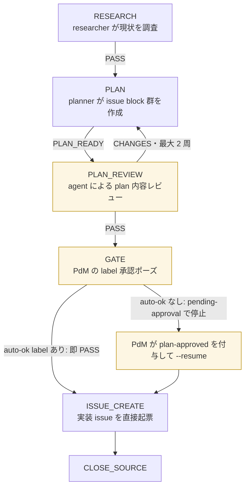
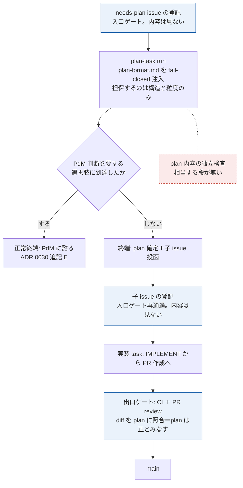

# issue #170 解説 — plan-task に plan review が無い（plan 内容の独立検査の欠落）

目次: [1. Background](#1-background) ／ [2. Intuition](#2-intuition) ／ [3. Code](#3-code) ／ [4. Quiz](#4-quiz)

この教材の対象は issue #170（`needs-explain` label 起点・主経路）。対象は diff ではなく**設計上の欠落の理解**である——「plan-task には、生成された plan の内容を独立に検査する段が無い」という事実を、ADR 0030（追記 A〜E 込み）・`design/plan-format.md`・`design/loops.md`・現行コード（`scripts/inner-loop.mjs` の旧 plan-loop）・issue #116／#142・Discussion #164 に接地して整理する。

> [!IMPORTANT]
> 本教材は**裁定ではない**。検査を挟むか・どこに挟むかの推奨は書かない。それは issue #170 の進め方 2（PdM が教材を理解した後に設計を確定する）に委ねられている。ここでやるのは「何が・どこで・どう担保されているか」「何が欠けているか」「挟み得る位置と選択肢・各代償」の中立な整理である。

読者は Discussion #154（receipt→CI 移行）・#159（backlog 廃止・issue = task）・#164（task loop 縮退・plan-task 導入の設計）を既読とする。既出の背景はその都度参照に切り替える。

## 1. Background

### 1.1 前提の再掲（参照のみ）

- **task の基盤**: issue がそのまま task（TASK-N = issue #N・採番 = GitHub・却下なし、ADR 0031）。plan = issue body・裁定 = comment・振り分け = label。詳細は Discussion #159。
- **task loop の縮退**: ローカル段を IMPLEMENT → PR 作成に縮退し、PLAN／TRIAGE 段を削除、review は PR 上で engine（issue #128）がローカル駆動する（ADR 0030 §3・追記 B）。旧 plan-loop（`RESEARCH→PLAN→PLAN_REVIEW→GATE→ISSUE_CREATE→CLOSE_SOURCE`）はコードごと削除される。詳細は Discussion #164（特に §1.4・§3.2）。2026-07-07 時点で issue #116 は open・未実装であり、旧 plan-loop コードは `scripts/inner-loop.mjs` に現存するが削除が決定済みである。
- **plan-task**: plan を「loop の 1 段」でなく「task の 1 つの型」にする（ADR 0030 §2）。起票者が `needs-plan` label を付けた issue が plan-task になり（追記 A。構造チェック案は廃案）、終端は「plan の確定＋子 issue の投函」。実装は終端に含まれない。

### 1.2 2 ゲート原則 — 「ゲート」と「段」の区別

ADR 0030 §0 が系の強制点を 2 つに限定する。

| 強制点 | 何を強制するか | 機械 |
|---|---|---|
| **入口 = 登記** | task の唯一の発生点。`task-request` label 付き issue の作成そのものが登記（ADR 0031 で intake Action は撤去済み） | GitHub の issue 機構。**判断ゼロ・却下なし**（ADR 0027 追記）——内容は一切見ない |
| **出口 = PR + CI** | main の唯一の入口（ADR 0026 §1） | branch protection ＋ status check `gate`（`rubrics/run.mjs` の再実行）＋ PR review |

原文は「強制はこの 2 点の機械に集約し、**中間段に独自の強制機構（receipt 類）を作らない**」。ここで禁じられているのは**強制機構の増設**であって、検査段そのものではない。実際、縮退後の task loop にも review（PR 上）と verify（CI）という検査は残る——それらは出口ゲートの機械に乗っているから 2 ゲート原則と整合する。この区別（ゲート = 機械強制点／段 = 品質検査）は §3.3 の選択肢整理で効く。

### 1.3 現状の plan 品質の担保構造 — 何が・どこで・どう強制されるか

issue #170 本文が挙げる担保は 2 つ、Discussion #164 スレッドの接地回答（2026-07-07、runner による）がさらに 2 つを確認している。合わせて 4 つ。

| # | 担保 | 何を担保するか | どこで効くか | 強制の質 |
|---|---|---|---|---|
| 1 | **plan-format.md の fail-closed 注入** | plan の**構造**（問題／選択肢／方針／契約／検証の 5 節）と**粒度**（人間が数分で理解できる単位、ADR 0030 §5） | plan-task の prompt 組み立て時。driver が `design/plan-format.md` を実行時読み込みで注入し、読取失敗時は fail closed（issue #116 comment 2026-07-06 で #142 を吸収。7 点論証は #142 参照） | 機械（driver）。ただし**内容の妥当性は判定しない**——形式が満点で前提が誤った plan は素通りする。2026-07-07 時点で未実装（#116 scope） |
| 2 | **PdM の盤面 triage** | 優先度・採否・`needs-plan` 付与の判断 | GitHub Projects の盤面（ビュー。機械は読まない） | 人間。起票時の振り分けであって、**生成された plan を読む工程ではない** |
| 3 | **正常終端「PdM に諮る」** | PdM 判断を要する選択肢に到達した場合の相談経路 | plan-task の run 内。escalation ではなく正常終端の一つ（ADR 0030 追記 E 末尾） | agent の自己判断で発動。**全 plan を網羅しない**——agent が「判断不要」と考えた plan は素通りする |
| 4 | **実装段階の間接照合** | 子 issue の実装 diff と plan の整合 | 出口ゲート上。PR review が「diff を plan ＋ rubric に照合」する。加えて implementer の prompt 契約に「plan の前提が現実と乖離していたら再計画せず ESCALATE」がある（`scripts/inner-loop-prompts.mjs` の impl-loop escalation 契約） | 事後・間接。**plan 自体を正とみなして照合する**ため、plan の誤りは「実装が plan に忠実」なら検出されない。implementer の乖離 ESCALATE は確率的な網であって検査ではない |

### 1.4 欠けているもの

上の 4 つのどれも「生成された plan の内容（技術的妥当性・接地・スコープの正しさ）を、生成者でない第三者が、子 issue 投函の前に判定する」工程ではない。そして plan-task の成果物は構造上、2 つのゲートのどちらの内容検査も受けない。

- **入口**: plan-task が投函する子 issue は登記（入口ゲート）を再通過するが、登記は判断ゼロ・却下なし——内容を見ないことが仕様である
- **出口**: plan-task はコードを生成しないので PR を作らない——出口ゲート（CI・PR review）を通る成果物が存在しない

つまり plan-task は、**成果物が両ゲートの検査対象にならない唯一の loop 型**である。誤った plan がそのまま子 issue 群に分解され、各子 issue は「plan に忠実な実装」として出口ゲートを正しく通過し得る。これが issue #170 の指摘する構造である。

## 2. Intuition

### 2.1 toy 例 — 形式が満点で前提が誤った plan の一巡

架空の例で担保の効き方を追う。ID・sha は実形式の架空値である。

issue #300「run の cost 異常を検知して通知する」が `task-request` + `needs-plan` で起票され、plan-task が走ったとする。生成された plan（issue #300 の body に確定）:

```markdown
## 問題
run 単位の cost 急増が翌日の集計まで発覚しない。異常時に即時通知したい。

## 選択肢
- (a) ingest 時にインライン判定 — 採用。判定点が 1 箇所で済む
- (b) cron で事後スキャン — 却下。即時性がない

## 方針
ingest パイプラインの終端に判定を 1 段挿す。閾値は設定ファイルに置く。

## 契約
type CostAlert = { runId: string; threshold: number; firedAt: string }

## 検証
閾値超過の fixture run を ingest して alert 行が 1 件できること（tier=test）
```

5 節が揃い、粒度も規準内——**担保 1（plan-format 注入）は完全に PASS する**。しかし既存スキーマでは cost 集計の主キーが `session_id` であり、`runId` 起点の契約は既存の集計面と二重帳簿になる、という前提の誤りがあったとする。これは**内容**の誤りであって、形式検査では原理的に捕まらない。

この plan から子 issue #301（判定ロジック）・#302（通知配線）が投函される。以降の各点で何が起きるか。

| 検査点 | 結果 | 理由 |
|---|---|---|
| 子 issue の登記（入口ゲート） | 素通り | 判断ゼロ・却下なしが仕様 |
| implementer の前提乖離 ESCALATE | **不確実** | 乖離に気づけば ESCALATE するが、`runId` 起点でも実装は書けてしまう——気づく保証がない |
| CI（status check `gate`） | GREEN になり得る | rubric は主にコード規範の機械検査。plan の前提誤りは対象外 |
| PR review（diff ⇄ plan 照合） | PASS になり得る | 実装が plan に**忠実**なら整合している。plan 自体の当否は照合の軸にない |

最悪経路では、誤った契約が #301・#302 の 2 本の PR として main に着地してから発覚し、巻き戻しの単位は「子 issue 群＋着地済み PR」になる。

### 2.2 前後比較 — 旧 plan-loop には検査が 2 段あった

2026-07-07 時点の `scripts/inner-loop.mjs` に現存する旧 plan-loop（issue #116 で削除決定済み）は、plan 内容の検査を **2 段**持っていた。



- **PLAN_REVIEW**（agent 検査）: plan candidate を読み、PASS／CHANGES／ESCALATE を返す。CHANGES は planner へ差し戻し（最大 2 周で ESCALATE）
- **GATE**（人間検査）: PLAN_REVIEW PASS 後、driver が停止して PdM の label 承認を待つ。`auto-ok` label があれば省略できる

縮退後の plan-task（ADR 0030 §2＋追記 A・E）にはこの 2 段に相当するものが無い。



> [!NOTE]
> これは見落としではなく、2 ゲート原則（ADR 0030 §0）から出た意図的な縮退である——Discussion #164 スレッドの接地回答が確認した点。issue #170 は「その意図的な縮退の結果として、plan 内容の独立検査という機能が失われたままである」ことを問題として立てている。

## 3. Code

対象は設計文書と旧コードのウォークスルーである。理解できる順に 3 つ——旧 plan-loop の検査 2 段の実装（何が失われるのか）、plan-format.md 運用節の宙吊り（残る文言は誰を指すのか）、検査を挟み得る位置と選択肢（何が可能か）。

### 3.1 旧 plan-loop の検査 2 段 — 実装の実体

`scripts/inner-loop.mjs` の遷移表。PLAN_REVIEW の CHANGES 差し戻しと GATE の承認待ちが状態機械として実装されている。

```js
// scripts/inner-loop.mjs（2026-07-07 時点・issue #116 で削除決定済み）
export const PLAN_LOOP_STAGES = ['RESEARCH', 'PLAN', 'PLAN_REVIEW', 'GATE', 'ISSUE_CREATE', 'CLOSE_SOURCE'];

export function nextPlanLoopState(state, verdict, cycles = 0) {
  if (verdict === null) return { next: 'ESCALATE', cycles };
  switch (state) {
    case 'PLAN':
      return verdict === 'PLAN_READY' ? { next: 'PLAN_REVIEW', cycles } : { next: 'ESCALATE', cycles };
    case 'PLAN_REVIEW':
      if (verdict === 'PASS') return { next: 'GATE', cycles };
      if (verdict === 'CHANGES') {
        const next = cycles + 1;
        return next > MAX_CYCLES ? { next: 'ESCALATE', cycles: next } : { next: 'PLAN', cycles: next };
      }
      return { next: 'ESCALATE', cycles };
    case 'GATE':
      return verdict === 'PASS' ? { next: 'ISSUE_CREATE', cycles } : { next: 'ESCALATE', cycles };
    // ...
  }
}
```

PLAN_REVIEW の prompt（`scripts/inner-loop-prompts.mjs` の `buildPlanReviewPrompt`）が検査の中身を規定する。PASS の条件・差し戻しの押し返し禁止・外部空間の無条件 CHANGES が明文である。

```js
// scripts/inner-loop-prompts.mjs — buildPlanReviewPrompt の要点
'以下の plan-loop 出力を、実装 issue として起票してよいかレビューしてください。',
// ...
'PASS は各 issue block に Title / Depends-on / Touches と実行可能な scoped plan が揃い、
 RESEARCH の issue 候補がすべて起票 block または Rejected 行で処置されている場合だけです。',
```

さらに escalation 契約が「レビュー指摘が設計判断を要求する場合、CHANGES で planner に押し返さず ESCALATE する」ことを定めていた——plan review の場で新しい設計を発明させない規律である。

```js
const PLAN_LOOP_ESCALATION_CONTRACT = [
  'plan-loop escalation: ユーザー裁可が必要な設計判断、調査結果による目標不成立・前提矛盾、
   生成 task の依存が既存 open issue と衝突する場合は ESCALATE してください。',
  'PLAN_REVIEW の差し戻し指摘が未定義の契約・ロール割当・規約新設の決定を求めている
   （問題は述べられているが実装解が一意でない）場合は、CHANGES で planner に押し返さないでください。
   最小変更を発明せず ESCALATE してください。',
].join(' ');
```

GATE は label 3 枚で駆動される人間承認ポーズである。

```js
const AUTO_OK_LABEL = 'auto-ok';                    // あれば GATE を素通り
const PENDING_APPROVAL_LABEL = 'pending-approval';  // 停止中の印（driver が付与）
const PLAN_APPROVED_LABEL = 'plan-approved';        // PdM の承認（人間が付与）
```

`auto-ok` が無ければ driver は承認 plan を issue に comment し（`buildPlanApprovalRequestComment`——「承認するには plan-approved ラベルを付与し `--resume` を実行」）、`pending-approval` を付けて exit 0 で停止する。resume 時は manifest 末尾が `GATE:PENDING_APPROVAL` であること・`plan-approved` label の存在を機械照合してから ISSUE_CREATE へ進む（`resolvePendingPlanGate`）。

この 2 段はどちらも、Discussion #164 §3.2 のとおり issue #116 の削除対象である（遷移表・prompt builder・label 機構ごと）。**削除の理由は plan-loop 全体の廃止**（起票経路の一本化・plan の二重化解消）であり、検査機能だけを選んで捨てた決定ではない——が、結果として検査機能の代替は導入されていない。

### 3.2 plan-format.md 運用節の宙吊り

`design/plan-format.md` の運用節にはこうある。

```markdown
## 運用
- 違反 plan は PdM / reviewer が**このドキュメントを根拠に差し戻す**（散文根拠の明文化が本書の役割）
```

「reviewer が差し戻す」——だが縮退後、plan を読む reviewer はどの段の誰か。PR review（engine 駆動、ADR 0030 追記 B）は実装 diff の照合であって plan の事前レビューではない。この記述は旧構造（task loop 内 PLAN 段＋needs-approval 承認、issue #142 の原案）を前提に書かれており、plan-task にそのまま写像されるかは未確定である。`design/loops.md` は 2026-07-07 時点で plan-task の行を持たず（改訂は issue #118・未着手）、loop 台帳上も plan-task の検査主体は定義されていない。

同文書の設計原則は「reviewer / PdM の**却下基準**」として書かれている——深いモジュール・同一情報の入口は 1 つ・契約は型で表現し型は PLAN が決める。却下基準は存在するのに、それを適用する検査工程が無い、というのが現状の形である。

### 3.3 検査を挟み得る位置と選択肢

plan-task の時間軸上、検査を挟み得る位置は 4 つある: **P1** = plan 生成中（run 内）／**P2** = plan 確定後・子 issue 投函前／**P3** = 子 issue 投函後・実装開始前／**P4** = 実装時（事後・現状）。各位置に対応する選択肢を、前例（repo 内の接地）・2 ゲート原則との整合・代償とともに並べる。**推奨は書かない**。

| 選択肢 | 位置 | 前例（接地） | 2 ゲート原則との整合 | 代償 |
|---|---|---|---|---|
| **(a) run 内に plan review 段を再導入** | P1 | 旧 PLAN_REVIEW の同型: `buildPlanReviewPrompt`＋CHANGES 差し戻し（最大 2 周）＋設計判断は ESCALATE。却下基準は plan-format.md 設計原則が既にある | 段であってゲートではない。§0 が禁じるのは「独自の**強制機構**」であり、検査段は task loop の PR review／CI と同格（1.2 節の区別）。ただし強制力は駆動側規律のみ | issue #116 が「1 run を短く・段を減らす」方向で縮退した直後に段を増やす——失敗切り分け粒度という縮退の動機との緊張。レビュー run のコスト増 |
| **(b) PdM 承認ポーズ** | P2 | 旧 GATE の label 機構（`auto-ok`／`pending-approval`／`plan-approved`＋`--resume`）が `scripts/inner-loop.mjs` に現存。issue #142 原案（needs-approval で PLAN_READY 停止）も同型。plan-format.md 原則「plan は PdM の判断材料。PdM が理解できない plan は通らない」に最も直結 | 人間判断であり機械強制ではない——§0 の禁止対象に当たらない。「PdM に諮る」終端（追記 E）の網羅版とも読める | PdM が人間ボトルネックになる（無人着地の方向 = ADR 0028 との緊張）。`auto-ok` 相当の選択制にすると「検査されない plan」が残り、全数にすると PdM の読む量が task 数に比例する |
| **(c) review engine の対象拡大** | P3 | ADR 0030 追記 B の engine（issue #128）は「review 待ちの PR を拾い reviewer をローカル駆動し、結果を PR comment に残す」——同じ監視点を plan-task の成果物（plan を body に持つ子 issue、または plan 確定時の親 issue）へ広げる形 | engine は既に出口ゲート側の実行系として設計済み。監視対象の拡大であり新ゲートの増設ではない | engine の監視対象が PR から issue に広がる新規設計（#128 は 2026-07-07 時点で未着地）。review 結果が comment だけなら強制力が無い——「実装 task の駆動を review PASS まで待たせる」等の結線が別途要り、それは実質 P3 の関門になる |
| **(d) plan の PR 化** | 出口ゲート上 | 統治文書（ADR・rubric）は既にこの経路——rubric 管理 loop の landing はゲート経由（`design/loops.md`）。plan を repo ファイルにすれば PR review＋CI が自動的に掛かる | 既存の出口ゲートに乗る——原則との整合は最も素直 | ADR 0031「issue がそのまま task・plan = body」と正面衝突する（plan の正本が issue と repo ファイルの 2 箇所になる）。CI の機械検査は plan 内容を判定しない＝実質は PR review 依存で、内容検査の実体は (c) に近づく |
| **(e) 現状維持** | P4 のみ | 現行決定そのもの（ADR 0030・issue #116）。既存の網: plan-format 注入（構造・粒度）・implementer の前提乖離 ESCALATE・PR review の diff⇄plan 照合・「PdM に諮る」終端・meta-loop の感知 | 原則と完全整合（何も足さない） | issue #170 が指摘するリスクの受容——誤 plan は子 issue 分解後・実装後にしか表面化せず、巻き戻し単位が「子 issue 群＋着地済み PR」になる（2.1 節の toy 例） |

> [!NOTE]
> 選択肢は排他ではない。(a)(b) は plan-task の run 設計（driver 側）、(c)(d) は loop 外の機械、(e) は基準線であり、組み合わせも位置の変形もあり得る。また issue #170 の進め方は「#116 の plan-task 実装と統合するか、後付けの独立変更にするかは設計時に判断」としており、実装形も未確定である。

## 4. Quiz

中難度 5 問。実質を理解していれば解ける。

**Q1. plan-task の成果物が 2 つのゲートのどちらの内容検査も受けないのはなぜか。**

- A: plan-task は緊急路（harness-hotfix）としてゲートを免除されているから
- B: 入口（登記）は判断ゼロで内容を見ず、plan-task はコードを生成しないので出口（PR+CI）を通る成果物が存在しないから
- C: needs-plan label が付いた issue はゲートの対象外と ADR 0030 に明記されているから
- D: 子 issue は intake を通らず直接 backlog に書き込まれるから

<details><summary>答えと解説</summary>

**B**。入口ゲート = 登記は「判断ゼロ・却下なし」（ADR 0027 追記・0031）が仕様であり、子 issue の内容を検査しない。出口ゲート = PR+CI は main に入るコードの検査であり、plan-task は plan の確定と子 issue 投函で終端する（ADR 0030 §2）——PR を作らないので出口を通らない。A は誤り（hotfix も同形化されゲートを通る、§7）。C の明記は存在しない。D は旧 plan-loop の ISSUE_CREATE（`backlog task create` 直接呼び）の話で、それ自体 ADR 0030 §1 で廃止が決定済み。
</details>

**Q2. 旧 plan-loop が持っていた plan 内容の検査 2 段と、それぞれの検査主体の組み合わせとして正しいものはどれか。**

- A: PLAN_REVIEW = CI の機械検査／GATE = reviewer agent
- B: PLAN_REVIEW = reviewer agent（PASS/CHANGES/ESCALATE、CHANGES は最大 2 周）／GATE = PdM の label 承認（auto-ok で省略可）
- C: RESEARCH = 人間の事前調査／PLAN_REVIEW = PdM の承認
- D: GATE = branch protection／CLOSE_SOURCE = PdM の最終確認

<details><summary>答えと解説</summary>

**B**。`nextPlanLoopState` で PLAN_REVIEW の CHANGES は PLAN へ差し戻し（MAX_CYCLES = 2 超で ESCALATE）、PASS で GATE へ。GATE は `auto-ok` label があれば即 PASS、無ければ `pending-approval` を付けて停止し、PdM が `plan-approved` を付与して `--resume` すると再開する（`resolvePendingPlanGate` が manifest 末尾と label を機械照合）。CI や branch protection は plan-loop には関与しない。
</details>

**Q3. plan-format.md の fail-closed 注入（issue #142 を #116 が吸収）が担保するもの・しないものの組み合わせとして正しいものはどれか。**

- A: 担保する = plan の技術的妥当性／しない = 節構成
- B: 担保する = 5 節の構造と粒度規準／しない = 内容の妥当性（前提の正しさ・接地・スコープ）
- C: 担保する = 子 issue の依存関係の正しさ／しない = plan の文字数
- D: 担保する = PdM の承認／しない = agent の verdict 形式

<details><summary>答えと解説</summary>

**B**。注入されるのは `design/plan-format.md` の骨格（問題／選択肢／方針／契約／検証＋スケール規則＋設計原則）であり、生成時のフォーマット強制である。2.1 節の toy 例のとおり、5 節が揃い粒度が規準内でも前提が誤った plan は素通りする——形式検査は内容を原理的に判定できない。fail closed は「md が読めないとき黙って旧 prompt に落ちない」の意味であり、内容検査を意味しない。
</details>

**Q4. 2 ゲート原則（ADR 0030 §0)の下で「plan の検査段を足すこと」自体が直ちに原則違反にならないのはなぜか。**

- A: 原則は入口と出口の位置だけを定めており、段の数は無制限だから
- B: plan-task は原則の適用範囲外だから
- C: 原則が禁じるのは中間段への独自の強制機構（receipt 類）の増設であり、検査段そのものではない——縮退後も review（PR 上）と verify（CI）という検査は出口ゲートの機械に乗って存続している
- D: 検査段は PdM が承認すれば何でも追加できると追記 E にあるから

<details><summary>答えと解説</summary>

**C**。§0 の原文は「強制はこの 2 点の機械に集約し、中間段に独自の強制機構（receipt 類）を作らない」。ゲート = 機械強制点と、段 = 品質検査の区別が要点である（1.2 節）。したがって §3.3 の選択肢は「検査に強制力をどう持たせるか」で性格が分かれる——既存ゲートに乗せる (c)(d)、人間判断にする (b)、駆動側規律に留める (a)。A は §0 の趣旨（中間機構を増やさない）を無視しており、D の記述は存在しない。
</details>

**Q5. 実装段階の間接照合（PR review が diff を plan に照合する）が、誤った plan を検出できない場合があるのはなぜか。**

- A: PR review は rubric だけを見て plan を読まないから
- B: 照合は plan を正とみなして diff との整合を見る——plan の前提が誤っていても、実装が plan に忠実なら「整合」として PASS し得るから
- C: review engine が未実装なので照合自体が行われないから
- D: 子 issue には plan が転記されないから

<details><summary>答えと解説</summary>

**B**。review の照合軸は「diff が plan ＋ rubric に従っているか」であり、plan 自体の当否は軸にない。2.1 節の toy 例では、`runId` 起点という誤った契約に忠実な実装は照合上「整合」する。A は誤り（review prompt は plan を含む）。C は状態の説明としては #128 未着地だが、「原理的に検出できない場合がある」理由ではない。D は誤り（plan-task の終端は子 issue への plan 付き投函。plan = body、ADR 0031）。なお implementer の前提乖離 ESCALATE 契約は存在するが、気づくかどうかは確率的で検査の代替にならない（1.3 節 #4）。
</details>

---

接地資料: issue #170（本文・2026-07-07）／ADR 0030（§0・§2・§3・§5・追記 A/B/E）／ADR 0031／`design/plan-format.md`／`design/loops.md`（2026-07-07 時点・plan-task 行なし）／`scripts/inner-loop.mjs`（`PLAN_LOOP_STAGES`・`nextPlanLoopState`・GATE label 機構）／`scripts/inner-loop-prompts.mjs`（`buildPlanReviewPrompt`・escalation 契約）／issue #116（本文・comment 2026-07-05〜07）／issue #142（吸収済み・7 点論証）／Discussion #164（本文＋スレッド接地回答 2026-07-07）。

本教材は explain loop（`.claude/skills/explain-diff/SKILL.md`・ADR 0032/0033）の成果物である。正本は `explains/2026-07-07-issue170-plan-task-review-gap.md`、配信は GitHub Discussion。publish 後は不変であり、追補はスレッド comment で行う。
