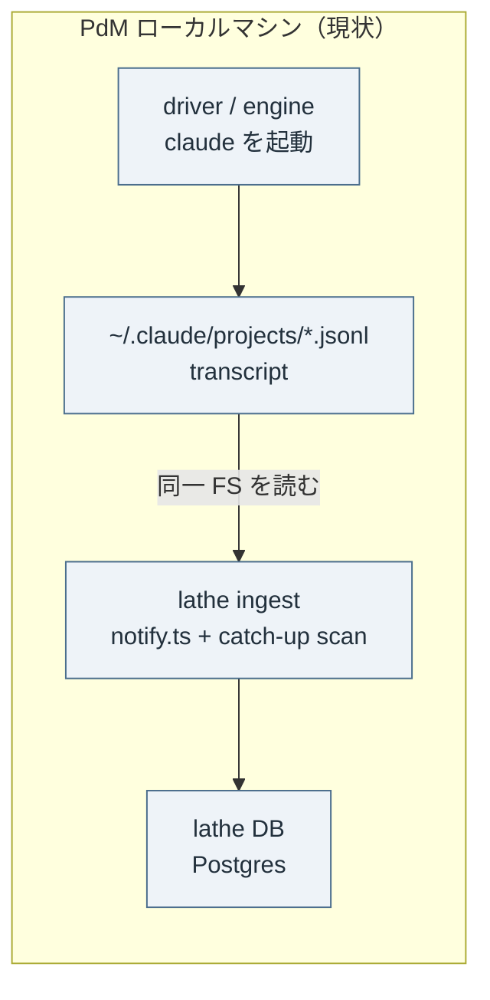
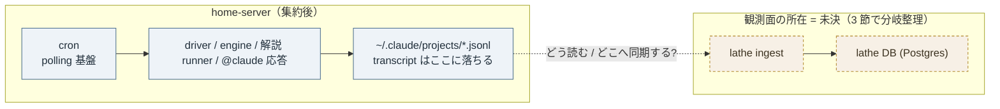
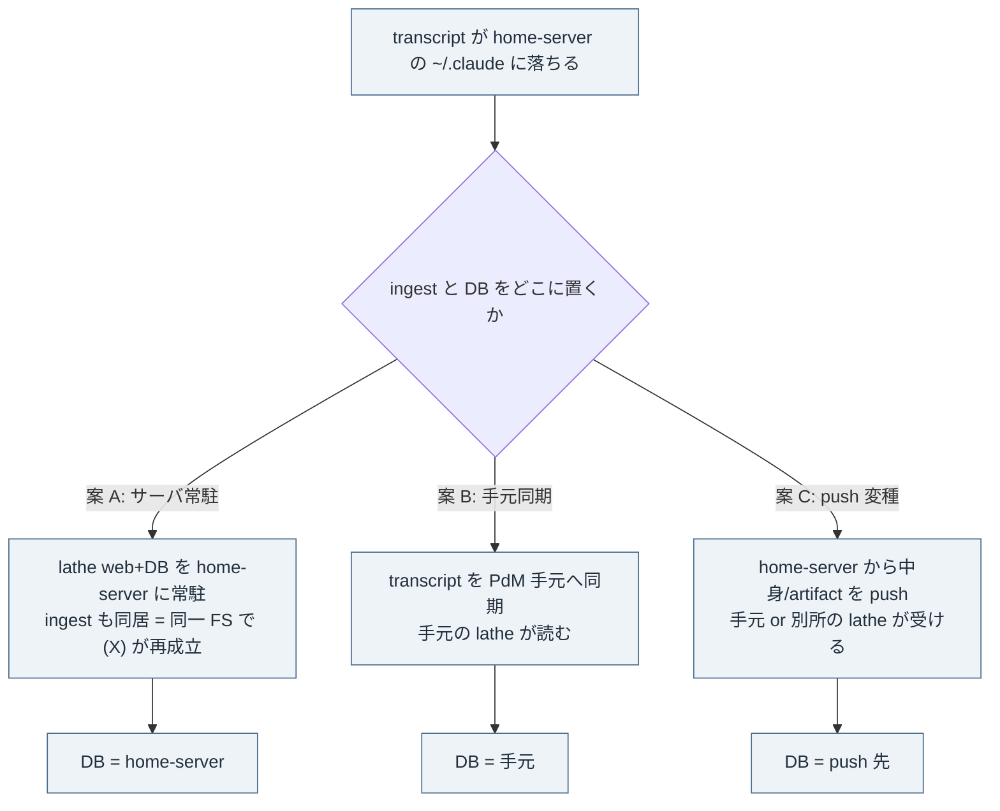

# issue #171 解説 — 実行基盤の自宅サーバー集約と観測面の接続設計

目次: [1. Background](#1-background) ／ [2. Intuition](#2-intuition) ／ [3. Code](#3-code) ／ [4. Quiz](#4-quiz)

この教材の対象は issue #171（`needs-plan` label 起点・PdM の将来トラック構想 2026-07-07）である。対象は diff ではなく**設計構想の理解**——「driver・review engine・応答 runner の実行を PdM のローカルマシンから自宅サーバーの Claude Code に集約する。その本丸は観測面（transcript / lathe ingest / lathe DB）の所在をどう繋ぎ直すかである」という構想を、`design/observation-ingest.md`・ADR 0001／0002／0004・`design/loops.md`・`design/agent-workflow.md`・依存 issue（#116／#128／#117）・現行 ingest コード（`apps/web/scripts/ingest/notify.ts`・`discover-dirs.ts`）に接地して整理する。

> [!IMPORTANT]
> 本教材は**裁定ではない**。ingest をサーバーで回すか手元へ同期するか、lathe DB をどこに置くか、いずれの推奨も書かない。それは issue #171 の進め方（plan-task で詰める）に委ねられている。ここでやるのは「何が・どこで実行され・どの観測面がどこに落ち・何が繋がっていて何が未決か」の中立な整理である。

読者に前提知識は仮定しない。1 節で全主体を定義してから 2 節以降に進む。

## 1. Background

### 1.1 lathe とは何を観測する系か

lathe はコーディング agent の実行を観測・改善・評価するハーネスエンジニアリングプラットフォームである（`AGENTS.md`）。観測対象は coding-agent の 1 実行 = **session** で、transcript（時系列イベント）・diff・統計・コストを持つ（`design/architecture.md` §1）。observability-dense な UI で、turn-first transcript / Git 差分 / コスト異常検知（G9）/ PR 連携を提供する。

lathe 自身は「コーディング agent を作らない」——既存 agent の観測・改善・評価に専念する（`AGENTS.md` Scope）。つまり lathe を動かす開発フロー（後述の driver・engine・runner）が生む transcript もまた lathe の観測対象になる（ドッグフード）。

### 1.2 登場する全主体

issue #171 が「集約」しようとしている実行系と、その実行が生む観測対象を分けて定義する。

| 主体 | 何をするか | なぜ存在するか | 現状の所在 |
|---|---|---|---|
| **driver（inner-loop）** | open な task issue を拾い、IMPLEMENT → PR 作成の inner loop を自律駆動する（`scripts/inner-loop.mjs`）。ADR 0030 §3 で PLAN／TRIAGE 段を削って縮退済み | task の実装を人手なしで完走させるため（`design/loops.md` inner 行） | **PdM のローカルマシン**（issue #171 本文） |
| **review engine** | review 待ちの open PR を拾い、reviewer をローカルで自動駆動し、結果を PR コメントに残す（issue #128・ADR 0030 追記 B） | PR review を gh 上のホスト実行でなくローカルで回すのは、**reviewer の transcript を lathe に ingest する**ため。gh 上のホスト実行では観測面に載らない（ADR 0030 追記 B） | ローカル想定（issue #171 本文） |
| **解説 loop runner** | `explain` label の issue を拾い explain-diff 教材を生成する自動化（`design/loops.md` explain 行の任意拡張、ADR 0032/0033）。本教材自身がこの loop の成果物である | 理解を新しいボトルネックへの一次対応にするため（explain loop の趣旨） | runner 自動化は任意拡張 |
| **@claude 応答** | GitHub 上のメンションに応答する経路（issue #171 が「同居可能」と挙げる主体） | issue 上のやり取りへの自動応答 | 未確認（本教材の接地資料に実装記述なし） |
| **cron** | 定時発火の仕組み。needs-plan/実装 task の polling・review 待ち polling・needs-explain polling を同じ基盤に載せられる（issue #171 本文） | 上記の driver/engine/runner を「いつ起こすか」を統一するため | issue #171 が提案する発火基盤 |
| **transcript** | agent の 1 実行の生ログ（`.jsonl`）。Claude Code は `~/.claude/projects/<dir>/<uuid>.jsonl`、Codex は `~/.codex/sessions/...` に落ちる（ADR 0001・`observation-ingest.md`） | 全細部（extended-thinking 本文・cap なしの tool I/O・sub-agent tree）は JSONL にしかないため（ADR 0001 Context） | 実行したマシンの `~/.claude` 等 |
| **Stop hook** | Claude Code / Codex の session hook。毎ターン `session_id` / `transcript_path` / `cwd` を stdin で渡す（inline 本文でなく path だけ、ADR 0001） | ingest のトリガー。「Stop が来た、path は Y」だけを本体に通知する（push 主・pull 補） | agent を動かすマシン上 |
| **lathe ingest** | transcript path を受けて JSONL を読み、session として正規化し DB に書く。push 経路 = `POST /api/ingest/notify`（`notify.ts`）、pull 補 = `~/.claude/projects` の catch-up scan（`discover-dirs.ts`） | 観測面（transcript）を DB の照会可能な形にするため | lathe 本体サーバ側 |
| **lathe DB** | Postgres（ADR 0004）。session / transcript_event / finding 等を格納する正本 | 観測データの永続化・照会（`design/architecture.md` §1） | 本体サーバ側 |
| **GitHub Actions（CI）** | main の唯一の入口 = PR + CI（ADR 0026 §1・0030 §0）。`gate`（`rubrics/run.mjs` 再実行）を status check として回す | 着地ゲート。**これは既に GitHub のホスト実行**で、driver/engine の集約とは別レイヤ | GitHub ホスト |

> [!NOTE]
> ここで役割分担が二分される。**GitHub Actions（CI・出口ゲート）は既にホスト実行で、集約の対象外**である。issue #171 が集約しようとしているのは、その手前でローカル実行される **driver・engine・runner・@claude 応答**——すなわち「transcript を生む実行系」であり、CI ではない。

### 1.3 現状 = ローカル実行依存の姿

現状、driver は PdM のローカルマシンで動き、engine も同想定である（issue #171 本文）。含意は 2 つ。

- **系の可用性がマシンに従属する**: PdM のマシンが閉じている間は driver が task を拾えず、engine が review 待ち PR を拾えず、系が止まる（issue #171 問題節）。
- **実行環境が分散する**: 実行が複数拠点に散れば、環境・認証・観測面の落ち先も散る（issue #171 問題節）。

そして observation-ingest.md の前提が効く。lathe の ingest は **(X) 薄い hook + サーバ読み**（ADR 0001）——hook は transcript path を送るだけ、サーバが transcript を**ファイルとして読む**——を採る。self-host（ADR 0004）ゆえ Langfuse の client 制約を負わずに成立する。しかしこれは「サーバと transcript が同一ファイルシステムを見られる」ことに暗黙に依存している。

### 1.4 依存する修理チェーン（#116 / #128 / #117）

issue #171 は「#116・#128・#117 の着地後」を依存に置くが、「修理チェーンと独立に設計だけ先行してよい（needs-plan）」とする。2026-07-07 時点の各 issue の状態（`gh issue view` で確認）:

| issue | 内容 | 2026-07-07 の state |
|---|---|---|
| #116 | ADR 0030 ③ task loop 縮退・plan-task 型導入（driver 復活） | **closed（着地済み）** |
| #128 | ADR 0030 ⑥ review engine（review 待ち PR をローカル自動駆動） | **closed（着地済み）** |
| #117 | ADR 0030 ④ escalation の intake 統一 | **open（未着地）** |

issue #171 本文は 3 者を「着地後」と表現するが、実測では #116・#128 は既に closed、#117 のみ open である。集約の対象となる driver（#116）と engine（#128）は着地済み、escalation の一元化（#117）が未着地、という状態で #171 の設計だけ先行する構図になる。

## 2. Intuition

### 2.1 核心 — 「実行を動かす」のは簡単、「観測面を繋ぐ」のが本丸

driver や engine を別マシンで動かすこと自体は、認証（サブスク: `claude setup-token` または server 上で `claude login`・`gh auth`、issue #171 方針節）を通せば成り立つ。難所は observation-ingest.md の (X) が置いた暗黙前提——**「transcript を読むサーバ」と「transcript が落ちるマシン」が同じファイルシステムを見る**——が、実行をサーバーに移した瞬間に問い直される点である。

ADR 0004 の Consequences がこれを既に予告している。

```markdown
- **クラウド実行**（agent がクラウドで完結）: ADR 0001 の「server が jsonl を path で
  読む」前提は filesystem 非共有で崩れる。将来 lathe-client の「中身/artifact を push
  する変種」+ 公開エンドポイント（VPS）か outbound トンネル（Cloudflare Tunnel /
  Tailscale）で対応。MVP 外として明示保留。
```

issue #171 の「本丸は観測面の接続」は、この 2026-06-09 に保留された論点が、実行のサーバー集約という具体構想として表面化したものである。

### 2.2 toy 例 — transcript がどこに落ち、どこで ingest されるか

架空だが実形式の値で追う。自宅サーバーで driver が task issue #142 の実装 run を回したとする。

```text
実行マシン: home-server（driver がここで claude を起動）
session_id:      6f2a1c9e-3b7d-4e08-9a11-2c5d7e0f4b83
transcript_path: ~/.claude/projects/-home-user-work-lathe/6f2a1c9e-3b7d-4e08-9a11-2c5d7e0f4b83.jsonl
cwd:             /home/user/work/lathe
project_id:      github.com/yutaro0915/lathe   （ADR 0002 = 正規化 git remote URL）
```

Stop hook が発火し、`notify.ts` の payload 形（`IngestNotifyPayload`）で本体に通知する。

```ts
// apps/web/scripts/ingest/notify.ts — hook が組み立てる payload の形
export interface IngestNotifyPayload {
  agent?: string;          // 'claude' | 'codex'
  session_id?: string;
  transcript_path?: string; // ← path だけ。本文は含まない（ADR 0001）
  cwd?: string;
  project_id?: string;      // ADR 0002 の canonical key
  event?: string;           // 'Stop' 等
  harness_hash?: HarnessSnapshot;
}
```

本体側 `ingestNotify` は path を**ファイルとして開いて読む**。しかも読める場所は allowlist で縛られている。

```ts
// notify.ts — 読める transcript root の既定 allowlist
return [
  path.join(os.homedir(), '.claude', 'projects'),
  path.join(os.homedir(), '.codex', 'sessions'),
  path.join(os.homedir(), '.codex', 'archived_sessions'),
];
// assertAllowedTranscriptPath: realpath がこの root 群の内側でなければ throw
```

ここが分岐点である。`os.homedir()` は **ingest プロセスが動くマシンの home** を指す。したがって「transcript が落ちるマシン」と「ingest プロセスが動くマシン」が一致しないと、この path は開けない。

### 2.3 before → after の配置図

現状（ローカル集中）では driver も transcript も ingest も DB も同一マシンにあり、ファイルシステムが共有されるので (X) が素直に成立する。



集約後、実行系（driver/engine/runner/@claude 応答）は home-server に移る。transcript は home-server の `~/.claude` に落ちる。問い = ingest と DB をどこに置き、transcript をどう読むか。



### 2.4 transcript を ingest する場所の 3 案（分岐）

「transcript が home-server に落ちてから、どこで ingest されるか」は少なくとも 3 通りある。各案の代償は 3 節で整理し、ここでは形だけ示す。



> [!NOTE]
> issue #171 のコメント（PdM 追加構想 2026-07-07）は、案 C 系を明示している——「lathe（web + Postgres）をサーバーで動かし、ローカルの transcript/実行記録は push ingest で送る。既存の push 主・pull 補 ingest（lathe-client init + notify・token 認可）がそのまま土台になる想定」。ただし「サーバー側 ingest との統合方式を plan で確定」とあり、方式そのものは未決である。

## 3. Code

対象は設計構想なので、接地資料を理解できる順に 4 グループでウォークスルーする——(3.1) (X)/(Y) の二分法と self-host 前提、(3.2) ingest が「ファイルを読む」ことの実コード、(3.3) 観測面の所在 3 案の中立整理、(3.4) 実行の取り合い・block・cron という周辺論点。

### 3.1 ingest transport の (X)/(Y) と self-host 前提

observation-ingest.md は「transcript を誰が読むか」を 2 案に整理している。

```markdown
- **(X) 薄い hook + サーバ読み**（ADR 0001）: hook は path を送るだけ、サーバが
  transcript を読み解析。codex-trace 等の self-host ツールが実証。
- **(Y) 厚い client 読み**（Langfuse 方式）: hook/plugin が client 側で読んで構造化し
  push。Langfuse がこれを採るのは SaaS でサーバがユーザーのマシンを読めない制約ゆえ。
```

そして lathe の立場が明記される。

```markdown
- Lathe は self-host（ADR 0004）なので **(X) が成立**。Langfuse の client 制約
  （Node 22+ 等）を負わない。
```

ここが #171 の設計負荷の源である。(X) の成立条件は「サーバが transcript ファイルを読める」であり、Langfuse が (Y) を強いられた理由は「SaaS でサーバがユーザーのマシンを読めない制約」だった。実行をサーバーに集約すると、**サーバと transcript が同一マシンなら (X) はそのまま成立し続けるが、transcript を手元に持ちたいなら Langfuse と同じ非共有問題に近づく**——(Y) 相当の「client が読んで push する変種」が要る。ADR 0004 の Consequences が予告した「lathe-client の中身/artifact を push する変種」がこれに対応する。

### 3.2 ingest が「path をファイルとして読む」ことの実コード

(X) が「同一 FS 前提」であることは、抽象論でなく現行コードに現れている。push 経路 `ingestNotify` は path の実在をローカルに確認し、allowlist の root 内かを realpath で照合する。

```ts
// notify.ts — ingestNotify（抜粋）
const transcriptPath = resolveTranscriptPath(payload);
if (!fs.existsSync(transcriptPath)) {          // ← ingest マシンのローカル FS を stat
  throw new Error(`transcript_path does not exist: ${transcriptPath}`);
}
const allowedTranscriptPath = assertAllowedTranscriptPath(transcriptPath); // realpath 照合
const built = buildSession(payload, allowedTranscriptPath, runner);        // ファイルを開いて解析
```

pull 補（catch-up）経路も同様に、既定で `~/.claude/projects` をローカル走査する。

```ts
// discover-dirs.ts — 既定の走査 root
export function discoverTranscriptDirs(
  base: string = path.join(os.homedir(), '.claude', 'projects'),
): TranscriptDir[] { /* base 配下の *.jsonl を stat して列挙 */ }
```

`os.homedir()` は ingest プロセスのマシンの home を返す。したがって push 経路も pull 経路も、**transcript が ingest プロセスと同じマシンの allowlist root 内にあること**を要求する。集約後にこれを満たすには、(a) ingest プロセスを home-server に置く（transcript と同居）、(b) transcript を ingest マシンの root へ同期する、(c) allowlist を跨ぐ転送経路（push 変種）を新設する、のいずれかになる。これが 3.3 の 3 案に対応する。

> [!NOTE]
> `LATHE_NOTIFY_ALLOWED_ROOTS` 環境変数で root は上書きできる（`configuredAllowedRoots`）。ただし上書きしても「その root がローカル FS に実在すること」は変わらない——リモート FS のマウントや同期がなければ path は開けない。allowlist はセキュリティ境界であって FS 共有を代替しない。

### 3.3 観測面の所在 — 3 案の中立整理

「本丸 = 観測面の接続」の設計選択肢を、接地・成立条件・代償とともに並べる。**推奨は書かない**。lathe DB（Postgres・ADR 0004）の所在も各案に含める。

| 案 | ingest の所在 | DB の所在 | (X)/(Y) との関係 | 接地（前例・資料） | 代償 |
|---|---|---|---|---|---|
| **A. サーバ常駐** | home-server（transcript と同居） | home-server（Postgres 常駐） | (X) がそのまま再成立（同一 FS） | ADR 0004 の self-host prod compose（アプリ + worker + Postgres の別 compose）。PdM コメント「lathe web+Postgres をサーバーで動かす」構想 | 手元 UI から観測するには home-server への接続（トンネル / 公開エンドポイント）が要る。DB の所在が手元から離れる。self-host 運用（バックアップ・可用性）が home-server に集中 |
| **B. 手元同期** | 手元（PdM マシン） | 手元 | 手元の ingest が読むには transcript を手元 root へ同期する必要（rsync / 共有 FS 等） | 明示的前例は接地資料に未確認。pull 補の catch-up scan（`discover-dirs.ts`）は「同一 FS の走査」であって同期機構ではない | 同期のラグ・欠落・二重取り込みの管理が要る。同期方式は未確認（本教材の資料範囲に実装なし） |
| **C. push 変種** | 受け側 lathe（手元 or 別所） | 受け側 | (Y) 相当。home-server の hook/agent が中身/artifact を push、受け側が読む | ADR 0004 Consequences「lathe-client の中身/artifact を push する変種 + 公開エンドポイント（VPS）か outbound トンネル」。PdM コメント「push ingest で送る・既存 notify が土台」 | 現行 notify は「path を送り本体がローカルで読む」——中身 push は notify payload の拡張（本文 or artifact の運搬）が要る。ADR 0004 は「MVP 外として明示保留」。転送量・認可（token）・再送防止の設計が要る |

> [!NOTE]
> 3 案は排他とは限らない。例えば「A（サーバ常駐 ingest+DB）＋ 手元 UI はトンネル越し」の組み合わせ、「C の push 変種で home-server → サーバ常駐 lathe へ送る」等、位置の組み合わせがあり得る。issue #171 は「サーバーで回すか手元へ同期するか」の 2 択で問題を立てるが、PdM コメントは C（push）を土台候補として名指ししている——ただし「統合方式は plan で確定」であり、確定はしていない。

現行 push 経路が「中身」でなく「path」を運ぶ設計だった理由も接地しておく。ADR 0001 の Decision D は、pure push（B 案≠ここでの B。ADR 内の選択肢 B）を「thinking が hook payload に含まれないため永遠に取れない」として退け、「hook は path だけ POST・本体がファイルから読む」を採った。つまり **path 方式は「hook payload に本文が来ない」制約への対応**であって、FS 共有を前提にしたのは副次だった。集約で FS 共有が崩れるなら、ADR 0001 が退けた「本文をどう運ぶか」が再び論点になる——ただし今度は hook payload でなく「client が JSONL を読んで push する変種」（(Y) 相当）として。

### 3.4 周辺論点 — 実行の取り合い・block・cron

issue #171 のコメント（PdM 追加構想 2026-07-07）が plan で必ず扱う 3 点を挙げている。観測面の直接の一部ではないが、集約設計に結線する。

```markdown
1. **ローカル開発との統合**: サーバー集約後もローカルで開発する需要は残る。両拠点で
   loop を回せる前提で、実行の取り合い（同一 task の二重着手）を防ぐ設計が要る——
   ADR 0031 の導出 status（参照 PR open = In Progress）が自然な排他になるか、
   明示 claim が要るかを詰める
2. **issue の実装 block 機能**: 特定 issue を driver/queue に拾わせない明示的な hold
   （label 例: blocked / hold）と、blocked-by #N 依存解決の両方
3. **lathe 本丸のサーバー常駐＋ローカルからのテレメトリ送信**: lathe（web + Postgres）を
   サーバーで動かし、ローカルの transcript/実行記録は push ingest で送る
```

- **1（二重着手）**: driver が「サーバーと手元の 2 拠点」で回ると、同一 task issue を両方が拾う競合があり得る。ADR 0031 の status 導出（参照 PR open = In Progress）は「PR が開けば In Progress と読める」機構だが、これが**着手前の排他**になるか（PR を作る前の IMPLEMENT 中は排他されないのでは）が論点として立っている。明示 claim（label 等）が要るかは未決。
- **2（block）**: `blocked` / `hold` label と `blocked-by #N` 依存解決。2026-07-07 時点で GitHub のラベル一覧（`gh label list`）に存在するのは `needs-plan` / `task-request` / `needs-explain` / `done-explain` / `needs-review` であり、**`blocked` / `hold` / `escalation` は未作成**（構想上の例示）。導出 status と同じく「機械が読むのは label/参照のみ」という設計方針が示されている。
- **3（cron 発火）**: needs-plan/実装 task の polling・review 待ち polling・needs-explain polling を同じ cron 基盤に載せる（issue #171 本文）。集約すれば発火基盤も一元化できる、という利点。これは実行の集約と観測面の集約を跨ぐ結節点である（同じ基盤が「拾う」と「送る」を担う）。

### 3.5 集約が触れない領域 — 出口ゲート

最後に、集約の**対象外**を接地する。main への着地ゲートは PR + CI（ADR 0026 §1・0030 §0）であり、CI は既に GitHub Actions のホスト実行である。

```markdown
# design/loops.md（原則・ADR 0026 §0）
ゲートは一つ（main の唯一の入口 = PR + CI GREEN、例外なし）。
```

したがって「driver/engine をサーバーに集約する」は**実行系（transcript を生む側）の再配置**であって、着地ゲートの再配置ではない。review engine（#128）がローカル駆動なのは review の transcript を ingest するためであり（ADR 0030 追記 B）、review の判定を CI が status check として機械強制する層とは別である。集約設計は「観測される実行をどこで回すか」に閉じ、「何を main に入れてよいか」の機械強制点（CI）には触れない——この切り分けが 1.2 の役割分担と対応する。

## 4. Quiz

中難度 5 問。実質を理解していれば解ける。

**Q1. issue #171 が「本丸は driver をサーバーで動かすこと自体でなく観測面の接続だ」と言うのはなぜか。**

- A: driver はサーバーで動かせないので、代わりに観測面だけ移すから
- B: 実行の再配置は認証を通せば成り立つが、lathe の ingest は (X)「サーバが transcript をファイルとして読む」前提であり、transcript の落ち先が変わると同一 FS 前提が問い直されるから
- C: 観測面は CI（GitHub Actions）に載っているので、CI をサーバーに移す設計が要るから
- D: transcript は hook payload に inline で含まれるので、payload の再設計が本丸だから

<details><summary>答えと解説</summary>

**B**。observation-ingest.md の (X) は「hook は path を送るだけ・サーバが transcript を読む」で、lathe は self-host（ADR 0004）ゆえ成立している。この成立条件は「サーバと transcript が同一 FS を見る」であり、実行をサーバーに集約すると transcript の落ち先が home-server に移るため、ingest/DB をどこに置き transcript をどう読むかが本丸になる（ADR 0004 Consequences が予告した論点）。A は誤り（driver はサーバーで動かせる）。C は誤り（CI は集約対象外・既にホスト実行）。D は誤り——ADR 0001 のとおり Stop hook には本文 inline は来ず path だけ来る。
</details>

**Q2. 現行の ingest（`notify.ts` の `ingestNotify`）が集約後にそのままでは transcript を読めなくなり得るのはなぜか。**

- A: notify は transcript_path を受けて `fs.existsSync` で実在確認し、allowlist（既定 `~/.claude/projects` 等）内かを realpath で照合する——いずれも ingest プロセスのローカル FS 前提だから
- B: notify は project_id が無いと必ず throw するから
- C: notify は Codex の transcript しか受け付けないから
- D: notify は GitHub Actions 上でしか動かないから

<details><summary>答えと解説</summary>

**A**。`ingestNotify` は path をローカルで stat し（`fs.existsSync`）、`assertAllowedTranscriptPath` が realpath を allowlist root（`os.homedir()` 基準の `~/.claude/projects` / `~/.codex/sessions` 等）と照合する。`os.homedir()` は ingest プロセスのマシンの home なので、transcript がそのマシンの root 内に無ければ開けない。B は誤り（project_id が無ければ cwd から解決、なくても throw しない）。C は誤り（claude/codex 両対応）。D は誤り（notify はローカル ingest 経路で CI とは別）。
</details>

**Q3. observation-ingest.md の (Y)「厚い client 読み」を Langfuse が採った理由と、それが #171 に効く含意の組み合わせとして正しいものはどれか。**

- A: Langfuse は (Y) を性能のために採った／#171 では性能が論点になる
- B: Langfuse は SaaS でサーバがユーザーのマシンを読めない制約ゆえ (Y) を採った／#171 で transcript を手元に持ちたい等で FS 非共有になると、lathe も (Y) 相当（client が読んで push する変種）に近づく
- C: Langfuse は (X) を採れなかったので (Y) にした／#171 では (X) が使えないので (Y) 一択になる
- D: Langfuse は Codex 専用なので (Y) にした／#171 は Claude 専用なので無関係

<details><summary>答えと解説</summary>

**B**。observation-ingest.md は「Langfuse が (Y) を採るのは SaaS でサーバがユーザーのマシンを読めない制約ゆえ」と明記する。lathe は self-host なので (X) が成立していたが、集約で FS 非共有が生じるなら、ADR 0004 Consequences の「lathe-client の中身/artifact を push する変種」＝(Y) 相当が候補になる。A は誤り（理由は性能でなく FS アクセス制約）。C は誤り——サーバ常駐案（3.3 A）なら (X) は再成立し得るので「一択」ではない。D は誤り（Langfuse の Codex/Claude 連携はどちらも Stop hook 経由で、専用ではない）。
</details>

**Q4. 3.3 の「サーバ常駐案（A）」で、(X) がそのまま再成立すると言えるのはなぜか。またその代償は何か。**

- A: 再成立の理由 = ingest と transcript が同一 home-server の FS にあるから／代償 = 手元 UI から観測するには home-server への接続（トンネル / 公開エンドポイント）が要る
- B: 再成立の理由 = CI がサーバーに移るから／代償 = GitHub Actions が使えなくなる
- C: 再成立の理由 = project_id が固定されるから／代償 = fork が同一 identity になる
- D: 再成立の理由 = hook payload に本文が inline されるから／代償 = payload が肥大する

<details><summary>答えと解説</summary>

**A**。案 A は lathe web+DB と ingest を home-server に常駐させ transcript と同居させる。(X) の成立条件「サーバが transcript をファイルとして読む」が同一 FS で満たされるので再成立する。代償は、DB と UI が手元から離れ、手元から観測するには home-server への接続（ADR 0004 が挙げる Cloudflare Tunnel / Tailscale 等のトンネル、または公開エンドポイント）が要ること。B は誤り（CI は集約対象外）。C は ADR 0002 の別論点。D は ADR 0001 が退けた pure push の話で、(X) の再成立理由ではない。
</details>

**Q5. issue #171 コメントの「二重着手を防ぐ設計」で、ADR 0031 の導出 status が自然な排他になるか論点になるのはなぜか。**

- A: 導出 status は「参照 PR open = In Progress」だが、PR を作る前の IMPLEMENT 中は PR が無いため排他が効かず、2 拠点の driver が同一 task を着手し得るから
- B: 導出 status は label を書き換えるので、2 拠点が同時に書くと衝突するから
- C: 導出 status は CI が計算するので、CI が落ちていると status が消えるから
- D: 導出 status は transcript から計算されるので、ingest が遅れると status がずれるから

<details><summary>答えと解説</summary>

**A**。ADR 0031 の status は保存せず導出する（open=To Do／参照 PR open=In Progress／merge close=Done）。PR が開けば In Progress と読めるが、driver が task を拾って IMPLEMENT を始めてから PR を作るまでの間は「参照 PR」が存在しない——この窓で 2 拠点の driver が同じ task を拾うと二重着手になる。だから「導出 status が自然な排他になるか、明示 claim（label 等）が要るか」が plan の論点として立てられている（issue #171 コメント）。B は誤り（status は保存せず、書き換える label ではない）。C・D は status の計算源の誤解——status は GitHub の PR 参照/open-close から導出され、CI や ingest が計算するのではない。
</details>

---

接地資料: issue #171（本文＋PdM コメント 2026-07-07）／issue #116・#128（2026-07-07 時点 closed）・#117（open）／`design/observation-ingest.md`（(X)/(Y)・self-host 前提・push 主 pull 補）／ADR 0001（Stop hook トリガー + サーバ側 jsonl 読み・D 採用）／ADR 0002（project identity = 正規化 git remote）／ADR 0004（Postgres・self-host・Consequences のクラウド実行保留）／ADR 0026 §0/§1・ADR 0030 §0/§3/追記 B（2 ゲート・review engine）／ADR 0031（導出 status）／`design/loops.md`／`design/agent-workflow.md`／`apps/web/scripts/ingest/notify.ts`・`discover-dirs.ts`（ローカル FS allowlist・catch-up scan）／`gh label list`（2026-07-07 時点 blocked/hold/escalation 未作成）。

本教材は explain loop（`.claude/skills/explain-diff/SKILL.md`・ADR 0032/0033）の成果物である。正本は `explains/2026-07-07-issue171-home-server-consolidation.md`、配信は GitHub Discussion。publish 後は不変であり、追補はスレッド comment で行う。
