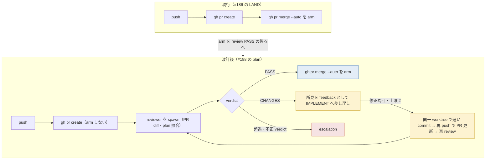
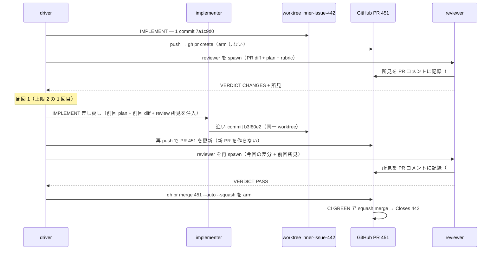
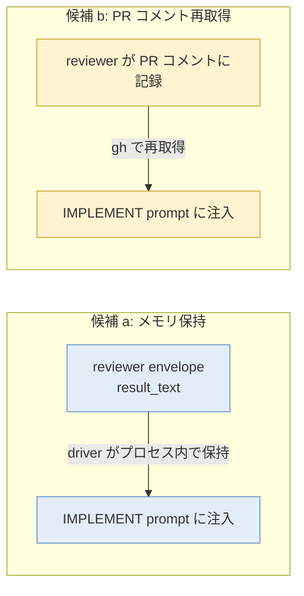

# issue #188 解説 — LAND 段に review を前置する（PR 作成後 reviewer PASS で arm・CHANGES で差し戻し）

目次: [1. Background](#1-background) ／ [2. Intuition](#2-intuition) ／ [3. Code](#3-code) ／ [4. Quiz](#4-quiz)

この教材の対象は issue #188（ADR 0035 追記の plan-task。直接要求で解説）。対象は diff ではなく、**まだ実装されていない plan／設計**である（`blocked-by #186`）。issue #188 の本文（plan）と PdM の設計要求 comment（5 論点）を、ADR 0035 の追記本文・現行 driver（`scripts/inner-loop.mjs` ほか、#186 で TASK_PLAN→PLAN_REVIEW→IMPLEMENT→LAND に拡張済み）・review engine（`scripts/review-engine.mjs`・issue #128）に接地して読む。この教材の仕事は「この plan が driver のどこに何を足すのか」を既存コードを引用して具体化することであり、実装で確定する細部は「未確認」と明記する。

> [!IMPORTANT]
> issue #188 は `blocked-by #186`。#186（LAND 段の現行実装＝PR 作成→auto-merge arm）が先に着地しており、この plan はその LAND 段の**内部順序を組み替える**追記である。2026-07-07 時点で #188 は未実装であり、実装の着地後は当該 PR の diff が事実の正本になる。

## 1. Background

### 1.1 lathe と、この issue が触る層

lathe はハーネスエンジニアリングプラットフォームである。コーディング agent のセッションを ingest して観測・分析するアプリ本体（`apps/web`、Next.js + Postgres）と、**lathe 自身を開発する agent 体制**（driver・named agents・CI・統治文書）の 2 層からなる。issue #188 が触るのは後者——「1 つの task を人間の介在なしに main へ届ける機械」である inner loop の **LAND 段の順序**である。

### 1.2 登場する主体

前提知識ゼロで各主体の「何をするか・なんのために在るか」を置く。

| 主体 | 何をするか | なんのために存在するか |
|---|---|---|
| **driver `scripts/inner-loop.mjs`** | 1 つの task（= GitHub issue、ADR 0031）を受け取り、段ごとに named agent を `claude -p` / `codex exec` で起動し、`VERDICT: <TOKEN>` を parse して次段へ遷移する状態機械 | 判断済みの bounded な作業を人手ゼロで自律完走する。**本 issue の主対象** |
| **inner loop** | driver が回す loop。task issue 1 件を段の列で完走する（`design/loops.md`。唯一の終端 = ゲート経由の merge または escalation） | task の実装を自律完走させる |
| **TASK_PLAN → PLAN_REVIEW → IMPLEMENT** | #186 が拡張した task-loop の段列（`TASK_LOOP_STAGES`）。TASK_PLAN が issue 上に plan を作り、PLAN_REVIEW が独立検査し、IMPLEMENT が worktree で 1 commit する | 「全ての実装は plan に依存し検査される」（ADR 0035 §1）を段で保証する |
| **LAND** | 段列の後の**driver のアクション**（agent 段ではない・`TASK_LOOP_TERMINAL`）。branch を main へ着地させる: push → `gh pr create` → auto-merge arm | ローカル run を PR という公共物に橋渡しする。**本 issue が組み替える対象** |
| **reviewer**（named agent） | PR / branch の diff を **plan ＋ 該当 rubric** に照らして設計遵守・抜け・risk を見て、`approve` / `changes-needed`（driver 文脈では PASS / CHANGES）を返す read-only の検査者（`.claude/agents/reviewer.md`・`.claude/skills/review/SKILL.md`） | gate で測れない**設計判断**を検査する（機械検査 = verifier / CI の領分と重複しない） |
| **implementer**（named agent） | worktree の中で issue（本文 = plan）に従い 1 commit する。IMPLEMENT 段の実作業（`buildImplementPrompt`） | plan の bounded な実装 |
| **PR + CI 単一着地ゲート** | main に入る唯一の道。PR の diff に対し CI（status check）が `rubrics/run.mjs` を GitHub 側で再実行し、GREEN でのみ squash merge が成立する。branch protection で物理強制（ADR 0026 §1） | main の唯一の入口。ここが第二ゲートを増やさない不変点 |
| **auto-merge arm** | `gh pr merge --auto --squash`。「CI が GREEN になったら squash merge せよ」を GitHub に予約する操作。arm 後は CI 完了で自動 merge される | 人手ゼロで着地するための予約 |
| **review engine `scripts/review-engine.mjs`**（issue #128） | open PR を一巡し、レビュー記録の無い PR について reviewer を**ローカルで**駆動し、結果を PR コメント（`## REVIEW:` マーカー付き）に残す独立の CLI。cron / 手動起動 | PR 上 review の実行系。ローカル駆動の理由は transcript を lathe へ ingest すること（gh ホスト実行では観測面に載らない、ADR 0030 追記 B）。**review は記録であってゲートではない**（ADR 0028） |
| **needs-review キュー** | `needs-review` label = 人間キュー。PdM が読み物を読んで Projects で Ready に動かすまで実装は発火しない（ADR 0035 §1） | 重要な task の実装解禁を PdM の承認入力にする |
| **Projects Ready** | GitHub Projects V2 の Status=Ready。機械が読む唯一の承認入力（ADR 0035 §3・§7） | 「人間の読解・判断が完了した。機械は続行せよ」の合図 |

> [!NOTE]
> **model ≠ role**（ADR 0005/0009）。reviewer / implementer は役割名であってモデル名ではない。同じ名前の agent 定義（`.claude/agents/`）が段ごとに `claude -p --agent <name>` で起動される。

### 1.3 #186 で今の LAND がどうなっているか（現行の着地）

#186（commit `f510f46`）が着地させた現行の LAND は、driver の `landBranch()` が 3 操作を順に実行する。plan review が RED を返さない限り、IMPLEMENT の後は**検査を挟まずに**そのまま着地する。

```js
// scripts/inner-loop.mjs — landBranch() の 3 操作（現行）
if (!step('git', ['push', '-u', 'origin', branch])) {
  return fail(`git push failed — cannot create PR for ${branch}`);
}
if (!step('gh', buildPrCreateArgs({ base: 'main', head: branch, title: subject, body: prBody }))) {
  return fail(`gh pr create failed for ${branch}`);
}
if (!step('gh', buildPrMergeArgs({ branch }))) {   // gh pr merge <branch> --auto --squash
  return fail(`gh pr merge --auto failed for ${branch}`);
}
return { ok: true, output: outputs.join('') };
```

`buildPrMergeArgs` は `['pr', 'merge', branch, '--auto', '--squash']` を返す（`inner-loop-core.mjs`）。つまり **PR を作った直後に auto-merge を arm する**。着地後のログはこう言う。

```
done — PR created for issue #N (Closes #N), auto-merge (squash) armed. CI gate completes the landing; the review engine records the review on the PR.
```

このとき review は review engine が**非同期に・別プロセスで**拾う。engine は「記録係」であってゲートではない（ADR 0028）ので、engine が reviewer を回すより前に CI が GREEN になれば、**review が付く前に merge され得る**。これが #116 実装時の監査役裁定 1（「arm は PR 作成時」）の帰結である。

### 1.4 本 issue が変える動機 — merge 前 review

issue #188 と ADR 0035 追記（2026-07-07 PdM 裁定）は、この「review 前に merge され得る」設計を**差し戻す**。ADR 0035 追記の本文はこう規定する。

> 「review 前に merge され得る」設計（#116 実装時の監査役裁定 1 = arm は PR 作成時）を**差し戻す**。review は GitHub 機構としては non-blocking のまま（required review は単一アカウントで deadlock = ADR 0028）だが、**driver が順序で前置を担保する**。

要点は 2 つ。

1. **GitHub 側の第二ゲートは作らない**。required review（GitHub の必須レビュー機構）は lathe が単一アカウント運用のため deadlock する（自分の PR を自分が承認できない、ADR 0028）。だから GitHub 機構としては review は non-blocking のまま。
2. **代わりに driver が順序で前置する**。LAND 段の中で「PR を作る → reviewer を回す → PASS なら初めて arm」という順序を driver が実行することで、「review を PASS するまで arm しない」を担保する。単一ゲート原則（main の機械ゲートは CI のみ）は不変で、これは「駆動側の順序」の変更にすぎない（ADR 0026 §1 不変）。

## 2. Intuition

### 2.1 LAND の新順序 — arm を後ろへずらす

現行 LAND は `push → pr create → arm` の 3 直線。plan（issue #188 本文）はこれを次の順に組み替える。



変わるのは 1 点に尽きる——**arm が「PR 作成時」から「reviewer PASS 後」へ後退する**。その間に reviewer が入り、CHANGES なら IMPLEMENT へ差し戻す往復が挟まる。全ての出口（arm / 差し戻し / escalation）のいずれかに必ず落ちるので、merge が宙吊りになる状態は無い（ADR 0035 追記「全ての出口が arm か差し戻しか escalation のいずれかに落ちる」）。

### 2.2 toy 例 — CHANGES → 差し戻し → PASS → arm の一巡

架空の例。ID・sha・verdict envelope は実形式の架空値である。issue #442「session 一覧の pagination cursor が最終ページで off-by-one する」が `task-request` で起票され、needs-review 無し（自動消化）で driver が拾ったとする。TASK_PLAN → PLAN_REVIEW PASS → IMPLEMENT IMPL_DONE まで進み、branch `inner/issue-442`（HEAD `7a1c9d0`）ができたとする。ここから LAND に入る。

**周回 0（初回 review）**。driver は push → PR #451 作成（arm しない）→ reviewer を spawn する。reviewer は PR #451 の diff を plan と rubric に照らし、CHANGES を返す。

```text
## REVIEW: CHANGES
- severity: major / apps/web/lib/sessions/paginate.ts:38 / 何が: 最終ページで `hasNext` が
  true を返す（cursor が総件数と等しいとき境界判定が >= でなく >）/ なぜ: plan の
  acceptance「最終ページで hasNext=false」に反する
- severity: minor / apps/web/lib/sessions/paginate.ts:52 / 何が: 空リストのとき cursor が
  null でなく "" / なぜ: 周辺コードの慣習（null 表現）に沿わない

VERDICT: CHANGES
```

driver はこの所見を feedback として IMPLEMENT へ差し戻す（周回 1）。**同一 worktree `inner-issue-442` で**追い commit する（新 worktree を切らない・新 PR を作らない）。implementer は境界判定を `>=` に直し、追い commit `b3f80e2` を作る。driver が再 push すると PR #451 が更新される（PR 番号は同じ）。

**周回 1（再 review）**。driver は再び reviewer を spawn する。今度は PASS を返す。

```text
## REVIEW: PASS
- 前回 major（paginate.ts:38 の境界判定）は `>=` に修正され解消。minor（空リストの
  cursor 表現）も null に統一され解消。
- 新規の blocker / major なし。

VERDICT: PASS
```

driver は **ここで初めて `gh pr merge #451 --auto --squash` を arm する**。CI が GREEN になれば squash merge され、`Closes #442` で issue が close し Done になる。

before/after で並べる。

| | 現行（#186 の LAND） | 改訂後（#188 の plan） |
|---|---|---|
| PR 作成後の次の操作 | 即 arm | reviewer を spawn |
| review のタイミング | engine が非同期に拾う（merge より後になり得る） | driver が LAND 内で同期に前置 |
| CHANGES 時 | （LAND に review が無いので分岐なし） | 所見を IMPLEMENT へ差し戻し・同一 worktree で追い commit・再 push で PR 更新・再 review |
| 差し戻し上限 | — | 2 周。超過で escalation |
| arm の条件 | PR 作成 | reviewer PASS |
| 新 PR を作るか | — | 作らない（push で既存 PR を更新） |

### 2.3 driver ⇄ reviewer ⇄ implementer の往復

CHANGES 差し戻しの往復を時系列で描く。



### 2.4 PdM の 5 設計論点

issue #188 の PdM comment は「順序だけ決めて運搬を曖昧にしない」ため、実装前に明示設計すべき 5 論点を挙げた。図と例で噛み砕く（**採否・確定形は未確認＝plan / 実装で確定**）。

**論点 1: CHANGES 所見の運搬経路**。reviewer の所見を implementer にどう渡すか。2 候補が示されている。



- 候補 a（メモリ保持）: driver が reviewer の envelope（`result_text`）をプロセス内で保持し IMPLEMENT prompt に注入。プロセス内・最短・往復なし。
- 候補 b（PR コメント再取得）: PR コメントから `gh` で再取得して注入。記録と運搬が一元化され self-contained だが往復が増える。

**どちらを採るかは未確認**（plan が理由付きで選ぶ）。現行コードの接地は §3.2 で示す（TASK_PLAN の `planText` はメモリ保持で PLAN_REVIEW に渡っており、a はこの既存パターンの踏襲になる）。

**論点 2: 注入形式**。IMPLEMENT prompt 内で「前回 plan・自分の前回 diff・review 所見」がどう並ぶか。所見を**指摘ごとに対応可否を返させる**（暗黙に握り潰させない）形式にするか。現行 `buildImplementPrompt` は issue 本文（plan）と裁定 comment を並べる構造を既に持つ（§3.3）ので、そこに「review 所見」ブロックと対応可否の契約を足す形が候補になる（**具体形は未確認**）。

**論点 3: 周回時の再 review の文脈**。2 周目の reviewer に「前回所見 ＋ 今回の差分」をどう見せるか。差分を **(i) 前回 head からの delta** で見せるか **(ii) branch 全体** で見せるか。同じ指摘の再発と新規指摘を区別できる形にする。review engine は現行 `gh pr diff <n>`（= branch 全体）で見ている（§3.4）ので、delta を見せるなら追加設計が要る（**採否は未確認**）。

**論点 4: worktree の継続**。差し戻しは**同一 worktree での追い commit**とし、PR は push で更新される（**新 PR を作らない**）ことを明示する。現行 driver は issue 番号から worktree 名を一意に導出する（`worktreeNameFor` → `inner-issue-<n>`）ので、同一 issue の周回は自然に同一 worktree になる（§3.5）。

**論点 5: escalation 時の記録**。2 周超過で escalation する際、**全周回の所見履歴**が issue / escalation 側から辿れること。現行 escalation は `.lathe/runs/issue-<n>.escalation.md` に書き、issue に comment する（§3.6）。所見が PR コメントに残る（review engine と同形式のマーカー）なら、PR から全周回が辿れる（**履歴の集約先は未確認**）。

これらは plan-format の「契約」節（インターフェース・データの流れ）として書くべき、というのが PdM の指示である。

## 3. Code

対象は未実装の plan なので、ウォークスルーは「現状こう → plan はこう足す」の形を取る。憶測部分は「未確認（実装で確定）」と明記する。理解できる順にグループ化する。

### 3.1 現状: LAND は agent 段でなく driver アクション

`inner-loop-core.mjs` の段テーブルは、TASK_PLAN → PLAN_REVIEW → IMPLEMENT の 3 段の**後ろ**に LAND を「terminal（driver のアクション）」として置く。

```js
// scripts/inner-loop-core.mjs
export const TASK_LOOP_STAGES = ['TASK_PLAN', 'PLAN_REVIEW', 'IMPLEMENT'];
export const TASK_LOOP_TERMINAL = 'LAND';
const TASK_LOOP_OK_VERDICTS = { TASK_PLAN: 'PLAN_READY', PLAN_REVIEW: 'PASS', IMPLEMENT: 'IMPL_DONE' };
```

コメントは「The stage tables are ordered arrays so an inspection stage can be inserted later without reshaping the driver（監査役裁定 2）」と書く——段の挿入が 1 行変更で済むよう配列にしてある。ただし本 issue が足す review は **LAND 段の内部**に入る（IMPLEMENT と LAND の間に新 agent 段を挿すのではなく、LAND アクションを「PR 作成 → review → arm」に展開する）ため、`TASK_LOOP_STAGES` へ要素を足すのか LAND アクション内で分岐するのかは**未確認（plan / 実装で確定）**。ADR 0035 追記の文面（「LAND 段の順序」）は後者（LAND 内展開）を示唆する。

driver 本体の while ループは `TASK_LOOP_TERMINAL`（= LAND）に達したら抜け、backstop 検査の後に `landBranch()` を呼ぶ。

```js
// scripts/inner-loop.mjs — while ループの終了と着地
while (state !== TASK_LOOP_TERMINAL && state !== 'ESCALATE') {
  // ... 各段を回す ...
}
// backstop: main working tree の意図しない tracked 変更を検査
const landResult = landBranch(branch, issueNumber);
```

### 3.2 現状の前例: PLAN_READY の所見はメモリ保持で次段へ渡っている

論点 1（運搬経路）の候補 a（メモリ保持）は、driver に**既に前例がある**。TASK_PLAN が PLAN_READY を返すと、driver は plan 本文をメモリ変数 `planText` に保持し、それを PLAN_REVIEW の prompt に注入する。

```js
// scripts/inner-loop.mjs — TASK_PLAN の結果をメモリ保持し、PLAN_REVIEW へ渡す
if (state === 'TASK_PLAN' && verdict === 'PLAN_READY') { // capture + post plan comment (ADR 0035 §1)
  planText = envelope.result ?? '';
  // issue にも plan comment を残す（gh issue comment）
}
// ...
const stageCtx = { issueNumber, issueTitle: issue.title, issueBody: issue.body, comments: issue.comments,
  ...(state === 'TASK_PLAN' && { planFormat: readPlanFormatOrDie() }),
  ...(state === 'PLAN_REVIEW' && { planText }) };
```

つまり「reviewer envelope をメモリ保持して IMPLEMENT prompt に注入」（候補 a）は、`planText` と同型のもう 1 本の変数（例: `reviewFeedback`）を LAND 内で持ち回る形になる。同時に PR コメントにも所見が残れば（review engine と同形式のマーカー）、記録と運搬を両立できる。**採否は未確認**だが、既存パターンとの整合という点で a には接地がある。

### 3.3 現状の IMPLEMENT prompt — ここに review 所見ブロックが足される

論点 2（注入形式）の足し先は `buildImplementPrompt`（`inner-loop-prompts.mjs`）である。現行はブロックを配列に push して組み立てており、issue 本文（plan）と裁定 comment を並べる構造を持つ。

```js
// scripts/inner-loop-prompts.mjs — buildImplementPrompt（抜粋）
const lines = [
  marker(issueNumber, 'IMPLEMENT'),
  '',
  `以下の issue（本文 = plan）に従って issue #${issueNumber}: ${issueTitle} を実装してください。`,
  // ... worktree 制約・skill 参照 ...
  '## issue（本文 = plan）',
  issueBody ?? '',
];
const commentsBlock = formatIssueComments(comments);
if (commentsBlock) {
  lines.push('', '## 裁定・申し送り（issue comments。scope 追記や確定裁定を含む。plan と併せて従うこと）', commentsBlock);
}
```

差し戻し時の IMPLEMENT は、この配列に「前回 diff」「review 所見（指摘ごとに対応可否を返させる契約付き）」のブロックを足す形が候補になる（**具体形は未確認**）。「暗黙に握り潰させない形式」は、reviewer 所見の各指摘に対し implementer が「対応した / 対応しない（理由）」を明示的に返す契約として prompt に書くことを指す。

### 3.4 review の実行系 — engine は記録係として不変

論点 3（再 review の文脈）と「engine は driver 経由でない PR の記録係として不変」の接地。review engine は open PR を一巡し、レビュー記録の無い PR について reviewer を回して結果を PR コメントに残す。判定は**内容ベース**で author ベースではない（engine と人間が 1 アカウントを共有するため）。

```js
// scripts/review-engine.mjs
export const ENGINE_MARKER = '<!-- lathe-review-engine -->';
export const REVIEW_HEADING = '## REVIEW:';
export const REVIEW_VERDICT_TOKENS = ['PASS', 'CHANGES', 'ESCALATE'];

export function hasReviewRecord(pr) {
  const bodies = [...(pr.comments ?? []), ...(pr.reviews ?? [])].map((c) => c?.body ?? '');
  return bodies.some((b) => b.includes(ENGINE_MARKER) || b.includes(REVIEW_HEADING));
}
```

engine の reviewer prompt は diff を **`gh pr diff <n>`（= branch 全体・inline）** で見せる（`buildEngineReviewPrompt`）。

```js
// scripts/review-engine.mjs — buildEngineReviewPrompt（diff の見せ方）
diffTruncated
  ? `## diff（\`gh pr diff ${pr.number}\` の先頭 ${DIFF_CHAR_LIMIT} chars で截断。全量は \`gh pr diff ${pr.number}\` で取得すること）`
  : `## diff（\`gh pr diff ${pr.number}\`）`,
```

ここが論点 3 の分岐点である。driver が LAND 内で回す review は、engine と同じ「branch 全体」を見せるのか、周回では「前回 head からの delta」を見せるのかで再発／新規の区別のしやすさが変わる（**採否は未確認**）。

engine の位置づけは ADR 0035 追記が明記する:「review engine（#128）は driver 経由でない PR（監査役の ADR PR 等）の記録係として存続」。つまり driver が LAND 内で reviewer を直接回すようになっても、engine は**削除されない**——監査役が手で作った ADR PR のような driver を経ないPR は engine が拾い続ける。engine と driver 内 review が同じ `## REVIEW:` マーカー・同じ verdict トークン（PASS / CHANGES / ESCALATE）を共有すれば、二重 review を避けられる（driver が LAND 内で記録を残せば engine の `hasReviewRecord` が true を返してスキップする）——ただしこの共有の具体設計は**未確認（実装で確定）**。

> [!NOTE]
> review engine の冒頭コメントは「Review is a record, not a gate（ADR 0028）」と書く。本 issue は**この性質を変えない**。driver が順序で前置するのは「LAND という駆動アクションの内部順序」であって、GitHub 上に第二の必須ゲートを作るのではない（ADR 0035 追記「GitHub 上の第二ゲートを作らない・ADR 0026 §1 不変」）。

### 3.5 純関数の export と unit test — verdict 分岐・周回判定

issue #188 の plan は「純関数（verdict 分岐・周回判定）を export し unit test。dry-run 表示追随」を明記する。これは #186 が PLAN_REVIEW の周回で既に採った形の踏襲である。

現状、段の verdict 分岐は純関数 `nextState`（`inner-loop-core.mjs`）が担い、PLAN_REVIEW の RED 周回はメイン while ループ内で `MAX_PLAN_REVIEW_RETRIES`（= 2）と比較して判定する。

```js
// scripts/inner-loop-core.mjs — MAX_PLAN_REVIEW_RETRIES = 2
export const MAX_PLAN_REVIEW_RETRIES = 2;
```

```js
// scripts/inner-loop.mjs — PLAN_REVIEW RED の周回判定（LAND review の CHANGES 周回の雛形）
if (state === 'PLAN_REVIEW' && verdict === 'RED') {
  if (++planReviewRetries <= MAX_PLAN_REVIEW_RETRIES) {
    log(`PLAN_REVIEW RED → retry TASK_PLAN (${planReviewRetries}/${MAX_PLAN_REVIEW_RETRIES})`);
    state = 'TASK_PLAN'; continue;
  }
  spawnSync('gh', ['issue', 'edit', String(issueNumber), '--add-label', 'needs-review,escalation'], { cwd: REPO_ROOT, stdio: 'inherit' });
  writeEscalation(issueNumber, 'PLAN_REVIEW', 'RED', `RED after ${MAX_PLAN_REVIEW_RETRIES} retries.\n\n${envelope.result ?? ''}`);
  state = 'ESCALATE'; break;
}
```

LAND review の CHANGES 周回は、この PLAN_REVIEW RED 周回とほぼ同型になる見込みである——上限 2 の比較、超過で escalation、周回カウンタの持ち回り。issue #188 の plan が求める「純関数の export」は、この分岐（`verdict === 'CHANGES' && retries <= max ? 差し戻し : escalation`）を while ループの中の手続きでなく、`inner-loop-core.mjs` に export される純関数（例: 周回判定関数）として切り出し unit test することを指す。**関数の正確な signature・名前は未確認（実装で確定）**。worktree naming の純関数は既にある。

```js
// scripts/inner-loop-core.mjs — worktree 名は issue 番号から一意に導出（論点 4 の接地）
export function worktreeNameFor(issueNumber) {
  return { branch: `inner/issue-${issueNumber}`, dirName: `inner-issue-${issueNumber}` };
}
```

同一 issue の周回は自然に同一 worktree（`inner-issue-<n>`）になるので、論点 4（同一 worktree で追い commit・新 PR を作らない）はこの一意導出に接地する。再 push は既存 branch への push なので PR 番号は変わらない。

### 3.6 escalation の現状 — 全周回の所見をどこに残すか

論点 5（escalation の記録）の足し先。現状の escalation は markdown をローカルに書き、issue にコメントする。

```js
// scripts/inner-loop.mjs — writeEscalation
function writeEscalation(issueNumber, stage, verdict, resultExcerpt) {
  const p = escalationPathFor(issueNumber);              // .lathe/runs/issue-<n>.escalation.md
  appendFileSync(p, buildEscalationMarkdown({ issueNumber, stage, verdict, resultExcerpt }), 'utf8');
  const cr = spawnSync('gh', ['issue', 'comment', String(issueNumber), '--body',
    `inner-loop escalated at stage ${stage} (verdict: ${verdict ?? 'none'}). See ${p}`], /* ... */);
}
```

`appendFileSync` なので周回ごとに追記される。加えて所見が PR コメント（`## REVIEW:` マーカー）に残れば、PR から全周回の review 履歴が辿れる。issue #188 の plan が求める「全周回の所見履歴が issue / escalation 側から辿れる」は、この escalation markdown と PR コメントのどちらを一次集約先にするか（あるいは両方）を明示することを指す（**集約先は未確認**）。

### 3.7 dry-run の表示追随

issue #188 の plan は「dry-run で LAND の新順序表示」を検証項目に挙げる。現状の dry-run は LAND を 1 行で表示する。

```js
// scripts/inner-loop.mjs — dryRunTaskLoop（現行の LAND 表示）
log(`dry-run: LAND — push → gh pr create (Closes #${issueNumber}) → gh pr merge --auto --squash`);
```

改訂後はこの 1 行が新順序（push → pr create（arm しない）→ reviewer → PASS で arm / CHANGES で差し戻し・上限 2 → 超過で escalation）を表示するよう追随させる。**表示文言は未確認（実装で確定）**。

### 3.8 検証（issue #188 本文）

plan の検証節はこう指定する: `preflight --fast` GREEN ／ dry-run で LAND の新順序表示 ／ **実 issue 1 件で「CHANGES → 差し戻し → PASS → arm」の一巡を監査役が着地後確認**。最後の一巡確認が本 issue の実質的な acceptance であり、§2.2 の toy 例が実データで再現されることを監査役が着地後に確かめる。

## 4. Quiz

中難度の 5 問。実質を理解していないと解けないが、ひっかけではない。選択肢は各 1 つが正解。

**Q1. 改訂後、driver が `gh pr merge --auto --squash`（arm）を実行するのはどの時点か。**

- a. PR を作成した直後（現行と同じ）
- b. reviewer が PASS を返した後
- c. CI が GREEN になった後
- d. PdM が Projects で Ready に動かした後

<details><summary>答えと解説</summary>

**b**。ADR 0035 追記の LAND 新順序:「push → `gh pr create`（arm しない）→ reviewer を spawn → PASS なら `gh pr merge --auto` を arm」。a は現行（#186）の形で、本 issue が差し戻す対象。c は誤り——arm は「CI が GREEN になったら merge せよ」を予約する操作なので CI GREEN の**前**に行う（arm 後に CI が回る）。d の Ready 承認は実装解禁（着手）の条件であって着地時点の arm とは別段（needs-review 付きのみ・LAND より前）。
</details>

**Q2. reviewer が CHANGES を返したとき、driver は何をするか。**

- a. 新しい worktree を切り、新 PR を作って再実装する
- b. 同一 worktree で追い commit し、再 push で既存 PR を更新して再 review する（上限 2 周）
- c. その場で escalation する
- d. auto-merge を arm したうえで review 所見を PR に残す

<details><summary>答えと解説</summary>

**b**。ADR 0035 追記:「CHANGES なら IMPLEMENT へ差し戻し（修正周回・上限 2）→ 超過で escalation」。issue #188 の PdM comment 論点 4 が「差し戻しは**同一 worktree での追い commit**とし、PR は push で更新される（**新 PR を作らない**）」を明示する。a は新 PR / 新 worktree を作る点で誤り（worktree 名は `worktreeNameFor` が issue 番号から一意導出するので周回は自然に同一 worktree になる）。c は「その場で」が誤り——escalation は 2 周を超過してから。d は arm を先にしてしまう点で本 issue の主旨（review PASS まで arm しない）に反する。
</details>

**Q3. review engine（#128）は本 issue の実装後どうなるか。**

- a. 削除される（driver が LAND 内で reviewer を直接回すため不要になる）
- b. driver 経由でない PR（監査役の ADR PR 等）の記録係として存続する
- c. LAND 段の内部に取り込まれ、driver から直接呼ばれるようになる
- d. required review の GitHub 機構に置き換わる

<details><summary>答えと解説</summary>

**b**。ADR 0035 追記と issue #188 本文がともに「review engine（#128）は driver 経由でない PR の記録係として不変」と明記する。監査役が手で作った ADR PR のような driver を経ない PR は engine が拾い続ける。a は誤り——driver 内 review は task-loop PR だけを対象にし、それ以外の PR の受け皿として engine は残る。d は誤り——required review は単一アカウントで deadlock する（ADR 0028）ため lathe は使わない。engine と driver 内 review が同じ `## REVIEW:` マーカーと verdict トークンを共有して二重 review を避ける設計は未確認（実装で確定）。
</details>

**Q4. 本 issue は main の機械ゲートを増やすか。**

- a. 増やす。reviewer PASS が CI と並ぶ第二の必須ゲートになる
- b. 増やさない。main の機械ゲートは引き続き CI のみで、review は「駆動側の順序」による前置にすぎない
- c. 増やす。GitHub の required review を有効化する
- d. CI を廃止し、reviewer PASS を唯一のゲートにする

<details><summary>答えと解説</summary>

**b**。ADR 0035 追記:「単一ゲート原則との整合: main の機械ゲートは引き続き CI のみ。本追記は『駆動側の順序』であり、GitHub 上の第二ゲートを作らない（ADR 0026 §1 不変）」。review は GitHub 機構としては non-blocking のまま（`review-engine.mjs` 冒頭コメント「Review is a record, not a gate」・ADR 0028）で、driver が LAND アクションの内部順序で「PASS まで arm しない」を担保するだけである。a・c は第二ゲートを作る点で誤り。d は CI 廃止という誤り——main の唯一の入口は PR + CI GREEN のまま（ADR 0026 §1）。
</details>

**Q5. PdM comment の論点 1（CHANGES 所見の運搬経路）で、候補 a（driver がメモリ保持して IMPLEMENT prompt に注入）が既存 driver の前例と整合すると言える根拠はどれか。**

- a. driver は既に PLAN_READY の plan 本文を変数 `planText` に保持し、PLAN_REVIEW の prompt に注入している
- b. review engine が envelope をメモリ保持している
- c. `nextState` が verdict をメモリに保持している
- d. worktree にメモリファイルが書かれている

<details><summary>答えと解説</summary>

**a**。`inner-loop.mjs` は TASK_PLAN が PLAN_READY を返すと `planText = envelope.result` でメモリ保持し、`stageCtx` の `...(state === 'PLAN_REVIEW' && { planText })` で次段 prompt に注入する（§3.2）。reviewer envelope をメモリ保持して IMPLEMENT prompt に注入する候補 a は、この `planText` と同型のもう 1 本の変数を LAND 内で持ち回る形になる。b は誤り——engine は 1 回のパスで PR コメントに記録して終わり、周回間のメモリ保持はしない。c の `nextState` は純粋な遷移関数で状態を保持しない。d は誤り（メモリ保持はプロセス内変数で、worktree ファイルではない）。なお候補 a / b のどちらを採るかは未確認（plan が理由付きで選ぶ）で、a は「既存パターンとの整合」という接地があるにすぎない。
</details>

---

接地資料: issue #188（本文 = ADR 0035 追記の plan ／ PdM comment 5 論点・2026-07-07）／ADR 0035（統一 task ライフサイクル・追記「review の merge 前置」）／ADR 0013（inner-loop driver）・0026（単一着地ゲート）・0028（unattended landing・review は記録）／`scripts/inner-loop.mjs`（`landBranch`・while ループ・`planText` 保持・`writeEscalation`・dry-run）／`scripts/inner-loop-core.mjs`（`TASK_LOOP_STAGES`・`TASK_LOOP_TERMINAL`・`MAX_PLAN_REVIEW_RETRIES`・`buildPrMergeArgs`・`worktreeNameFor`）／`scripts/inner-loop-prompts.mjs`（`buildImplementPrompt`・`buildPlanReviewPrompt`）／`scripts/review-engine.mjs`（`ENGINE_MARKER`・`REVIEW_HEADING`・`REVIEW_VERDICT_TOKENS`・`buildEngineReviewPrompt`・`hasReviewRecord`）／`.claude/skills/review/SKILL.md`・`.claude/agents/reviewer.md`／`design/loops.md`（解説 loop・inner loop の終端）／commit `f510f46`（#186）。「未確認」とした点は実装（本 issue の PR）で確定する。

本教材は explain loop（`.claude/skills/explain-diff/SKILL.md`・ADR 0032/0033）の成果物である。正本は `explains/2026-07-07-issue188-land-review-gate.md`、配信は GitHub Discussion。publish 後は不変であり、追補はスレッド comment で行う。