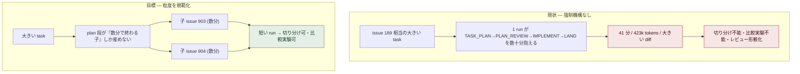
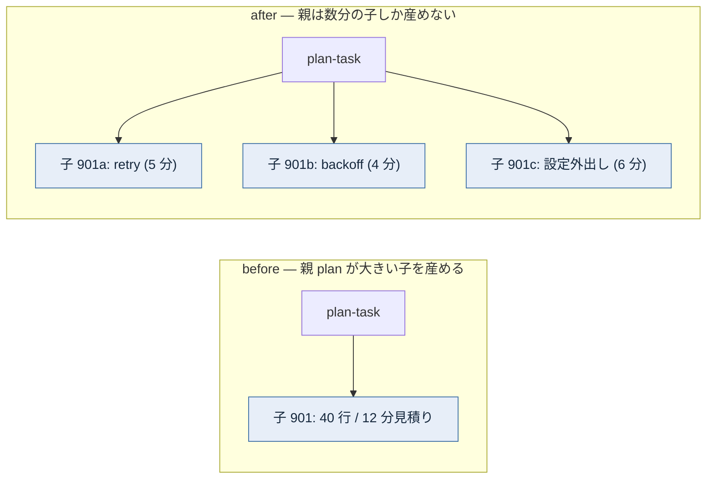
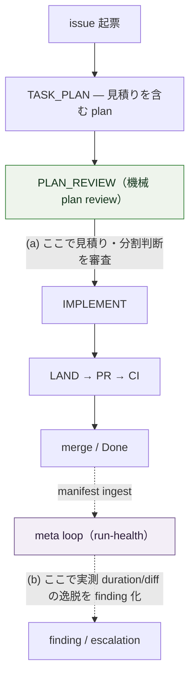
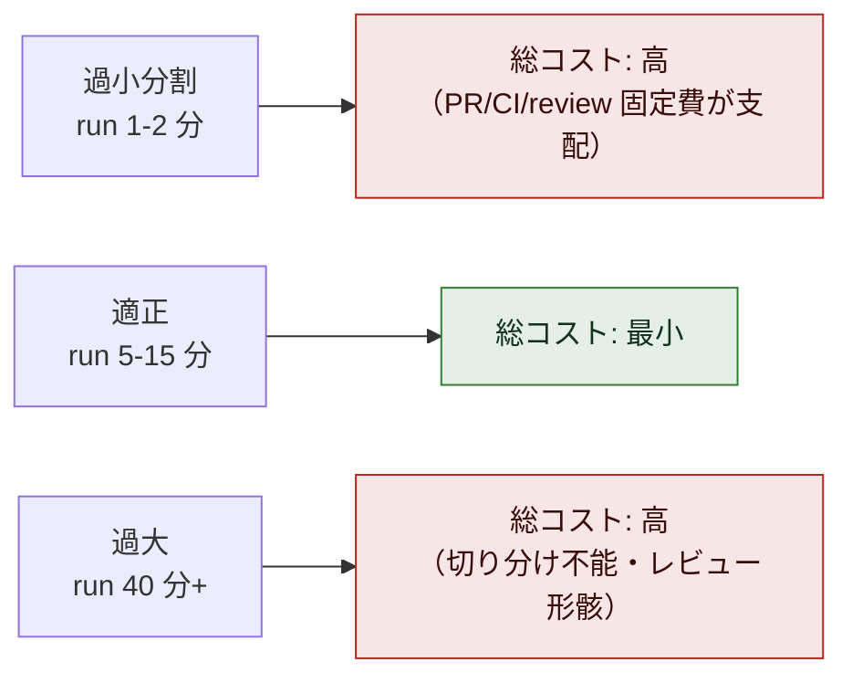

# issue #189 解説 — 実装粒度の規範化（1 agent が数十分 task を抱える構造をなくす）

目次: [1. Background](#1-background) ／ [2. Intuition](#2-intuition) ／ [3. Code](#3-code) ／ [4. Quiz](#4-quiz)

この教材の対象は issue #189（`task-request` + `needs-review` label）。対象は merge 済みの diff ではなく、**issue 上に立てられた議論（plan/discussion issue）** である——ADR 0030 §5 の粒度規準に強制機構が無いという問題を、規範（何で測るか）・rubric（どこで検査するか）・実現方法（どう作るか）・トレードオフ（分割の過剰）の 4 論点に分けて詰める議論である。2026-07-07 時点で #189 は open・未着手であり、選択肢は確定していない。本教材は「議論の各選択肢が、現在のコード・設計文書のどこに着地しうるか」を接地して示すものであり、決定の記録ではない。

## 1. Background

### 1.1 lathe と、この issue が触る層

lathe はハーネスエンジニアリングプラットフォームである。コーディング agent のセッションを ingest して観測・分析するアプリ本体（`apps/web`、Next.js + Postgres）と、**lathe 自身を開発する agent 体制**（driver・named agents・CI・統治文書）の 2 層からなる。issue #189 が触るのは主に後者——「1 つの task を人間の介在なしに main へ届ける機械」が 1 回の実装 run で抱える作業の**量**である。ただし論点 3 の telemetry は前者（ingest されたデータ）にも触れる。

### 1.2 登場する主体

前提知識を仮定しないため、この議論に関与する主体をすべて挙げる。

| 主体 | 何をするか | なんのために存在するか |
|---|---|---|
| **PdM** | 人間。壁打ちで方針を裁定し、needs-review キューを読んで承認する | 価値判断の最終責任者 |
| **outer loop（監督・監査役）** | PdM と対話するセッション。監視（meta-audit）・issue 化・rubric 管理・escalation への裁定を行う。**終端に実装は存在しない**（`design/loops.md`） | 「何をやるべきか」の判断 |
| **inner loop（task loop）** | driver `scripts/inner-loop.mjs` が 1 つの issue を受け取り、段ごとに named agent を起動して自律完走する状態機械 | 判断済みの bounded な作業を人手ゼロで main へ届ける。**本 issue の直接の関心対象** |
| **driver** | 上記 inner loop の実体。段の遷移・verdict parse・worktree 管理・PR 作成を行うプログラム | 段の連結と着地の実行系 |
| **meta loop** | driver `scripts/meta-loop.mjs`（read-only）。ingest された run を SCOPE→GROUND→DIAGNOSE→REPORT で監査し finding を出す | 系の健全性の事後観測。起票・改訂はしない（ACT 系に渡す） |
| **named agents**（planner / reviewer / implementer 等） | 各段の実作業。skill（`.claude/skills/`）に従う | 段ごとの役割分離（model ≠ role、ADR 0005/0009） |
| **task = issue** | `task-request` label 付き issue の作成そのものが登記。TASK-N = issue #N（ADR 0031）。status は保存せず導出（open=To Do／参照 PR open=In Progress／merge close=Done） | task の唯一の発生点（入口ゲート） |
| **plan-task** | `needs-plan` label 付き issue に対して走る run 型。実装せず、plan を確定して子 issue を投函する | 「plan を作ること」自体を task にした型。実装 task はここから生まれる |
| **implement task** | plan を持つ通常の実装 task。driver が TASK_PLAN→PLAN_REVIEW→IMPLEMENT→LAND を回す | 1 つの bounded な変更を main へ着地させる単位 |
| **PR + CI ゲート** | main に入る唯一の道。PR の diff に対し CI が `rubrics/run.mjs` を再実行し GREEN で merge。branch protection で物理強制 | 系の出口ゲート（ADR 0026 §1） |
| **rubric（`rubrics/`）** | コード規範と監査ゲートの機械検査・agent-judge。merge 判定は `run.mjs` のみ | 「何を満たすべきか」の機械化された基準。CI と meta loop の両方が参照する |
| **plan-format（`design/plan-format.md`）** | PLAN 段の成果物規約。scale 規則（trivial/standard）と完全形 5 セクションを定める | plan が PdM の判断材料であることを担保する散文規範 |
| **ADR 0030 §5 の粒度規準** | 「task は人間が数分（理想 1 分）で完全に理解できる範囲に閉じる」という**文章**。plan-format.md の分割規準として明文化される予定 | 粒度の目標を言語化した規範。**強制する機構が無いことが本 issue の起点** |

### 1.3 ゲートは 2 つだけ、という設計思想

ADR 0030 §0 が系の背骨である。強制点は**入口 = 登記（issue 投函）** と**出口 = PR + CI GREEN** の 2 つだけで、その間の作業単位はすべて task、loop の種類とは task の型のことである。中間段に独自の強制機構（旧 receipt 類）を作らない。

この思想は本 issue の議論を制約する。粒度を強制する新しい機構を作るなら、それは「入口・出口の 2 ゲートに畳めるか」「畳めないなら meta loop の観測点に置けるか」を先に問わねばならない。中間段に第 3 のゲートを生やすのは §0 に反する。

### 1.4 なぜ「1 agent が数十分抱える状態」が問題か

問題は速度ではない。issue #189 本文が挙げる実測は #116 が **41 分・単一 agent・423k tokens**、#186 も長時間走行である。長い run が困るのは、系の設計思想が短い run を前提にしているからである。

1. **比較実験（ADR 0030 §6）の単位にならない**——rubric／skill 改訂の受け入れ条件は「同一 task 集合で改訂前後を走らせ、事前宣言した予想差分が観測されること」である。6 段や複数の変更が 1 本の run に混ざると、どの改訂が効いたかを切り分けられない。
2. **失敗の切り分けができない**——run が長いほど、途中で失敗したとき原因区間を特定する材料が 1 本のログに埋もれる。ADR 0030 は「途中成果物がログしかなく、失敗の切り分けが困難」を as-is の問題 3 として記録している。
3. **レビュー精度が落ちる**——plan-format.md の原則は「plan は PdM の判断材料である。PdM が理解できない plan は通らない」。1 run が数十分ぶんの変更を抱えると、その plan も PR も人間が数分で理解できる範囲を超え、レビューが形骸化する。
4. **粒度規準（§5）が空文になる**——「人間が数分で完全に理解できる範囲」という規範はあるが、それを破った task を止める機構が無い。規範が守られたかは事後に人が気づくだけである。

つまり #189 は「§5 の規範に、系の設計思想（2 ゲート・比較実験・切り分け・レビュー精度）と整合する強制機構を与える」議論である。

### 1.5 現在の task loop の形（2026-07-07 時点のコードで確認）

#116 と #186 は既に closed（merge 済み）であり、driver の段構成は #116 教材が書かれた時点から変わっている。現行 `scripts/inner-loop-core.mjs` の定数を引く。

```js
// scripts/inner-loop-core.mjs
export const TASK_LOOP_STAGES = ['TASK_PLAN', 'PLAN_REVIEW', 'IMPLEMENT'];
export const TASK_LOOP_TERMINAL = 'LAND';
export const PLAN_TASK_STAGES = ['PLAN'];
export const PLAN_TASK_TERMINAL = 'FILE_CHILDREN';
export const MAX_PLAN_REVIEW_RETRIES = 2;
```

実装 task は **TASK_PLAN（plan を作る）→ PLAN_REVIEW（機械が plan を検査）→ IMPLEMENT（worktree で実装）→ LAND（push→PR→merge arm）** の 1 本を driver が自律完走する。plan-task は **PLAN → FILE_CHILDREN（plan 確定＋子 issue 投函）**。

> [!NOTE]
> LAND 段の現行実装は `scripts/inner-loop.mjs` で `push → gh pr create → gh pr merge --auto --squash`（arm を即実行）である。ADR 0035 追記が定めた「reviewer を PR 作成後に spawn し、PASS で arm・CHANGES で差し戻し」の review 前置は issue #188（open・blocked-by #186）として未着地であり、本教材執筆時点の LAND は review を前置していない。粒度議論はこの LAND の中身とは独立だが、「imple 分割（LAND 前置 review 等）で多少改善する」という #189 本文の言及はこの #188 を指す。

この 1 本を「どこまで長くしてよいか」「長すぎたら誰が止めるか」が #189 の議論対象である。

## 2. Intuition

核心は 1 つ——**粒度は現在「理解可能性」という文章でしか規定されておらず、それを『実行前の見積り』と『実行後の実測』のどちらで・どこで機械が読むかが決まっていない。#189 はその測り方と検査点を決める。**

### 2.1 現状 vs 目標

現状は「1 issue が数十分の 1 run を抱える」。目標は「大きい issue は plan 段で数分の子 issue 群に割られ、1 run が短く保たれる」。



*図 1: 現状は粒度規準が守られたか事後に人が気づくだけ。目標は plan 段で分割が起きて run が短く保たれる状態である。*

### 2.2 toy データ — 見積りと実測

架空の issue #901「ingest の retry・backoff・設定外出しをまとめて実装」を例にする（番号・token・sha はすべて架空だが実形式）。

論点 3 が言う「見積り欄の必須化」を入れると、plan の方針節にこういう見積りが載る形になる。

```markdown
## 方針
- goal: retry 上限・backoff 係数・timeout を設定ファイルへ外出しし、driver から読む
- 見積り: 想定 diff 約 40 行 / 3 ファイル / 想定 run 8〜12 分
- 分割判断: 単一の設定読み込み契約に閉じるため分割不要（standard・数分で理解可能）
```

これに対し、実際に走った run の manifest（実測）はこうなる。lathe が既に ingest する形式である（`run_stages.duration_ms` は実在する。§3.4）。

```json
{
  "issue": 901,
  "started_at": "2026-07-07T02:10:44Z",
  "ended_at":   "2026-07-07T02:53:31Z",
  "stages": [
    { "stage": "TASK_PLAN",   "verdict": "PLAN_READY", "duration_ms": 190000 },
    { "stage": "PLAN_REVIEW", "verdict": "PASS",       "duration_ms": 95000 },
    { "stage": "IMPLEMENT",   "verdict": "IMPL_DONE",  "duration_ms": 2280000 }
  ]
}
```

`ended_at − started_at ≈ 42.8 分`。見積り「8〜12 分」を大幅に超過している。**見積り（実行前・plan にある）と実測（実行後・manifest にある）が両方あるからこそ、「どこで検査するか」（論点 2）が意味を持つ**——(a) は見積りを plan review で審査し、(b) は実測を事後に照合する。

### 2.3 before / after — 分割義務を課すと何が変わるか

論点 1 の「上限超過 task は plan 段で子 issue に分割する義務」を plan-task に課したときの before/after。



*図 2: 分割義務は plan-task の終端条件を「plan の確定＋子 issue 投函」から「plan の確定＋**規準内まで割った**子 issue 投函」へ強める。分割の粒度は ADR 0030 §5 の『分離して意味が保てる最小単位』であり、1 行単位まで刻む趣旨ではない。*

### 2.4 論点 2 — 検査点 (a)/(b)/(c) はどこにあるか

論点 2 は「どこで機械検査するか」を (a) plan review の検査項目 (b) 実測 gate (c) 両方 から選ぶ。2 ゲート原則（§1.3）に照らすと、検査点は既存の観測構造のどこかに畳まねばならない。



*図 3: (a) は plan review 段（実行前・強制点＝進む/止まる）、(b) は meta loop の run-health プロファイル（実行後・観測点＝finding/escalation）。(c) は両方。(a) は「進ませない」力を持つが実測を知らない。(b) は実測を知るが事後で、既に着地した後の是正になる。*

### 2.5 論点 4 — 分割の過剰というトレードオフ

分割は無限に善ではない。1 run が小さくなるほど PR・CI・review の固定オーバーヘッドが相対的に支配的になる。#189 本文は適正レンジの例として 5〜15 分を挙げる。

| 1 run あたり実装量 | 切り分け・比較実験 | PR/CI/review オーバーヘッド比率 | 総合 |
|---|---|---|---|
| 過大（40 分＋） | 困難（現状の問題） | 低い | 悪 |
| 適正（5〜15 分） | 容易 | 中 | 良 |
| 過小（1〜2 分） | 容易 | 支配的（PR ごとに CI 全回・review 起動） | 悪 |



*図 4: コストは U 字。両端が悪い。#189 論点 4 は「適正レンジの下限・上限をデータ（ingest された実測 duration）で決めるか」を問う。§2.2 の実測が既に取れているため、この決定はデータに接地できる。*

## 3. Code

対象は議論（未確定の plan）なので、ウォークスルーの対象は「現在、粒度規準がどこに文章として書かれ、どこに強制機構が欠けているか」である。論点 1〜4 それぞれについて、選択肢がコード/文書のどこに着地しうるかを接地して示す。

### 3.1 規範の現状 — 粒度規準は文章のみ（論点 1 の起点）

ADR 0030 §5 が粒度規準の正本である。

```
### 5. task の粒度規準
task は「人間が数分（理想 1 分）で完全に理解できる範囲」に閉じる。
plan-format.md の scale rules に分割規準として明文化し、plan-task はこの規準まで
分割してから子 issue を出す。粒度の細かさは §6 の比較実験・失敗切り分け・レビュー精度の
前提条件である（1 行単位まで刻む趣旨ではない——分離して意味が保てる最小単位）。
```

対応する plan-format.md の scale 規則は、trivial/standard の 2 クラスを持つが、**時間・行数・ファイル数の上限は一切書いていない**。

```markdown
## スケール規則（過剰形式化の禁止）
| クラス | 例 | 要求 |
|---|---|---|
| **trivial** | 明確なバグ修正・数行・契約/構造に触れない | 軽量形: 問題 / 修正方針 / 検証 の3行〜。承認不要 |
| **standard** | 機能追加・複数ファイル・契約/構造に触れる | 完全形（5セクション）＋ needs-approval なら PdM 承認 |
```

論点 1 が問うのは、この表に「実行時間の上限（1 run ≤ N 分）」「diff 規模（行数・ファイル数）」の列を足すか、そして「上限超過なら plan 段で分割する義務」を明文化するか、である。着地先は plan-format.md（散文規範）＋ ADR 0030 §5 の改訂。ただし plan-format.md の冒頭原則「plan は『何を・なぜ』まで。『どうやって』の詳細は implement の仕事」との整合が要る——見積りは「どうやって」の詳細に踏み込みすぎない粒度に留める必要がある（この整合判断は未確定）。

### 3.2 検査点 (a) — PLAN_REVIEW の現行検査項目（論点 2a）

現在の機械 plan review の検査項目は `scripts/inner-loop-prompts.mjs` の `buildPlanReviewPrompt` にある。

```js
// scripts/inner-loop-prompts.mjs — buildPlanReviewPrompt
'## 検査項目',
'',
'1. plan-format 準拠（acceptance criteria・変更対象・検証方法が明記されているか）',
'2. 実装可能性（曖昧な前提・未定義の依存・解が一意でない設計判断はないか）',
'3. scope の明確さ（acceptance criteria が機械的に検証可能か）',
'',
'PASS: 上記すべて問題なし。実装を続行できる。',
'RED: 重大な問題あり。問題点を具体的に列挙してください（planner が修正に使います）。',
```

検査項目に**粒度・見積り・分割判断が無い**。論点 2(a) は、ここに 4 つ目の項目を足す形になる。追加すると、driver の RED 分岐（既存）がそのまま効く。

```js
// scripts/inner-loop.mjs — PLAN_REVIEW RED の既存分岐（ADR 0035 §5）
if (state === 'PLAN_REVIEW' && verdict === 'RED') {
  if (++planReviewRetries <= MAX_PLAN_REVIEW_RETRIES) { state = 'TASK_PLAN'; continue; }
  spawnSync('gh', ['issue', 'edit', String(issueNumber), '--add-label', 'needs-review,escalation'], ...);
  state = 'ESCALATE'; break;
}
```

つまり (a) を選ぶと「粒度超過 → plan review RED → planner が分割し直し（上限 2 回）→ なお超過なら needs-review + escalation で人間キューへ」という流れが**新しい機構をほぼ足さずに**得られる。plan-format.md に見積り欄が必須化されていれば、reviewer は見積りを読んで分割判断を審査できる。ただし「見積りが妥当か」を LLM reviewer が判定できるかは未確認（見積りは自己申告であり、reviewer は実測を持たない）。

### 3.3 分割義務 (論点 3) — plan-task の終端は現状「分割せず子を出す」ことも許す

plan-task の遷移は `scripts/inner-loop-core.mjs` の `nextPlanTaskState` にあり、終端は FILE_CHILDREN（plan 確定＋子 issue 投函）である。現在の実装は**子 issue の粒度を検査しない**——親 plan が大きい子を 1 つ産んでも終端に到達できる。

```js
// scripts/inner-loop-core.mjs
export function nextPlanTaskState(state, verdict) {
  if (verdict === null) return { next: 'ESCALATE' };
  if (verdict === 'ASK_PDM') return { next: 'ASK_PDM' };
  const idx = PLAN_TASK_STAGES.indexOf(state);
  if (idx < 0) return { next: 'ESCALATE' };
  if (verdict !== PLAN_TASK_OK_VERDICTS[state]) return { next: 'ESCALATE' };
  return { next: PLAN_TASK_STAGES[idx + 1] ?? PLAN_TASK_TERMINAL };
}
```

論点 3 の「親 plan は数分で終わる子しか産めない」を課すなら、着地先は 2 つの候補がある。

1. **plan-task の PLAN prompt に分割義務を注入**——`buildPlanTaskPrompt`（`inner-loop-prompts.mjs`）は既に plan-format.md を fail-closed で注入している。同様に「子 issue は §5 規準まで割ること」を prompt に加える（散文の力）。
2. **plan-task に検査段を挿入**——`PLAN_TASK_STAGES = ['PLAN']` は「an inspection stage can be inserted later」とコメントで拡張余地が明記されている（#170 の plan review 欠落裁定と同型）。子 issue の粒度を機械/agent が検査する段を足す形。

どちらも 2 ゲート原則には抵触しない（plan-task は入口ゲートの手前の作業であり、独自の第 3 ゲートを main に生やすわけではない）。

### 3.4 検査点 (b) — 実測 telemetry は既に ingest されている（論点 2b・論点 3・論点 4）

#189 本文は「lathe への run duration telemetry（既に ingest される transcript から導出可能か）」を問う。**答えは既に導出可能である**。lathe の DB スキーマ（`apps/web/db/schema.sql`）は複数レベルで duration を持つ。

```sql
-- apps/web/db/schema.sql
CREATE TABLE IF NOT EXISTS run_stages (
  ...
  duration_ms  BIGINT,          -- 段ごとの所要時間
  ...
);
CREATE TABLE IF NOT EXISTS sessions (
  ...
  started_at   TEXT NOT NULL,
  ended_at     TEXT,
  duration_ms  BIGINT,          -- セッション（run）全体の所要時間
  ...
);
```

そして driver が manifest を書く時点で `duration_ms` を各段に記録している（`buildManifestEntry` in `inner-loop-core.mjs`、ingest 側は `apps/web/scripts/ingest/run-manifests.ts` の `durationMs: integerOrNull(stage.duration_ms)`）。つまり論点 2(b)・論点 4 の「実測でレンジを決める／実測 gate で閾値超過を検知する」ためのデータは**新規計測を足さずに揃っている**。

diff 規模（行数・ファイル数）については、head_sha は manifest に記録されるが、行数・ファイル数を集計・ingest している箇所は**未確認**（`rubrics/` 配下に diff-size 系の rubric は存在せず、schema にも lines_changed 相当の列は見当たらなかった）。diff 規模を規範に入れるなら、`git diff --numstat` 相当の集計と ingest を新設する必要がある可能性が高い。

### 3.5 検査点 (b) の着地先 — meta loop の run-health プロファイル

実測 gate（論点 2b）を「閾値超過 → meta finding / escalation」として置くなら、着地先は既存の meta loop プロファイル `scripts/meta-profiles/run-health.json` である。その questions には既に duration の逸脱監査が含まれている。

```json
{
  "id": "run-health",
  "target": "inner / plan loop の運行の健全性",
  "questions": [
    "escalation の率と再発パターン（同型の escalation が繰り返していないか）",
    "差し戻し cycle の分布（... 往復が多い issue はどれか）",
    "invalid（判定不能）の頻度と帰属（...）",
    "stage cost / duration の逸脱（特定 stage・backend が異常に高くないか）"
  ],
  "cadence": "10 run ごと、または escalation が 3 連続でクラスタした時"
}
```

現状これは**閾値による強制ではなく、meta-auditor（read-only）が事後に観測して finding を出す**質問項目である。meta loop は SCOPE→GROUND→DIAGNOSE→REPORT で finding を出すだけで、起票・rubric 更新・コード修正はしない（`design/loops.md`）。したがって (b) を「escalation まで自動化」したいなら、run-health の finding を task-request 化する結線（ACT 系へ渡す部分）が別途要る——この結線の有無は未確認。現時点では (b) は「観測はできるが、閾値超過を自動で止める/起票する機構は無い」状態である。

### 3.6 論点別の着地先まとめ

| 論点 | 選択肢 | 着地しうる場所（接地） | 現況 |
|---|---|---|---|
| 1 規範 | 時間/diff 上限を規範に足す・分割義務を課す | `design/plan-format.md` の scale 表＋ ADR 0030 §5 | 文章のみ・上限列なし |
| 2(a) | plan review で見積り・分割を審査 | `buildPlanReviewPrompt` の検査項目に 4 つ目を追加＋既存 RED 分岐 | 検査項目に粒度なし |
| 2(b) | 実測 gate（超過→finding/escalation） | `meta-profiles/run-health.json`（duration 逸脱の質問は既存）＋ finding→起票の結線 | 観測は可・自動起票結線は未確認 |
| 3 | 見積り欄必須化 | plan-format.md 完全形 5 セクションの方針節 | 未実装 |
| 3 | plan-task の分解義務 | `buildPlanTaskPrompt` prompt 注入 or PLAN_TASK_STAGES に検査段挿入 | 子粒度検査なし（拡張余地はコメントに明記） |
| 3 | driver の実行時間計測・超過時挙動 | `run_stages.duration_ms`（計測は実在）＋超過時分岐（新設） | 計測は実在・超過時挙動は未実装 |
| 3 | run duration telemetry | `sessions.duration_ms` / `run_stages.duration_ms`（既に ingest） | 導出可能（実在） |
| 4 | 適正レンジをデータで決める | ingest 済み実測 duration の分布分析 | データは揃っている |

> [!IMPORTANT]
> 本 issue は `needs-review` label を持つ（ADR 0035）。統一ライフサイクルでは、needs-review 付き issue は plan 完了後に**教材が自動生成され、PdM が読んで Projects で Ready に動かすまで実装は発火しない**。本教材はその「読み物」であり、論点の中立整理（推奨なし）である。どの選択肢を採るか・適正レンジの数値は PdM が Ready への移動で承認する決定であって、本教材は決定しない。

## 4. Quiz

実質を理解していれば解ける 5 問。選択肢は各 1 つが正解。

**Q1. issue #189 が「1 run を短くしたい」主たる理由として、本文と設計思想に最も合致するのはどれか。**

- a) 単純に実行が速くなり待ち時間が減るから
- b) 比較実験・失敗の切り分け・レビュー精度が、短く中間成果物が公共物である run を前提にしているから
- c) 41 分の run は API のタイムアウトに達するから
- d) token を 423k から減らしてコストを下げるのが第一目的だから

<details><summary>答えと解説</summary>

**b**。§1.4 のとおり、縮退・短縮の利得は速度ではない。ADR 0030 §6 の比較実験（同一 task 集合で改訂前後を走らせる）と切り分け・レビュー精度が、run が短く中間成果物が PR という公共物であることを前提にしている。a・d は副次的効果であって規範化の動機ではない。c は本文に根拠が無い（推測）。

</details>

**Q2. 論点 2 の検査点 (a) plan review と (b) 実測 gate の本質的な違いはどれか。**

- a) (a) は人間が、(b) は機械が検査する
- b) (a) は plan の見積り（実行前・進む/止まる強制点）を審査し、(b) は manifest の実測（実行後・観測点）を照合する
- c) (a) は CI で、(b) は branch protection で強制される
- d) (a) は plan-task に、(b) は実装 task にしか適用できない

<details><summary>答えと解説</summary>

**b**。§2.4・§3.2・§3.5 のとおり、(a) は PLAN_REVIEW 段で見積り・分割を審査する実行前の強制点（RED なら進めない）、(b) は run-health プロファイルが ingest 済みの実測 duration を事後に照合する観測点。a は誤り——(a) も機械 plan review（agent 判定）で人間ではない。c も誤り——粒度検査は 2 ゲート原則上 CI や branch protection には置かない（中間段の観測構造に畳む）。

</details>

**Q3. 「run duration telemetry は transcript から導出可能か」への、現行コードに接地した答えはどれか。**

- a) 導出できない。新たに計測コードを追加する必要がある
- b) 導出できる。`sessions.duration_ms` と `run_stages.duration_ms` が既に ingest されている
- c) transcript には時刻が無いので session 単位でしか出せない
- d) manifest には duration が無く、CI ログから逆算するしかない

<details><summary>答えと解説</summary>

**b**。§3.4 のとおり、driver は `buildManifestEntry` で各段に `duration_ms` を記録し、ingest（`run-manifests.ts`）が `run_stages.duration_ms` へ、session は `sessions.duration_ms`・`started_at`/`ended_at` へ格納する。よって新規計測なしに run 全体・段別の実測時間が導出可能である。a・d は事実に反する。c も誤り——session は `started_at`/`ended_at` を持ち、段別も取れる。なお diff 規模（行数・ファイル数）の集計・ingest は別で、これは未確認・未整備である点に注意。

</details>

**Q4. 論点 4 のトレードオフを最も正確に述べているのはどれか。**

- a) 分割は常に善である。細かいほど切り分けも比較実験も良くなる
- b) 分割を過剰にすると PR・CI・review の固定オーバーヘッドが相対的に支配的になり、コストは適正レンジで最小の U 字を描く
- c) 分割の主なコストは planner の token 消費であり、run 数とは無関係
- d) 適正レンジは理論的にしか決められず、実測データでは決められない

<details><summary>答えと解説</summary>

**b**。§2.5 の U 字。過大（40 分＋）は切り分け不能、過小（1〜2 分）は PR ごとの CI 全回・review 起動という固定費が支配的になる。a は過小分割のコストを無視している。d は誤り——§3.4 のとおり実測 duration は ingest 済みで、#189 本文も「適正レンジをデータで決めるか」を論点にしている（データに接地できる）。

</details>

**Q5. 粒度を強制する新機構を設計するとき、ADR 0030 §0（2 ゲート原則）が課す制約はどれか。**

- a) 強制は必ず CI（出口ゲート）に集約し、plan review では検査してはならない
- b) 検査点は入口・出口の 2 ゲートに畳むか、畳めないなら meta loop の観測点に置く。中間段に第 3 の強制ゲートを main に生やしてはならない
- c) 新機構は必ず branch protection のルールとして表現しなければならない
- d) 粒度検査は outer loop（監査役）が手動で行うべきで、機械化してはならない

<details><summary>答えと解説</summary>

**b**。§1.3 のとおり、系の強制点は入口 = 登記と出口 = PR + CI の 2 つだけで、中間段に独自の強制機構を作らない。したがって (a) plan review は PLAN_REVIEW 段（進む/止まるの判定はするが main への第 3 ゲートではない）に検査項目として置け、(b) 実測 gate は meta loop の観測点（run-health）に置く。a は誤り——plan review での検査は §0 に反しない（中間の verdict 判定であって main の第 3 ゲートではない）。c・d は §0 と `design/loops.md` の役割分担に反する。

</details>

---

接地資料: issue #189（本文・`task-request`+`needs-review` label）／ADR 0030（特に §0 2 ゲート・§5 粒度規準・§6 比較実験）／ADR 0035（統一 task ライフサイクル・needs-review 単一キュー・追記の LAND review 前置）／`design/plan-format.md`（scale 規則・完全形 5 セクション）／`design/loops.md`（loop 台帳）／`scripts/inner-loop-core.mjs`・`scripts/inner-loop.mjs`・`scripts/inner-loop-prompts.mjs`（TASK_LOOP_STAGES・nextPlanTaskState・buildPlanReviewPrompt・LAND）／`scripts/meta-loop.mjs`・`scripts/meta-profiles/run-health.json`（duration 逸脱の監査質問）／`apps/web/db/schema.sql`・`apps/web/scripts/ingest/run-manifests.ts`（duration_ms の ingest）／関連 issue #116（closed・task loop 縮退）・#186（closed・driver 結線）・#188（open・LAND review 前置）・#180（ADR 0035 骨子）（いずれも 2026-07-07 時点の main）。本教材は議論（未確定 plan）の解説であり、決定は PdM の Ready 承認による。未確認と明記した箇所（diff 規模の集計/ingest・run-health finding→自動起票の結線・見積りの reviewer 判定可能性・見積りと plan-format 冒頭原則の整合）は実装/設計が確定していない。