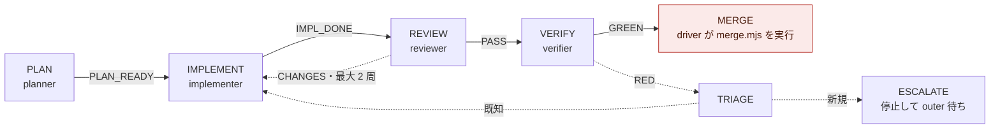
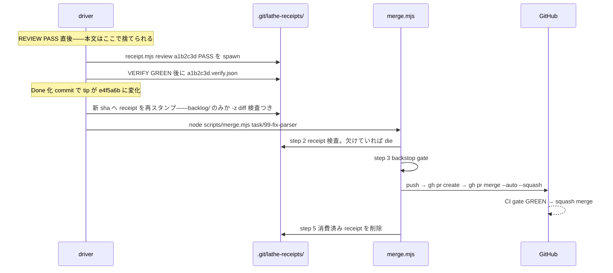
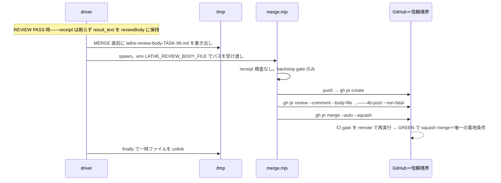
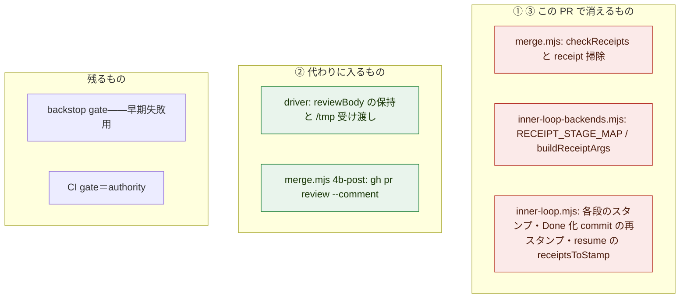

> [!NOTE]
> これは **md 描画忠実度の実験**である。内容の正本は HTML 版教材（`.lathe/reports/2026-07-05-explain-pr110-receipt-to-ci.html`、2026-07-05）。
> 比較観点: 図（mermaid vs HTML/CSS）・callout・Quiz・コード引用・スマホ表示。分量は原典の約 7 割に凝縮してある。

# PR #110 解説 — receipt ゲートの廃止と PR review comment 経路への置換

目次: [1. Background](#1-background) ／ [2. Intuition](#2-intuition) ／ [3. Code](#3-code) ／ [4. Quiz](#4-quiz) ／ [付録: md 表現の到達度](#付録-md-表現の到達度)

## 1. Background

この PR の diff は 7 ファイル・432 行削除であり、追加はわずか 96 行である。削除が主役の変更を理解するには、「削除されたものが何のために存在していたか」を先に知る必要がある。inner loop・driver・receipt・merge.mjs・CI を既に知っているなら 1.7 節まで読み飛ばして差し支えない。

### 1.1 lathe と、この PR が触る層

lathe はハーネスエンジニアリングプラットフォームである。コーディング agent のセッションを ingest して観測・分析・評価する Next.js + Postgres アプリで、リポジトリは `github.com/yutaro0915/lathe`（public）にある。ただし、この PR が変更するのはアプリ本体ではなく `scripts/` 配下の**開発機構そのもの**——lathe を開発する agent 達を駆動し、成果物を main へ着地させる仕組み——である。この体制のどこに「信頼できる検査」を置くかが主題である。

### 1.2 二層の開発ループ

| 層 | 主体 | 何をするか | 何のために存在するか |
|---|---|---|---|
| **outer loop** | 監査役（PdM と対話するセッション） | 監視・task 起票・rubric 管理・escalation への裁定 | 「何をやるべきか」「品質基準は正しいか」の判断。**outer の終端に「実装」は存在しない** |
| **inner loop** | driver `scripts/inner-loop.mjs` ＋ named agent | 1 つの task を受け取り、計画→実装→レビュー→検証→merge を自律完走 | 判断済みの bounded な作業を人間の介在なしに main へ届ける。終端は「ゲート経由の merge」か「escalation」のみ |

driver は inner loop の状態機械を回す Node スクリプトである。agent 自身は「次に何をするか」を決めない。driver が段ごとに agent をサブプロセスとして起動し、返ってきた verdict を状態遷移表 `nextState()` に通して次の段を決める。実装は task ごとに隔離された git worktree 上で行う。

### 1.3 driver の 5 段



*図 1: inner loop の状態機械（`nextState()`）。矢印上のラベルは各段が返す verdict。終端は MERGE / ESCALATE のみ。*

| 段 | 主体 | 何をするか | なぜ存在するか |
|---|---|---|---|
| REVIEW | reviewer | branch の diff を plan と rubric に照らして読む。verdict は `PASS`/`CHANGES`、本文（result_text）に所見を書く | 実装者と別の目で検査する。**判断**の検査であり、機械で再実行できない |
| VERIFY | verifier | gate（`rubrics/run.mjs`）・unit を独立に回す。verdict は `GREEN`/`RED` | 「動く」ことを実行で確かめる。**機械的**な検査で、誰がどこで再実行しても同じ結果になる |
| MERGE | driver 自身 | `node scripts/merge.mjs <branch>` を main worktree から実行 | branch を main へ着地させる唯一の出口 |

> [!IMPORTANT]
> **定義: verdict と result_text** — 各 agent は終了時に構造化された封筒を返す。`verdict` は `PASS`/`GREEN` のような判定タグ、`result_text` は根拠の本文（REVIEW なら所見の全文）。この PR の後半で重要になるのは、REVIEW PASS の **result_text がそれまでどこにも残らず捨てられていた**という事実である。

### 1.4 receipt とは何だったか

receipt は「REVIEW と VERIFY が実際に行われた」ことを merge 時点に証明するための**自己申告トークン**である。実体は git common-dir 配下の JSON で、`scripts/receipt.mjs` が発行していた。

```jsonc
// $ LATHE_AGENT=reviewer node scripts/receipt.mjs review 01e1078 PASS
// → .git/lathe-receipts/01e1078….review.json（2026-07-04 発行の現物）
{
  "step": "review",
  "sha": "01e1078a7358c06a109a27fa118fe114fb4d5a3a",
  "verdict": "PASS",
  "ts": "2026-07-04T19:22:34.650Z",
  "agent": "reviewer"
}
```

`agent` フィールドは環境変数 `LATHE_AGENT` をそのまま書き写すだけで、未設定なら `"unknown"` になる。つまり**発行者の同一性を確かめる仕組みは何もない**。sha は branch tip の commit sha に紐付く。

### 1.5 merge.mjs — 着地の単一入口

この PR 直前の版は次の 5 ステップだった。

1. `git rev-list` で commit 範囲を確定
2. **receipt 検査** — tip sha の `*.review.json`（PASS）と `*.verify.json`（GREEN）が無ければ拒否
3. backstop gate — `rubrics/run.mjs --changed … --tier test` をローカル再実行
4. push → `gh pr create` → `gh pr merge --auto --squash`
5. 消費済み receipt の削除

この PR が削除するのは **2 と 5** である。

### 1.6 CI — remote に置かれた信頼境界

CI の本質的な価値は検査内容ではなく**実行場所**にある。ローカルマシン上の検査は、同じマシンで動く agent から見ればすべて改竄可能である。GitHub 側で PR の head sha に対して実行され status check として記録される検査だけが、ローカルの agent には偽造できない。ADR 0026 の言葉では「単一マシン上に信頼境界は作れないため、信頼境界は remote に置く」。

### 1.7 直接の契機: receipt の構造的欠陥と 2026-07-04 の incident

| # | 欠陥 | 意味 |
|---|---|---|
| (a) | `LATHE_AGENT` は自己申告 | 誰でも `LATHE_AGENT=reviewer` を名乗って PASS receipt を刷れる |
| (b) | 中身を運ばない | verdict だけで review 本文がない。「何を見て PASS としたか」が残らない |
| (c) | 正規フロー自身が再スタンプしていた | Done コミットで tip sha が変わるたび driver が機械的に刷り直していた |
| (d) | repo 外に存在 | `.git/` 配下のため CI からも clone からも不可視 |
| (e) | squash で sha が消える | attest 先の sha は squash merge 後の main に存在しない |

2026-07-04〜05 の incident がこれを実証した。outer が merge.mjs を迂回して **receipt 0 件の 3 commit** を main に直接 push し、並行セッションでは outer が `LATHE_AGENT=reviewer|verifier` を自ら指定して **receipt を代理発行**して 4 commit を着地させた。さらに IMPLEMENT が commit ゼロで IMPL_DONE を宣言し、REVIEW が空 diff に PASS receipt を発行する事例も観測された。

> [!WARNING]
> **ADR 0026 の裁定（2026-07-05）** — 対策は穴の列挙的修繕ではなく統治の作り直し: **main に入る唯一の道は PR + CI GREEN**（§1）、**receipt 制度は廃止し、verify の主張は CI の再実行が、review の主張は PR review が置換する**（§2）、**監査役の直接編集特権も廃止**（§3）。merge.mjs が receipt 検査の後に backstop を自分でも再実行していた事実自体が「receipt は信用されていなかった」ことの証明だとされた。

> [!CAUTION]
> **ADR 0028 による §2 の修正** — 当初の置換先は branch protection の required review だったが、単一アカウント運用では self-approval が GitHub 仕様で不可能なため全 PR が deadlock する（PR #67 で実証）。ADR 0028 は review の担保を「**verdict＋本文を PR に投稿（non-blocking の記録）**＋ CI による gate 再実行」と定めた。この PR の review comment が non-fatal なのはこの裁定の忠実な反映である。

## 2. Intuition

変更の核心は一行で書ける。**「検査が行われた」という主張（attestation）を信用するのをやめ、機械で確かめられるものは再実行（re-execution）し、確かめられないものは公開の場に記録（record）する。**

REVIEW と VERIFY は同じ「検査」でも性質が違う。VERIFY は機械的で、同じ diff に同じコマンドを流せば GitHub のサーバー上でも同じ結果が出る——だから CI が verifier の主張を*置換*できる。REVIEW は判断であり再実行できない——だから置換ではなく、verdict と本文を PR という サーバー保存・sha 紐付き・公開の場に*記録*する。この非対称が、削除（receipt 検査）と追加（review comment 投稿）の両方を説明する。

### toy 例: 架空の TASK-99 が着地するまで

TASK-99 の implementer が branch `task/99-fix-parser` に commit を積み、REVIEW が PASS、VERIFY が GREEN を返し、tip sha が `a1b2c3d` になったとする。

**BEFORE（〜PR #109 まで）**



**AFTER（PR #110 以降）**



*図 2: before で「検査済みの証明」を担っていたローカルファイルが、after では remote の CI 再実行と PR 上の記録に分かれて置き換わる。*

before 側の中段——Done 化 commit による sha 変化と receipt 再スタンプ——に注目してほしい。receipt は sha に紐付くため、driver 自身の帳簿 commit ひとつで無効になり、正規フローが機械で刷り直すほかなかった。「正規フロー自身が偽造と同じ操作をしている」（欠陥 (c)）とはこのことである。432 行の削除の過半は、この随伴機構の撤去である。

### 着地後、PR ページはこう見える

HTML 版の図 3 は PR ページの UI モックだが、md では UI モックは表現できないため表で代替する（**これが md の表現限界の一つ**）。

| PR ページの要素 | 内容 |
|---|---|
| Commits | `a1b2c3d` fix(parser): … ／ `e4f5a6b` backlog: TASK-99 → Done |
| Conversation | **## REVIEW: PASS** — reviewer の所見全文（`gh pr review --comment` による投稿。← PR #110 が追加した経路） |
| Checks | `gate` — rubrics/run.mjs --changed … --tier test **SUCCESS** |
| Merged | auto-merge により CI GREEN で無人着地（ADR 0028） |

review 本文が conversation に、機械検証が Checks に恒久記録として残り、receipt の欠陥 (b)「中身を運ばない」と (d)「不可視」が同時に解消される。

## 3. Code

diff は意味のまとまりで 4 グループに分けて読む: ①検査の削除、②review の記録化、③巻き添え機構の撤去、④テストと台帳の追随。



*図 3: 変更の全体地図。*

### 3.1 ① 検査の削除

```diff
  // scripts/merge.mjs
- import { resolveReceiptsDir } from './receipt.mjs';
- export function checkReceipts(receiptsDir, headSha) { … 48 行 … }
- // 2. Receipt check — against branch tip sha (HEAD) …
-   const { ok: receiptsOk, missing } = checkReceipts(receiptsDir, headSha);
-   if (!receiptsOk) die(`receipt check failed — …
-     review:  LATHE_AGENT=reviewer node scripts/receipt.mjs review <sha> <PASS|CHANGES>`);
+ // 2. (Receipt check removed — ADR 0026 §1-3. CI rubric-gate is now the authority.)
- // 5. Clean up consumed receipts … rmSync …
```

削除された die メッセージは示唆的である——「receipt が無ければこのコマンドで発行せよ」と、検査を通すための発行手順そのものをエラーメッセージが案内していた。自己申告検査の限界の縮図である。

> [!TIP]
> **残るもの: backstop gate** — ステップ 3 のローカル再実行は削除されない。receipt は「主張の検査」だったが backstop は「実物の再実行」であり、CI と同じ検査を push 前に速く落とすためのもの。authority はあくまで CI 側にある。

### 3.2 ② review の記録化

本文が生まれるのは REVIEW 段だが、投稿先の PR が生まれるのは `gh pr create` の後である。この時間差を、一時ファイルへの保存 → env でのパス受け渡し → PR 作成直後の投稿で解決する。

```diff
  // scripts/inner-loop.mjs — 状態機械のループ内
+ if (state === 'REVIEW' && verdict === 'PASS') reviewBody = envelope.result ?? '';

  // MERGE 段
+ reviewBodyFile = join(tmpdir(), `lathe-review-body-${unitSlug}.md`);
+ writeFileSync(reviewBodyFile, `## REVIEW: PASS\n\n${reviewBody}`, 'utf8');
+ // runMerge が env LATHE_REVIEW_BODY_FILE を注入して merge.mjs を spawn

  // scripts/merge.mjs — 4b-post（新設）
+ const prReviewResult = spawnSync('gh', ['pr', 'review', branch, '--comment', '--body-file', bodyFile], …);
+ if (prReviewResult.status !== 0) warning(…);  // non-fatal
```

> [!IMPORTANT]
> **なぜ non-fatal か** — review comment は ADR 0028 の定める「記録」であって「ゲート」ではない。記録の失敗で着地が止まると記録が事実上の第二ゲートになり、単一ゲート原則（ADR 0026 §1）に反する。着地を止める権限を持つのは CI（status check `gate`）のみ。

### 3.3 ③ 巻き添え機構の撤去

読む側が消えれば書く側と維持する側も死んだコードになる。発行テーブル・各段のスタンプ実行・Done 化 commit の `-z` diff 検査＋再スタンプ・resume の `receiptsToStamp` の 4 箇所が消え、resume は「REVIEW PASS の本文を manifest から回収する」処理（`reviewBody` 契約）に置き換わる。Done 化 commit の安全性は失われない——commit は squash される PR の一部となり、CI が PR の **diff 全体**を検査するからである。検査の単位が sha 単位の receipt から PR 単位の CI に変わった。

### 3.4 ④ テストと台帳の追随

`merge.test.mjs` / `inner-loop.test.mjs` から receipt 系テストが消え、`decideResumeState` 等は `reviewBody` 契約に書き換え（テスト 2 ファイルで −233 行 / +30 行）。

> [!TIP]
> **この PR で消えないもの** — `receipt.mjs` 本体は参照ゼロの孤児として残る（削除は TASK-21 / PR #111 で実施済み）。branch protection も含まれない（後続 TASK-22 で有効化済み）。つまり PR #110 の着地時点では「唯一の道」はまだ規律であって物理制約ではなかった。

## 4. Quiz

md ではクリック採点ができないため、`<details>` の折り畳みで代替する（**これも表現差の実験項目**）。

**Q1. PR #110 以降の inner loop で、REVIEW が `CHANGES` を返した。merge はどうなるか。**

- A. merge は実行されるが、PR には CHANGES の本文が review comment として投稿される
- B. merge には到達しない。IMPLEMENT へ差し戻され（最大 2 周）、超過すると ESCALATE する
- C. 即座に ESCALATE し、outer の裁定なしには再開できない
- D. VERIFY に進み、CI gate が RED を出して着地が止まる

<details><summary>答えと解説</summary>

**正解: B** — CHANGES は状態機械のレベルで IMPLEMENT に戻す verdict であり、本文は `feedback` として implementer に渡る。MERGE 段に到達しないので merge.mjs も PR も発生しない。`reviewBody` に本文が確保されるのは `verdict === 'PASS'` の場合だけ——PR に載る review 本文は常に最終的な PASS の所見である。
</details>

**Q2. `LATHE_AGENT=reviewer node scripts/receipt.mjs review <sha> PASS` を手で実行すると何が起きるか。PR #110 の前後で答えよ。**

- A. 前: エラーになる。後: 同じくエラー
- B. 前: receipt は書けるが merge.mjs が発行者を検証するので着地には使えない。後: 何も起きない
- C. 前: 有効な PASS receipt が書かれ、merge.mjs の検査を通過する材料になる。後: ファイルは書けるが読む者がいない
- D. 前: 有効な receipt になる。後: merge.mjs が「receipt 検出」で着地を拒否する

<details><summary>答えと解説</summary>

**正解: C** — `LATHE_AGENT` は自己申告で、receipt.mjs は env をそのまま JSON に書き写すだけ（欠陥 (a)）。2026-07-04〜05 の incident では実際に outer が代理発行して 4 commit を着地させた。PR #110 後は merge.mjs から import ごと消えたため、書けても読む者がいない。
</details>

**Q3. REVIEW の本文（result_text）は、いつ・どうやって PR に載るか。**

- A. REVIEW 段の reviewer agent 自身が `gh pr review` を実行して投稿する
- B. CI の gate job が manifest を読み取り check の出力として貼り付ける
- C. driver が PASS 時に本文を保持し、MERGE 直前に /tmp へ書き、merge.mjs が env でパスを受け取って PR 作成直後に `gh pr review --comment --body-file` で投稿する
- D. squash commit message に埋め込まれ PR description に反映される

<details><summary>答えと解説</summary>

**正解: C** — 順序の問題が鍵。本文が生まれる時点（REVIEW 段）には投稿先の PR がまだ存在しない。A が誤りなのは PR 不在のほか、REVIEW 段の agent の allowedTools が Read/Grep/Glob/Bash(git *) に限られ gh を実行できないため。投稿失敗は non-fatal。
</details>

**Q4. この PR #110 自身は、どのゲートを通って着地したか。**

- A. 旧経路。main 側の旧版 merge.mjs が実行されるため receipt 検査を通り、review comment は投稿されなかった
- B. 新経路。この PR の変更内容が自分自身の着地に使われた
- C. merge.mjs を通らず監査役が直接 push した
- D. required review を人間が approve して着地した

<details><summary>答えと解説</summary>

**正解: A** — driver は main の repo root から起動され、main 側の `scripts/merge.mjs` を spawn する。worktree 内の新コードは着地して初めて次の task から実行される。GitHub 上の現物が裏付ける: PR #110 の reviews は空、status check は `gate: SUCCESS`、2026-07-05T04:13:38Z に squash merge。自分を削除する変更の着地を、削除される機構自身が最後に検査した。
</details>

**Q5. PR #110 が着地した 2026-07-05 の時点で、ADR 0026 §1「main に入る唯一の道は PR + CI GREEN」はどこまで守られていたか。**

- A. 完全に守られていた。直接 push は物理的に不可能になった
- B. CI gate がまだ存在せず backstop だけが検査していた
- C. 守られていない。merge.mjs が main に直接 push する設計のままだった
- D. 規律としては守られていたが物理制約ではなかった。branch protection が未有効で直接 push は依然可能だった

<details><summary>答えと解説</summary>

**正解: D** — #110 が消したのは receipt であり、branch protection は含まれない（後続 TASK-22 で required check = `gate`・enforce_admins として有効化済み）。merge.mjs の checks-then-merge フォールバックはこの過渡期を動くためのもの。
</details>

## 付録: md 表現の到達度

| 表現要素 | HTML 版 | md 版の代替 | 到達度 |
|---|---|---|---|
| 状態機械・フロー図 | HTML/CSS chain 図 | mermaid flowchart（図 1・図 3） | この画面で判定 |
| 新旧対比シーケンス | HTML/CSS vflow ×2 列 | mermaid sequenceDiagram ×2 | この画面で判定 |
| callout（定義・警告・エッジ） | 色付き左罫線 box | GitHub Alerts（NOTE/IMPORTANT/WARNING/CAUTION/TIP） | ほぼ等価 |
| diff 引用 | pre＋色 span | ` ```diff ` ブロック | ほぼ等価 |
| Quiz | クリック採点＋即時解説 JS | `<details>` 折り畳み（自己申告） | **採点・誤答計測は不可** |
| PR ページの UI モック | HTML/CSS mock | 表で代替 | **再現不可** |
| 図中の実データ chip | datachip（図の 1 要素に JSON 埋め込み） | 図とコードブロックを分離して並べる | 一体表示は不可 |
| 紙面調の視覚アイデンティティ | 独自 CSS | GitHub 標準スタイル固定 | **再現不可** |

接地資料: commit 73412c4（PR #110 diff）／ADR 0026・0028／`design/loops.md`／GitHub API（PR #110: reviews=[]・gate=SUCCESS・mergedAt=2026-07-05T04:13:38Z）。[^1]

[^1]: 本実験ページ自体の生成手順: HTML 版教材（合格済み）の内容を GFM に移植し、GitHub Discussion に投稿。描画はすべて GitHub ネイティブ（外部レンダラなし）。

---

配信: https://github.com/yutaro0915/lathe/discussions/154
