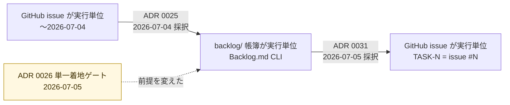
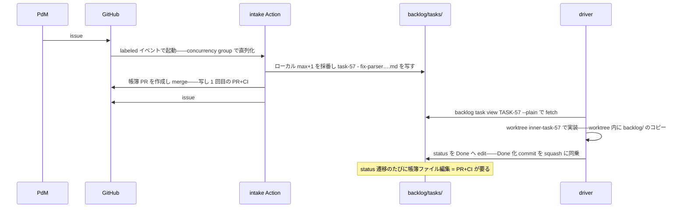
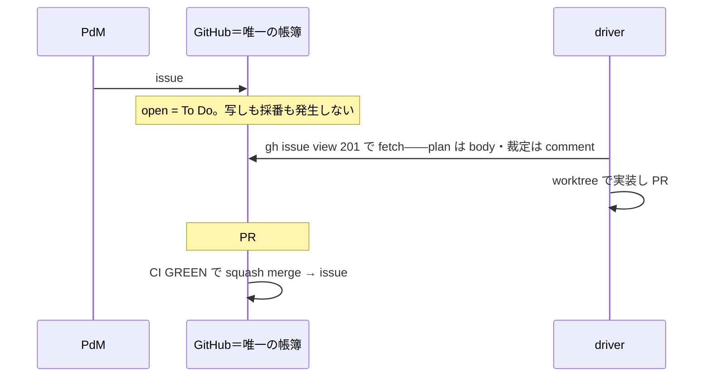
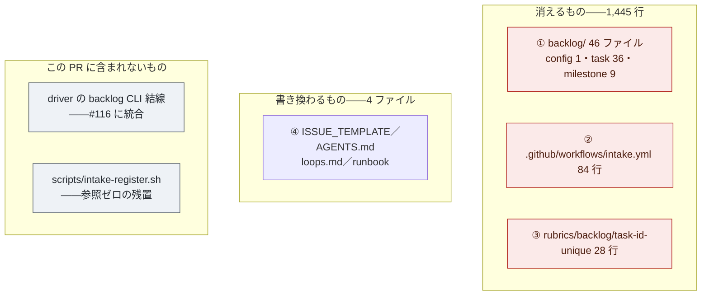

# PR #146 解説 — backlog/ 帳簿の廃止と issue=task 移行（ADR 0031）

目次: [1. Background](#1-background) ／ [2. Intuition](#2-intuition) ／ [3. Code](#3-code) ／ [4. Quiz](#4-quiz)

この教材は issue #158 の依頼（観点: なぜ自作帳簿を消せたのか・何が何に置き換わったのか・移行で消えた機構の一覧）に答える。対象は PR #146（2026-07-05T06:46:47Z squash merge、commit `a83632d`）と ADR 0031。diff は **52 ファイル・追加 13 行・削除 1,458 行**であり、削除が主役の変更である。

## 1. Background

### 1.1 lathe と、この PR が触る層

lathe はハーネスエンジニアリングプラットフォームである。コーディング agent のセッションを ingest して観測・分析・評価する Next.js + Postgres アプリで、リポジトリは `github.com/yutaro0915/lathe`（public）にある。この PR が変更するのはアプリ本体ではなく、**lathe を開発する体制そのもの**——「やるべき作業（task）をどこに記録し、その進行状態をどう管理するか」という task substrate（作業台帳の置き場所と形式）である。

### 1.2 登場する主体

| 主体 | 何をするか | なんのために存在するか |
|---|---|---|
| **PdM** | 人間。壁打ちで方針を裁定し、task の優先度・採否を triage する | 価値判断の最終責任者。機械は判断を発明しない（後述 1.4 の #80 事例） |
| **outer loop（監査役）** | PdM と対話するセッション。監視・task 起票・rubric 管理・escalation への裁定 | 「何をやるべきか」の判断。outer の終端に実装は存在しない（`design/loops.md`） |
| **inner loop（driver `scripts/inner-loop.mjs`）** | task を 1 つ受け取り、隔離 worktree で計画→実装→レビュー→検証→merge を自律完走する | 判断済みの bounded な作業を人間の介在なしに main へ届ける |
| **Backlog.md CLI**（この PR で廃止） | OSS ツール（MrLesk/Backlog.md）。repo 内 `backlog/tasks/*.md` を task 台帳として CRUD する | ADR 0025 が採用した task substrate の実体。盤面（`backlog browser`）も提供 |
| **intake Action `.github/workflows/intake.yml`**（この PR で廃止） | `task-request` label 付き issue を到着順に backlog task へ写して close する GitHub Action | 登記の単一 writer。task ID 採番の直列化（ADR 0027） |
| **CI（status check `gate`）** | PR の diff に対して `rubrics/run.mjs` を GitHub 側で再実行する | main に入る唯一の道 = PR + CI GREEN（ADR 0026）。信頼境界は remote に置く |
| **GitHub Projects v2**（この PR の後の盤面） | 同じ issue 群への board / table / roadmap ビュー | PdM の triage 空間。帳簿ではなくビュー——同期が存在しない（ADR 0031 §4） |

### 1.3 task substrate の変遷 — issue → Backlog.md → issue



*図 1: task substrate の変遷。ADR 0025 の採択（2026-07-04）から ADR 0031 の採択（2026-07-05）まで 1 日である。何が誤りだったのかではなく、何の前提が変わったのかがこの PR を理解する鍵になる。*

ADR 0025（2026-07-04 採択）は、それまで実行単位だった GitHub issue を「外部レポート窓口」に降格し、repo 内 markdown の帳簿 `backlog/tasks/task-N.md` を正本にした。動機は 2 つ——自前ビューア `tools/wbs.mjs`（1,735 行）の保守負債と、task 情報が issue body・plan manifest・ローカル tasks.json に散在して単一正本がなかったこと。「scope + 受け入れ条件 + 計画 + 依存 + status」を 1 枚の md に統合できる点が採用理由だった。実際に TASK-11 が新 driver で PLAN→MERGE を自律完走する live-fire 検証も PASS している（ADR 0025 受け入れ節）。

帳簿の task ファイルは frontmatter に status を持つ。PR #146 が削除した実物から引用する。

```yaml
# backlog/tasks/task-13 - plan-format-....md（削除された実物の frontmatter 冒頭）
---
id: TASK-13
title: 'plan-format: PLAN prompt へ規約骨格を注入 + needs-approval 承認ポーズ'
status: To Do
labels:
  - loop
  - plan-format
milestone: m-18
dependencies: []
priority: high
---
```

status の値域は `backlog/config.yml`（同じく削除）が定めていた: `statuses: ["To Do", "In Progress", "Done"]`。**この 3 値の status フィールドこそが、後述する「保存された状態」の実体である。**

### 1.4 intake Action — 登記の単一 writer（ADR 0027）

帳簿が repo 内ファイルになると、「誰が task ID を採番するか」という問題が生まれる。ID はローカル max+1 で採番されるため、並走する 2 つの登記が同じ ID を取り得る（TASK-12 で実発生）。ADR 0027 はこれを**登記の単一 writer** で解決した——`task-request` label 付き issue の到着を trigger に、GitHub Actions の concurrency group で登記を 1 本ずつ直列化し、issue を backlog task へ写して close する。

削除された `.github/workflows/intake.yml`（84 行）の冒頭コメントは、この機械の設計判断を凝縮している。

```yaml
# intake（登記）= 判断ゼロの決定的機械（ADR 0027 追記 2026-07-05）
#
# `task-request` label が付いた issue を、到着順に backlog task へ写して close する。
# 却下はしない — priority や採否の triage は PdM が backlog の盤面で行う。
# 判断する主体（LLM）を登記に置くと規則を発明する（2026-07-05、実在しないテンプレの
# 必須フィールドを理由に #80 を却下した事例）ため、登記は deterministic に保つ。
#
# 単一 writer（ADR 0027 §2）: concurrency group で登記を常に 1 本ずつ直列化し、
# ID 採番（ローカル max+1）の競合を構造的に防ぐ。
```

さらにバースト到着対策（3 issue 同時到着で GitHub の concurrency queue が中間 run を cancel し、#77 が登記漏れした実事故）として hourly の catch-up sweep（TASK-24、PR #101）まで積まれていた。採番衝突そのものは CI check `rubrics/backlog/task-id-unique`（TASK-19 成果物・28 行）が機械検査していた。

> [!NOTE]
> ここまでで見えるのは、**自作帳簿は 1 ファイル群では済まない**ということである。帳簿本体（backlog/）・登記機械（intake Action）・登記の直列化（concurrency group）・取りこぼし回収（sweep）・整合性検査（task-id-unique）が随伴し、それぞれが実事故（#80・#77・TASK-12 衝突）への対処として増築されてきた。PR #146 はこの随伴系全体を削除する。

### 1.5 前提を変えた ADR 0026 — 単一着地ゲート

ADR 0025 の採択時点では、監査役が main へ直接 commit できた。帳簿の status を動かすコストはローカル編集 1 回＝実質ゼロである。

ADR 0026（2026-07-05）がこの前提を壊した。**main に入る唯一の道は PR + CI GREEN** と定め、TASK-22 で branch protection（required check = `gate`・enforce_admins）が物理的に有効化された。この統治は receipt 偽造 incident（PR #110 の解説教材＝Discussion #154 が詳しい）への応答であり、それ自体は正しい。しかし帳簿にとっては維持費の構造が変わる。ADR 0031 の背景節から引用する。

> task の status 1 つを動かすにも PR+CI が必要になり、task 1 本のライフサイクルで 3 回以上の「帳簿 PR」が走る。

status の値域は To Do / In Progress / Done の 3 値（1.3 節）。つまり task 1 本が生まれて終わるまでに、登記の写し・着手・完了と、**帳簿ファイルを編集するためだけの PR+CI が実装 PR とは別に積み重なる**。

### 1.6 worktree コピーと 2026-07-05 の FF 事故

もう 1 つの構造問題は、inner loop が task ごとに git worktree を切ることに由来する。repo 内ファイルである backlog/ は **worktree の数だけコピーが存在**し、どこで編集しても他のコピーとの同期問題が残る。ADR 0031 背景節が記録する実事故: 2026-07-05、main worktree 上の未コミット backlog 編集が fast-forward を黙って失敗させ、手元 main が 4 commit 遅れた。

### 1.7 ADR 0031 の決定

ADR 0031（2026-07-05 PdM 裁定）は原因を「置き場所」ではなく次の一点に定めた。

> 根本原因は置き場所ではなく、**git/GitHub が既に知っている事実を repo 内ファイルへ二重記録していること**。

決定は 4 点に畳める。

1. **task の正本 = GitHub issue**。issue 番号がそのまま task ID（TASK-N = issue #N）
2. **状態は保存せず導出する**。保存するのは導出できないものだけ
3. **Backlog.md と backlog/ の廃止**。intake Action の写し機能・task-id-unique check も役割終了
4. **盤面 = GitHub Projects v2**。同じ issue 群へのビューであり、同期が存在しない。機械は labels と issue 状態のみ読む

PR #146 は、この決定のうち repo 側で実施できる移行（帳簿・登記機械・検査の削除と文書追随）を 1 つの PR にまとめたものである（Closes #136）。

## 2. Intuition

なぜ自作帳簿を「消せた」のか。答えは一行で書ける。**帳簿が保存していた情報のほぼすべては、git/GitHub が既に持っている事実からいつでも計算し直せる（導出できる）ものだった。** 導出できる値を保存すると、正本と写しの間に同期という仕事が生まれ、同期には機械（intake Action・sweep・一意性検査）と規律（単一 writer）が要る。保存をやめれば、同期の仕事そのものが消滅する。

状態の導出とは具体的にはこうである。

| 帳簿が保存していた status | 導出後の定義 | 参照する GitHub の事実 |
|---|---|---|
| `To Do` | open な issue（`task` 系 label 付き） | issue の open/closed 状態 |
| `In Progress` | その issue を参照する PR が open | PR と issue のリンク（`Closes #N` 等） |
| `Done` | PR の merge により issue が close | merge イベントと issue close |

3 値のどれも、**書き込むという操作自体が存在しない**。issue を作れば To Do になり、PR を出せば In Progress になり、merge されれば Done になる。状態遷移は開発行為そのものの副産物であり、帳簿係は要らない。

逆に、導出できないものだけが保存対象として残る: **plan 本文** = issue body、**裁定・申し送り** = issue comment（時刻・帰属つき）、**needs-plan／escalation／優先度** = label、**依存関係** = body の `blocked-by #N` 記法。

### 2.1 toy 例: 架空 issue #201 のライフサイクル

架空の task「fix: parser の off-by-one」で、PR #146 の前後を比べる。

**BEFORE（ADR 0025〜0027 体制）** — 帳簿と登記機械を経由する。



同じ作業に **2 つの ID**（issue #201 と TASK-57）が生まれ、対応表は commit message（`intake: TASK-57 <- issue #201`）にしか残らない。issue は close されるので、GitHub 上で「この作業は今どうなっているか」を知るには backlog/ を clone して読むしかない。

**AFTER（ADR 0031 体制）** — issue がそのまま task。



*図 2: before で 3 主体（intake Action・backlog/・driver の帳簿編集）が担っていた状態管理が、after では GitHub の既存イベントからの導出に置き換わり消滅する。*

> [!IMPORTANT]
> **採番の直列化はどこへ行ったか** — ADR 0027 が単一 writer を置いた唯一の理由は ID 採番の直列化だった。issue 番号は GitHub がサーバー側で最初から直列採番している。つまり intake Action は、**GitHub が既に解いている問題をローカルで解き直すための機械**だった。二重記録をやめると、直列化機械（concurrency group）も、その取りこぼし回収（catch-up sweep）も、衝突検査（task-id-unique）も、解くべき問題ごと消える。

### 2.2 何が何に置き換わったのか（対応表）

| 旧機構（PR #146 以前） | 新（ADR 0031 体制） | 置換の性質 |
|---|---|---|
| `backlog/tasks/task-N.md`（正本） | GitHub issue そのもの（TASK-N = issue #N） | 写しの廃止。issue が最初から正本 |
| frontmatter `status:` への書き込み | open／参照 PR open／merge close からの**導出** | 操作自体の消滅 |
| intake Action の採番（ローカル max+1 ＋ concurrency group） | GitHub のサーバー側 issue 採番 | 既存機構への委譲 |
| task-id-unique CI check | ——（衝突が構造的に不可能） | 検査対象の消滅 |
| task 本文（Description／AC／Notes） | issue body | 置き場所の変更（thought は不変） |
| `backlog task edit --notes` での裁定記録 | issue comment（時刻・帰属つき） | 置き場所の変更 |
| frontmatter `dependencies:` | body の `blocked-by #N` 記法 | 置き場所の変更 |
| frontmatter `priority:`・`labels:` | issue label（`p0-urgent` 等） | 置き場所の変更 |
| 盤面 `backlog browser`（:6420） | GitHub Projects v2（ビュー。機械は読まない） | 帳簿つきビュー → 同期なしビュー |
| `backlog/milestones/m-10〜m-18` | Projects の triage 空間（列・優先度・milestone） | PdM 専用領域化 |

> [!NOTE]
> ADR 0031 は自らを「ADR 0025 の実質巻き戻し」と呼ぶが、巻き戻らないものが 1 つある。0025 の「task に plan／受け入れ条件を 1 枚で持たせる」という思想は、**issue body 上でそのまま生きる**（ADR 0031 影響節）。捨てたのは思想ではなく、思想を repo 内ファイルという置き場所に実装したことである。

### 2.3 「repo の外に情報を置かない」との整合

ADR 0026 §4 は運用知識をセッション記憶やローカル memory に置くことを禁じた。issue を正本にするのはこれに反しないか。ADR 0031 §5 が解釈を与える——禁止の趣旨は**観測不能・履歴なしの置き場**であり、GitHub の issue／PR／label は観測可能・履歴付き・ingest 可能な substrate なので正本たりうる。現に PR 連携（G1）も intake もそこにあった。issue イベントの lathe ingest は観測面の宿題として起票対象になっている（ADR 0031 §6）。

## 3. Code

diff 52 ファイルを意味のまとまりで 5 グループに分けて読む。①帳簿本体の削除、②登記機械の削除、③一意性検査の削除、④文書の追随、⑤移行の実務。



*図 3: 変更の全体地図。*

### 3.1 ① 帳簿本体の削除 — backlog/ 46 ファイル

`backlog/config.yml`（15 行）・`backlog/tasks/*.md`（36 ファイル）・`backlog/milestones/m-10〜m-18`（9 ファイル）が全削除される。config.yml は status 値域・`task_prefix: "task"`・盤面ポート `default_port: 6420` を定めていた——つまり帳簿の「スキーマ」ごと消える。

```diff
- # backlog/config.yml
- project_name: "lathe"
- default_status: "To Do"
- statuses: ["To Do", "In Progress", "Done"]
- task_prefix: "task"
- default_port: 6420
```

削除された task 36 ファイルには Done 済みの歴史も含まれる。**Done task は issue へ移行しない**——歴史は git 履歴で参照できるため（issue #136 の実施順 1）。ここにも「導出できるものは保存しない」と同じ原理が働いている。

### 3.2 ② 登記機械の削除 — intake.yml 84 行

1.4 節で見た deterministic 登記機械が丸ごと消える。trigger（`issues: [labeled]`）・直列化（`concurrency: group: intake`）・hourly sweep（`schedule: cron: '0 * * * *'`）・per-issue 失敗隔離のすべてが不要になる。登記 = issue 作成そのものになったため、「登記の完了」を待つ主体がいない。

```diff
- name: intake
- on:
-   issues:
-     types: [labeled]
-   schedule:
-     - cron: '0 * * * *'
- concurrency:
-   group: intake
-   cancel-in-progress: false
```

> [!WARNING]
> **残置物** — intake.yml が呼んでいた `scripts/intake-register.sh`（登記の実体・約 4.2KB）は PR #146 では削除されておらず、参照ゼロの孤児として repo に残る（2026-07-07 時点で grep により確認。参照は自ファイルのみ）。PR #110 が receipt 検査を消した際に `receipt.mjs` 本体が孤児として残り後続 task（PR #111）で削除された経緯と同型であり、後始末の起票対象である。

### 3.3 ③ 一意性検査の削除 — task-id-unique

```diff
- // rubrics/backlog/task-id-unique/rubric.json
- "title": "backlog/tasks 内の task ID は一意（重複 ID で RED、並走 intake PR の再採番を機械強制）",
- "origin": "ADR 0027 / TASK-19（2026-07-05）: 並走 intake PR による ID 衝突（TASK-12 実例）を機械で防ぐ",
- "cmd": "grep -h '^id:' backlog/tasks/*.md 2>/dev/null | sort | uniq -d | wc -l | tr -d ' '",
- "expect": "eq:0",
```

この検査が守っていた不変条件「task ID は一意」は消えていない。**成立のさせ方が変わった**——検査で守る（violation を検出して RED）のではなく、構造で守る（GitHub のサーバー側採番により重複が最初から発生し得ない）。検出型の保証が構成型の保証に置き換わるとき、検査は削除できる。

### 3.4 ④ 文書の追随

4 ファイルが issue=task・status 導出へ書き換わる。ISSUE_TEMPLATE は起票者への案内文そのものが変わる。

```diff
  # .github/ISSUE_TEMPLATE/task-request.md
- about: backlog task の起票依頼。intake Action が到着順に task へ登記します（却下なし）。
+ about: task の起票。この issue がそのまま task になります（TASK-N = issue #N・却下なし、ADR 0031）。
```

`design/loops.md` の loop 台帳では、intake が独立した loop であることをやめる。

```diff
- | **intake（登記）** | GitHub Action（deterministic・単一 writer、ADR 0027 追記） | … | **task 起票（issue close＋task 参照）** | …
+ | **intake（登記）** | **廃止（ADR 0031）**——登記は issue 作成そのもの。… | issue がそのまま task（**TASK-N = issue #N**。status は導出: open=To Do／参照 PR open=In Progress／merge close=Done） | **issue 作成の完了** | …
```

`design/runbooks/outer-operations.md` は裁定の記録先を差し替える（`backlog task edit --notes` → issue comment）。`AGENTS.md` は起票規約 1 行を全面改稿し、「実行単位は issue。status は保存せず導出」を宣言する。

### 3.5 ⑤ 移行の実務 — open 11 task の issue 化と、この PR がやらないこと

PR 本文と merge commit message によれば、open だった 11 task は着地前に issue 化済みである。

- **intake 由来の 5 件**（元 issue が存在）: #113・#115〜#118 を reopen し、帳簿側の notes（裁定）を転記
- **帳簿直起票の 6 件**（元 issue なし）: TASK-4/7/10/12/13/14 → 新規 issue #138〜#143 へ転記

転記された issue は冒頭に出自を明記する。実物 #141 から引用する。

> **ADR 0031 移行**: 旧 TASK-12 からの転記（元 file は git 履歴参照）。

一方、**driver の backlog CLI 結線除去はこの PR に含まれない**。`scripts/inner-loop.mjs` は `node_modules/.bin/backlog` の直呼び・`backlog task view <id> --plain` の parse・`backlog task create --depends-on` を PR #146 着地後も保持しており（2026-07-07 時点で確認）、除去は #116（ADR 0030 ③ task loop の縮退）に統合された。ADR 0031 移行節が「TASK-33 の縮退書き直しと統合可」と明示的に許容した分割である。同じく ADR 0031 は **TASK-29〜33 の着手を禁止**し、移行後に issue 上で再定義するとした（ADR 0030 の決定内容は不変・substrate だけが変わる）。

まとめとして、移行で消えた機構の一覧を示す（issue #158 の観点 3 への直接の回答）。

| 消えた機構 | 規模 | 存在理由（当時） | 消せた理由 |
|---|---|---|---|
| `backlog/tasks/`・`milestones/`・`config.yml` | 46 ファイル | task の正本・盤面のデータ | issue が正本になった |
| intake Action（写し・close） | 84 行 | issue → 帳簿の写し | 写す先が消えた |
| 採番の単一 writer（concurrency group） | 同上に内包 | ローカル max+1 の衝突防止 | 採番を GitHub に委譲 |
| catch-up sweep（hourly cron） | 同上に内包 | バースト到着の登記漏れ回収（#77） | 登記 = issue 作成なので漏れが定義不能 |
| task-id-unique CI check | 28 行 | 並走登記の ID 衝突検出（TASK-12） | 衝突が構造的に不可能 |
| status 書き込み操作（`backlog task edit --status`） | 運用 | 帳簿の状態更新 | 状態は導出に置換 |
| 帳簿 PR（task 1 本あたり 3 回以上） | 運用 | 単一着地ゲート下の帳簿編集 | 編集対象の消滅 |

## 4. Quiz

**Q1. PR #146 の着地後、`task-request` label を付けて issue を作成すると何が起きるか。**

- A. intake Action が起動し、issue を task へ写してから close する
- B. 何も起きない。次に監査役が手動で `backlog task create` を実行する必要がある
- C. 何も起きる必要がない。issue 作成の完了がそのまま登記の完了であり、その issue が task である
- D. GitHub Projects の automation が issue を backlog/ へ export する

<details><summary>答えと解説</summary>

**正解: C** — loops.md の改訂後の intake 行が「唯一の終端 = issue 作成の完了」と定める。写しの機械（A）は削除済み、`backlog task create`（B）は CLI ごと廃止、Projects（D）はビューであって帳簿ではなく同期処理を持たない。open な issue は導出により自動的に To Do である。
</details>

**Q2. task-id-unique CI check（重複 task ID の検出）を削除できた理由として正しいものはどれか。**

- A. 重複検出のロジックが CI から driver 側へ移設されたから
- B. ID の一意性という不変条件自体が不要になったから
- C. 検査対象の `backlog/tasks/*.md` が消滅し、かつ ID = issue 番号は GitHub がサーバー側で直列採番するため、重複が構造的に発生し得なくなったから
- D. GitHub Projects が重複を検出して警告するから

<details><summary>答えと解説</summary>

**正解: C** — 不変条件（一意性）は生きている（B は誤り）。変わったのは保証の方式で、violation を検出する検査から、violation が発生し得ない構成へ移った。ADR 0027 が単一 writer を置いた理由も 0031 の言葉では「採番の直列化」ただ 1 つであり、GitHub 採番はそれを最初から満たしている。
</details>

**Q3. ADR 0031 体制で、task が「In Progress」になる瞬間に書き込まれるものは何か。**

- A. issue の status フィールドが In Progress に更新される
- B. 何も書き込まれない。その issue を参照する PR が open になったという事実から導出される
- C. driver が issue に `in-progress` label を付与する
- D. Projects の Status 列を PdM が動かす

<details><summary>答えと解説</summary>

**正解: B** — 「status の書き込みという操作自体を廃止する」（ADR 0031 §2）。issue に status フィールドは存在せず（A）、label は needs-plan／escalation／優先度のような導出不能な情報のためにある（C）。D は起き得るが Projects はビューであり、機械は labels と issue 状態しか読まないので、それが task の状態を定義することはない。
</details>

**Q4. GitHub issue を正本にすることは、ADR 0026 §4「repo の外に情報を置かない」に反しないか。ADR 0031 の整理として正しいものはどれか。**

- A. 反するが、帳簿維持費の削減がそれを上回ると判断して例外を認めた
- B. 反しない。禁止の趣旨は観測不能・履歴なしの置き場であり、issue／PR／label は観測可能・履歴付き・ingest 可能な substrate だから正本たりうる
- C. 反しないのは一時的な措置で、将来 issue 本文を repo へ定期 export して二重化する
- D. ADR 0026 §4 は ADR 0031 で廃止された

<details><summary>答えと解説</summary>

**正解: B** — ADR 0031 §5 の解釈そのもの。§4 が禁じたのはセッション記憶・ローカル memory のような観測も履歴も残らない置き場である。C のような export は「二重記録」の再発明であり本 ADR の原理と正反対。なお観測面は宿題として残り、issue イベントの lathe ingest が起票対象になっている（§6）。
</details>

**Q5. ADR 0025（Backlog.md 採用、2026-07-04）が ADR 0031（2026-07-05）で実質巻き戻された。0031 自身が挙げる巻き戻しの根拠として正しいものはどれか。**

- A. Backlog.md の機能不足が判明した（live-fire 検証が FAIL した）
- B. 決定の前提が変わった。採用時は main 直コミットが可能で帳簿の維持費はゼロに見えたが、ADR 0026 の単一着地ゲートで status 1 つの変更にも PR+CI が要る構造になった
- C. PdM が要件を誤って伝えていた
- D. GitHub Projects v2 が無料化され、外部 SaaS の選択肢が増えたため

<details><summary>答えと解説</summary>

**正解: B** — ADR 0031 背景節の明示的な論理:「ADR 0025 採用時は main 直コミットが可能で帳簿の維持費はゼロに見えた——前提が変わった以上、決定を見直す」。live-fire 検証（TASK-11）はむしろ PASS していた（A は誤り）。加えて worktree コピーの同期事故（2026-07-05 の FF 4 commit 遅れ）が「運用規律では再発を防げない」ことを示した。却下された代替（常駐 MCP・外部 SaaS 同期・現状維持）はいずれも機構の追加か同期の再輸入であり、「機構は追加より削除」（ADR 0026 §0）に従って二重記録そのものを消す道が選ばれた。
</details>

---

接地資料: commit `a83632d`（PR #146 squash、52 files・+13/−1458）／ADR 0031・0025・0026・0027／issue #136（移行 plan）・#141（転記実例）・#116（driver 結線除去の統合先、2026-07-07 時点 open）／`design/loops.md`・`design/runbooks/outer-operations.md` の同 PR diff／GitHub API（PR #146: state=MERGED・mergedAt=2026-07-05T06:46:47Z）／`scripts/inner-loop.mjs`・`scripts/intake-register.sh` の 2026-07-07 時点の現物確認。[^1]

[^1]: 本教材は issue #158（explain label）を起点に explain-diff skill（ADR 0032/0033）で生成した。正本は `explains/2026-07-07-pr146-issues-as-task-substrate.md`、配信は GitHub Discussion（Explain カテゴリ）。

---

配信: https://github.com/yutaro0915/lathe/discussions/159
