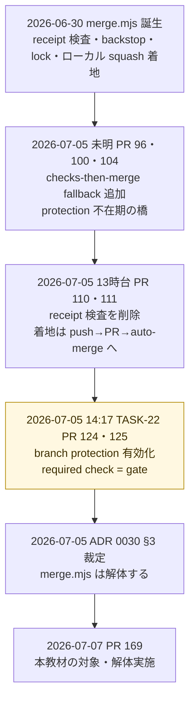
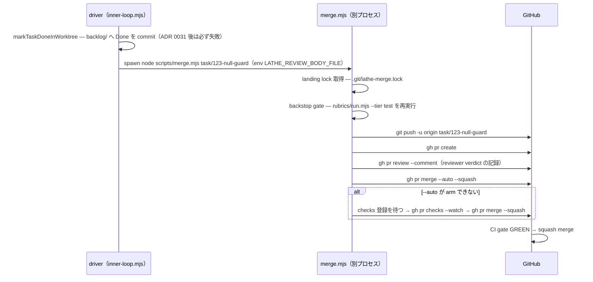
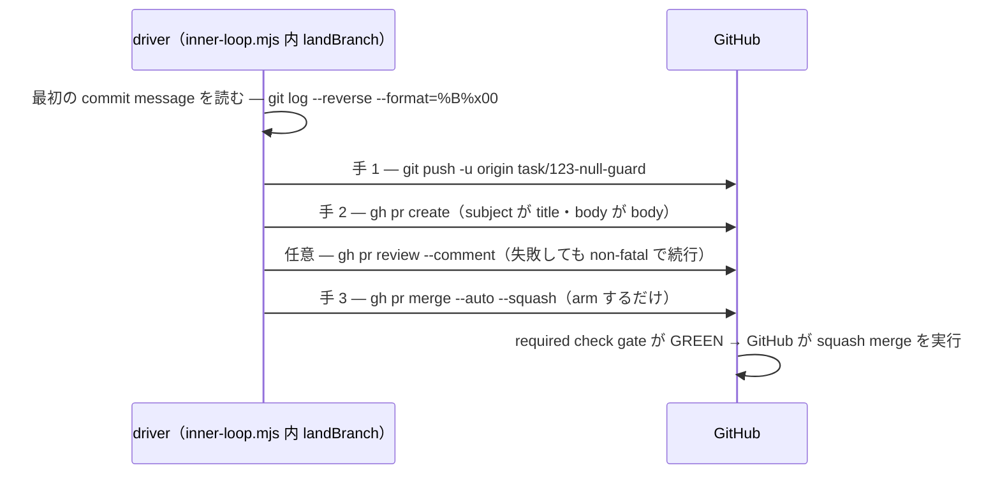

# PR #169 解説 — merge.mjs 解体（着地 3 手の driver 直実行化、ADR 0030 §3）

目次: [1. Background](#1-background) ／ [2. Intuition](#2-intuition) ／ [3. Code](#3-code) ／ [4. Quiz](#4-quiz)

対象は PR #169（2026-07-07T03:58:11Z squash merge、commit `fb129ac`）と、その plan である issue #115（ADR 0030 §3「merge.mjs は解体する」の実装 task）。diff は **7 ファイル・追加 270 行・削除 887 行**であり、`scripts/merge.mjs`（399 行）と `scripts/merge.test.mjs`（382 行）の全削除が主役である。PR 本文はこの変更を ADR 0030 実装の「修理チェーン 1/4」と位置づける。

> [!NOTE]
> 本教材は Discussion #154（PR #110 — receipt ゲートの廃止と CI 単一ゲート化）と Discussion #159（PR #146 — backlog/ 帳簿の廃止と issue=task 移行）を既読と仮定する。receipt 機構・CI ゲート `gate`・「status は保存せず導出」の背景説明は繰り返さず、そちらを参照する。

## 1. Background

### 1.1 本 PR の位置 — 単一着地ゲート化の 3 連削除の最終段

ADR 0026（2026-07-05 採択）は「main に入る唯一の道 = PR + CI GREEN」を定めた。以後、ローカル側に残っていた旧着地機構は 3 段階で削られてきた。

1. **PR #110／#111**（2026-07-05）: receipt 検査の削除（詳細は Discussion #154）
2. **PR #146**（2026-07-05）: backlog/ 帳簿と intake Action の削除（詳細は Discussion #159）
3. **PR #169**（2026-07-07、本教材）: 着地スクリプト merge.mjs 本体の削除

つまり本 PR は「削除の削除」に近い。#110 で中身（receipt 検査）を失い、#146 で書き込み先（backlog/）を失った merge.mjs の残骸から、まだ生きている 3 手だけを救出して器を捨てる作業である。

### 1.2 merge.mjs — 何であったか

merge.mjs は、driver（`scripts/inner-loop.mjs`）の状態機械が終端 MERGE に達したとき `node scripts/merge.mjs <branch>` として spawn される**別プロセス**だった。誕生は 2026-06-30（commit `3f9f4ba`「merge gate enforcing review+verify receipts」）。当時の着地は GitHub を経由しないローカル squash——merge.mjs 自身が main を書き換える主体だったため、検査と直列化を自前で持つ必要があった。

削除直前（2026-07-07 時点・399 行）の責務は次のとおり。

| 責務 | 何をしていたか | なんのために存在したか |
|---|---|---|
| landing lock | `.git/lathe-merge.lock` に自 PID を書き、他プロセスが保持中なら待機。死んだ PID は reclaim | ローカル着地の直列化。複数 task の同時 merge で main が壊れるのを防ぐ |
| receipt 検査（跡地） | 何もしない。`// 2. (Receipt check removed — ADR 0026 §1-3...)` というコメントだけが残っていた | reviewer／verifier の証明検査（PR #110 で削除済み。Discussion #154 参照） |
| backstop gate | 変更 path に対し `rubrics/run.mjs --changed <paths> --tier test` をローカルで再実行し、RED なら着地拒否 | CI が権威になる前の「着地直前の最終検査」 |
| 着地 3 手 | `git push` → `gh pr create` → `gh pr merge --auto --squash` | ADR 0026 §1-2 の正規の着地。本 PR が唯一救出する部分 |
| checks-then-merge fallback | `--auto` の arm が失敗したら、checks の登録をポーリングで待ち（`waitForChecksRegistered`）、`gh pr checks --watch` で GREEN を待って `--auto` なしで直接 merge | branch protection 不在期は auto-merge を arm できなかったための橋（PR #96／#100／#104、2026-07-05 未明） |
| PR review comment 投稿 | env `LATHE_REVIEW_BODY_FILE` で受け取った reviewer verdict を `gh pr review --comment --body-file` で PR に記録 | 記録目的・non-blocking（ADR 0028） |
| `LATHE_MERGE=1` の付与 | 内部の全 subprocess（git／gh／run.mjs）の env に付与 | git-guard hook が「main 上の raw merge／commit」を block していた時代に、merge.mjs 経由の正規操作を見分けるための合言葉（`git-guard.mjs` が `process.env.LATHE_MERGE` を読んでいた） |

また merge.mjs 本体の外、driver 側にも一つ削除対象があった。**`markTaskDoneInWorktree()`** — merge 直前に worktree 内で `backlog task edit <id> --status Done` を実行し、`backlog: TASK-N -> Done` という記帳 commit を branch に積んで squash に同乗させる関数である（ADR 0025 §4 由来）。

### 1.3 前提を壊した 2 つの出来事

merge.mjs の各責務は「GitHub がやってくれないこと」の自前実装だった。2026-07-05 の 2 つの出来事が、その前提を同日に壊した。



*図 1: merge.mjs の生涯。fallback の追加（未明）と、それを不要にする branch protection 有効化（14:17）が同じ日である。橋は架けてから約 10 時間で vestigial になった。*

- **branch protection 有効化**（TASK-22、PR #124／#125、2026-07-05 14:17 JST）。required status check = `gate` により、(a) `gh pr merge --auto` が正規に arm できるようになり fallback の存在理由が消えた。(b) main への直 push が GitHub 側で物理的に不可能になり、ローカルの lock と backstop が守っていたものを remote が守るようになった。同 PR で git-guard hook から main 系ルールが strip され、`LATHE_MERGE` を読む消費者も消えた（set するだけで誰も読まない env になっていた）。
- **ADR 0031**（issue=task、2026-07-05 採択・PR #146 で実施）。status は保存せず PR の状態から導出するため、`markTaskDoneInWorktree` の書き込み先 `backlog/` はもはや存在しない。呼べば必ず失敗する死んだコードだった。

issue #115 には別セッションからの申し送り comment（2026-07-05）が残っており、「fallback は protection 有効化で概ね vestigial。driver 直呼びへ移す際に --auto 一本に簡素化するか保険として運ぶかを実装判断に含めること（simplicity 原則なら前者）」と指示していた。本 PR は前者——簡素化——を選んだ。

## 2. Intuition

### 2.1 399 行のうち、残す価値があるのは 3 個のコマンドだけ

削除直前の merge.mjs がやっていたことを「GitHub 側に代替があるか」で仕分けると、次のようになる。

| merge.mjs の責務 | 行き先 | 代替（なぜ消せるか） |
|---|---|---|
| landing lock（約 100 行） | **削除** | GitHub が merge を直列化する。並行して 2 本の PR ができても main は壊れない |
| backstop gate | **削除** | CI の required check `gate` が同じ `rubrics/run.mjs` を PR head sha に対して実行する。完全重複 |
| checks-then-merge fallback | **削除** | protection 有効化後は `--auto` が正規に arm できる。橋の対岸に着いた |
| receipt 検査の跡地コメント | **削除** | 実体は PR #110 で削除済み |
| `LATHE_MERGE=1` | **削除** | 消費者ゼロ（読み手の git-guard main 系ルールが TASK-22 で strip 済み） |
| 着地 3 手（push → pr create → merge --auto） | **移設** | driver 内の新関数 `landBranch()` が直接実行 |
| PR review comment 投稿 | **移設** | `landBranch()` の引数 `reviewBodyFile` として機能維持（撤去自体は issue #116 の scope） |
| 純関数群（message 分解・argv 組み立て） | **移設** | `inner-loop.mjs` へ。テストも `merge.test.mjs` から `inner-loop.test.mjs` へ移設 |

driver 側の `markTaskDoneInWorktree` は**削除**——Done を「書く」必要そのものが消えた。task の Done は「その issue を close した merged PR がある」ことから導出される（Discussion #159 の中心論点）。

### 2.2 toy 例 — 1 本の branch が着地するまで

架空の task branch `task/123-null-guard` に 3 commit（実装 1 ＋ review 修正 2）が積まれているとする。着地時、最初の commit message だけを PR の title／body にしたい。`landBranch()` は次の 1 コマンドで全 commit の message を NUL 区切りで読む。

```console
$ git log --reverse --format=%B%x00 main..task/123-null-guard
fix(web): runs 一覧の null guard — cost 欠損 run で 500 を防ぐ

Closes #123
^@fix review: cost=0 と null の分岐を分離
^@fix review: unit test を追加
^@
```

（`^@` は NUL バイト。`%x00` を区切りにするのは、commit body 内の空行や trailer が「commit 間の区切り」と衝突しないようにするためである。）

これを 2 つの純関数に通す。

| 関数 | 入力 → 出力 |
|---|---|
| `extractFirstCommitMessage` | 上の出力 → `"fix(web): runs 一覧の null guard — cost 欠損 run で 500 を防ぐ\n\nCloses #123"`（最初の NUL まで） |
| `splitCommitMessage` | ↑ → `{ subject: "fix(web): runs 一覧の null guard — cost 欠損 run で 500 を防ぐ", body: "Closes #123" }` |

subject が PR title、body が PR body になる。review 修正 commit が title を汚さない。

### 2.3 before / after

**before（2026-07-05〜07-07 の merge.mjs 経由）:**



**after（PR #169 以降）:**



after の driver は**着地を完了させない**。`--auto` を arm した時点で手を離し、実際の squash merge は CI GREEN 後に GitHub が行う。driver の完了ログも `merged onto main` から `auto-merge (squash) armed. CI gate will complete the landing.` に変わった。lock が要らない理由はここにある——ローカルには「直列化すべき main の書き換え」がもう存在しない。

> [!IMPORTANT]
> この構図は Discussion #154 の信頼境界の議論の帰結である。検査（backstop）も直列化（lock）も、改変可能なローカル環境でなく GitHub 側（required check・merge queue 相当の直列化）に置かれた。ローカルに残るのは「PR を作って arm する」という、失敗してもやり直せる操作だけである。

### 2.4 プロセス境界の消滅

merge.mjs は別プロセスだったから、driver からの情報伝達は env 変数（`LATHE_REVIEW_BODY_FILE`）と argv しかなかった。`landBranch()` は driver と同一プロセス内の関数なので、同じ情報が単なる**引数** `reviewBodyFile` になった。機能は同一・伝達路だけが変わった典型例である（この review comment 投稿自体の撤去は issue #116 の scope であり、本 PR は触らない）。

## 3. Code

### 3.1 新設 — `landBranch()`（`scripts/inner-loop.mjs`）

救出された着地 3 手の全体。`step()` が「実行して出力を貯め、成否を返す」共通処理、`fail()` が蓄積出力ごと失敗を返す。

```js
export function landBranch(branch, reviewBodyFile = null, deps = {}) {
  // ...step / fail ヘルパ定義...

  // --format=%B%x00: NUL-separated so multi-paragraph bodies / trailers don't
  // collide with the inter-commit separator.
  const logR = run('git', ['log', '--reverse', '--format=%B%x00', `main..${branch}`], ...);
  if (logR.status !== 0) return fail(`could not read commit messages for ${branch}: ...`);
  const { subject, body } = splitCommitMessage(extractFirstCommitMessage(logR.stdout ?? ''));
  if (!subject) return fail(`no commits found between main and ${branch} — nothing to land`);

  if (!step('git', ['push', '-u', 'origin', branch])) {
    return fail(`git push failed — cannot create PR for ${branch}`);
  }
  if (!step('gh', buildPrCreateArgs({ base: 'main', head: branch, title: subject, body }))) {
    return fail(`gh pr create failed for ${branch}`);
  }
  if (reviewBodyFile && !step('gh', buildPrReviewArgs({ branch, bodyFile: reviewBodyFile }))) {
    log(`warning: gh pr review --comment failed for ${branch} (non-fatal)`);
  }
  if (!step('gh', buildPrMergeArgs({ branch }))) {
    return fail(`gh pr merge --auto failed for ${branch}`);
  }
  return { ok: true, output: outputs.join('') };
}
```

失敗の扱いに段差がある点が読みどころである。push／pr create／merge --auto の失敗は `fail()`（driver 側で escalation 起票につながる）だが、**review comment の失敗だけは warning で続行**する。ADR 0028 がこの投稿を「記録目的・non-blocking」と定義しているためで、記録の失敗で着地を止めない。

呼び出し側の driver 終端も対応して書き換わった。

```diff
-    log(`merging branch ${branch} onto main`);
-    const mergeResult = runMerge(branch, reviewBodyFile);   // spawn node scripts/merge.mjs
-    if (!mergeResult.ok) {
-      writeEscalation(issueNumber, 'MERGE', null, `node scripts/merge.mjs failed\n\n...`);
+    log(`landing branch ${branch}: push → gh pr create → gh pr merge --auto --squash`);
+    const landResult = landBranch(branch, reviewBodyFile);
+    if (!landResult.ok) {
+      writeEscalation(issueNumber, 'MERGE', null, `landing failed\n\n...`);
```

> [!NOTE]
> driver に残る `backstop: main working tree clean — proceeding with merge.` というログは、削除された backstop gate とは**別物**である。これは着地前に main の working tree が clean かを見る既存検査で、本 PR の scope 外。「backstop」という語が 2 つの機構に使われていた点は紛らわしいが、gate の再実行のほうだけが消えた。

### 3.2 移設 — 純関数 4 種とテスト

`extractFirstCommitMessage`／`splitCommitMessage`／`buildPrCreateArgs`／`buildPrMergeArgs`／`buildPrReviewArgs` は merge.mjs から `inner-loop.mjs` へそのまま移設され、テストも `merge.test.mjs`（382 行・全削除）から `inner-loop.test.mjs`（+188 行）へ移設された。テスト名に仕様が書かれている。

```
buildPrMergeArgs: --auto flag is present (ensures CI gate controls landing)
buildPrMergeArgs: --delete-branch flag is NOT present (driver worktree owns local branch cleanup)
buildPrReviewArgs: does not include --approve (self-authored PR)
landBranch: gh pr review failure is non-fatal — auto-merge still armed
landBranch: git push failure → fails before any gh call
```

`--auto` の存在をテストで固定している点は、PR #104（2026-07-05）で fallback 側の `--delete-branch` が問題を起こした経緯の裏返しであり、「CI ゲートが着地を制御する」という不変条件を argv レベルで守っている。検証は `preflight --fast` GREEN（unit 216/216、PR 本文）。

### 3.3 全削除 — merge.mjs の 3 機構

**landing lock**（約 100 行）。PID lock の取得・待機・reclaim の一式。

```diff
-export function decideLock({ exists, holderPid, holderAlive, selfPid }) {
-  if (!exists) return 'acquire';
-  if (!Number.isNaN(holderPid) && holderPid === selfPid) return 'acquire';
-  if (!Number.isNaN(holderPid) && holderPid > 0 && holderAlive) return 'skip';
-  return 'reclaim';
-}
-export function resolveMergeLockPath(cwd) { /* .git/lathe-merge.lock */ }
-async function acquireMergeLock(lockPath, ...) { /* EEXIST → 待機ループ */ }
```

**backstop gate**。CI と同じ `run.mjs` のローカル再実行。

```diff
-  const runMjs = join(cwd, 'rubrics', 'run.mjs');
-  const result = spawnSync('node', ['--', runMjs, '--changed', ...paths, '--tier', 'test'], ...);
-  if (result.status !== 0) {
-    die('backstop verify RED — run.mjs --tier test failed');
-  }
```

**checks-then-merge fallback**。`--auto` 失敗時の checks 登録ポーリング（`waitForChecksRegistered`、上限約 120 秒）→ `gh pr checks --watch` → 直接 merge、の一連。protection 不在期の橋として PR #96／#100／#104 で 3 回修理された部分だが、丸ごと消えた。`landBranch()` では `--auto` の失敗は単に `fail()` である。

### 3.4 削除 — `markTaskDoneInWorktree()`（driver 側）

```diff
-  if (isTaskUnitLike(issueNumber)) {
-    log(`marking task ${issueNumber.id} Done in worktree before merge...`);
-    const doneResult = markTaskDoneInWorktree(issueNumber.id, worktreePath, headSha);
-    if (!doneResult.ok) {
-      writeEscalation(issueNumber, 'MERGE', null, `backlog task edit --status Done failed\n\n...`);
-      die(`status=Done failed — see ${escalationPathFor(issueNumber)}`);
-    }
-  }
```

関数本体（`backlog task edit --status Done` → `git add backlog/` → 記帳 commit）とテスト 3 本も削除。ADR 0031 で `backlog/` が消滅した 2026-07-05 以降、この経路は「実行されれば必ず escalation」という地雷だった。Done は書くものではなく、issue を close した merged PR から導出されるものになった（Discussion #159）。

### 3.5 周辺整理 — stale 参照の一掃

- `scripts/inner-loop-backends.mjs`: sandbox 境界の設計コメントが「main を守るのは merge.mjs の backstop」と述べていた箇所を「PR+CI landing gate（ADR 0026/0030）」に更新
- `scripts/inner-queue.test.mjs`: テスト fixture の path 例に `scripts/merge.mjs` を使っていた 1 行を `scripts/inner-queue.mjs` に置換（実在しないファイルを例に使わない）
- `scripts/intake-register.sh`: コメント内の「merge.mjs の checksNotRegistered() と同型の判定」という参照を、gh の出力文字列による判定の説明に書き換え
- `LATHE_MERGE=1`: merge.mjs 内 11 箇所の付与が本体ごと消滅。読み手（git-guard の main 系ルール）は PR #124 で先に消えていたため、挙動変化はゼロ

## 4. Quiz

**Q1. landing lock（`.git/lathe-merge.lock`）を削除しても安全である直接の根拠はどれか。**

- A. driver が task を 1 つずつしか実行しないから
- B. 着地の実体が GitHub 上の squash merge になり、直列化は GitHub が担うから
- C. lock の PID 判定にバグがあり、もともと機能していなかったから
- D. branch protection が並行 push を拒否するから

<details><summary>答えと解説</summary>

**B**。lock が守っていたのは「複数プロセスが同時にローカル main を書き換える」事態である。PR #169 以降、driver は PR を作って auto-merge を arm するだけで、main を書き換える主体は GitHub になった。並行して `landBranch()` が 2 本走っても、できるのは 2 本の PR であり、merge の順序づけは GitHub が行う。A は事実として保証されていない（並行実行はあり得る）。C を示す証拠はない。D は「直 push の防止」であって着地の直列化そのものではない。
</details>

**Q2. backstop gate が「CI と完全重複」といえる理由として正確なものはどれか。**

- A. どちらも unit test を実行するから
- B. 同じ `rubrics/run.mjs` を、CI が required check `gate` として PR の head sha に対して実行するから
- C. backstop は tier=heavy、CI は tier=test で、CI のほうが広いから
- D. backstop の結果は receipt に記録され、CI がそれを読むから

<details><summary>答えと解説</summary>

**B**。backstop は `run.mjs --changed <paths> --tier test` のローカル再実行であり、CI の `gate` check が同じ検査を remote で行う。しかも remote 側は改変不可能な環境で PR head sha に対して走るため、信頼境界の観点でローカル実行より強い（Discussion #154 の中心論点）。同じ検査の弱い側を残す理由がない。C は tier の記述が逆かつ不正確、D の receipt は PR #110/#111 で削除済みである。
</details>

**Q3. `git log --reverse --format=%B%x00` で commit message を NUL 区切りにするのはなぜか。**

- A. 改行区切りだと、commit body 内の空行や trailer が commit 間の区切りと衝突するから
- B. NUL のほうが parse が高速だから
- C. gh CLI が NUL 区切りの入力を要求するから
- D. subject と body を分離するため

<details><summary>答えと解説</summary>

**A**。commit message は複数段落の body や `Co-authored-by:` 等の trailer を含み得るため、改行や空行を区切りにすると 1 commit の内部構造と衝突する。message 本文に現れ得ない NUL（`%x00`）を区切りにすれば、`split('\0')[0]` で最初の commit message を安全に取れる。subject/body の分離（D）は次段の `splitCommitMessage` の仕事である。
</details>

**Q4. checks-then-merge fallback（PR #96／#100／#104 で追加・修理）を PR #169 で捨てられた条件はどれか。**

- A. `gh pr checks --watch` が廃止されたから
- B. CI の実行が十分速くなり、待つ必要がなくなったから
- C. branch protection（required check = `gate`）の有効化により `gh pr merge --auto` が正規に arm できるようになったから
- D. fallback にバグが多く、修理コストが利益を上回ったから

<details><summary>答えと解説</summary>

**C**。`--auto` は branch protection が有効なリポジトリでしか arm できない。protection 不在期（2026-07-05 未明まで）は「checks の完了を自前で待って直接 merge する」橋が必要だったが、同日 14:17 の TASK-22（PR #124/#125）で protection が有効化され、橋の存在理由が消えた。issue #115 の申し送り（2026-07-05）はこれを「概ね vestigial」と評し、簡素化（--auto 一本）と保険（fallback 温存）の選択を実装判断として残した。本 PR は簡素化を選んだ。
</details>

**Q5. `markTaskDoneInWorktree` の削除後、task が Done であることはどう分かるか。**

- A. driver が merge 後に issue へ `done` label を付ける
- B. その issue を `Closes #N` で参照する PR が merge されて issue が close されることから導出される
- C. `.lathe/runs/` の manifest に Done が記録される
- D. GitHub Projects の盤面で人間が Done 列へ動かす

<details><summary>答えと解説</summary>

**B**。ADR 0031 の「status は保存せず導出」——参照 PR が open なら In Progress、merge されて issue が close されれば Done。旧経路では merge 直前に `backlog task edit --status Done` の記帳 commit を squash に同乗させていたが、書き込み先の `backlog/` ごと PR #146 で消滅しており、この関数は呼ばれれば必ず失敗する死んだコードになっていた（詳細は Discussion #159）。A・C のような別帳簿への書き込みは「保存された status」の再発明であり採られていない。D の盤面はビューであって帳簿ではない。
</details>

---

正本: `explains/2026-07-07-pr169-merge-mjs-dismantled.md`（lathe repo）。接地: PR #169 diff（commit `fb129ac`）・issue #115 とその comment・ADR 0026／0028／0030／0031・commit `3f9f4ba`（merge.mjs 誕生）・PR #96／#100／#104／#110／#111／#124／#125／#146。
