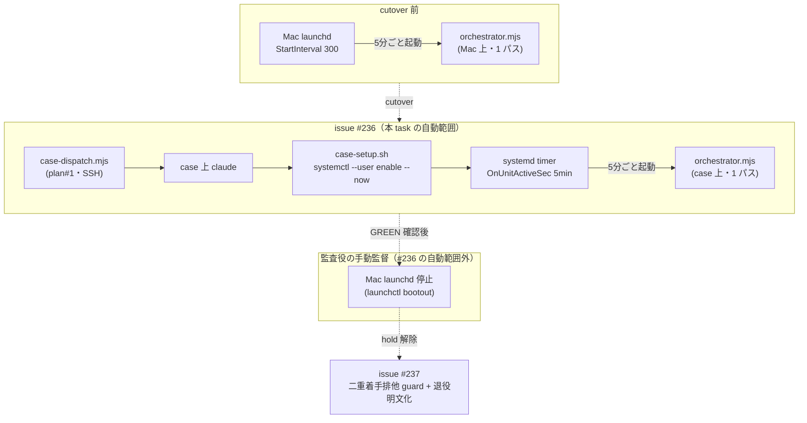
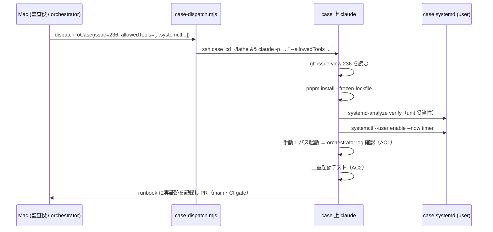

# issue #236 解説 — case 側 orchestrator 常駐の導入・自己検証（SSH 経由）

目次: [1. Background](#1-background) ／ [2. Intuition](#2-intuition) ／ [3. Code](#3-code) ／ [4. Quiz](#4-quiz)

この教材の対象は GitHub issue #236 の **plan（issue #236 の PdM plan comment、`VERDICT: PLAN_READY`）** である。diff ではない。まだ実行されていない設置作業の計画そのものを、その計画が触る既存機械（orchestrator 本体・SSH task 受け渡し機構・systemd unit・install script・終端契約）に接地して読む。この教材の仕事は「この plan が既存のどの機械を、どこに、どう設置するのか」を実コードと実 unit ファイルを引用して具体化することであり、実行で確定する細部（実ログの中身・NixOS 分岐の実際の判定）は「本 task の成果物として作られる予定」または「未確認」と明記する。

> [!IMPORTANT]
> 本 plan の deliverable である runbook `design/runbooks/case-orchestrator-residency.md` は 2026-07-08 時点で**まだ存在しない**。「未確認」ではなく、**本 task の成果物として新規作成される予定**のファイルである。したがって本教材が示す runbook の必須セクション構成は plan の契約であり、実物ではない。

---

## 1. Background

前提知識をゼロと仮定して、issue #236 が触る系を組み立てる。触るのは lathe アプリ本体（`apps/web`）ではなく、**lathe 自身を開発する agent 体制を回す実行基盤**の側である。

### 1.1 orchestrator（配車）— 常駐 dispatch 本体

lathe は「1 つの task を人手ゼロで main へ届ける機械」（inner loop）を持つが、その inner loop を**いつ・どの task に対して起動するか**を決めて発車させるのが **orchestrator（配車）**である。実体は `scripts/orchestrator.mjs`。何をするか（ファイル冒頭コメントより）:

1. **derive**: GitHub の全状態（open issue・PR・Projects 盤面）を導出する。
2. **classify**: それらを 4 クラス（PLAN / IMPLEMENT / EXPLAIN / PR_REVIEW）＋待機に分類する。
3. **dispatch**: eligible な決定を並列（上限 5）で spawn する。
4. **盤面投影**: Projects の列（Approval / Escalated）を実状態へ同期する（非致命）。

決定的に重要な性質が **1 プロセス 1 パスで終わる**ことである。orchestrator は常駐ループを自分の中に持たない。1 回起動されると derive → classify → dispatch を 1 巡し、子を spawn したら**自身は即座に exit する**（fire-and-forget）。子の完走は待たない。「常駐」は orchestrator プロセスが居座ることではなく、**外部の cadence 装置が 5 分ごとに orchestrator を起動し直すこと**で実現する。この cadence 装置が macOS では launchd、Linux（case）では systemd timer である。

### 1.2 orchestrator が使う 3 つのファイル基盤

orchestrator が「二重 dispatch を防ぐ」ために使う、リポジトリ内の `.lathe/` 配下の 3 つの成果物を押さえておく。

- **`.lathe/orchestrator.lock`** — 「今 orchestrator が 1 パス走っている」ことを示すロックファイル。中身は JSON で `{ pid, startedAt }`。起動時に、既存 lock の `pid` が生きていれば二重起動せず exit 0、死んでいれば stale として take over する（**PID 排他**）。exit 時に自分の pid の lock だけを消す。これがあるので、5 分間隔の起動が前パスと重なっても 2 プロセスが同時に走らない。
- **`.lathe/runs/live-<CLASS>-<NUMBER>.json`（live マーカー）** — 「この issue／PR に対する子が今走っている」ことを示すマーカー。orchestrator が子を spawn する時に書き、子が exit する時に消す。名前は例えば `live-plan-236.json`。orchestrator は次パスの classify でこのマーカーを見て、走行中の task は skip する（worktree の有無に依存しない実行中判定）。
- **`.lathe/logs/orchestrator.log`** — 各パスの証跡（append）。パス冒頭に ISO timestamp を書き、lock 取得／解放・dispatch・DEFER・盤面投影の結果が残る。自己検証はこのログを読んで行う。

> [!NOTE]
> lock は「orchestrator プロセスの単一性」、live マーカーは「個別 task の子の走行中判定」を担う。層が違う。lock が 1 つ、live マーカーが task ごとに 0 個以上。

### 1.3 Mac launchd — 現行の cadence 装置

現在（cutover 前）、この 5 分 cadence は **Mac の launchd** が担っている。launchd は macOS の常駐サービス管理機構で、`StartInterval 300`（300 秒＝5 分間隔）で `orchestrator.mjs` を起動し直している。plist は `ops/launchd/com.lathe.orchestrator.plist`。issue #236 のゴールは、この cadence を **Mac launchd から case の systemd timer へ移す**こと（の前半＝case 側に常駐を立てること）である。Mac launchd の**停止**そのものは #236 の自動範囲外で、監査役の手動監督ステップとして cutover 手順に置かれる。

### 1.4 case — 常駐先の Linux マシン

**case** は LAN 上（192.168.11.14 / User cherie）の NixOS マシンで、orchestrator を 24 時間常駐させる先である。Mac は対話開発に使い、自律 loop は case に単一常駐させる、という役割分担（この分担の明文化と guard は後続の issue #237 の担当）。case は DHCP のため IP 可変・LAN 経路を使う、と runbook `design/runbooks/case-remote-tasks.md` が記録している。

### 1.5 plan#1 dispatch（`case-dispatch.mjs`）— SSH 越しの task 受け渡し

「case に常駐を設置する」作業を、Mac から手で scp/ssh するのではなく、**agent 経路の中で**やり切るための機構が plan#1 の `scripts/case-dispatch.mjs`（issue #231）である。役割は「Mac から case 上の Claude Code に task を渡し、case 側で完結させる 1 入口」。フローは:

```
Mac: case-dispatch.mjs --issue <n> --task-file <path>
     └─ ssh case 'cd <repoDir> && CLAUDE_CODE_OAUTH_TOKEN=... claude -p "<task>" --allowedTools ...'
                              └─ case 上の claude が gh issue view #n を読み実装
```

この機構の設計上の要点は、`dispatchToCase()` が **`allowedTools` を必須引数**（既定値なし・空配列不可）とすることである。呼び出し側が毎回、その task に必要な最小権限を明示する（権限の散逸を防ぐ）。#236 の dispatch は systemd 操作を含む task なので、既定セットに無い `Bash(systemctl:*)` などを明示的に渡す必要がある（後述 §3.1）。

### 1.6 systemd timer / service — case 側の cadence 装置（plan#4＝#234 の成果物）

case で launchd の代わりを務めるのが systemd user unit のペアで、これは先行 task plan#4（issue #234）で **authoring 済み・未設置**である。

- **`ops/systemd/lathe-orchestrator.service`** — 何をするか: `orchestrator.mjs --max 5` を 1 回だけ起動する。`Type=oneshot`（service が exit するまで次の timer 発火が pending になる＝並列起動不可）。node の絶対パス・repo root・PATH・log 出力先は `{{PLACEHOLDER}}` で、install script が case 上で解決して置換する。
- **`ops/systemd/lathe-orchestrator.timer`** — 何をするか: 上の service を 5 分間隔で発火する（`OnUnitActiveSec=5min`＝前 service 完了から 5 分後、launchd `StartInterval 300` の等価）。

つまり **launchd の `StartInterval 300` と同じ意味論**を、Type=oneshot service ＋ timer の 2 ファイルで表現している。

### 1.7 `case-setup.sh` — 冪等 install script（plan#4 の成果物）

`ops/install/case-setup.sh` は上の 2 unit を case の `~/.config/systemd/user/` へ設置する install script。何をするか:

1. `{{NODE_BIN}}`（nix store の node 絶対パス）・`{{REPO_ROOT}}`・`{{LOG_DIR}}`・`{{LOGIN_PATH}}`（login-shell PATH）を case 上で解決して placeholder を置換。
2. `systemctl --user daemon-reload`。
3. `systemctl --user enable --now lathe-orchestrator.timer`（＝ enable かつ即時 start。enable は冪等）。

冪等（2 回実行しても差分が出ない）に作られている。`--check` を付けると設置せず現状だけ表示する。

### 1.8 `--settings` pin（#224）— inner spawn の設定固定

orchestrator が子（inner-loop）を spawn する時、その argv に `--settings <REPO_ROOT>/.claude/settings.json` が乗る。これは issue #224 で着地した「inner claude の設定を repo 内の 1 ファイルに pin する」配線で、実体は `scripts/inner-loop-core.mjs` の `INNER_SETTINGS_PATH` 定数。#236 の自己検証の一項（AC3）は「常駐後もこの `--settings` が起動ログに乗っていること」の確認である。#224 は D3 で着地済み＝実効ブロッカー無し。

> [!NOTE]
> 「#224」「#236」「#237」は ADR 番号ではなく **issue 番号**である。`--settings` pin の意思決定は独立の ADR ファイルにはなく、コード（`INNER_SETTINGS_PATH`）と issue #224 に接地する。

### 1.9 loops.md の終端契約 — 「1 パス完了が終端・escalation は breaker に数えない」

`design/loops.md` は全 loop の統治文書で、各 loop の「唯一の終端」を定める。orchestrator の終端は **全子 spawn 完了**（子ライフサイクルは `dispatch-runner.mjs` に委譲・cross-pass breaker は `outcomes.jsonl` ledger で管理）。この「1 パス完了が終端」という契約は、常駐先が Mac launchd であろうと case systemd であろうと**不変**でなければならない。#236 の契約セクションは「常駐後もこの終端契約を保持する」ことを検証項目に含む。

あわせて circuit breaker の意味論も不変契約である。連続 failure が上限に達すると dispatch を止める（open）が、**escalation は故障に数えない**（`applyBreaker` が escalation でカウント不変・open もしない）。裁定待ちを故障扱いして系を止めない、という設計判断である。

### 1.10 issue #237 との関係と hold の経緯

issue #237 は「Mac 併用時の二重着手排他（case 単一常駐の明文化＋guard＋Mac launchd 退役 cutover）」で、#236 の**後続**（`blocked-by #236`）。監査役は #236 の plan 確定後、いったん **hold** を掛けた。理由: 確定 plan の `systemctl --user enable --now` は #237（二重着手排他 guard）が未着地の状態で case 常駐を ON にするため、**Mac launchd と case の二重 dispatch 窓が開く**懸念。plan 確定済みのため scope 追記はせず、朝に PdM 報告のうえ**監督下で #236→#237 を連続実施**する方針を取った。翌朝 PdM GO で hold 解除され、cutover 監督が開始した。

---

## 2. Intuition

核心の直感は「**プロセスの常駐 ≠ ループの常駐**。orchestrator は 1 パスで死ぬ関数であり、常駐性は外部の cadence 装置（launchd → systemd timer）が繰り返し起動し直すことで生む」である。#236 はその cadence 装置の実体を Mac から case へ移す最初の一歩を、**手作業でなく plan#1 の SSH task 経路で**やり切る。

### 2.1 常駐の実体（toy な時系列）

case で timer が有効になったあとの、架空だが実形式のログ抜粋（`.lathe/logs/orchestrator.log`）を before/after で示す。

**1 パス目（04:00 発火・dispatch あり）**:

```text
[orchestrator] === pass 2026-07-08T04:00:03Z ===
[orchestrator] self-update: synced with origin/main
[orchestrator] DISPATCH PLAN issue #240
[orchestrator] pass complete: dispatched=1 deferred=0 projected=0
```

このパスの spawn 時に live マーカーが 1 つ生まれる:

```json
{ "pid": 48213, "kind": "issue", "number": 240 }
```

ファイル名は `live-plan-240.json`。lock ファイルはこのパスの間だけ存在する:

```json
{ "pid": 48201, "startedAt": "2026-07-08T04:00:03.220Z" }
```

パス末尾で orchestrator（pid 48201）が exit し、`releaseLock()` が自分の pid の lock を消す。子（pid 48213）はまだ走っており、live マーカーは残る。

**2 パス目（04:05 発火・走行中を skip）**:

```text
[orchestrator] === pass 2026-07-08T04:05:04Z ===
[orchestrator] self-update: synced with origin/main
[orchestrator] pass complete: dispatched=0 deferred=0 projected=0
```

issue #240 は live マーカー `live-plan-240.json`（pid 48213 生存）で走行中と判定され dispatch されない。子が exit するとマーカーが消え、次以降のパスで再評価される。

### 2.2 二重起動の lock 排他（AC2）

2 プロセスをほぼ同時に起動したときの挙動。1 個目が lock を取り、2 個目は生存 lock を検出して即 exit する。

**プロセス A（先着）**: lock 不在 → 取得 → 1 パス実行。

**プロセス B（後着・A の走行中）**:

```text
[orchestrator] === pass 2026-07-08T04:00:04Z ===
[orchestrator] another orchestrator is running (pid=48201) — exiting (1 プロセス 1 パス)
```

B は `process.exit(0)`。B は self-update も dispatch もしない。これが AC2 の期待挙動である。

### 2.3 cutover 全体の関係図

#236 がどこを担い、Mac launchd 停止と #237 がどこにあるかを図で示す。



### 2.4 dispatch の指揮系統（SSH 越し設置）

#236 の設置作業が「Mac の監査役 → case の claude → case 上の設置コマンド」と一方向に流れる様子。



### 2.5 escalation の実際（この plan で観測された脱線）

issue #236 のスレッドには、plan 確定後に driver が dispatch を試みて escalation を投函した記録がある（stage TASK_PLAN・verdict UNPARSABLE）。result excerpt は:

```text
Not logged in · Please run /login
```

これは case 上の claude 認証（oauth-token）に関する詰まりを示す escalation であり、§1.9 の契約通り**故障（breaker）に数えず**裁定待ちとして扱われる例である。plan の前提「認証（claude/gh）は plan#3 recon 済み前提」に対する実地の詰まりが、この escalation として現れている（実解決の詳細は未確認）。

---

## 3. Code

plan/設計文書と接地コードを、理解できる順にグループ化して引用する。ファイル順ではない。

### 3.1 dispatch の allowedTools（plan 契約 (a)・deliverable）

plan の契約セクションは、#236 dispatch が渡す `allowedTools` を明示指定する。既定セットは systemd 操作を含まないため、systemctl / systemd-analyze / journalctl を足す。plan の該当ブロック（issue #236 plan comment §4(a)）:

```text
Read, Grep, Glob, Write, Edit,
Bash(git:*), Bash(gh:*), Bash(node:*), Bash(pnpm:*),
Bash(bash:*),            # ops/install/case-setup.sh 実行
Bash(systemctl:*),       # --user enable/status/is-enabled
Bash(systemd-analyze:*), # verify
Bash(journalctl:*)       # unit ログ確認（検証用）
```

なぜ「明示」が要るか。`case-dispatch.mjs` の `buildRemoteCmd` は `allowedTools` を必須・非空にしており、欠落・空だと throw する:

```js
export function buildRemoteCmd(opts) {
  const { issue, taskPrompt, allowedTools, repoDir } = opts;

  if (!Array.isArray(allowedTools) || allowedTools.length === 0) {
    throw new Error(
      'allowedTools is required and must be non-empty. ' +
      'Provide the minimum tool set explicitly to prevent permission sprawl.'
    );
  }
  // ...
}
```

CLI 経由の既定（`DEFAULT_ALLOWED_TOOLS`）には systemd 系が無い:

```js
export const DEFAULT_ALLOWED_TOOLS = [
  'Read', 'Grep', 'Glob',
  'Write', 'Edit',
  'Bash(git:*)', 'Bash(gh:*)', 'Bash(node:*)', 'Bash(pnpm:*)',
];
```

test（`case-dispatch.test.mjs`）が「空・undefined・null は throw」「`--allowedTools` が argv に必ず乗る」を assert しており、この必須性は機械で担保されている。したがって #236 は既定に頼れず、systemd 系を含む集合を呼び出し側から渡す。これが plan の変更不可契約 (a) である。

### 3.2 設置（case-setup.sh の enable --now・既定 (ii)）

plan の方針は「既定 (ii)＝`systemctl --user enable --now`」で常駐を立て、install は既存の冪等 install script を使う。該当は `ops/install/case-setup.sh` の末尾:

```bash
log "systemd user daemon をリロード..."
systemctl --user daemon-reload

log "timer を enable..."
# 冪等: enable --now は既に enabled でも安全（enable は冪等）
systemctl --user enable --now "${UNIT_TIMER}"
```

`{{PLACEHOLDER}}` は case 上でこの script が解決する。node は NixOS の PATH に無いため `nix path-info` で store パスを引く（hash は rebuild で変わるので直書きしない）:

```bash
resolve_node() {
  local node_bin
  if node_bin=$(command -v node 2>/dev/null) && [[ -x "$node_bin" ]]; then
    echo "$node_bin"; return 0
  fi
  local store
  store=$(nix path-info nixpkgs#nodejs 2>/dev/null) \
    || store=$(nix path-info nixpkgs#nodejs_24 2>/dev/null) \
    || die "node の nix store パスを解決できませんでした。..."
  node_bin="${store}/bin/node"
  # ...
}
```

### 3.3 ESCALATE 分岐（NixOS 宣言方式 (i)）

plan は唯一の分岐を契約に明記する。既定は (ii)＝`enable --now`（命令的）だが、case が NixOS で user unit の enable に**宣言方式 (i)**（nix-config での宣言）を必須とすると判明したら、nix-config は**別 repo**のため実装せず ESCALATE する。plan §3 の該当:

```text
ESCALATE 分岐: 既定 (ii)＝systemctl --user enable --now。
case が NixOS で user unit enable に宣言方式 (i) を必須とすると判明したら、
nix-config は別 repo のため実装せず ESCALATE。
```

これは「この task の worktree の外（別 repo）に手を出す必要が出たら止まる」という境界宣言である。

### 3.4 unit 妥当性（service の Type=oneshot と ExecStart 絶対パス）

自己検証 AC4 は `systemd-analyze verify` の pass と timer の `enabled` 確認である。検証対象の service の要点（`ops/systemd/lathe-orchestrator.service`）:

```ini
[Service]
Type=oneshot

# {{NODE_BIN}} と {{REPO_ROOT}} は case-setup.sh が解決して置換
ExecStart={{NODE_BIN}} {{REPO_ROOT}}/scripts/orchestrator.mjs --max 5

WorkingDirectory={{REPO_ROOT}}
Environment=PATH={{LOGIN_PATH}}
StandardOutput=append:{{LOG_DIR}}/orchestrator.log
StandardError=append:{{LOG_DIR}}/orchestrator.log
```

`Type=oneshot` は「1 パスで終わる orchestrator」に対応し、service が exit するまで次の timer 発火が pending になる（並列起動不可）。`ExecStart` が**絶対パス**なのは、`orchestrator.mjs` が `fileURLToPath(import.meta.url) === argv[1]` で `isMain` を判定するため（相対パスだと main が走らない）。timer 側は launchd `StartInterval 300` の等価:

```ini
[Timer]
OnActiveSec=5min       # 有効化から 5 分後に初回（起動直後は走らせない）
OnUnitActiveSec=5min   # service 完了から 5 分後に再発火（= 実質 5 分間隔）
Unit=lathe-orchestrator.service

[Install]
WantedBy=timers.target
```

### 3.5 自己検証 AC1 / AC2 が確認する orchestrator の実装

AC1（1 パス GREEN・live マーカー生成→削除・lock 取得/解放がログに残る）と AC2（二重起動で 2 個目が lock で exit）は、`scripts/orchestrator.mjs` の既存挙動を case 実機で確認するものである。lock 取得の中核:

```js
export function decideLockAction(existing, isAlive) {
  if (!existing) return { action: 'acquire' };
  const pid = existing.pid;
  if (Number.isInteger(pid) && pid > 0 && isAlive(pid)) return { action: 'exit', pid };
  return { action: 'takeover', stalePid: Number.isInteger(pid) ? pid : null };
}
```

2 個目が生存 lock を見て exit する CLI 側の分岐（AC2 が確認するログ行の出所）:

```js
const lock = acquireLock();
if (!lock.ok) {
  log(`another orchestrator is running (pid=${lock.pid}) — exiting (1 プロセス 1 パス)`);
  process.exit(0);
}
```

lock の中身が `{ pid, startedAt }` であること、exit で自分の pid の lock だけ消すこと:

```js
writeFileSync(LOCK_PATH, `${JSON.stringify({ pid: process.pid, startedAt: new Date().toISOString() })}\n`, 'utf8');
// ...
function releaseLock() {
  const current = readJsonOrNull(LOCK_PATH);
  if (current?.pid === process.pid) rmSync(LOCK_PATH, { force: true });
}
```

live マーカーの名前規則（AC1 が「live-*.json 生成→削除」を確認する対象）:

```js
export function liveMarkerName(cls, number) {
  return `live-${CLASS_SLUGS[cls] ?? 'unknown'}-${number}.json`;
}
```

### 3.6 AC3 が確認する #224 の `--settings` 配線

AC3 は inner spawn の起動ログに `--settings …/.claude/settings.json` が乗ることの確認。pin の定義（`scripts/inner-loop-core.mjs`）:

```js
export const INNER_SETTINGS_PATH = join(REPO_ROOT, '.claude', 'settings.json'); // inner claude --settings pin (plan §2A)
```

同じ定数が EXPLAIN dispatch の argv にも乗る（`orchestrator.mjs` の `buildDispatchSpec`）:

```js
case CLASS_EXPLAIN:
  return {
    command: 'claude',
    args: ['-p', buildExplainPrompt(decision.number), '--settings', INNER_SETTINGS_PATH, '--allowedTools', ...EXPLAIN_ALLOWED_TOOLS],
    logKey: `explain-${decision.number}`,
  };
```

### 3.7 不変契約 (c)：終端契約と breaker（検証で確認のみ）

plan の契約 (c) は「常駐後も loops.md の終端契約と breaker 意味論を保持する（変更しない・確認のみ）」。breaker の実装が escalation を故障に数えない箇所:

```js
export function applyBreaker(state, outcome, maxFailures) {
  if (outcome === OUTCOME_ESCALATION) return { ...state };  // escalation は数えない
  if (outcome === OUTCOME_SUCCESS) return { consecutiveFailures: 0, open: state.open };
  const consecutiveFailures = state.consecutiveFailures + 1;
  const open = state.open || (maxFailures > 0 && consecutiveFailures >= maxFailures);
  return { consecutiveFailures, open };
}
```

§2.5 の escalation（`Not logged in`）がこの契約に該当し、breaker を進めない。

### 3.8 runbook（deliverable (b)・新規作成予定）

plan の契約 (b) は runbook `design/runbooks/case-orchestrator-residency.md` の**新規作成**。このファイルは 2026-07-08 時点で存在せず、本 task の成果物として作られる。plan が要求する必須セクション:

```text
① 前提（case SSH/gh/claude 認証・repo path、case-remote-tasks.md 参照）
② 設置手順
③ 自己検証（1 パス・二重起動）
④ 実証跡（実ログ抜粋）
⑤ ESCALATE 分岐
⑥ トラブルシュート
```

runbook は AC1–AC4 の実証跡（case 実機の実ログ抜粋）を添えて PR で main へ着地させる（AC5）。CI の `gate`（`pnpm preflight` の該当 tier）が GREEN であることが merge 条件。

> [!WARNING]
> Mac launchd の停止は runbook の手順に含めるが、**#236 の自動実行範囲ではない**。監査役が case 常駐 enable の時点で手で `launchctl bootout` する監督ステップ（二重 dispatch 窓の最小化）。自動化すると不可逆寄りの外向き操作が無監督で走るため、あえて手動に置いている。

---

## 4. Quiz

中難度 5 問。各問、選択肢を読んで答えを選んでから `<details>` を開いて確認する。

### Q1. orchestrator の「常駐」の実体として最も正確なのはどれか。

- a. orchestrator.mjs が無限ループを持ち、プロセスが起動しっぱなしで居座る
- b. orchestrator.mjs は 1 パスで exit する関数であり、外部の cadence 装置（launchd / systemd timer）が 5 分ごとに起動し直すことで常駐性を生む
- c. orchestrator.mjs 自身が 5 分の sleep を挟んで再帰的に自分を spawn し続ける
- d. systemd timer が orchestrator の内部ループに 5 分ごとに割り込んで pass を刻む

<details><summary>答えと解説</summary>

**b**

orchestrator は fire-and-forget の 1 パス shell で、子を spawn したら即 exit する（ファイル冒頭コメント「常駐しない」）。常駐性はプロセスの居座りではなく、Mac では launchd の `StartInterval 300`、case では systemd timer の `OnUnitActiveSec=5min` が繰り返し起動し直すことで実現する。#236 はこの cadence 装置を Mac launchd から case systemd へ移す前半である。

</details>

### Q2. #236 が case へ設置作業を渡すのに、Mac から手で scp/ssh せず plan#1 の `case-dispatch.mjs` を使う理由として plan が挙げているのはどれか。

- a. scp より SSH task の方が転送が速いから
- b. case の systemd がリモート install を SSH task 経由でしか受け付けない仕様だから
- c. 手動 scp/ssh は PdM 裁定（SSH task 方式）に反し、手順が agent 経路の外に漏れて再現不能になるため（証跡が case のログに残る option B を採用）
- d. Mac に systemctl が無く case-dispatch.mjs だけが systemd を操作できるから

<details><summary>答えと解説</summary>

**c**

plan §2 は (A) Mac からの手動 scp/ssh を「PdM 裁定（SSH task 方式）に反し、手順が agent 経路の外に漏れ再現不能」として却下し、(B) `dispatchToCase` で case 側 claude に task を渡し設置・検証・runbook 記録まで case 上で完結する案を採用する。理由は速度や仕様上の制約ではなく、SSH task 方式への一致と証跡の残存である。

</details>

### Q3. `case-dispatch.mjs` の `dispatchToCase` に `allowedTools` を空・未指定で渡すとどうなるか。また #236 dispatch が既定セットをそのまま使えないのはなぜか。

- a. 空なら全 tool 許可にフォールバックし、#236 は既定のままで systemd を操作できる
- b. 空でも警告だけ出して継続し、#236 は既定に systemd が含まれるので問題ない
- c. 空なら空のまま dispatch され、#236 は runbook 側で権限を補う
- d. `buildRemoteCmd` が throw する（allowedTools は必須・非空）。既定セット（DEFAULT_ALLOWED_TOOLS）に systemctl / systemd-analyze / journalctl が無いため、#236 はそれらを明示的に渡す必要がある

<details><summary>答えと解説</summary>

**d**

`buildRemoteCmd` は `allowedTools` が配列でない／空だと `allowedTools is required and must be non-empty` を throw する（test で担保）。`DEFAULT_ALLOWED_TOOLS` は `Read, Grep, Glob, Write, Edit, Bash(git:*), Bash(gh:*), Bash(node:*), Bash(pnpm:*)` で systemd 系を含まないため、plan の契約 (a) は #236 dispatch に `Bash(systemctl:*)` `Bash(systemd-analyze:*)` `Bash(journalctl:*)` `Bash(bash:*)` を明示的に足した集合を渡す。

</details>

### Q4. AC2（二重起動排他）が確認する挙動として正しいのはどれか。

- a. 2 プロセス同時起動時、2 個目は 1 個目の生存 lock（pid）を検出して `process.exit(0)` し、self-update も dispatch もしない
- b. 2 プロセス同時起動時、両方が lock を共有し交互に pass を刻む
- c. 2 個目は 1 個目を kill して lock を奪い、自分が pass を走らせる
- d. 2 個目は 5 分待ってから再試行し、その間 timer 発火をキューに積む

<details><summary>答えと解説</summary>

**a**

`decideLockAction` は既存 lock の pid が生存していれば `{ action: 'exit' }` を返し、CLI は `another orchestrator is running (pid=…) — exiting (1 プロセス 1 パス)` をログして `process.exit(0)` する。2 個目は self-update も dispatch もしない。既存プロセスを kill したり奪ったりはしない（stale＝pid 死の場合のみ take over する）。

</details>

### Q5. loops.md の終端契約と breaker について、#236 が「常駐後も保持する（変更しない）」とする不変契約はどれか。

- a. orchestrator の終端を「全子の完走を待つ」に変え、breaker は escalation も故障に数える
- b. orchestrator の終端は「全子 spawn 完了（1 パス完了）」であり、circuit breaker は escalation を故障に数えない（カウント不変・open もしない）
- c. 常駐先が case になったので終端は「timer の次発火まで」に変わる
- d. breaker は maxFailures を無視し、escalation が出たら即 dispatch を止める

<details><summary>答えと解説</summary>

**b**

loops.md は orchestrator の終端を「全子 spawn 完了」と定め、`applyBreaker` は escalation を受け取ると state を変えず（故障に数えず open もしない）、success でリセット・failure で加算する。#236 の契約 (c) はこの終端契約と breaker 意味論を常駐後も**保持する（確認のみ・変更しない）**とする。スレッドの `Not logged in` escalation がこの「故障に数えない」対象の実例である。

</details>
