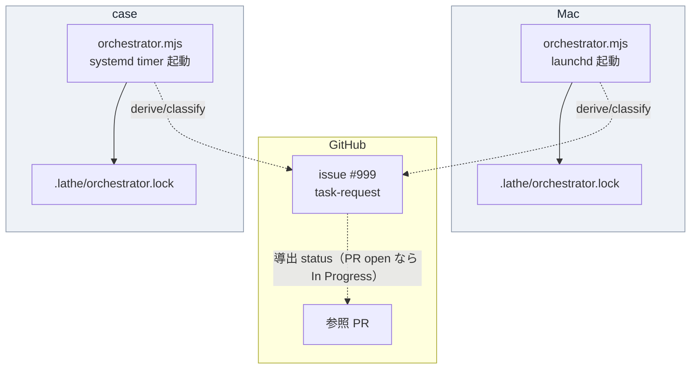
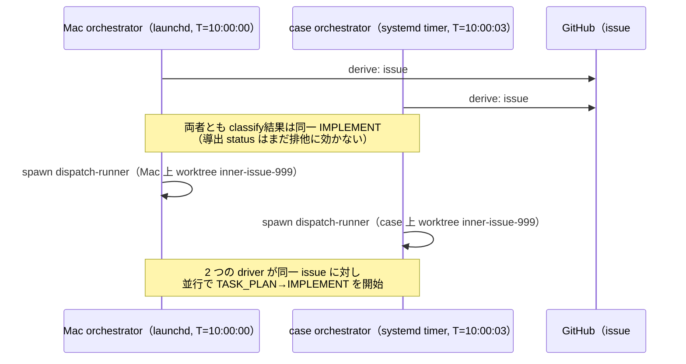
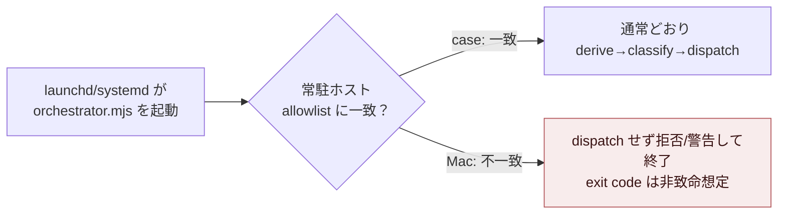

# Mac 併用時の二重着手排他 — case 単一常駐 guard と Mac launchd 退役 cutover（issue #237）

対象: [issue #237](https://github.com/yutaro0915/lathe/issues/237)（OPEN・label: `task-request` / `needs-review` / `escalation`）。
本教材の作成時点（2026-07-08）で本 issue は未実装。したがって以下は「これから何を変更しようとしているか」の plan の解説であり、実装済み diff の解説ではない。

## 1. Background

### 1.1 orchestrator とは何か

`scripts/orchestrator.mjs` は lathe の自律実行系の配車役である。1 回の起動（1 パス）で次を行う。

1. **derive**（`orchestrator-derive.mjs`）: GitHub（issue・PR・label・Projects）から現在状態を導出する。lathe は状態を repo 内ファイルに保存せず、GitHub 自体を正本として毎回読み直す（ADR 0031）。
2. **classify**（`orchestrator-classify.mjs`）: 導出した状態を、issue ごとに「今何をすべきか」の決定（`PLAN` / `EXPLAIN` / `IMPLEMENT` / `PR_REVIEW` のいずれかの dispatch、または `WAIT_*` / `SKIP_*` の待機・対象外）に変換する。
3. **dispatch**: 決定が dispatch クラスなら、対応する既存コマンド（`inner-loop.mjs`・`review-engine.mjs`・`claude -p`）を fire-and-forget で spawn する。spawn した時点でこのパスは完了とみなし、子の完走を待たない。
4. **盤面投影**: GitHub Projects の Approval / Escalated 列へ、決定に応じた状態を書き戻す（失敗しても非致命）。

orchestrator は常駐プロセスではない。「1 パス＝1 プロセスの起動→終了」であり、5 分間隔で外部の cadence 機構（macOS では launchd、case では systemd timer）が繰り返し起動する。この設計は `design/loops.md` の loop 一覧表に明記されている。

### 1.2 inner loop と outer loop

`AGENTS.md` の定義では、**outer loop**（監督役）が監視・issue 化・rubric 管理・escalation 対応を担い、**inner loop**（named agent）が task ごとの実装を自律完走して PR＋CI で main に着地させる。orchestrator が spawn する `inner-loop.mjs` がこの inner loop の駆動役であり、1 つの issue に対して TASK_PLAN → PLAN_REVIEW → IMPLEMENT → LAND（PR 作成）→ review 周回、を 1 プロセス内で進める。

### 1.3 lock と live マーカー

orchestrator は 2 種類のローカルファイルで「今このマシンで何が走っているか」を判定する。

- **lock**（`.lathe/orchestrator.lock`）: orchestrator プロセス自身の排他。JSON に `{pid, startedAt}` を書き、既存 lock の PID が生存していれば新規パスは即座に `exit 0`（`decideLockAction` / `acquireLock`、`scripts/orchestrator.mjs` 92–125 行）。PID が死んでいる（stale）場合は take over する。
- **live マーカー**（`.lathe/runs/live-<class>-<number>.json`）: dispatch した子（driver・explain runner 等）が「自分は今この issue/PR を処理中」と書き、完走時に消す。orchestrator は次パスの冒頭でこのマーカー集合と worktree 一覧を union して「実行中」判定に使う（`deriveRunningTargets`、137–183 行）。worktree を持たない `plan-task` 実行（worktree を作らない）を見逃して二重 dispatch する実害が過去に確認されたため、live マーカーが主でworktree 検出は補助という位置づけになっている。

いずれも **そのマシンのローカル filesystem 上のファイル**である。他マシンの orchestrator からは見えない。

### 1.4 導出 status（ADR 0031 §2）

lathe は issue の進捗状態を保存せず、GitHub の実データから毎回導出する。

- open issue（`task-request` label）= To Do
- **その issue を参照する PR が open = In Progress**
- PR merge による issue close = Done

`orchestrator-classify.mjs` の `classifyIssue` はこの導出 status を判定順の一部に使っており、`inProgressIssueNumbers`（参照 PR が open）に含まれる issue は `WAIT_PR` として dispatch しない（99–108 行）。これは **どのマシンで PR を検出しても同じ結論になる**という性質上、cross-machine でも自然に効く排他になる。ただし「spawn してから PR が実際に作られるまでの間」は PR がまだ存在しないため、この排他は効かない（後述 2.3）。

### 1.5 hold / escalation label（ADR 0037・ADR 0030 追記 E）

`hold` label が付いた issue は `WAIT_HOLD` として dispatch を止める（故障 breaker には数えない）。PdM が「依存は解決しているが今は動かしたくない」場合に使う明示的な一時停止手段である。`escalation` label は「機械が停止し PdM の意思決定を要求している」印で、`WAIT_ESCALATION` として dispatch を止める。issue #237 自身にもこの 2 つの label 運用が実際に使われている（1.7 節）。

### 1.6 case と Mac の役割・launchd と systemd

- **Mac**: PdM のローカル開発機。`ops/launchd/com.lathe.orchestrator.plist` が macOS の launchd（Apple の cron 的常駐実行の仕組み）を通じて `node scripts/orchestrator.mjs --max 5` を 300 秒間隔（`StartInterval`）で起動していた。
- **case**: PdM 宅内の NixOS サーバー。issue #171（「実行基盤の自宅サーバー集約」、CLOSED）の PdM 構想を受け、issue #236（「case 側 orchestrator 常駐の導入・自己検証」、CLOSED、2026-07-08 完了）で `~/lathe` 上に `lathe-orchestrator.timer`（systemd user timer、`OnUnitActiveSec=5min`、`Type=oneshot`）が導入・自己検証済みである。`design/runbooks/case-orchestrator-residency.md` にその導入記録がある。

case への移設が必要になった背景は issue #171 の PdM 構想（2026-07-07）にある。「ローカルマシン依存だとマシンが閉じている間に系が止まる」問題への対処として、実行を常時稼働の case に集約する。

### 1.7 issue #237 に至る経緯

issue #171 は plan-task として分解され、9 件の子 issue（`plan#1`〜`plan#9`）を産んだ。issue #237 は `plan#7` に相当し、body 冒頭の `Blocked-by: plan#6`（= issue #236）が示すとおり、case 常駐の自己検証（#236）完了を前提条件とする。

分解時点（issue #171 の plan-task comment）では、この子 issue の採用方針は PdM 裁定待ちの `ASK_PDM D2` として残されていた。

> **D2（排他モデル）**: (A) 自律 orchestrator は case 単一常駐（推奨）／(B) cross-machine 分散 lock（却下寄り）

issue #237 の本文には、この D2 が **(A) で確定した**と明記されている。

> **採用は D2＝(A) case 単一常駐で確定**。加えて cutover で **Mac launchd 退役**が必要（D2 明示要求）。

さらに issue #237 の comment 履歴からは、実装着手前の運用判断も読み取れる。

- 監査役の hold comment（2026-07-08 未明）: 「cutover（Mac launchd 退役）は一方向の切替のため、PdM への検証報告後に実施する」として、#236 の GREEN 確認までは本 issue の cutover 部分を保留。
- hold 解除 comment: #236（case 常駐）の稼働確認後、「Mac launchd は 2026-07-08T03:25Z 頃に監査役が bootout 済み（plist 残置・正式退役と排他 guard は本 issue の実装で完遂すること）」と記録されている。つまり **launchd の実行自体は既に手動で止められているが、plist ファイルの正式な退役処理と hostname guard の実装はまだ本 issue のスコープとして残っている**。
- escalation label は上記とは別の理由で付いている: 本 issue の TASK_PLAN 段が case 側の claude 認証エラー（`Not logged in · Please run /login`）で `UNPARSABLE` 終端したため、`orchestrator-classify.mjs` の escalation 分岐（環境要因）に落ちた記録が issue に残っている。これは D2 の設計判断とは無関係の、実行環境側の障害である。

> [!NOTE]
> 上記の bootout（`launchctl bootout`）は監査役が手動で行った運用操作であり、issue #237 が要求する「plist を退役状態にする」「runbook に手順と復帰方法を残す」という repo 側の成果物はまだ存在しない。`ops/launchd/com.lathe.orchestrator.plist` は本教材作成時点で変更されておらず、通常稼働時の内容のままである（2 節・3 節で現物を確認する）。

## 2. Intuition

### 2.1 二重 spawn がなぜ起こりうるか

lock・live マーカーはホストごとのローカル filesystem 上にある。Mac の orchestrator は `/Users/cherie/LLMWiki/projects/lathe/.lathe/orchestrator.lock` を見るが、case の orchestrator は `/home/cherie/lathe/.lathe/orchestrator.lock` を見る。**両者は別ファイルであり、互いの存在を知らない**。

architecture 全体像:



lock はホスト内の同時起動を防ぐが、**ホスト間の同時起動は防がない**。導出 status（1.4 節）は「PR が既に存在する」場合にのみ効く。issue に対する最初の spawn（＝まだ PR がない段階）は、Mac と case のどちらの orchestrator も「これは無印の未着手 issue だ」と同じ結論に達し得る。

### 2.2 具体例: 同一 issue の二重 IMPLEMENT

架空の issue #999（`task-request` label のみ、`needs-review` なし）で考える。



この 2 つの driver は、それぞれ別の worktree・別のブランチ名（同名になる可能性もある）で並行に実装を進め、最終的に 2 本の重複 PR、あるいは片方が push に失敗して壊れた状態を残す。design/loops.md 冒頭のコメントが指す「a11y chip と T2 修正が main で交錯」事故（AGENTS.md の worktree 規律の背景）と同型の、単一 writer 原則違反である。

### 2.3 guard が防ぐ範囲・防がない範囲

issue #237 の方針は「Mac では自律 orchestrator を起動させない」guard を `orchestrator.mjs` に追加することである。効果はこう変わる。



guard は「Mac 上で自律的に spawn すること」自体を止める。一方で、次の 2 点は guard の範囲外のまま残る（issue #237 の「契約」節が明記する不変事項でもある）。

- **spawn〜PR 生成の race window**: case の orchestrator が issue を spawn してから、driver が実際に PR を作成するまでの間（TASK_PLAN・IMPLEMENT の実行時間）は、導出 status がまだ「In Progress」を返さない。この間に**同一 case 上で** 2 パス目が走れば、lock（ホスト内排他）が防ぐ。しかし guard も lock も「別ホストからの同一 issue への手動 driver 起動」までは防がない設計であり、issue #237 は「残る race window は runbook に明記する」ことを求めている（guard で解消しきるとは書かれていない）。
- **Mac 側の対話開発**: guard は「自律 orchestrator の起動」だけを止める。Mac で PdM や監査役が手動で `inner-loop.mjs` や `claude` を対話的に動かすこと自体は禁止しない（design/loops.md への追記文言も「Mac は対話開発のみ・inner loop に Mac は介入しない」であり、対話開発そのものは許容している）。その場合の二重着手回避は、Mac 側の開発が PR/branch を作った時点で case 側の導出 status（In Progress 判定）が効く、という従来の仕組みに委ねられる。

> [!NOTE]
> race window の残存は issue #237 の「契約」節が明示する既知の限界であり、本教材作成時点でも解消手段は runbook 記載予定という段階（未実装）である。「guard を入れれば race window も消える」という理解は誤り。

## 3. Code

### 3.1 現状: lock・live マーカーはあるが、常駐ホスト guard は無い

`scripts/orchestrator.mjs` の `isMain` エントリポイントは、lock 取得の直後に self-update・derive・classify・dispatch へ進む。ホスト名を見て起動可否を分岐する箇所は存在しない。

```js
// scripts/orchestrator.mjs 420-436 行（実在コード）
  let locked = false;
  if (!parsed.dryRun) {
    const lock = acquireLock();
    if (!lock.ok) {
      log(`another orchestrator is running (pid=${lock.pid}) — exiting (1 プロセス 1 パス)`);
      process.exit(0);
    }
    locked = true;
    process.on('exit', releaseLock);
  }

  try {
    if (!parsed.dryRun) { // ⓪ self-update（ff-only・非致命・次パスから有効・dry-run では副作用ゼロのため skip）
      const s = syncMainFfOnly();
      if (s.status === 'synced') log('self-update: synced with origin/main');
      else log(`warning: self-update skipped (${s.status}): ${s.detail ?? ''}`);
    }
    // ① derive（保存しない）
```

`node scripts/inner-loop-backends.mjs` と `review-engine.mjs` を含む `scripts/` 全体を検索しても、`hostname` や `HOSTNAME` を扱うコードは無い（本教材作成時点、`grep -rn hostname scripts/` は該当なし）。issue #237 が要求する「非常駐ホストでの自律起動を拒否/警告する guard」は、この `acquireLock()` 呼び出しの前後に新規に挿入される想定になる（挿入位置・実装形はまだ確定していない — 環境変数か hostname allowlist か、というレベルまでしか issue 本文は指定していない）。

issue #237 の方針節（issue body、実在テキストの引用）:

> 2. `orchestrator.mjs` に常駐ホスト判別 guard（環境変数/hostname allowlist）を追加し、非常駐ホスト（Mac）での自律起動を拒否/警告する。

この文はまだ実装を指す diff ではなく、実装が満たすべき要件の記述である。契約節はこの guard について次の不変条件も定めている。

> 既存 lock/live マーカーの意味は不変（guard 追加のみ）。導出 status の定義（ADR 0031 §2）を変更しない。

つまり guard は `decideLockAction` / `deriveRunningTargets` / `classifyIssue` のロジックを書き換えるものではなく、それらの手前に新しい早期リターンを 1 つ追加するだけの変更として設計される想定である。

### 3.2 現状: design/loops.md はまだ「単一常駐」を明文化していない

`design/loops.md` の loop 一覧表・現行の orchestrator 行は次のとおりである。

```md
| **orchestrator（配車）** | launchd（5 分間隔）→ `scripts/orchestrator.mjs` | 常駐 cadence | ... |
```

「回す者」列は `launchd` とだけ書かれており、case の systemd timer や「Mac は対話開発のみ」という運用境界には触れていない。issue #237 の方針 1（issue body 引用）はこの文書を更新対象として名指ししている。

> 1. `design/loops.md` に「自律 orchestrator は case 単一常駐・Mac は対話開発のみ・inner loop に Mac は介入しない」を明記。

本教材作成時点でこの追記は行われていない（`design/loops.md` に `case` という語や `Mac は対話開発のみ` という文言は存在しない）。

### 3.3 現状: Mac launchd plist は稼働時のままの内容で残置されている

`ops/launchd/com.lathe.orchestrator.plist` は、5 分間隔（`StartInterval` 300 秒）で `scripts/orchestrator.mjs` を起動する設定を保持したままである（実在するファイル全文、抜粋）。

```xml
<key>StartInterval</key>
<integer>300</integer>

<key>RunAtLoad</key>
<false/>
```

1.7 節で触れたとおり、監査役は `launchctl bootout` によって **launchd への登録自体は既に外している**（実行はされていない）。しかし plist ファイルの中身は「退役状態」を示す記述に変わっていない。issue #237 の方針 3（issue body 引用）が要求するのは、この状態を正式な cutover 手順として記録することである。

> 3. **cutover（plan#6 の case 常駐 GREEN 確認後）**: Mac 側 launchd を退役（`launchctl bootout`＋plist を退役状態へ）。不可逆寄りの運用操作のため runbook に手順と復帰方法を残す。残る race window（spawn〜PR 生成）も runbook に明記。

plan#6（issue #236）は既に GREEN で完了している（`design/runbooks/case-orchestrator-residency.md` に検証ログが残っている）ため、この cutover の前提条件は満たされている。残る作業は plist を「退役状態」に書き換えること、および runbook への手順・復帰方法・race window の明記である。

### 3.4 手掛かり: case 側の検証ログと既知の未解決事項

`design/runbooks/case-orchestrator-residency.md` の末尾「関連」セクションは、既にこの issue を先読みして次のように書かれている（実在テキスト）。

```md
- 後続（case 正式退役・Mac launchd 停止）: issue #237
```

同 runbook には、case 側の inner loop がまだ claude 認証で失敗する既知の問題（`Not logged in · Please run /login`）が記録されており、これは issue #237 の TASK_PLAN 段が escalation label に落ちた実際の原因（1.7 節）と一致する。ただし runbook はこれを「本 issue（#236）スコープ外」の後続課題として切り出している。issue #237 の実装がこの認証問題を解消するわけではない点に注意する。

## 4. Quiz

<a id="q1"></a>

**Q1.** lock（`.lathe/orchestrator.lock`）と live マーカー（`.lathe/runs/live-*.json`）が Mac・case 両拠点併用時に二重 spawn を防げない根本理由として最も正確なものはどれか。

a. lock ファイルの JSON 形式が Mac と case で互換性を持たないため。
b. live マーカーは PID 生存確認をしないため、常に stale 扱いになるため。
c. 両者ともホストごとのローカル filesystem 上のファイルであり、別ホストの orchestrator からは参照できないため。
d. GitHub の導出 status が cross-machine では一切機能しないため。

<details><summary>答えと解説</summary>

**c**. lock も live マーカーも `.lathe/` 配下のローカルファイルであり、Mac と case はそれぞれ別の filesystem 上にこれを持つ（1.3 節）。a・b は実装事実に反する（JSON 形式自体は共通、live マーカーは `isAlive` で PID 生存確認する）。d も誤り — 導出 status は cross-machine でも「参照 PR が存在する」局面では有効に働く（1.4 節）。ただし spawn 直後で PR がまだ無い局面には効かない、という限定が正しい理解である。

</details>

<a id="q2"></a>

**Q2.** issue #171 の plan-task で ASK_PDM として残された D2（排他モデル）について、issue #237 の本文が確定したと明記している採用案はどれか。

a. Mac と case の両方で自律 orchestrator を常駐させ、cross-machine 分散 lock で排他する。
b. case の常駐を廃止し、Mac のみで自律 orchestrator を運用する。
c. 導出 status のみに依存し、hostname guard は追加しない。
d. 自律 orchestrator は case 単一常駐とし、Mac は対話開発のみに限定する。

<details><summary>答えと解説</summary>

**d**. issue #237 本文は「採用は D2＝(A) case 単一常駐で確定」と明記しており、(A) は「自律 orchestrator は case 単一常駐、Mac は対話開発のみ」である（1.7 節）。a は却下寄りとされた選択肢 (B)。b は本文に無い誤り選択肢。c は方針 2 に反する（guard 追加が明示要求されている）。

</details>

<a id="q3"></a>

**Q3.** issue #237 の「契約」節が明記する、guard 導入後も残る限界として正しいものはどれか。

a. spawn してから driver が実際に PR を作成するまでの race window は、guard 導入後も解消されない。
b. 導出 status（ADR 0031 §2）の定義自体を、guard 導入と同時に変更する。
c. 既存の lock/live マーカーの意味を、guard 導入時に再設計する。
d. Mac 上での対話的な driver 起動を、guard によって完全に禁止する。

<details><summary>答えと解説</summary>

**a**. issue #237 の方針節は「残る race window（spawn〜PR 生成）も runbook に明記する」としており、guard で消せるとは書いていない（2.3 節）。b・c は契約節が明示的に否定している（「導出 status の定義を変更しない」「既存 lock/live マーカーの意味は不変」）。d も誤り — guard が止めるのは自律起動であり、Mac での対話開発自体は許容されている。

</details>

<a id="q4"></a>

**Q4.** 本教材作成時点（2026-07-08）の `scripts/orchestrator.mjs` の状態として正しいものはどれか。

a. 環境変数 `LATHE_ORCHESTRATOR_HOST` を読み、case 以外では即 exit する guard が既に実装されている。
b. hostname や常駐ホスト判定に関するコードは存在せず、guard はまだ追加されていない。
c. hostname guard は実装済みだが、design/loops.md への追記が先送りされている。
d. lock の代わりに guard が排他機構として全面的に置き換えられている。

<details><summary>答えと解説</summary>

**b**. `scripts/` 内を検索しても hostname 関連コードは存在せず、issue #237 は OPEN・未実装である（3.1 節）。a・c は存在しない実装を前提とした誤り。d も誤り — 契約節が「既存 lock/live マーカーの意味は不変」と明記しており、置き換えではなく追加である。

</details>

<a id="q5"></a>

**Q5.** issue #237 に付与されている `escalation` label の直接の理由として正しいものはどれか。

a. D2（排他モデル）の採用案について、PdM の再裁定が必要と orchestrator が判断したため。
b. Mac launchd の bootout 操作が失敗し、手動復旧が必要になったため。
c. issue #237 の TASK_PLAN 段が case 側 claude の認証エラー（`Not logged in`）で `UNPARSABLE` 終端したため。
d. `design/loops.md` の改訂案がゲート unit テストで RED になったため。

<details><summary>答えと解説</summary>

**c**. issue #237 の comment には TASK_PLAN 段の escalation レポート（`verdict: UNPARSABLE`、`Not logged in · Please run /login`）が実在し、これが escalation label の直接原因である（1.7 節・3.4 節）。D2 自体は issue本文で既に確定済みであり a は誤り。b は bootout 自体は成功したと記録されている（1.7 節）。d はまだ改訂が行われていない段階のため該当しない。

</details>
