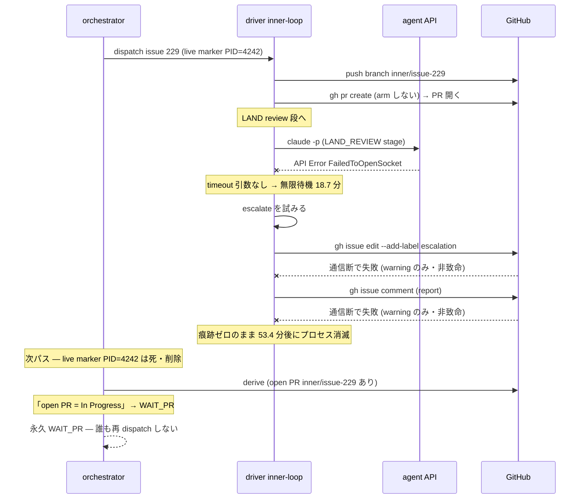
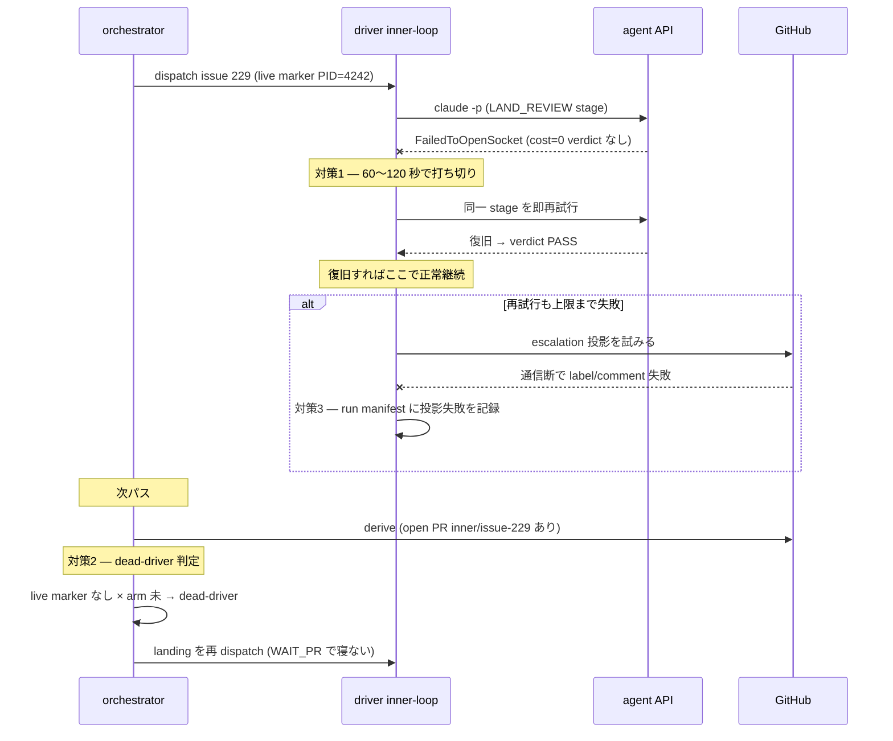
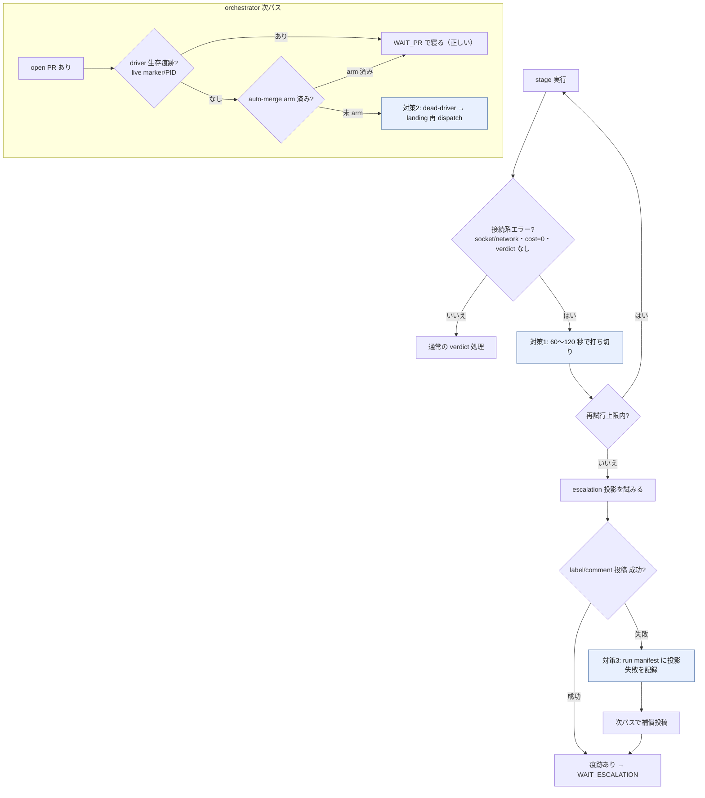

# issue #254 解説教材 — driver の API エラー耐性と orchestrator の dead-driver 検知

対象は lathe の issue #254（plan・実装 PR はまだ無い）。タイトルは「driver: stage の API エラー耐性 — 接続系エラーの短時間打ち切り＋即再試行、orchestrator の dead-driver 検知」である。本教材は要約ではなく展開であり、読者が前提知識ゼロから issue #254 の世界を組み立てられることを目標とする。

## 目次

- [1. Background](#1-background)
- [2. Intuition](#2-intuition)
- [3. Code](#3-code)
- [4. Quiz](#4-quiz)
- [接地資料](#接地資料)

---

## 1. Background

issue #254 は、lathe という「ハーネスエンジニアリングプラットフォーム」の自動開発機構に生じた 1 件の障害を根本原因とする plan である。障害の中身を理解するには、lathe が task をどう自動で回すか、その登場主体それぞれが何をするのかを先に押さえる必要がある。ここでは前提知識を仮定せず、登場する全主体を「何をするのか・なんのために存在するのか」の順で説明する。

### 二層ループ — outer と inner

lathe の開発は 2 つのループに分かれる（正本 `design/loops.md`）。

- **outer loop（監督）**: 人間（PdM）と監査役が回すループ。問題を言語化し、選択肢を出し、issue を起票し、rubric（コード規範）を管理し、escalation（後述）に対応する。**outer の終端に「実装」は存在しない** — outer は判断と起票までで、コードは書かない。
- **inner loop（実装 driver）**: task 1 件を受け取り、計画・実装・着地までを自律的に完走するループ。実体は `scripts/inner-loop.mjs` という 1 本のプロセスであり、これを **driver** と呼ぶ。ADR 0035 により、全ての task はこの単一 driver が「TASK_PLAN → PLAN_REVIEW → IMPLEMENT → LAND」という同じレールで処理する（単一 driver 化）。

この 2 層を分ける理由は、判断（outer）と機械実行（inner）を混ぜないためである。判断は人間が承認し、実行は機械が自律で回す。

### task = GitHub issue（ADR 0031・0035）

lathe では **task の実体が GitHub issue そのもの**である（ADR 0031）。`task-request` label が付いた open issue が 1 件の task を表す。TASK-N という別台帳は無く、issue #N がそのまま TASK-N である。

- **issue の body** = plan（計画本文）
- **issue の comment** = 裁定・申し送り
- **issue の label** = run 種別の選択（`needs-plan` なら分解型、`needs-review` なら人間承認要）
- **issue の open/close 状態** = task が生きているかどうか

重要なのは、**状態を保存せず gh（GitHub）から都度導出する**という原則である（ADR 0031 §2）。「この task は今どの段階か」をどこかのファイルに書いておくのではなく、issue と PR の現在の姿から毎回計算し直す。issue #254 の障害は、まさにこの「導出」が通信断で誤作動したことに端を発する。

### stage — driver の 1 手番

driver は task を一気に処理するのではなく、**stage**（段）と呼ぶ単位で 1 手ずつ進める。task loop の stage 列は次の 3 つである（`inner-loop-core.mjs` の `TASK_LOOP_STAGES`）。

| stage | 何をするか | どこで走るか |
|---|---|---|
| `TASK_PLAN` | plan-format に従い計画を書き、issue に plan comment を投稿 | repo root（読み取り主体） |
| `PLAN_REVIEW` | その計画を機械が独立検査する | repo root |
| `IMPLEMENT` | worktree 内で実装する | 隔離 worktree |

各 stage は 1 回の「ヘッドレス agent 呼び出し」として実行される。具体的には `claude -p`（Claude backend）または `codex exec`（Codex backend）を子プロセスとして spawn する。実装は `inner-loop-stage-runner.mjs` の `runStageClaude` / `runStageCodex` にある。

なぜ stage に割るのか。段ごとに verdict（判定トークン。`PLAN_READY` / `PASS` / `IMPL_DONE` / `RED` / `ESCALATE` など）を返させ、その verdict で次に進むか・やり直すか・escalation するかを機械が決めるためである。verdict は stage の出力テキスト末尾の `VERDICT: <TOKEN>` 行から `parseVerdict` が読む。

### LAND と auto-merge arm（ADR 0026・0035 追記）

3 stage が終わると driver は終端 **LAND** に入る。LAND は agent の stage ではなく driver のアクションであり、branch を着地させる。順序は ADR 0035 追記で確定している。

1. worktree の branch を push する
2. `gh pr create`（PR を作る。ただし **arm しない**）
3. reviewer を spawn し、PR の diff を plan に照らして review する
4. review が **PASS** なら `gh pr merge --auto --squash` を実行して **auto-merge を arm** する（CHANGES なら実装へ差し戻し、上限 2 周）

ここで **auto-merge arm** とは、GitHub の「required check が GREEN になったら自動で merge せよ」という予約のことである。lathe の main への機械ゲートは **CI ただ一つ**（ADR 0026 の単一着地ゲート）。PR を作るだけでは merge されない。CI（required check `gate`）が GREEN になり、かつ auto-merge が arm されていて初めて merge される。arm されていない open PR は、CI が通っても永久に merge されない。この「arm 済みか否か」が issue #254 の dead-driver 検知の鍵になる。

> [!NOTE]
> lathe の branch 命名は `inner/issue-<n>`（`worktreeNameFor`）である。driver が issue #229 の task を実装するなら branch は `inner/issue-229`、worktree ディレクトリは `.claude/worktrees/inner-issue-229` になる。この命名規則は後で状態導出に使われる。

### orchestrator（配車）と live marker

driver は自分から起動しない。**orchestrator**（`scripts/orchestrator.mjs`）が起動する。orchestrator は launchd（macOS の常駐スケジューラ）が 5 分間隔で起動する 1 プロセス 1 パスの配車係である。1 パスで次を行う（`design/loops.md`）。

1. **derive**: gh から全 open issue・全 open PR・盤面 Status を 1 パスで導出（`orchestrator-derive.mjs`）
2. **classify**: 各 issue/PR を仕事クラス（IMPLEMENT / PLAN / EXPLAIN / PR_REVIEW）または待機クラスに分類（`orchestrator-classify.mjs`）
3. **dispatch**: dispatch クラスを並列 spawn（上限 5）
4. **投影**: 盤面/label を実状態へ同期（非致命）

orchestrator が二重に driver を起動しないための仕掛けが **live marker** である。orchestrator は driver を spawn するとき `.lathe/runs/live-<type>-<n>.json`（例 `live-implement-229.json`）を書き、その中に driver プロセスの **PID** を記録する。driver が終われば marker を消す。次のパスの orchestrator は、marker があり、かつその PID が生きていれば「実行中」と判定して再 dispatch を skip する（`deriveRunningTargets`）。PID が死んでいる marker は stale として削除する。

> [!IMPORTANT]
> live marker は「driver が生きている痕跡」である。PID が生きていれば実行中、marker が無い（または PID が死んでいる）なら実行中でない。issue #254 の dead-driver 検知は、この「live marker/PID の有無」を新たな判定入力として使う。

### WAIT_PR — 「open PR = In Progress」の導出

classify の中で issue #254 に直結するのが **WAIT_PR** クラスである。orchestrator は「その issue を Closes する open PR があるか、または `inner/issue-<n>` branch の open PR があるか」を調べ、あれば「この issue は In Progress（driver が実装中で PR まで進んだ）」と導出して dispatch を skip する。実装は `deriveInProgressIssueNumbers`（PR body の `Closes #N` と branch 名 `inner/issue-<n>` を読む）、判定は `classifyIssue` の次の分岐である。

```js
if (ctx.inProgressIssueNumbers?.has(issue.number)) {
  return { class: WAIT_PR, reason: 'open PR が参照 = In Progress（ADR 0031 §2）' };
}
```

**普段この導出は正しい**。open PR があるということは、driver が TASK_PLAN → PLAN_REVIEW → IMPLEMENT を終え、LAND で PR を作ったということである。driver は続けて review → arm を行っている最中か、既に arm 済みで CI 待ちである。どちらにせよ人手・機械の再介入は不要で、待てば着地する。だから orchestrator は WAIT_PR として寝る（再 dispatch しない）のが正しい。

**通信断ではこれが誤読になる**。open PR が存在しても、それを作った driver が既に死んでいて、しかも auto-merge を arm できていない（review PASS の前に落ちた）場合、その PR は誰も着地させない。それでも orchestrator は「open PR = In Progress」だけを見て WAIT_PR と判定し、永久に寝る。誰も再 dispatch しない。これが issue #254 の後半の事故である。

### escalation 投影 — 痕跡を残す仕組み（と、その脆さ）

driver が自力で進めなくなったとき（verdict が `ESCALATE`、上限超過、rebase 衝突など）、driver は **escalation** を「投影」する。投影の実体は `inner-loop-escalation.mjs` の `projectEscalation` で、対象 issue に対し 2 つの gh 操作を行う。

1. `escalation` label を付ける（`gh issue edit --add-label escalation`。無ければ `gh label create` してから再試行）
2. レポート全文を comment として投稿する（`gh issue comment`）

この escalation label が付くと、orchestrator は `WAIT_ESCALATION` と分類して dispatch を止め、PdM の裁定を待つ（故障とは数えない）。つまり escalation 投影は「driver が行き詰まったという**痕跡を GitHub 上に残す**」ための仕組みである。

問題は、この 2 つの gh 操作が **どちらも失敗しても warning を出すだけの非致命**であることだ。

```js
if (!labelOk) logFn(`warning: could not add ${ESCALATION_LABEL} label to issue #${issueNumber} (continuing)`);
// ...
const commentOk = cr.status === 0;
if (!commentOk) logFn(`warning: could not post escalation report comment on issue #${issueNumber} (continuing)`);
```

平時はこれで良い（gh の一過性エラーで run 全体を殺したくない）。だが issue #254 の障害では、そもそも API への通信が断たれていた。label 付与も comment 投稿も同じ通信断で失敗した。結果、**escalation の痕跡がどこにも残らなかった**。補償（あとで再投稿する仕組み）が無いため、痕跡ゼロのまま消えた。

### run manifest — run の観測記録

driver は各 stage の実行を **run manifest** に追記する。ファイルは `.lathe/runs/issue-<id>.json`（plan-task なら `plan-<id>.json`）で、`{ unit, stages[] }` の形を持つ。1 stage 分のエントリは `buildManifestEntry` が作り、スキーマは次のフィールドを持つ（`inner-loop-core.mjs`）。

| フィールド | 意味 |
|---|---|
| `stage` | どの段か（`TASK_PLAN` 等） |
| `session_id` | backend session の ID |
| `verdict` | その段の判定トークン |
| `backend_cost_usd` | その段のコスト（無ければ `null`） |
| `backend_cost_source` | コストの出所 |
| `duration_ms` | 壁時計の所要時間 |
| `ts` | ISO timestamp |
| `backend` | `claude` / `codex` |
| `head_sha` | worktree の HEAD sha |
| `result_text` | 出力テキスト |

manifest は run の観測記録（誰が何秒でいくらかかって何 verdict を返したか）であり、後述する meta-audit（事後監査）はこれを読んで壁時計の外れ値を検出する。issue #254 の Scope 3 は、escalation 投影の成否をこの manifest に記録し、次パスで補償投稿する案である。

### この障害を検出した meta-audit（Discussion #251）

以上の主体が絡む障害は、meta-audit（Lathe MCP に接地した事後監査）が「統一世代 13 run の壁時計外れ値」を調べる過程で実測された（Discussion #251・PdM 裁定 2026-07-08）。数字は次のとおり（Discussion #251）。

- 統一世代の run では stage 間の gap は 0.0〜0.2 分（idle はほぼゼロ）
- CI の merge 所要は median 1.0 分
- 唯一の巨大な外れ値が issue #229 の LAND_REVIEW での socket error：**18.7 分ハング＋後続 53.4 分の in-process 空白（合計 ~72 分・課金ゼロ）**

issue #254 は、この meta-audit が出した対策 3 案のうち **案 1** を起票したものである（案 2 = #255、案 3 = #256）。label は `task-request` ＋ `needs-review`。needs-review が付くので、この plan は自動生成の教材（本稿）を経て、PdM が読み、Projects 盤面で Ready に動かして初めて実装が発火する（ADR 0035）。

---

## 2. Intuition

核心の直感は 1 文で言える。**通信断が「痕跡を残す」機構自身を壊すと、寝ている orchestrator が起きられなくなる**。issue #254 の 3 対策は、この連鎖を「痕跡を残す」「寝ない」という一貫した原理で断ち切る。

まず issue #229 で実際に起きた連鎖を、架空だが実形式のデータで追う。番号・branch 名・エラー文字列・manifest JSON は実際の形式に合わせた toy データである。

### before — 通信断が痕跡ごと消す連鎖



要点は次のとおりである。

- driver が API を呼ぶ子プロセスに **timeout 引数が無い**（`runStageClaude` の `spawnSync` に `timeout` オプションが無い）。接続系エラーで応答が返らないと、driver は無限に待つ。これが 18.7 分ハング。
- driver が escalation を投影しようとしても、**同じ通信断**で label も comment も失敗する。非致命なので run は続くが、痕跡は残らない。
- driver プロセスが消えると orchestrator は live marker を stale として削除する。次パスで見えるのは「open PR が 1 件ある」という事実だけ。orchestrator は「open PR = In Progress」を導出して WAIT_PR と判定し、寝る。
- この PR は review PASS 前に落ちたので **auto-merge は arm されていない**。CI が GREEN でも merge されない。誰も動かさない。

このとき issue #229 の manifest には、LAND_REVIEW の段が正常な verdict を持たないまま残る。toy の形は次のようになる。

```json
{
  "unit": { "kind": "issue", "id": 229 },
  "stages": [
    { "stage": "TASK_PLAN", "verdict": "PLAN_READY", "duration_ms": 42000, "backend_cost_usd": 0.12 },
    { "stage": "PLAN_REVIEW", "verdict": "PASS", "duration_ms": 31000, "backend_cost_usd": 0.05 },
    { "stage": "IMPLEMENT", "verdict": "IMPL_DONE", "duration_ms": 210000, "head_sha": "a1b2c3d" },
    { "stage": "LAND_REVIEW", "verdict": null, "duration_ms": 1122000, "backend_cost_usd": null,
      "result_text": "API Error: Unable to connect to API (FailedToOpenSocket)" }
  ]
}
```

`duration_ms: 1122000`（約 18.7 分）で `verdict: null`・`backend_cost_usd: null`。これが「壁時計は巨大・課金ゼロ・verdict 無し」という接続系エラーの指紋である。監査役の手動 resume で初めて回収された（Discussion #251 実例）。

### after — 3 対策が連鎖を断つ

issue #254 の 3 対策を同じ舞台に置くと、連鎖は 2 か所で断たれる。



3 対策の分担は次の flowchart で見ると原理が揃う。



3 対策の原理を言語化すると次のようになる。

- **対策 1（打ち切り＋即再試行）**: 「無限に待たない」。接続系エラーは一過性のことが多いので、短い上限で切って同じ stage をすぐやり直す。回数上限を超えたら escalation に回す。これで 18.7 分ハングを数分に圧縮する。
- **対策 3（escalation 投影の補償）**: 「痕跡を必ず残す」。label/comment の投稿失敗を run manifest に記録し、次パスで補償投稿する。通信断で 1 度失敗しても、後で痕跡が GitHub に届く。
- **対策 2（dead-driver 検知）**: 「open PR を見ても盲信しない」。open PR があっても、driver の生存痕跡（live marker/PID）が無く、かつ auto-merge が arm されていないなら、その PR は誰も着地させない孤児である。orchestrator は WAIT_PR で寝る代わりに landing を再 dispatch する。

対策 2 と 3 は同じ「痕跡」を逆から支える。対策 3 は driver 側で痕跡を残そうとし、対策 1・3 が両方すり抜けても、対策 2 が orchestrator 側で「痕跡が無いこと」を検知して救い上げる。二重の安全網である。期待効果は該当事象 1 件あたり ~50〜70 分の回収（meta-audit 案 1・Discussion #251）。

> [!TIP]
> 「open PR = In Progress」導出そのものは間違っていない。間違うのは、driver が死んで痕跡が消えた特殊ケースだけである。対策 2 は導出を捨てるのではなく、「driver 生存痕跡」と「arm 状態」という 2 つの追加条件で例外だけを切り出す。

---

## 3. Code

issue #254 は plan であり実装 PR はまだ無い。したがってここでは diff ではなく「plan が触る現行コードの現状抜粋＋plan の変更方針」を、理解できる順に 3 グループで歩く。現状コードは実ファイルからの正確な引用である。

### グループ①: stage runner のエラー耐性（Scope 1）

**現状** — stage の backend spawn は `scripts/inner-loop-stage-runner.mjs` の `runStageClaude` にある。

```js
function runStageClaude(stage, prompt, cwd, resumeSessionId, deps = {}) {
  const run = deps.spawnSync ?? spawnSync;
  const args = buildClaudeArgs(stage, prompt, resumeSessionId);
  const r = run('claude', args, {
    encoding: 'utf8',
    cwd,
    maxBuffer: 1e8,
    env: { ...process.env, LATHE_STAGE: stage },
  });
  if (r.status !== 0 && !r.stdout) die(`claude -p failed for stage ${stage}: ${r.stderr || 'no output'}`);
  let env;
  try { env = JSON.parse(r.stdout); } catch (e) {
    die(`could not parse claude envelope for stage ${stage}: ${e.message}\nstdout: ${r.stdout}`);
  }
  return { session_id: env.session_id ?? null, result: env.result ?? '', total_cost_usd: env.total_cost_usd ?? null, backend: 'claude' };
}
```

現状の性質は 3 点ある。

1. **`spawnSync` に `timeout` オプションが無い** — 応答が返らないと無限に待つ。issue #229 の 18.7 分ハングの直接原因。
2. **die 条件は `r.status !== 0 && !r.stdout` のみ** — エラーでも stdout に何か出れば die しない。接続系エラー（`FailedToOpenSocket`）の扱いは特別化されておらず、cost=0・verdict 無しのまま先へ流れる。
3. **cost は `env.total_cost_usd ?? null`** — 接続系エラーでは課金が無いので `null`。これが「課金ゼロ」の指紋になる。

`runStageCodex` も対称的に `codex exec` を `spawnSync` で spawn し、同じく timeout 引数を持たない。

**plan の変更方針**（issue #254 Scope 1） — 接続系エラー（socket/network 系・cost=0 で verdict 無し）を検出し、短い上限（例 60〜120 秒）で打ち切り、同一 stage を即再試行する。再試行には回数上限を付け、上限を超えたら escalation に回す。timeout を `spawnSync` に与えるか、エラー文字列（`FailedToOpenSocket` 等）を判定するかは実装段の設計判断だが、狙いは「無限待機を短い有限時間に変える」ことである。

なお VERDICT が読めない場合の再試行は既に存在する。`inner-loop-core.mjs` の `runStageWithUnparsableRetry` が `MAX_UNPARSABLE_STAGE_RETRIES = 1` で 1 回だけ再試行する。ただしこれは「出力はあるが verdict が読めない」ケース用であり、「そもそも接続できずハングする」ケースは対象外である。issue #254 は接続系エラー専用の打ち切り＋再試行を新設する（既存の unparsable 再試行とは別の分岐）。

### グループ②: orchestrator の dead-driver 検知（Scope 2）

**現状** — 実行中判定は `scripts/orchestrator.mjs` の `deriveRunningTargets`。live marker の PID 生存で判定する。

```js
export function deriveRunningTargets(entries, isAlive) {
  const issues = new Set();
  const prs = new Set();
  const stale = [];
  for (const { name, marker } of entries ?? []) {
    if (!marker || !isAlive(marker.pid)) { stale.push(name); continue; }
    (marker.kind === 'pr' ? prs : issues).add(marker.number);
  }
  return { issues, prs, stale };
}
```

そして「open PR = In Progress」の分類は `scripts/orchestrator-classify.mjs` の `classifyIssue`。

```js
if (ctx.runningIssueNumbers?.has(issue.number)) {
  return { class: WAIT_RUNNING, reason: 'live マーカー/worktree が実行中を示す' };
}
if (ctx.inProgressIssueNumbers?.has(issue.number)) {
  return { class: WAIT_PR, reason: 'open PR が参照 = In Progress（ADR 0031 §2）' };
}
```

`inProgressIssueNumbers` は `deriveInProgressIssueNumbers`（`inner-queue-decisions.mjs`）が PR body の `Closes #N` と branch 名 `inner/issue-<n>` から作る。

```js
export function deriveInProgressIssueNumbers(prs) {
  const inProgress = new Set();
  for (const pr of prs ?? []) {
    for (const m of String(pr?.body ?? '').matchAll(/\b(?:close[sd]?|fix(?:e[sd])?|resolve[sd]?)\s+#(\d+)/gi)) {
      inProgress.add(Number(m[1]));
    }
    const branchMatch = String(pr?.headRefName ?? '').match(/^inner\/issue-(\d+)$/);
    if (branchMatch) inProgress.add(Number(branchMatch[1]));
  }
  return inProgress;
}
```

現状の性質は、WAIT_RUNNING（live marker あり）でなければ、open PR があるだけで無条件に WAIT_PR に落ちる点である。**arm 状態は一切見ていない**。driver が死んで marker が消えても、PR が open である限り WAIT_PR になり、永久に寝る。

**plan の変更方針**（issue #254 Scope 2） — dead-driver を次の 3 条件の AND で判定し、成立時は WAIT_PR で寝る代わりに **landing を再 dispatch** する。

1. open PR あり（現状の inProgress 導出）
2. driver 生存痕跡なし（live marker/PID が無い）
3. auto-merge が未 arm

3 条件目の「auto-merge 未 arm」が「driver は review PASS まで到達できていない＝この PR は自力で着地しない」ことを表す。arm 済みなら CI 待ちの正常経路なので寝てよい。issue #254 は「dead-driver 判定の純関数」を新設して unit で検証する方針である（純関数化により GraphQL/gh を叩かずに判定ロジックを test できる。既存の `deriveRunningTargets` や `classifyIssue` と同じ純関数分離の流儀）。

> [!WARNING]
> arm 状態の取得は現状の derive（`orchestrator-derive.mjs` の `SNAPSHOT_QUERY`）に無い。plan の実装段では PR の auto-merge 状態を snapshot に足す必要がある。ここは未確認の実装詳細であり、issue #254 本文は「auto-merge 未 arm」を条件として挙げるが取得手段は plan 段で精査するとしている。

### グループ③: escalation 投影の補償（Scope 3）

**現状** — `scripts/inner-loop-escalation.mjs` の `projectEscalation`。label・comment の両方が非致命で、失敗しても warning のみ・補償なし。

```js
let labelOk = addLabel();
if (!labelOk) {
  run('gh', ['label', 'create', ESCALATION_LABEL, /* ... */], /* ... */);
  labelOk = addLabel();
}
if (!labelOk) logFn(`warning: could not add ${ESCALATION_LABEL} label to issue #${issueNumber} (continuing)`);

const cr = run('gh', ['issue', 'comment', String(issueNumber), '--body-file', '-'],
  { cwd, encoding: 'utf8', input: report, stdio: ['pipe', 'pipe', 'pipe'] });
const commentOk = cr.status === 0;
if (!commentOk) logFn(`warning: could not post escalation report comment on issue #${issueNumber} (continuing)`);

return { ok: labelOk && commentOk, labelOk, commentOk };
```

`projectEscalation` は既に `{ ok, labelOk, commentOk }` という成否を戻り値に持っている。だが呼び出し側（`inner-loop.mjs` の `escalateIssue`）はこの戻り値を捨てており、失敗が記録されない。

```js
function escalateIssue(issueNumber, stage, verdict, resultExcerpt) {
  projectEscalation({ issueNumber, stage, verdict, resultExcerpt }, { log });
}
```

**plan の変更方針**（issue #254 Scope 3） — label/comment 投稿の失敗を run manifest に記録し、次パスで補償投稿する。`projectEscalation` の `labelOk`/`commentOk` を捨てずに拾い、manifest（`.lathe/runs/issue-<id>.json`）へ「escalation 投影が未完である」旨を残す。次に orchestrator（または driver）が回ったとき、その記録を見て label/comment を再投稿する。これにより 1 度の通信断で痕跡が消えなくなる。manifest エントリのスキーマ拡張になるため、`buildManifestEntry`（`inner-loop-core.mjs`）に補償フラグを足すか、専用の記録を足すかは実装段の設計判断である。

### 検証（plan 記載）

issue #254 は次の 2 種の unit を検証手段として挙げる。

- **fake backend で接続系エラーを注入する unit** — 接続系エラー（socket/network）を注入し、「打ち切り → 再試行 → 上限で escalation」の分岐を確認する。`runStageClaude`/`runStageCodex` は既に `deps.spawnSync` で spawn を差し替えられる設計なので、fake backend の注入は既存の DI（依存注入）の口に載せられる。
- **dead-driver 判定の純関数 unit** — グループ②で新設する純関数（open PR × 生存痕跡なし × 未 arm → dead-driver）を、gh を叩かず入力オブジェクトだけで検証する。既存の `deriveRunningTargets`・`classifyIssue`・`deriveInProgressIssueNumbers` が全て純関数として export され unit test されているのと同じ流儀である。

---

## 4. Quiz

中難度 5 問。実質を理解していないと解けないが、ひっかけではない。

### Q1. issue #229 の障害で「18.7 分ハング」が起きた直接原因はどれか。

- A. CI（required check `gate`）の実行が遅かったため
- B. `runStageClaude` の `spawnSync` に `timeout` オプションが無く、接続系エラーで応答が返らないと無限に待つため
- C. `MAX_UNPARSABLE_STAGE_RETRIES = 1` の再試行が接続系エラーを繰り返したため
- D. orchestrator の並列 dispatch 上限 5 に達して順番待ちになったため

<details><summary>答えと解説</summary>

**正解: B**。`runStageClaude`（および `runStageCodex`）は backend を `spawnSync` で spawn するが timeout 引数を持たない。接続系エラー（`FailedToOpenSocket`）で応答が返らないと driver は無限に待つ。これが 18.7 分ハングの直接原因である。A は CI median 1.0 分で外れ値ではない。C の unparsable 再試行は「出力はあるが verdict が読めない」ケース用で、接続できずハングするケースは対象外。D は dispatch の話で stage 内のハングとは無関係。

</details>

### Q2. 通信断のあと orchestrator が issue #229 を「永久 WAIT_PR」と誤読したのはなぜか。

- A. issue #229 に `escalation` label が付いていたから
- B. issue #229 の manifest の LAND_REVIEW エントリが `verdict: null` だったから
- C. open PR（`inner/issue-229`）が存在し、`classifyIssue` が「open PR = In Progress」を導出して WAIT_PR に落としたから
- D. issue #229 が `needs-review` label を持ち Ready でなかったから

<details><summary>答えと解説</summary>

**正解: C**。orchestrator は状態を保存せず gh から都度導出する。driver が死んで live marker が消えても、`inner/issue-229` の open PR が残っている限り `deriveInProgressIssueNumbers` がそれを拾い、`classifyIssue` は「open PR が参照 = In Progress」として WAIT_PR に落とす。誰も再 dispatch しない。A は誤り — 通信断で escalation 投影が失敗したので label は付いていない（付いていれば WAIT_ESCALATION になり、それはそれで PdM が拾える）。B は manifest はローカル記録で orchestrator の classify 入力ではない。D は WAIT_APPROVAL の話で、そもそも In Progress 導出が先に効く。

</details>

### Q3. 対策 2（dead-driver 検知）が「open PR = In Progress」導出を捨てずに例外だけ切り出すために足す 2 条件はどれか。

- A. 「PR が draft である」かつ「CI が RED」
- B. 「driver 生存痕跡（live marker/PID）が無い」かつ「auto-merge が未 arm」
- C. 「issue が `needs-review` を持つ」かつ「盤面が Ready でない」
- D. 「blocked-by 参照が open」かつ「escalation label が無い」

<details><summary>答えと解説</summary>

**正解: B**。dead-driver は「open PR あり × driver 生存痕跡なし × auto-merge 未 arm」の AND で判定する。生存痕跡が無ければ driver は死んでおり、未 arm なら review PASS まで到達していない＝この PR は自力で着地しない孤児である。だから landing を再 dispatch する。arm 済みなら CI 待ちの正常経路なので寝てよい。A/C/D はいずれも別クラス（SKIP_DRAFT / WAIT_APPROVAL / WAIT_DEP）の条件であり dead-driver とは無関係。

</details>

### Q4. 接続系エラーの run manifest 上の「指紋」として issue #229 の LAND_REVIEW エントリが示す組み合わせはどれか。

- A. `duration_ms` は極小・`backend_cost_usd` は高額・`verdict` は `PASS`
- B. `duration_ms` は巨大・`backend_cost_usd` は `null`・`verdict` は `null`
- C. `duration_ms` は `null`・`backend_cost_usd` は `null`・`verdict` は `ESCALATE`
- D. `duration_ms` は median 1.0 分・`backend_cost_usd` は少額・`verdict` は `IMPL_DONE`

<details><summary>答えと解説</summary>

**正解: B**。接続系エラーは無限待機で `duration_ms` が巨大（約 18.7 分 = 1122000ms）、課金が無いので `backend_cost_usd` は `null`、出力が正常な VERDICT 行を持たないので `parseVerdict` は `null` を返す。「壁時計は巨大・課金ゼロ・verdict 無し」がこの障害の指紋であり、meta-audit（Discussion #251）が統一世代 13 run の外れ値としてこれを検出した。

</details>

### Q5. 対策 3（escalation 投影の補償）が必要になるのは、`projectEscalation` の現状のどの性質のためか。

- A. `projectEscalation` が例外を throw して driver プロセスを即座に殺すため
- B. label 付与と comment 投稿がどちらも非致命（失敗しても warning のみ）で、補償が無いため、通信断で両方失敗すると痕跡がゼロになるため
- C. `projectEscalation` が `escalation` label ではなく `needs-review` label を付けるため
- D. `projectEscalation` の戻り値 `{ ok, labelOk, commentOk }` が常に `ok: true` を返すため

<details><summary>答えと解説</summary>

**正解: B**。`projectEscalation` は label 付与も comment 投稿も失敗時に warning を出すだけで続行する（非致命）。平時は gh の一過性エラーで run 全体を殺さないための設計だが、issue #229 では通信断で label も comment も同じ理由で失敗し、補償（後で再投稿する仕組み）が無いため痕跡がゼロになった。対策 3 は投稿失敗を run manifest に記録し次パスで補償投稿する。A は誤り — 失敗は throw でなく warning。C は誤り — 付けるのは `escalation` label。D は誤り — 戻り値は `ok: labelOk && commentOk` であり、両方失敗すれば `ok: false` を返す（が、呼び出し側 `escalateIssue` が戻り値を捨てているのが記録欠落の根である）。

</details>

---

## 接地資料

- **issue #254**（plan・本教材の対象。label: `task-request` ＋ `needs-review`。Discussion #251 meta-audit の案 1 を起票。案 2 = #255・案 3 = #256）
- **Discussion #251**（meta-audit・PdM 裁定 2026-07-08「案 1,2 を needs-review で」。数字: 統一世代 stage 間 gap 0.0〜0.2 分・CI median 1.0 分・#229 socket error 18.7 分ハング＋53.4 分空白＝合計 ~72 分・課金ゼロ）
- **issue #229**（障害の実例。LAND_REVIEW で `API Error: Unable to connect to API (FailedToOpenSocket)`。監査役の手動 resume で回収）
- `scripts/inner-loop-stage-runner.mjs`（`runStageClaude` / `runStageCodex` — timeout 引数なしの `spawnSync`）
- `scripts/inner-loop.mjs`（driver 本体の state machine ループ・`escalateIssue`）
- `scripts/inner-loop-core.mjs`（`runStageWithUnparsableRetry`・`parseVerdict`・`MAX_UNPARSABLE_STAGE_RETRIES`・`buildManifestEntry` のスキーマ・`worktreeNameFor`）
- `scripts/orchestrator.mjs`（`deriveRunningTargets`・live marker・PID lock・stale 掃除）
- `scripts/orchestrator-derive.mjs`（`SNAPSHOT_QUERY`・`normalizePr`・`isDriverPrBranch`）
- `scripts/orchestrator-classify.mjs`（`classifyIssue` の WAIT_PR / WAIT_RUNNING 分岐）
- `scripts/inner-queue-decisions.mjs`（`deriveInProgressIssueNumbers`・`parseInnerIssueWorktrees`）
- `scripts/inner-loop-escalation.mjs`（`projectEscalation` — label/comment 非致命・補償なし）
- `design/loops.md`（orchestrator loop・task loop・LAND・唯一の終端の正本）
- **ADR 0035**（統一 task ライフサイクル・単一 driver・needs-review×Ready 承認・LAND review 前置と arm の意味論）
- **ADR 0026**（単一着地ゲート = PR + CI）
- **ADR 0031**（issues as task substrate・状態は保存せず gh から導出）
