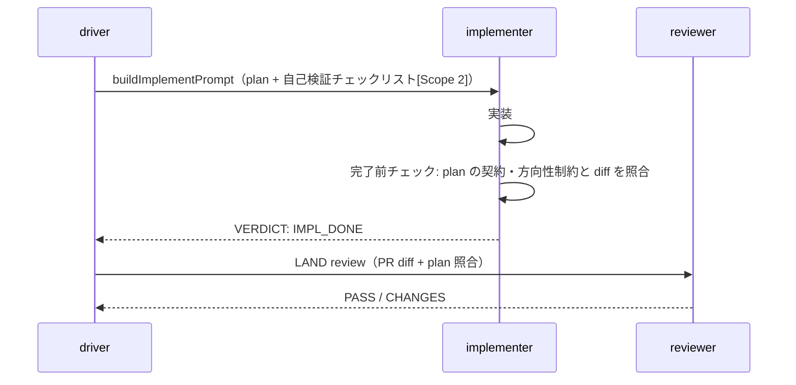
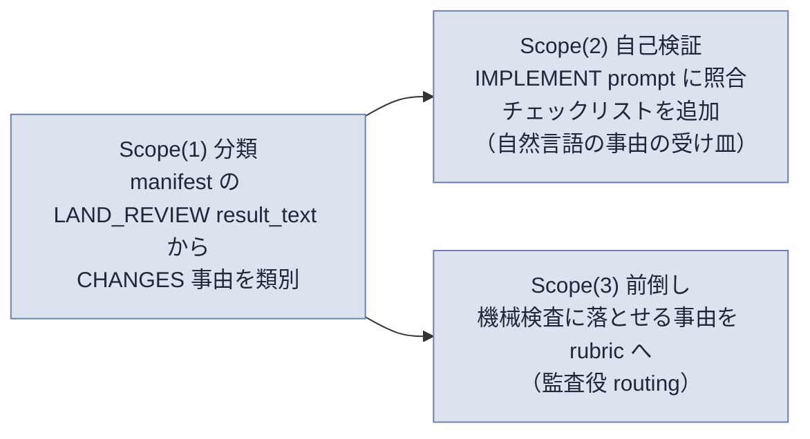

# issue #255 解説 — review 1 周目通過率の向上（実装段の自己検証前倒し）

目次: [1. Background](#1-background) ／ [2. Intuition](#2-intuition) ／ [3. Code](#3-code) ／ [4. Quiz](#4-quiz)

この教材の対象は GitHub issue #255（label: `task-request`, `needs-review`。「review 1 周目通過率の向上 — 頻出 CHANGES 事由を実装段の自己検証へ前倒し」）である。対象は diff ではなく、まだ実装されていない **plan（Scope）とその接地文脈**である。issue #255 の本文（問題・Scope・期待効果・検証）を、現行の driver（`scripts/inner-loop.mjs` ほか）・LAND review 実装（`scripts/inner-loop-land.mjs`）・IMPLEMENT prompt 契約（`scripts/inner-loop-prompts.mjs`）・rubric エンジン（`rubrics/run.mjs`）・実例 #229（PR #230）に接地して読む。この教材の仕事は「この plan が既存機械のどこに何を足すのか」を既存コードを引用して具体化することであり、実装で確定する細部は「未確認」と明記する。

> [!IMPORTANT]
> issue #255 は 2026-07-08 時点で `needs-review`（人間キュー）である。本文の Scope は「plan 段で精査」と明記されており、確定 plan ではない。したがって本教材が引用する挿入位置・関数名・rubric 名は「plan がどこに落ちるかの候補」であり、実装 PR の diff が着地するとそれが事実の正本になる。

---

## 1. Background

前提知識をゼロと仮定して、issue #255 が触る系を組み立てる。触るのは lathe アプリ本体（`apps/web`）ではなく、**lathe 自身を開発する agent 体制**（driver・named agents・CI・統治文書）の側である。

### 1.1 inner loop と 3 段（TASK_PLAN → PLAN_REVIEW → IMPLEMENT）＋ LAND

lathe はハーネスエンジニアリングプラットフォームである。開発体制は「1 つの task を人手ゼロで main へ届ける機械」である **inner loop（task loop）** を持つ。task は GitHub issue そのもの（ADR 0031。issue #N = TASK-N、issue 本文 = plan）であり、driver `scripts/inner-loop.mjs <n>` が段ごとに named agent を `claude -p "<prompt>" --agent <name>` で起動し、agent が出力最終行に置く `VERDICT: <TOKEN>` を parse して次段へ遷移する状態機械である。

現行の段列（`design/loops.md`・ADR 0030 §3・ADR 0035 §1）はこうである。

| 段 | 誰が | 何をするか | なんのために存在するか |
|---|---|---|---|
| **TASK_PLAN** | planner agent（read-only・repo root） | issue 本文から、この issue 自体の実装 plan を `design/plan-format.md` 準拠で作る。driver は PLAN_READY 後に plan を issue の comment（`## plan\n\n<plan>`）として投函する | 「すべての実装は plan を持って生まれる」を段で保証する |
| **PLAN_REVIEW** | reviewer agent（read-only） | 直前の plan を機械 plan review で検査。PASS で続行、RED で所見注入つき TASK_PLAN 再試行（上限 2） | plan が actionable かを実装前に検査する |
| **IMPLEMENT** | implementer agent（worktree の中） | issue（本文 = plan）に従い worktree で 1 commit する。`.claude/skills/implement/SKILL.md` に従う | plan の bounded な実装 |
| **LAND**（段ではなく driver のアクション） | driver ＋ reviewer agent | branch を main へ着地させる。push → PR 確保 → **LAND review 周回** → PASS で auto-merge arm | ローカル run を PR という公共物に橋渡しし、着地前に設計判断を検査する |

IMPLEMENT の後は driver 直属のアクション LAND が走る。ここが issue #255 の主戦場である。

### 1.2 LAND review gate（PR 作成後・reviewer PASS で arm・CHANGES で差し戻し）

LAND は issue #188 の着地（`scripts/inner-loop-land.mjs`）で「review 前置」を持つ。旧 LAND は「push → PR 作成 → 無条件で auto-merge arm」だったが、現行はこう組み替えられている。

```
push → gh pr create（arm しない）
     → reviewer を spawn（PR diff ＋ plan を照合・marker 付き PR コメント投稿）
     → verdict 分岐:
         PASS    → gh pr merge --auto --squash（ここで初めて arm）
         CHANGES → 所見を IMPLEMENT へ差し戻し（同一 worktree で追い commit → push で
                   PR 自動更新 → 再 review）。修正周回上限 MAX_LAND_REVIEW_REWORK_ROUNDS
         それ以外 → 失敗を返し driver が escalation を issue へ投影
```

reviewer は read-only の named agent で、PR / branch の diff を **plan ＋ 該当 rubric** に照らして「設計遵守・抜け・risk」を見る（`.claude/skills/review/SKILL.md`）。機械で測れる規範は rubric＝verifier / CI が見るので、reviewer はそれを再実行せず**設計判断**に集中する（責務分離）。

> [!NOTE]
> model ≠ role（ADR 0005 / 0009）。reviewer / implementer は役割名であってモデル名ではない。同名の agent 定義（`.claude/agents/`）が段ごとに起動される。

### 1.3 CHANGES 差し戻しの周回コスト

reviewer が **CHANGES** を返すと、LAND は「1 周目で着地」しない。所見が同一 worktree の IMPLEMENT（正確には LAND rework 契約、後述）へ注入され、追い commit → 再 push → 再 review が回る。この 1 周（rework round）が丸ごとコストである。issue #255 が引く実測（依拠: Discussion #251 の meta-audit）はこうである。

| 内訳 | 時間 |
|---|---|
| 初回 review | 4.6 分 |
| rework（差し戻しの実装修正） | 6.1 分 |
| 再 review | 4.6 分 |
| 小計 | 約 15.3 分／周 |
| ＋ tail | 再 push・再 CI の待ち |

さらに issue #255 の実測では **LAND review の 1 周目 CHANGES 率が 3/10**（10 run 中 3 run が初回で差し戻し）。つまり run の 3 割が、この約 15 分＋tail を余分に払っている。

### 1.4 IMPLEMENT prompt 契約 — 「契約」とは何か

IMPLEMENT 段の agent に渡す prompt は `scripts/inner-loop-prompts.mjs` の `buildImplementPrompt(ctx)` が組み立てる文字列である。この prompt が implementer の**契約**（従うべき規約の集合）を成す。現行の契約はこの要素からなる。

- issue 本文（= plan）と裁定 comment の注入
- worktree の中で編集せよ・nested subagent を spawn するな・main に書くな
- `.claude/skills/implement/SKILL.md` に従え（main freshness の rebase 契約）
- escalation 契約（`IMPL_LOOP_ESCALATION_CONTRACT`）
- 1 commit・明示 `git add <paths>`・実 exit code を確認せよ
- 最終行に `VERDICT: IMPL_DONE | ESCALATE`

issue #255 Scope(2) の「実装段の自己検証チェックリスト（prompt 契約への追加）」は、この `buildImplementPrompt`（と、差し戻し用の `buildLandReworkPrompt`）が組む prompt に **1 節を足す**という意味である。

### 1.5 rubric エンジン — 機械検査に落とせる事由の受け皿

`rubrics/` は「機械で測れる規範」の正本である。`rubrics/run.mjs` が cwd の変更パスに対し、そのパスを scope が覆う rubric だけを発火させる（`node rubrics/run.mjs --changed <paths>`）。各 check は `verify.cmd`（shell で測る）・`verify.judge`（agent ジャッジ）・`verify.verifier`（named verifier）のいずれかで機械判定される。merge ゲートの CI はこの `run.mjs` を GitHub 側で再実行する（ADR 0026 §1、単一着地ゲート）。

issue #255 Scope(3)「機械検査に落とせる事由は rubric へ前倒し」は、CHANGES 事由のうち**機械で測れるもの**を reviewer の目でなく rubric の check に移すという意味である。rubric の新設 / 改訂は監査役 routing（統治資産・inner に触らせない、`buildImplementPrompt` の外部空間契約でも `rubrics/` は implementer 禁止空間）。

---

## 2. Intuition

核心の直感は 1 行である。

> **実装後に LAND review で落ちる CHANGES の一部は、plan の契約を「実装完了前」に自分で照合すれば消える。**

CHANGES 事由には 2 種がある。(a) 実装者が plan を読み違えた・見落とした「自己検出可能」なもの、(b) plan にない設計判断を reviewer が初めて指摘する「新規」なもの。(a) は本来、implementer が「完了と宣言する前に plan と自分の diff を突き合わせる」だけで消える。issue #255 はこの (a) を消しにいく。

### 2.1 toy 例（架空・実形式）

架空の issue #900 を置く。plan にこう書かれているとする（実形式）。

```text
## 方針
述語 shouldSkipRebase(branch, deps) を追加する（I/O 述語・単一入口・
gh 失敗は FF 保全側で true）。
```

「gh 失敗は FF 保全側で true」は**方向性制約**である。これに反する実装をしても、その場では動く（gh は普段成功する）ので implementer は気づかない。LAND review で reviewer が plan と diff を照合して初めて露見する。

| | 実装 | review result_text（架空・before/after） |
|---|---|---|
| 制約に反した実装 | `if (r.status !== 0) return false;` | `REVIEW: CHANGES` — `[blocker] gh 失敗時フォールバック方向が plan と逆。plan は「gh 失敗は FF 保全側で true」。false だと rebase が走り push 済み履歴を書き換え non-FF push で修正対象の bug を再現する` |
| 制約どおりの実装 | `if (r.status !== 0) return true;` | `REVIEW: PASS`（この事由では落ちない） |

これは架空だが、後述の実例 #229 と同型である。ここで効くのは「reviewer が指摘する前に、implementer 自身が plan の `true` という一語と自分の `return false` を照合していれば、review を待たずに直せた」という点である。

### 2.2 rework 周回 vs 自己検証で 1 周着地

```mermaid
flowchart TD
    subgraph A["現行（自己検証なし）"]
        A1["IMPLEMENT: 契約と逆に実装"] --> A2["LAND review"]
        A2 -->|"CHANGES: plan と逆"| A3["rework 6.1m"]
        A3 --> A4["再 push / 再 CI"]
        A4 --> A5["再 review 4.6m"]
        A5 -->|PASS| A6["arm -> merge"]
    end
    subgraph B["Scope(2) 導入後（自己検証あり）"]
        B1["IMPLEMENT: 実装"] --> B2["完了前チェック: plan の契約・方向性制約と diff を照合"]
        B2 -->|"照合で逆を検出 -> その場で直す"| B3["LAND review"]
        B3 -->|PASS| B4["arm -> merge (1 周着地)"]
    end
    classDef cost fill:#f0d9d9,stroke:#b06060,color:#402020
    classDef save fill:#d9e8d9,stroke:#5a8f5a,color:#203020
    class A2,A3,A4,A5 cost
    class B2,B3,B4 save
```



左（現行）は CHANGES で約 15 分＋tail を払う。右（Scope(2) 導入後）は IMPLEMENT の終了前に照合を挟み、(a) 型の事由をその場で潰して 1 周で着地する。issue #255 の期待効果は「CHANGES 率 3/10 → 1/10 で 約 5 分／run」である。

### 2.3 チェックリストがどこに座るか（IMPLEMENT の内側）



チェックリストは reviewer 側でなく **implementer の prompt** に足す。reviewer は最後の砦のまま変えない。狙いは「reviewer が見る前に implementer が自分で 1 段目の照合を済ませる」ことである。

### 2.4 3 つの Scope の役割分担



Scope(1) が「何で落ちているか」を実測で確定し（推測でチェックリストを作らない）、その結果を機械化可否で振り分ける。機械で測れないもの（例: plan の方向性制約との整合）は Scope(2) の prompt チェックリストへ、機械で測れるもの（例: 特定 API の呼び出し形）は Scope(3) の rubric へ落とす。

> [!NOTE]
> issue #255 の期待効果「約 5 分／run」は meta-audit の案 2 の見積もりであり、実測は未確定である。検証は「チェックリスト注入の unit ＋ 導入後 10 run の CHANGES 率の前後比較」で、後者は #129（実験 loop・未実装 / Approval 待ち）が通れば可能になる。現時点で前後比較は未実施である。

---

## 3. Code

接地資料を理解できる順にウォークスルーする。引用はいずれも現行 repo（2026-07-08）の実体である。

### 3.1 (a) IMPLEMENT prompt が組まれる場所と、チェックリストの挿入点

`scripts/inner-loop-prompts.mjs` の `buildImplementPrompt(ctx)` が IMPLEMENT の prompt を組む。現行の末尾の契約はこうである。

```js
// scripts/inner-loop-prompts.mjs — buildImplementPrompt（現行の末尾契約）
  lines.push(
    '',
    IMPL_LOOP_ESCALATION_CONTRACT,
    '',
    '1 commit にまとめること。明示 `git add <paths>` を使うこと（`git add -A` / `git add .` は禁止）。',
    '実 exit code を確認して検証すること（推測で GREEN と書かない）。',
    '',
    verdictInstruction(['IMPL_DONE', 'ESCALATE']),
  );
  return lines.join('\n');
```

Scope(2)「実装段の自己検証チェックリスト」は、この `lines.push(...)` に **1 節を足す**（`verdictInstruction` の直前が自然な位置）。趣旨は「IMPL_DONE を宣言する前に、plan の契約・方向性制約と自分の diff を照合せよ」を明文化することである。具体の文面・照合項目は plan 段で確定する（未確認）。

この prompt には plan が既に注入されている。`buildImplementPrompt` の冒頭で issue 本文（= plan）が入る。

```js
// scripts/inner-loop-prompts.mjs — buildImplementPrompt（plan の注入）
    `以下の issue（本文 = plan）に従って issue #${issueNumber}: ${issueTitle} を実装してください。`,
    // ...
    '## issue（本文 = plan）',
    issueBody ?? '',
```

つまり implementer は既に plan 全文を手元に持っている。Scope(2) は「持っている plan と、これから宣言する成果物を、宣言前に突き合わせよ」という**照合手順の追加**であり、新しい情報を渡すのではない。

差し戻し経路にも同じ追加が要る。CHANGES で戻る rework は `buildImplementPrompt` ではなく `buildLandReworkPrompt(ctx)` が組む別 prompt を使う（push 済み branch なので契約が違う: 追い commit のみ・rebase/amend/reset 禁止）。その末尾も同型である。

```js
// scripts/inner-loop-prompts.mjs — buildLandReworkPrompt（末尾契約）
  lines.push(
    '',
    IMPL_LOOP_ESCALATION_CONTRACT,
    '',
    '変更は明示 `git add <paths>` で stage すること（`git add -A` / `git add .` は禁止）。',
    '全指摘を「対応しない」と判断した場合は commit を作らず、指摘ごとの理由を出力に列挙して IMPL_DONE で終えてよい（再 review が対応表明を審査します）。',
    '実 exit code を確認して検証すること（推測で GREEN と書かない）。',
    '',
    verdictInstruction(['IMPL_DONE', 'ESCALATE']),
  );
```

Scope の検証項目「チェックリスト注入の unit（prompt 構築）」は、`scripts/inner-loop-prompts.test.mjs` に「prompt にチェックリスト文言が含まれる」旨の test を足すことを指す。同ファイルには既に `buildImplementPrompt` / `buildLandReworkPrompt` の契約を 1 文ずつ検証する test 群がある（例: `buildImplementPrompt: commit discipline (explicit git add, one commit)`）。同じ形で 1 件増える見込みである（未確認）。

### 3.2 (b) LAND review が CHANGES を出す場所と result_text

CHANGES verdict の分岐は `scripts/inner-loop-land.mjs` の純関数 `decideLandReviewAction` が持つ。

```js
// scripts/inner-loop-land.mjs — CHANGES 分岐（純関数・unit test 対象）
export function decideLandReviewAction({ verdict, reworkRoundsUsed, maxReworkRounds = MAX_LAND_REVIEW_REWORK_ROUNDS }) {
  if (verdict === 'PASS') return { action: 'arm' };
  if (verdict === 'CHANGES') {
    if (reworkRoundsUsed >= maxReworkRounds) {
      return { action: 'escalate', reason: `CHANGES after ${maxReworkRounds} rework round(s) — 修正周回上限超過` };
    }
    return { action: 'rework' };
  }
  return { action: 'escalate', reason: `invalid review verdict: ${verdict ?? '(none/unparsable)'}` };
}
```

reviewer の所見（result_text）がどこに残るかが Scope(1) の分類対象を決める。`landBranchWithReview` の review 周回で、reviewer の envelope を manifest に記録する。

```js
// scripts/inner-loop-land.mjs — review 所見を manifest に記録
    record(buildManifestEntry({
      stage: LAND_REVIEW_MANIFEST_STAGE,          // = 'LAND_REVIEW'
      sessionId: envelope.session_id ?? null,
      verdict: verdict ?? UNPARSABLE_VERDICT,     // PASS / CHANGES
      // ...
      headSha: reviewHeadSha,
      resultText: envelope.result ?? '',          // ← reviewer の所見全文（CHANGES の理由）
    }));
```

`buildManifestEntry`（`scripts/inner-loop-core.mjs`）はこの `resultText` を manifest エントリの `result_text` フィールドに落とす。

```js
// scripts/inner-loop-core.mjs — buildManifestEntry（result_text フィールド）
  const entry = {
    stage,
    session_id: sessionId ?? null,
    verdict: verdict ?? null,
    // ...
    head_sha: headSha ?? null,
    result_text: resultText ?? null,   // ← ここに reviewer の所見が入る
  };
```

manifest は run ごとに `.lathe/runs/issue-<n>.json` として書かれ、`stages[]` 配列に各段のエントリが並ぶ（`apps/web/scripts/ingest/run-manifests.test.ts` の `deriveRunManifestRows` が読む形式: 各 stage は `stage` / `verdict` / `session_id` / `result_text` 等を持つ）。

つまり Scope(1)「直近の CHANGES/RED 事由の分類（manifest の review result_text から接地）」は、`stage === 'LAND_REVIEW'` かつ `verdict === 'CHANGES'` のエントリの `result_text` を集めて、事由を類別する作業である。推測でなく実測の所見文が材料になる。

> [!NOTE]
> `RED` は plan review（PLAN_REVIEW 段）や verifier の verdict 語彙であり、LAND review の差し戻し verdict は `CHANGES` である。issue #255 が「CHANGES/RED 事由」とまとめているのは、plan 段 RED と LAND 段 CHANGES の両方を分類対象に含める趣旨と読める（正確な分類対象の切り方は plan 段で確定する。未確認）。

### 3.3 実例 #229 / PR #230 — 「plan を読めば実装時に自己検出できたミス」

issue #255 が引く実例は #229 である（本教材の接地: `gh issue view 229` / `gh pr view 230`）。issue #229 は driver の bug 修正 task で、その plan（issue #229 本文）はこう明示していた。

```text
（issue #229 の plan 由来。PR #230 の review が引用した確定 plan の一節）
branchHasOpenPr(branch, deps)（I/O 述語・単一入口・gh 失敗は FF 保全側で true）
```

PR #230（`fix #229: skip rebaseWorktree when open PR exists`）の実装は、gh 失敗時に `return false` にしていた。LAND review はこれを **CHANGES** で差し戻した。review コメント（`scripts/review-engine.mjs` が投稿する `<!-- lathe-review-engine -->` marker 付き）の実体はこうである。

```text
## REVIEW: CHANGES

#### [blocker] hasOpenPrForBranch の gh 失敗時フォールバック方向が確定 plan と逆

gh 失敗時に return false（= open PR なし = rebase を実施する）とフォールバックしている。
  if (result.status !== 0) return false;  // ← 問題の行

確定 plan は次のように明示している:
> gh 失敗は FF 保全側で true

論理を追う:
- true  → open PR があると仮定 → rebase スキップ → push 済み履歴を書き換えない → FF safe
- false → open PR なしと仮定 → rebase 実施 → push 済み履歴を書き換える → non-FF push →
          修正対象の bug (#224) をそのまま再現

修正の方向: if (result.status !== 0) return true; に変更し、テストも合わせる。
```

この CHANGES は「plan に `true` と書いてあるのに実装が `false` だった」という、diff を plan の一語と突き合わせれば実装完了前に自己検出できた種類のミスである。まさに Scope(2) の自己検証チェックリストが狙う (a) 型の事由である。PR #230 はこの 1 周の rework の後に PASS になり merge された（現状 MERGED）。

> [!NOTE]
> 同 review コメントには [minor] として「関数名が plan の `branchHasOpenPr` と実装の `hasOpenPrForBranch` で異なる」との指摘もあるが、reviewer は「plan の命名は設計意図の表現で実装命名を規範的に縛らない」と判断し major に上げなかった。方向性制約（`true`/`false`）は縛る一方、命名は縛らない——この線引きは reviewer の設計判断であり、Scope(2) のチェックリストが「plan の何を照合させるか」を設計するときの手がかりになる。

### 3.4 (c) rubric への前倒し経路

Scope(3) の受け皿は `rubrics/run.mjs` である。変更パスを scope が覆う rubric だけが `--changed` で発火する。

```js
// rubrics/run.mjs — --changed で scope が変更パスを覆う rubric だけ発火（scope 封じ込め）
if (args[0] === '--changed') {
  changed = args.slice(1);
  const graph = buildReverseGraph(changed);
  selection = selectRubrics({ changed, graph, rubrics: all });
  // 発火 = invariant ∨ (scope ∩ 影響集合 ≠ ∅) ∨ declared-edge
```

CHANGES 事由のうち「機械で測れる」もの（例: 特定の API 呼び出し形・禁止パターンの grep・型の締め方）は、reviewer の目でなく rubric の check（`verify.cmd` / `verify.judge` / `verify.verifier`）へ移せる。移せば CI（＝ `run.mjs` の GitHub 側再実行）が単一着地ゲートで機械的に止めるので、そもそも reviewer が CHANGES を出すまでもなくなる。

ただし #229 型の「plan の方向性制約との整合」は、rubric が個別 plan の意味を知らない以上、機械 check には落ちにくい。ゆえにこの型は Scope(3)（rubric）でなく Scope(2)（implementer の自己照合）の担当になる——ここが 2 つの Scope の境界である。

rubric の新設 / 改訂は **監査役 routing**（統治資産）である。`buildImplementPrompt` が組む implementer 契約は `rubrics/` を含む外部空間を implementer に触らせない（`buildPlanTaskPrompt` の `PLAN_TASK_EXTERNAL_SPACE_CONTRACT` が同型に `rubrics/` を planner 禁止空間として ASK_PDM に routing する）。したがって Scope(3) が rubric 改訂を要すると判明した場合、その部分は inner loop でなく監査役（outer loop）の起票へ回る。

### 3.5 統治上の位置づけ（なぜ inner に丸投げしない設計か）

issue #255 は `needs-review` である。Scope(2)（prompt 契約の追加＝ `scripts/inner-loop-prompts.mjs`）は inner loop の task として実装できるが、Scope(3) の rubric 改訂は監査役管轄である。この分割は「実装解が一意な bounded 作業は inner・設計判断や統治資産の改訂は outer」という loop 体系（ADR 0026 §0 / ADR 0030 §0 / `design/loops.md`）に沿う。

---

## 4. Quiz

中難度 5 問。選択肢から 1 つ選び、`<details>` を開いて答え合わせをする（クリック採点は持たない）。

### Q1. issue #255 が「自己検証チェックリスト」を足す先はどこか。

- (A) reviewer agent の prompt（`.claude/skills/review/SKILL.md`）
- (B) implementer の IMPLEMENT prompt（`scripts/inner-loop-prompts.mjs` の `buildImplementPrompt` ほか）
- (C) CI の `rubrics/run.mjs`
- (D) PLAN_REVIEW 段の prompt

<details><summary>答えと解説</summary>

正解: **(B)**。Scope(2) は「IMPLEMENT の終了前に plan の契約・方向性制約との照合を必須化（prompt 契約への追加）」であり、`buildImplementPrompt`（と差し戻し用 `buildLandReworkPrompt`）が組む implementer 契約の末尾に 1 節足す。狙いは「reviewer が見る前に implementer が自分で 1 段目の照合を済ませる」ことなので、reviewer 側（A）でも rubric（C）でも plan review（D）でもない。reviewer は最後の砦のまま変えない。
</details>

### Q2. CHANGES 事由のうち、Scope(2)（implementer の自己照合）でなく Scope(3)（rubric への前倒し）が担当すべきなのはどれか。

- (A) 特定の禁止 API 呼び出しが grep で検出できる事由
- (B) plan が「gh 失敗は true」と明示しているのに実装が false だった事由
- (C) reviewer にしか判断できない blast radius の広さ
- (D) plan にない新規の設計判断

<details><summary>答えと解説</summary>

正解: **(A)**。Scope(3) は「機械検査に落とせる事由を rubric へ前倒し」。grep で機械判定できる (A) は `verify.cmd` の check に落ちる。(B) は個別 plan の意味（方向性制約）に依存し rubric は plan の意味を知らないので機械 check に落ちにくく、Scope(2)（implementer が手元の plan と自分の diff を照合）の担当。(C) は reviewer の設計判断で機械化対象でない。(D) は plan にない新規事由で、そもそも自己検出も機械化もできず reviewer の領分に残る。
</details>

### Q3. LAND review の CHANGES 事由を「推測でなく実測で」分類する（Scope(1)）ために読む材料はどれか。

- (A) `git log main..HEAD` の commit message
- (B) `.lathe/runs/issue-<n>.json` の `stages[]` のうち `stage === 'LAND_REVIEW'` かつ `verdict === 'CHANGES'` のエントリの `result_text`
- (C) issue 本文（plan）の Touches 行
- (D) PR の CI ログ

<details><summary>答えと解説</summary>

正解: **(B)**。reviewer の所見全文（CHANGES の理由）は `landBranchWithReview` が `buildManifestEntry` の `resultText` として記録し、`inner-loop-core.mjs` がそれを manifest エントリの `result_text` に落とす。run manifest は `.lathe/runs/issue-<n>.json` に `stages[]` として書かれる。Scope(1) はこの LAND_REVIEW × CHANGES の `result_text` を集めて事由を類別する。commit message（A）や Touches（C）や CI ログ（D）には reviewer の CHANGES 理由は入っていない。
</details>

### Q4. 実例 #229 / PR #230 の CHANGES が「plan を読めば実装時に自己検出できた」と言えるのはなぜか。

- (A) reviewer が実装を書き換えて直したから
- (B) plan が「gh 失敗は FF 保全側で true」と一語で明示しており、diff の `return false` と突き合わせれば完了前に矛盾が見えたから
- (C) CI が RED を出したから
- (D) 関数名が plan と違っていたから

<details><summary>答えと解説</summary>

正解: **(B)**。PR #230 の実装は gh 失敗時に `return false` だったが、確定 plan は「gh 失敗は FF 保全側で true」と明示していた。`true` だと open PR ありと仮定して rebase をスキップし push 済み履歴を守る（FF safe）、`false` だと rebase が走り non-FF push で修正対象の bug (#224) を再現する。plan の `true` という一語と自分の `return false` を照合するだけで実装完了前に検出できた——これが Scope(2) が狙う (a) 型。(A) は誤り（reviewer は read-only で修正しない）。(C) は誤り（差し戻しは reviewer の CHANGES であって CI RED ではない）。(D) の命名差は同 review で minor 止まり・major に上げられていない。
</details>

### Q5. issue #255 の期待効果「CHANGES 率 3/10 → 1/10」の前後比較検証は、現時点でなぜ即座に実行できないか。

- (A) manifest に result_text が記録されていないから
- (B) reviewer が CHANGES を出せないから
- (C) 前後比較の材料となる実験 loop（#129）が未実装 / Approval 待ちだから
- (D) LAND review が廃止されたから

<details><summary>答えと解説</summary>

正解: **(C)**。issue #255 の検証は「チェックリスト注入の unit（prompt 構築）＋導入後 10 run の CHANGES 率の実測比較」で、後者の前後比較は #129（実験 loop）が通れば可能になると本文が明記する。`design/loops.md` の loop 一覧でも実験 loop は「未実装（#129・Approval 待ち）」である。(A) は誤り（result_text は記録されている——Q3 参照）。(B)(D) は現行機械の事実に反する。
</details>
