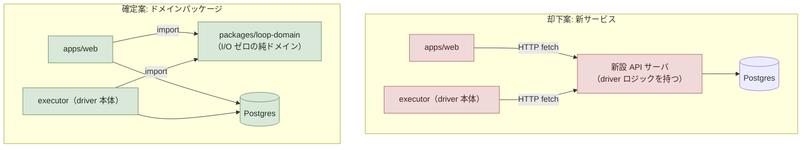
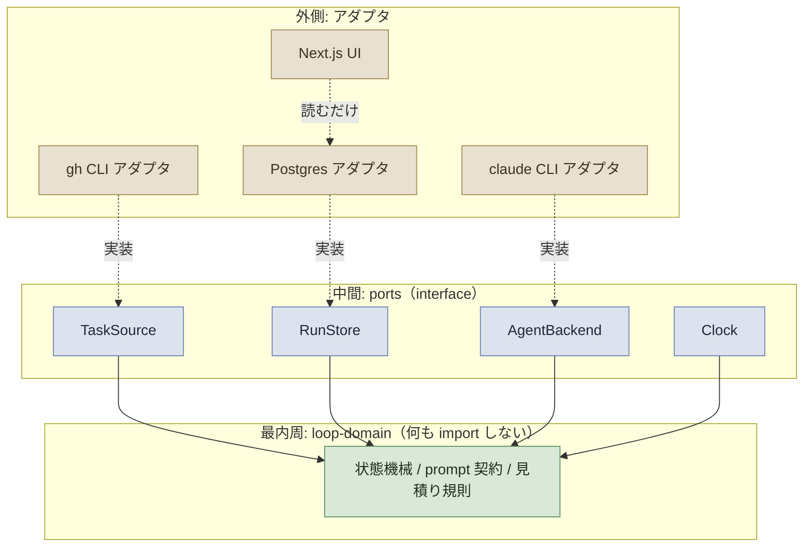
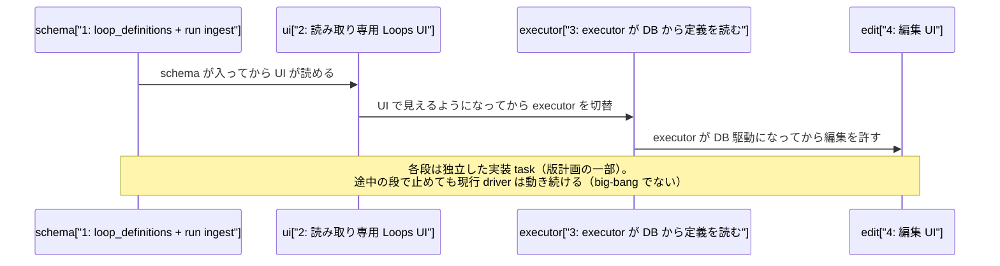

# issue #278 解説 — driver の lathe 統合: loop-domain パッケージと context 境界の設計

目次: [1. Background](#1-background) ／ [2. Intuition](#2-intuition) ／ [3. Code](#3-code) ／ [4. Quiz](#4-quiz)

この教材の対象は GitHub issue #278（label: `task-request`, `needs-review`。「driver の lathe 統合 — loop-domain パッケージと context 境界の設計（vision #141 の子・DDD/クリーンアーキテクチャ簡約形）」）である。対象は diff ではなく、vision issue #141 の子として 2026-07-08 の壁打ちで確定した**アーキテクチャの骨格**（設計文書ドラフト＋ADR 起草まで、実装ゼロ）である。この教材の仕事は、issue #278 の提案が既存の repo 構造（`scripts/*.mjs` の driver 群・`packages/` 構成・`.dependency-cruiser.js`・ADR 0031・ADR 0036・`design/loops.md`）のどこに何を足すのか／何と対比されるのかを、既存コードと文書を引用して具体化することである。実装で確定する細部（本 issue は実装ゼロなのでほぼ全部）は「未確認」と明記する。

> [!IMPORTANT]
> issue #278 は 2026-07-08 時点で `needs-review`（人間キュー）である。issue 本文は「設計として確定」と書くが、成果物（design/ ドラフト・ADR 起草）自体はまだ存在しない。本教材が引用する関数名・スキーマ案・ルール名は「この壁打ち結果がどこに落ちるかの候補」であり、実装 PR の diff が着地して初めて事実の正本になる。

---

## 1. Background

前提知識をゼロと仮定して、issue #278 が触る系を組み立てる。触るのは lathe アプリ本体（`apps/web`、観測機能）ではなく、**lathe 自身を開発する driver（inner loop の実行機構）** の側である。

### 1.1 vision #141 との関係— 本 issue はその最初の設計子

issue #141 は「lathe 製品再定義の vision 骨子を壁打ちで固める」issue であり、lathe を「単なる観測ツール」から「統治された開発ループのハーネス（駆動・統治・観測の統合）」へ再定義する構想を扱う（既存教材 `explains/2026-07-07-issue141-harness-redefinition.md` 参照）。issue #278 本文の冒頭は「vision root は #141（本 issue はその最初の設計子。壁打ち 2026-07-08 の確定方向を単体で扱う）」と明示する。つまり #141 が「lathe とは何か」という大きな再定義を扱う一方、#278 はそのうち**駆動（driver）をどう lathe 本体に統合するか**という一点を切り出して先に確定する子 issue である。

### 1.2 driver とは何か — 現行の実体（`scripts/*.mjs`）

lathe 自身の開発体制は `design/loops.md` に定義された loop の集合であり、そのうち「実装（task loop）」を回すのが **driver**（`scripts/inner-loop.mjs <issue番号>`）である。driver は GitHub issue（task の正本、後述 1.4）を受け取り、TASK_PLAN → PLAN_REVIEW → IMPLEMENT の 3 段を named agent（`claude -p "<prompt>" --agent <name>`）で順に起動し、agent が出力する `VERDICT: <TOKEN>` を parse して次段へ遷移する状態機械として動く。IMPLEMENT の後は driver 直属のアクション LAND（PR 作成 → review 周回 → auto-merge arm）が走る。

issue #278 本文は driver の規模を「現 scripts/\*.mjs 群・15 モジュール 9,168 行」と記す。本教材作成時点（2026-07-08）に `ls scripts/*.mjs`（テストファイル除く）で実測すると次の通りである。

```text
$ ls scripts/*.mjs | grep -v '\.test\.' | wc -l
26
$ ls scripts/*.mjs | grep -v '\.test\.' | xargs wc -l | tail -1
  6971 total
```

実測は 26 モジュール・6,971 行であり、issue 本文の「15 モジュール 9,168 行」とは一致しない。issue 本文の記述時点（2026-07-08 の壁打ち時点）と本教材作成時の実測にずれがある／どちらの数字がどの範囲（テスト込み・別ディレクトリ込みなど）を指すかは**未確認**である。数字を鵜呑みにせず、本教材ではモジュール数・行数の議論は実測値（26 / 6,971）を基準にする。

一方、issue 本文が名指しする `inner-loop-core.mjs` の行数は実測と一致する。

```text
$ wc -l scripts/inner-loop-core.mjs
491 scripts/inner-loop-core.mjs
```

491 行という issue 本文の記載は実測と一致しており、issue #278 の原資への参照はこの点で裏付けが取れる（詳細は §3.1）。

### 1.3 現行 driver の loop 名と、issue #278 の「executor」「orchestrator」の対応

issue #278 は「orchestrator」「executor」という語を使うが、これは `design/loops.md` の現行の loop 名とそのままは一致しない。対応づけは次の通りである。

| issue #278 の語 | 現行の対応物（`design/loops.md`） | 何をするか |
|---|---|---|
| orchestrator（配車） | `scripts/orchestrator.mjs`（launchd 5 分間隔で常駐） | gh 全状態を導出 → 分類 → 並列 dispatch → 盤面/label 投影 |
| executor | `scripts/inner-loop.mjs` 系（driver 本体） | TASK_PLAN → PLAN_REVIEW → IMPLEMENT → LAND を実行する task loop |

`design/loops.md` の loop 一覧表で「orchestrator（配車）」は既存の欄として存在するが、「executor」という名前の行は無い（現行は「実装（task loop）」という行名で driver を指す）。issue #278 の「executor が段を決め claude アダプタが実行」は、現行の driver（`scripts/inner-loop.mjs` とその周辺モジュール）を指すと読める。この対応が明示されないと、既存の loop 台帳を知っている読者ほど「executor とは何か」で混乱しやすい点に注意する。

### 1.4 ADR 0031「task 状態は保存せず導出」— issue #278 が延長する原理

ADR 0031（issues-as-task-substrate、2026-07-05 accepted）は「task の正本 = GitHub issue（TASK-N = issue #N）」と定め、状態を保存せず導出する原則を確立した。

> To Do = open issue／In Progress = 参照 PR が open／Done = PR merge で issue close。保存するのは導出できないものだけ（plan 本文 = issue body、裁定・申し送り = issue comment、needs-plan／escalation／優先度 = label）

この原則が生まれた背景は「git/GitHub が既に知っている事実を repo 内ファイルへ二重記録していること」が事故（未コミット backlog 編集による FF 保全失敗、2026-07-05）の根本原因だった、という反省である。

issue #278 の「task 状態の正は GitHub のまま（ADR 0031「保存せず導出」）。lathe DB が所有するのは LoopDefinition（版つき）と run telemetry のみ。task 状態テーブルは作らない（二重台帳の禁止）」は、この ADR 0031 の原理を driver の DB 設計に**延長**したものである。ADR 0031 が「task の状態」について言っていたことを、issue #278 は「loop-domain の DB スキーマ」に適用し、「task 状態を lathe DB に二重保存しない」という制約として引き継ぐ。すなわち loop-domain の DB（新設予定）が持ってよいのは「GitHub からは導出できないもの」＝ loop 定義そのものと run の実行記録（telemetry）だけであり、「issue が今どの状態か」という、GitHub から導出できる情報を lathe DB にコピーして二重の帳簿を作ることは、ADR 0031 が既に禁じた二重記録の再発になる。

### 1.5 ADR 0036「loop は loop で改修しない」— issue #278 の「LoopDefinition（版つき）」が接続する先

ADR 0036（harness-release-loop、2026-07-07 accepted）は「loop は完成しているから機能する」という原理から、**loop 本体（driver・orchestrator・ゲート機構）の改修を、走行中の loop 自身に食わせてはならない**と定める。改修は「版（version）」として scope を全確定し、outer の編成（bootstrap: worktree 隔離 subagent の波状並列）で一回で実装を完了させる。実測根拠は #201 再編で、loop 自身に改修を回した場合は plan 再生成の繰り返し等で崩壊し、outer 一括編成に切り替えると 15 スライスを 4 波 8 PR で数時間内に着地した、というものである。

issue #278 が言う「LoopDefinition（版つき・ADR 0036 の版固定に対応）」は、この ADR 0036 の「版」という**運用上の概念**を、DB の**データモデル**として持たせるという意味である。版そのものの計画・承認・切替の手順は ADR 0036 が既に規定しており、issue #278 はその版を「テーブルとして保持する側」を新設する、という関係になる。版の切替タイミングでどの LoopDefinition が有効かを機械的に問い合わせられるようにする、というのが接続の意図だと読めるが、スキーマの具体形（バージョン番号か、issue 番号を鍵にするか等）は**未確認**である。

### 1.6 context 境界表の 4 行 — 何が「観測」で何が「駆動」か

issue #278 は次の 4 つの context を挙げる（issue 本文の表を再掲）。

| context | 所有 | 正 |
|---|---|---|
| 観測 | sessions・events・findings | lathe DB（実装済み） |
| 駆動 | LoopDefinition・Run・stage イベント | lathe DB（新規） |
| 統治 | plan 契約・検査文言・rubric | repo＋DB（契約のデータ化） |
| task | issue 状態・plan・裁定 | **GitHub**（導出のみ） |

「観測」は Phase 1 で実装済みの lathe の既存機能（turn-first transcript・Git 差分・統計・コスト異常検知等、`AGENTS.md` Status 節参照）を指す。「task」は §1.4 の ADR 0031 がそのまま担う行である。issue #278 が新設するのは「駆動」（LoopDefinition・Run・stage イベントを lathe DB に持たせる）と「統治」（plan 契約や rubric の検査文言を repo だけでなく DB にもデータとして持たせる、いわば「契約のデータ化」）の 2 行である。

> [!NOTE]
> 「統治」の所有が「repo＋DB」と両方書かれているのは、現行 rubric が repo（`rubrics/*.mjs` 等）にコードとして存在する一方、issue #278 は将来的にその検査文言・契約を DB からも参照可能なデータとして持たせる方向を示唆していると読める。具体的にどのテーブル・どの契約が対象かは issue 本文に記載がなく**未確認**である。

### 1.7 `packages/domain` との名前の衝突 — 読者が誤解しやすい点

`packages/` には既に `domain` という名前のパッケージが存在する（`packages/domain/src/index.ts`）。中身は `FINDING_KINDS`（`'failure_loop' | 'unattributed_diff' | 'excess_cost' | 'risky_action'`）や `SubmitFindingInput` 等、**lathe アプリの観測機能（analyst 側）の Finding モデル**である。

```ts
// packages/domain/src/index.ts（既存・観測系の Finding モデル）
export const FINDING_KINDS = ['failure_loop', 'unattributed_diff', 'excess_cost', 'risky_action'] as const;
export interface SubmitFindingInput {
  analyst: string;
  kind: FindingKind;
  title: string;
  body: string;
  confidence: number;
  // ...
}
```

これに対し issue #278 が提案する `packages/loop-domain` は、**driver/loop の状態機械・prompt 契約・見積り規則**を扱う、まったく別のドメインである。両者は「domain」という語を共有するだけで中身も所属する context（観測 vs 駆動）も異なる。「既存の `packages/domain` を拡張する話」だと読むと誤解になる点に注意する。issue #278 の提案が実現すれば、repo には `packages/domain`（観測・Finding）と `packages/loop-domain`（駆動・loop 状態機械）という、名前が紛らわしい 2 つのパッケージが並存することになる。

他に `packages/` 配下には次のパッケージが既存する（対比材料として）。

| パッケージ | 何をするか |
|---|---|
| `packages/acp-client` | Agent Client Protocol（ACP）の client 実装 |
| `packages/client`（`@lathe/client`） | `lathe-client` CLI（push 主・pull 補 ingest の hook） |
| `packages/mcp`（`@lathe/mcp`） | MCP server（`@modelcontextprotocol/sdk` 使用、Postgres 接続あり） |
| `packages/shared`（`@lathe/shared`） | cost-anomaly 判定等、複数箇所から使う pure ロジックの共有先 |

### 1.8 dependency-cruiser — 依存方向を機械強制する既存の先例

issue #278 は「依存は常に外→内。dependency-cruiser（既存 lint:deps）に 1 ルール追加で機械強制」と書く。`.dependency-cruiser.js`（repo root）には既に、pure core が I/O を import することを禁じる `pure-core-no-io` ルールが存在する（詳細は §3.4）。issue #278 の「1 ルール追加」はこの既存ルールと同型の追加になると推測できる（詳細は Code セクションで具体化する）。

### 1.9 #189「散文 prompt の追放」への言及 — 未確認の接続

issue #278 の移行順序 6 は「③ executor が定義を DB から読む（散文 prompt の追放・#189 型事故の構造的封じ）」と書く。issue #189（「実装粒度の規範化 — 1 agent が数十分 task を抱える状態をなくす」、closed、直近 commit bbdeffd で「plan 見積り欄必須化・plan review 検査追加」が実装済み）本文を確認すると、内容は 1 run の実行時間・分割義務に関する議論であり、「散文 prompt」という語や、それに起因する具体的な事故の記述は本文に見当たらない。したがって issue #278 が「#189 型事故」と呼ぶものが具体的にどの事故を指すかは**未確認**である。深追いはせず、「散文 prompt（自然言語のみで機械検査できない prompt 契約）を DB 駆動の構造化定義に置き換えることで、prompt 内の規範漏れ・書式事故を機械的に防ぎたい、という意図と読める」という範囲に留める。

---

## 2. Intuition

核心の直感は次の 1 行である。

> **driver は既に「新サービスを作らずに済む形」で存在している——`inner-loop-core.mjs` は 491 行の純関数の集合であり、これを新パッケージへ切り出して web と executor の両方から import させれば、別プロセスの API サーバという運用対象を増やさずに「共有ドメイン」が手に入る。**

### 2.1 「新サービス」案と「ドメインパッケージ」案の対比（toy 例）

壁打ちで却下された選択肢（別プロセスの API サーバ新設）と、確定した方向（`packages/loop-domain` ＋既存 Postgres）を、架空の toy 構成で対比する。



却下案は「新設 API サーバ」という新しい運用対象（デプロイ・監視・障害対応が要る常駐プロセス）を増やす。確定案は「同じコードを import する」だけなので新しい運用対象は増えず、Postgres という**既存の**合流点に両者が書き込む。

### 2.2 現行 manifest（ファイル）から RunStore（DB）への置き換え（before/after）

現行の driver は run の進行を `.lathe/runs/<kind>-<id>.json` というファイルに記録する（§3.2 で詳細を見る）。issue #278 のデータフロー案では、これを RunStore という port 越しの DB 書き込みに置き換える。架空の issue #900 を例に、before（現行ファイル）と after（提案後の DB 行、架空のスキーマ）を対比する。

**before（現行、`.lathe/runs/issue-900.json` の実形式に準拠）**:

```json
{
  "unit": { "kind": "issue", "id": 900 },
  "stages": [
    {
      "stage": "IMPLEMENT",
      "session_id": "sess_a1b2c3",
      "verdict": "IMPL_DONE",
      "head_sha": "9f8e7d6c5b4a3210fedcba9876543210abcdef01",
      "ts": "2026-07-08T03:12:00.000Z",
      "result_text": "..."
    }
  ]
}
```

**after（提案後、架空のスキーマ・未実装につき未確認）**:

```json
// packages/loop-domain 経由で RunStore(Postgres) に追記される stage イベント（架空）
{
  "run_id": "run_0000000900_01",
  "loop_definition_id": "loop_def_v3",
  "unit_kind": "issue",
  "unit_id": 900,
  "stage": "IMPLEMENT",
  "verdict": "IMPL_DONE",
  "head_sha": "9f8e7d6c5b4a3210fedcba9876543210abcdef01",
  "ts": "2026-07-08T03:12:00.000Z"
}
```

`loop_definition_id` という新しい列が加わる点が構造上の変化である。これは §1.5 の ADR 0036「版」をデータとして持たせた結果、どの版の loop 定義でこの run が実行されたかを stage イベント自体が指し示せるようになる、という意図だと読める（スキーマの具体形は未確認）。

### 2.3 3 輪のクリーンアーキテクチャ



依存の矢印は常に外側（アダプタ）→中間（ports）→内側（loop-domain）へ向く。loop-domain 自身は何も import しない（pure）。この形は既に `.dependency-cruiser.js` の `pure-core-no-io` ルールが `packages/shared/src/` と `packages/domain/src/` に対して機械強制している「pure core は I/O を import しない」という制約と同型であり、issue #278 はこの対象パスに `packages/loop-domain/src/` を加えることを想定していると読める（詳細は §3.4）。

### 2.4 移行順序（big-bang 禁止）の 4 段



この順序自体が ADR 0036 の「版として計画し一括実装」という原理と、`design/loops.md` の「機構は追加より削除・シンプルに」という原則の両方を体現している。①②の段階では現行 driver（ファイル manifest 駆動）がそのまま動き続け、③で初めて executor の読み取り元が切り替わる。この段階分けにより、途中でどれか 1 段が失敗しても現行 loop が壊れない（ADR 0036 §5「走行系との分離」）。

---

## 3. Code

接地資料を、ファイル順ではなく理解できる順にウォークスルーする。引用はいずれも現行 repo（2026-07-08）の実体である。

### 3.1 `inner-loop-core.mjs` — issue が「原資」と呼ぶ既存の純関数状態機械

issue #278 は「原資: `inner-loop-core.mjs`（491 行）が既に純関数の状態機械として存在」と書く。実測は §1.2 の通り一致している。ファイル冒頭のコメントが、この主張を裏付ける。

```js
// scripts/inner-loop-core.mjs — ファイル冒頭コメント
// inner-loop-core.mjs — shared pure logic for the inner-loop driver
// (scripts/inner-loop.mjs) and the plan-task runner
// (scripts/inner-loop-plan-task.mjs). ...
// Everything here is pure or fs-read-only; no spawnSync.
```

実際に状態遷移を担う純関数がある。task loop の遷移テーブルはこうである。

```js
// scripts/inner-loop-core.mjs — task loop の状態遷移（純関数）
export const TASK_LOOP_STAGES = ['TASK_PLAN', 'PLAN_REVIEW', 'IMPLEMENT'];
export const TASK_LOOP_TERMINAL = 'LAND';
const TASK_LOOP_OK_VERDICTS = { TASK_PLAN: 'PLAN_READY', PLAN_REVIEW: 'PASS', IMPLEMENT: 'IMPL_DONE' };

export function nextState(state, verdict) {
  if (verdict === null) return { next: 'ESCALATE' };
  const idx = TASK_LOOP_STAGES.indexOf(state);
  if (idx < 0) return { next: 'ESCALATE' };
  if (verdict !== TASK_LOOP_OK_VERDICTS[state]) return { next: 'ESCALATE' };
  return { next: TASK_LOOP_STAGES[idx + 1] ?? TASK_LOOP_TERMINAL };
}
```

`nextState(state, verdict)` は `state`（現在の段）と `verdict`（直前段の agent 出力から parse した token）だけを受け取り、副作用なしに次の段を返す。これは issue #278 が言う「executor が段を決め」の「段を決める」部分そのものである。もう 1 つ、manifest エントリを組み立てる純関数もある。

```js
// scripts/inner-loop-core.mjs — buildManifestEntry（run 記録の組み立て、純関数）
export function buildManifestEntry({ stage, sessionId, verdict, /* ... */ headSha, resultText, skipped }) {
  const entry = {
    stage,
    session_id: sessionId ?? null,
    verdict: verdict ?? null,
    // ...
    head_sha: headSha ?? null,
    result_text: resultText ?? null,
  };
  if (skipped === true) entry.skipped = true;
  return entry;
}
```

`buildManifestEntry` は「どこに書くか」を一切知らない（引数を受け取ってオブジェクトを返すだけ）。実際にファイルへ書き込む処理は呼び出し側（`inner-loop.mjs` 等）が担う。この分離（「何を記録するか」を pure に決め、「どこに書くか」を外側が決める）は、issue #278 が提案する「RunStore port」の輪郭にそのまま重なる——`buildManifestEntry` が返すオブジェクトを、現行はファイル書き込みアダプタが `.lathe/runs/*.json` に落とし、提案後は Postgres アダプタ（RunStore の実装）が DB に落とす、という置き換えが素直に想定できる（実装の詳細は未確認）。

さらに `parseDriverArgsWith` のコメントは、issue #278 が前提とする「task の正 = GitHub issue」という事実を driver がすでに内在化していることを示す。

```js
// scripts/inner-loop-core.mjs — parseDriverArgsWith のコメント
 * Parse driver flags. The unit of execution is a GitHub issue number
 * (issue = task, ADR 0031 — the old `--task TASK-<n>` / Backlog.md unit and
 * the `--plan` mode flag are gone; the run type comes from the issue labels).
```

「run type is derived from issue labels」という現行の設計は、issue #278 の「domain は TaskSnapshot を受け取るだけ・取得元を知らない」という境界則と整合的である——現行でも driver 本体（`inner-loop-core.mjs`）は GitHub API を直接呼ばず、呼び出し側が取得した `issue`（label 込みのオブジェクト）を渡されるだけの形になっている（`issueLabelNames` / `selectRunType` 等が issue オブジェクトを受け取るだけの純関数である点も同型）。

### 3.2 manifest ファイル — issue が「後継」と呼ぶ現行の run 記録

issue #278 のデータフローは「RunStore(DB) に段イベント追記（manifest ファイルの後継）」と書く。現行の manifest はファイルパスの組み立ても純関数である。

```js
// scripts/inner-loop-core.mjs — manifest ファイルパス
export function manifestPathFor(unit) {
  return join(REPO_ROOT, '.lathe', 'runs', `${unit.kind}-${unit.id}.json`);
}

export function buildManifest(unit, stages) {
  return { unit, stages };
}
```

`.lathe/runs/<kind>-<id>.json` は repo 内のファイルであり、駆動の記録が今は「repo のファイルシステム」という、ADR 0031 が禁じた「観測不能・履歴なしの置き場」ではないにせよ、DB のように問い合わせ可能ではない置き場に存在している。issue #278 の「駆動 context の正 = lathe DB（新規）」は、この manifest ファイルを DB テーブルへ置き換える、という意味だと読める。

### 3.3 ADR 0031 の該当節 — issue #278 が引用する「保存せず導出」の原文

ADR 0031 §「決定」の 2 番目の項が issue #278 の根拠として引用されている。

```md
### 2. 状態は保存せず導出する

- **To Do** = open issue（`task` 系 label）／**In Progress** = その issue を参照する PR が
  open／**Done** = PR merge で issue close。status の書き込みという操作自体を廃止する
- 保存するのは**導出できないものだけ**: plan 本文 = issue body、裁定・申し送り =
  issue comment（時刻・帰属つき）、needs-plan／escalation／優先度 = label
```

issue #278 の「task 状態テーブルは作らない（二重台帳の禁止）」は、この「保存するのは導出できないものだけ」という制約をそのまま新設 DB スキーマに適用したものである。すなわち loop-domain 用の DB マイグレーションを設計する際、「issue のどの label が付いているか」「issue が open か closed か」といった GitHub から直接読める値をテーブルの列として持たせることは、この節が禁じる二重記録に該当する。

### 3.4 `.dependency-cruiser.js` の `pure-core-no-io` — issue #278 の「1 ルール追加」が乗る先

issue #278 の「dependency-cruiser（既存 lint:deps）に 1 ルール追加で機械強制」の対象になると推測できる既存ルールは `pure-core-no-io` である。

```js
// .dependency-cruiser.js — pure-core-no-io（既存の pure core 強制ルール）
{
  name: 'pure-core-no-io',
  severity: 'error',
  comment:
    'pure core が I/O（pg / fs / net / child_process / lib/postgres）を import している',
  from: {
    path: '(^apps/web/lib/db/rows\\.ts$|^packages/shared/src/|^packages/domain/src/)',
    pathNot: [
      '^packages/shared/src/harness\\.ts$',
    ],
  },
  to: {
    path:
      '(^node_modules/\\.pnpm/[^/]+/node_modules/pg/|^node_modules/pg/|^(node:)?(fs|net|child_process)$|^apps/web/lib/postgres|@/lib/postgres)',
  },
},
```

現行の `from.path` は `packages/shared/src/` と `packages/domain/src/`（既存 2 パッケージ）を対象にしている。issue #278 が「1 ルール追加」と言う場合、素直な実装は `from.path` の正規表現に `^packages/loop-domain/src/` を alternation で足す（既存ルールを拡張する）か、同型の新規ルールオブジェクトを 1 件追加するかのいずれかになると推測できる。どちらの形になるかは実装 PR で確定する事項であり**未確認**である。

もう 1 つ、依存方向を強制する既存ルールとして `I2-package-to-app` がある。

```js
// .dependency-cruiser.js — I2-package-to-app（外→内の依存方向強制の既存先例）
{
  name: 'I2-package-to-app',
  severity: 'warn',
  comment: 'packages/* が apps/web を import している — 依存方向違反 (I2)',
  from: { path: '^packages/' },
  to: { path: '^apps/web/' },
},
```

これは issue #278 の「依存は常に外→内」の一部（packages 側が apps/web に依存してはならない）を既に機械強制している先例である。ただし現状 `severity: 'warn'`（error でなく）であり、コメントに既知違反（`packages/mcp/src/server.ts` 等）が残っている点は、issue #278 の「1 ルール追加」がこの既存 warn ルールをどう扱うか（据え置くか error に上げるか）を左右しうる。この扱いも未確認である。

### 3.5 `design/loops.md` — 「orchestrator」「executor」という語が既存台帳のどこに座るか

`design/loops.md` の loop 一覧表から、issue #278 の語との対応箇所を引く。

```md
| **orchestrator（配車）** | launchd（5 分間隔）→ `scripts/orchestrator.mjs` | 常駐 cadence | gh 全状態を導出 → 分類 → 並列 dispatch → 盤面/label 投影 | ... |
| **実装（task loop）** | driver `scripts/inner-loop.mjs <n>` | ... | TASK_PLAN → PLAN_REVIEW → IMPLEMENT → LAND ... | ... |
```

「orchestrator」の行は既存の台帳にそのままの語で存在する。一方「実装（task loop）」の行が issue #278 の「executor」に対応する（現行台帳に「executor」という語での行は無い）。この対応は §1.3 で述べた通りである。

さらに `design/loops.md` は harness-release-loop の行で ADR 0036 を直接参照している。

```md
| **harness-release（版改修）** | 監査役（outer）＋PdM 一括承認 | loop 本体・ゲート・配車の意味論に触る改修（ADR 0036） | 版として scope 全確定 → **bootstrap 編成（worktree 隔離 subagent の波状並列）で一括実装**。... |
```

issue #278 自体が「loop 本体・ゲート・配車の意味論に触る改修」（loop-domain の新設・境界則の変更）に該当するかどうかは issue 本文に明示がない。ただし対象が driver・orchestrator の構造そのものであることから、実装段階に進む際は harness-release loop（版計画・bootstrap 一括実装）の対象になる可能性が高いと読める（issue #278 自身は設計文書段階であり、実装版の扱いは後続 issue に委ねられる。未確認）。

---

## 4. Quiz

中難度 5 問。選択肢から 1 つ選び、`<details>` を開いて答え合わせをする。

### Q1. issue #278 が確定したバックエンド方針として正しいのはどれか。

- (a) 別プロセスの新規 API サーバを立て、web と executor がそれを HTTP で叩く
- (b) `packages/domain` を拡張して loop の状態機械を追加する
- (c) driver のロジックを `apps/web` の API route に直接埋め込む
- (d) `packages/loop-domain`（I/O ゼロの純ドメイン）を新設し、web と executor が同じものを import し、Postgres を合流点にする

<details><summary>答えと解説</summary>

**d**。issue #278 §1「バックエンド = 「新サービス」ではなく「ドメインパッケージ＋既存 Postgres」」の確定方針そのものである。別プロセスの API サーバは新設しない（運用対象を増やさない）ため (a) は誤り。`packages/domain` は既存の Finding モデル（観測系）であり loop-domain とは別物（§1.7）なので (b) は誤り。(c) は「web と executor が同じものを import する」という共有の思想に反する。
</details>

### Q2. issue #278 の「task 状態テーブルは作らない（二重台帳の禁止）」が根拠にしている既存の決定はどれか。

- (a) ADR 0031（状態は保存せず導出する）
- (b) ADR 0026（単一着地ゲート）
- (c) ADR 0030（2 ゲート原則）
- (d) ADR 0036（loop は loop で改修しない）

<details><summary>答えと解説</summary>

**a**。ADR 0031 は「task の状態は保存せず GitHub から導出する。保存するのは導出できないものだけ」と定める。issue #278 はこの原理を loop-domain の DB 設計に延長し、「lathe DB が所有するのは LoopDefinition と run telemetry のみ」とし、GitHub から導出できる task 状態をテーブル化することを禁じる（§1.4）。ADR 0036（d）は「LoopDefinition（版つき）」の根拠であって task 状態テーブル禁止の根拠ではない（§1.5）。ADR 0026（b）・0030（c）は単一着地ゲートや 2 ゲート原則であり、本件の直接の根拠ではない。
</details>

### Q3. issue #278 の「LoopDefinition（版つき）」が接続する先の原理はどれか。

- (a) ADR 0031「保存せず導出」
- (b) ADR 0036「loop は loop で改修しない・改修は版として計画する」
- (c) `design/plan-format.md` の scale rules
- (d) `.dependency-cruiser.js` の `I2-package-to-app`

<details><summary>答えと解説</summary>

**b**。ADR 0036 は loop 本体の改修を「版（version）」として計画し、outer の bootstrap 編成で一括実装するという原理を確立した（実測根拠: #201 再編）。issue #278 の「LoopDefinition（版つき）」は、この「版」という運用概念をデータモデル（DB テーブル）として持たせる、という意味である。版の運用手順自体は ADR 0036 が既に規定しており、issue #278 は版を保持するテーブルを作る側にあたる（§1.5）。(a) は task 状態の話（Q2）であり別の接続先。(c)(d) は無関係。
</details>

### Q4. `packages/domain` と issue #278 が提案する `packages/loop-domain` の関係として正しいのはどれか。

- (a) 同一パッケージのバージョン違いである
- (b) `packages/loop-domain` は `packages/domain` を import して拡張する予定である
- (c) `packages/domain` は観測機能の Finding モデル、`packages/loop-domain` は driver/loop の状態機械であり、名前が紛らわしいだけで別物である
- (d) `packages/domain` は issue #278 の完了後に廃止される

<details><summary>答えと解説</summary>

**c**。`packages/domain/src/index.ts` は `FINDING_KINDS` や `SubmitFindingInput` 等、lathe アプリの観測機能（analyst 側）の Finding モデルである。issue #278 が提案する `packages/loop-domain` は driver/loop の状態機械・prompt 契約・見積り規則を扱う、所属する context（駆動）も内容も異なるパッケージである（§1.7）。両者を「拡張関係」（b）と読むと誤解になる。(a)(d) はいずれも issue 本文・既存コードのどこにも根拠がない。
</details>

### Q5. issue #278 の移行順序（①〜④）で、executor が loop 定義を DB から読むようになるのはどの段階か。

- (a) ① `loop_definitions` + run ingest の schema 投入と同時
- (b) ② 読み取り専用 Loops UI の実装と同時
- (c) ④ 編集 UI の実装と同時
- (d) ③ executor が定義を DB から読むよう切り替える段階

<details><summary>答えと解説</summary>

**d**。issue #278 §6「移行順序（big-bang 禁止）」は「① schema → ② 読み取り専用 Loops UI → ③ executor が定義を DB から読む（散文 prompt の追放・#189 型事故の構造的封じ）→ ④ 編集 UI」という順を明示する。①②の段階では現行 driver（ファイル manifest 駆動）はそのまま動き続け、executor の切替は③で初めて起きる。④（編集 UI、c）はさらにその後段であり、executor 切替より遅い（§2.4）。
</details>
