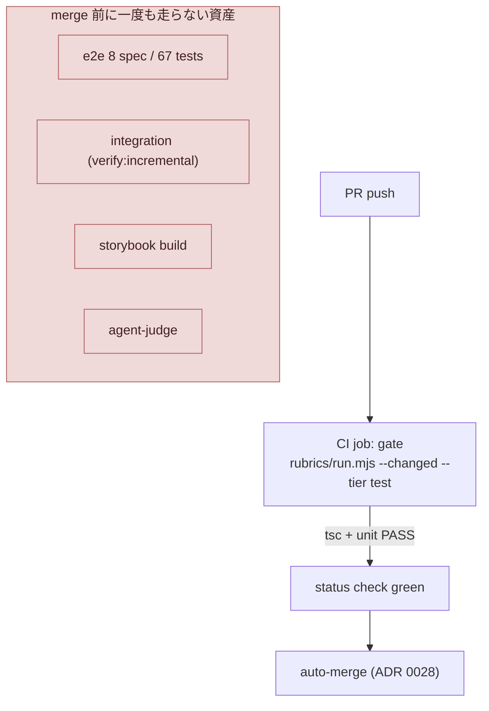
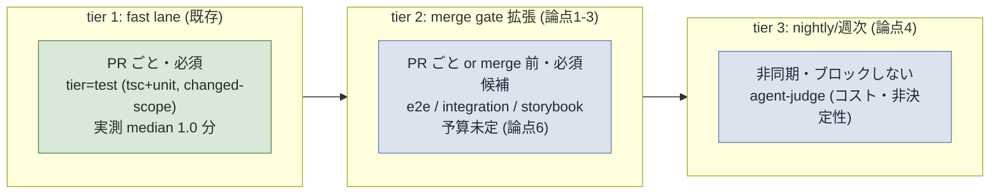

# issue #279 解説 — CI の本格設計（tier 設計と資産棚卸し）

目次: [1. Background](#1-background) ／ [2. Intuition](#2-intuition) ／ [3. Code](#3-code) ／ [4. Quiz](#4-quiz)

この教材の対象は GitHub issue #279（label: `task-request`, `needs-review`。「CI の本格設計 — テスト/rubric 資産の全量を tier 設計で CI に載せる（基盤構築期のザル CI からの卒業）」）である。PdM の注文は本文冒頭に明記されている——「解説強め。まず『CI 設計のいろは』を一般論から丁寧に解説し、わかりやすい外部解説記事へのリンクを添えること。その上で本プロジェクトの資産棚卸しと適応設計を説明する」。この指示に従い、本教材は Background の前半で CI/CD 設計の一般論を、後半で lathe 固有の前提を組み立てる。issue #279 は診断（何が足りないか）と論点（何を決めるべきか）を示す文書であり、まだ確定 plan ではない。したがって本教材が示す解決の方向は「設計論点への手がかり」であり、実装 PR の diff が着地して初めて事実の正本になる。

> [!IMPORTANT]
> issue #279 は 2026-07-08 時点で `needs-review`（人間キュー）である。7 つの設計論点は「plan 段で確定すべきこと」と明記されており、本教材はそれらに断定的な答えを与えない。未確定部分はすべて「未確認」と明記する。

---

## 1. Background

### 1.1 CI 設計のいろは（一般論）

まず前提知識をゼロと仮定して、CI（Continuous Integration）パイプライン設計の一般的な考え方を組み立てる。

**テストピラミッド。** ソフトウェアの自動テストは実行コストと信頼できる範囲がトレードオフの関係にある。単体テスト（unit）は 1 関数・1 モジュールを対象に数ミリ秒〜数十ミリ秒で終わるが、モジュール間の結線ミスは検出できない。統合テスト（integration）は複数モジュール（例: DB とアプリケーション層）の結線を検査するが、実行に外部リソース（DB プロセスなど）を要し秒〜分オーダーになる。E2E（end-to-end）テストはブラウザ操作などユーザー視点の経路を丸ごと検査するが、さらに遅く不安定（flaky）になりやすい。この「下ほど多く・軽く、上ほど少なく・重い」構成を「テストピラミッド」と呼ぶ——多くの検証を安価な下層に寄せ、高価な上層は本当に必要な経路だけに絞るという設計指針である。Google のテストブログはこの構成を「E2E テストを安易に増やすな（Just Say No to More End-to-End Tests）」という具体的な警句で説明している（一般に広く参照される議論）。

**fast lane / merge gate / nightly の 3 層。** テストピラミッドを実行タイミングの軸に投影すると、典型的な CI 設計は次の 3 層に分かれる。

1. **fast lane（PR 上で毎回・数分以内）**: 変更のたびに開発者へ即座にフィードバックを返す層。lint・型検査・変更に関係する単体テストなど、安価で決定的な検査を置く。
2. **merge gate（main へ入る直前・必須）**: fast lane より広いが、まだ「ブロックしてよい」コストに収まる検査。ここを通らない変更は物理的に main に入れない。
3. **nightly / 週次（非同期・ブロックしない）**: 実行に数十分〜数時間かかる重い検査（全量 E2E、負荷試験、非決定的な LLM 判定など）を、開発のクリティカルパスから外して定期実行する層。ここで検出された不具合は次のサイクルで拾う。

この 3 層分離の考え方は、Martin Fowler の継続的インテグレーションに関する古典的な整理（「ビルドは高速に保ち、遅い検査は非同期に回す」という原則）や、GitHub Actions・CircleCI など主要 CI サービスの公式ドキュメントが共通して推奨するパターンである。

**scoped 実行 vs 全量実行。** リポジトリが大きくなると、変更のたびに全テストを回すのは高コストになる。そこで「変更されたパスに関係するテストだけを選んで実行する」scoped 実行（differential / affected-only execution とも呼ばれる）が使われる。長所は高速化、短所は「依存関係の把握が誤っていると影響範囲を見落とす」リスクである。多くの実務チームは、PR 上は scoped、merge gate または nightly では全量、という二段構えでこのリスクを相殺する。

**flaky test 対策。** E2E や統合テストは環境要因（タイミング、ネットワーク、外部サービスの応答揺らぎ）で本質的でない失敗（flaky）を起こしやすい。典型的な対策は再試行（retry）、隔離（quarantine——不安定なテストを一時的に必須チェックから外して個別に追跡する）、および実行環境の決定性を上げること（fixture の自前生成、外部 API のモック化）である。

> [!NOTE]
> 外部リンクについて: WebSearch による実在確認ができない環境だったため、本教材では特定記事への直接 URL 掲載を見送る。一般に参照される資料としては、Martin Fowler の Continuous Integration に関する記述（martinfowler.com の同名記事）、Google Testing Blog のテストピラミッド／E2E テストに関する議論、および GitHub Actions・CircleCI 等の公式ドキュメントにある CI 設計ガイド（required status checks、テストの並列化・キャッシュ等）が挙げられる。これらはタイトルで検索すれば容易に到達できる著名な資料である。

### 1.2 lathe 固有の前提（前提知識ゼロから組み立てる）

ここからは lathe リポジトリ固有の仕組みを、登場する主体ごとに「何をするか・なんのために存在するか」を明記しながら組み立てる。

**inner loop と単一着地ゲート（ADR 0026）。** lathe は「lathe 自身を開発する agent 体制」を持つ（`AGENTS.md` の協働規律を参照）。1 つの task（= GitHub issue）を人手ゼロで main へ届ける機械が inner loop であり、実装（IMPLEMENT）の後に LAND（PR 作成 → review → auto-merge arm）が走る。ADR 0026 は 2026-07-04〜05 の incident（outer loop が gate を迂回して main に直接 push した事故）を契機に、「main に入る唯一の道は **PR + CI GREEN**」という単一着地ゲートを定めた。**CI が rubric gate をリモートで再実行する**ことが信頼境界そのものである——ローカルの agent が「検証した」と自己申告する receipt 制度は同 ADR で廃止され、re-execution（CI が実際に再実行して確かめる）に置き換えられた。つまり CI は単なる補助チェックではなく、lathe の統治構造の根幹をなす部品である。

**ADR 0028（着地の無人化）。** ADR 0026 の修正として、単一アカウント運用では PR author の self-approval が GitHub 仕様で不可能なため、required review（人間の承認必須化）は採用されていない。review の担保は「reviewer の verdict と本文を PR に投稿する（non-blocking）」＋「CI による gate 再実行」の組み合わせである。branch protection の required は **status checks のみ**（実際に `gh api repos/yutaro0915/lathe/branches/main/protection` で確認すると、`required_status_checks.contexts` は `["gate"]` の 1 本のみ、`enforce_admins: true`、required review 系の項目は存在しない——2026-07-08 実測）。これが issue #279 の論点(5)「branch protection」の現況である。

**`rubrics/run.mjs` — scope × tier の単一エンジン。** lathe の「機械で測れる規範」はすべて `rubrics/` 配下の `rubric.json` として定義され、`rubrics/run.mjs` という 1 本のスクリプトがこれを実行する。この仕組みは 2 つの軸を持つ。

- **scope（どれを）**: `--changed <paths>` で変更パスを渡すと、そのパスを「覆う」rubric だけが発火する（`rubrics/select.mjs` の逆依存グラフによる影響集合計算）。全 rubric を毎回走らせるのではなく、変更に関係するものだけに絞り込む——これが前述の「scoped 実行」の lathe における実装である。
- **tier（どこまで）**: 各 check は `verify.tier` を持ち（`cmd` / `test` / `heavy` の 3 段階）、`--tier <cmd|test|heavy>` で「その tier 以下の check だけ」を実行する。`rubrics/run.mjs` のコード上のコメントがこの対応をそのまま説明している。

```js
// rubrics/run.mjs
const TIER_RANK = { cmd: 0, test: 1, heavy: 2 };
```

`cmd` は grep・lint など高速で決定的な検査、`test` はそれに tsc（型検査）・unit を加えたもの、`heavy` は e2e・integration・storybook・agent-judge まで含む全量である。これは前節の「fast lane / merge gate / nightly」の 3 層構成と同型の設計思想——ただし lathe では 3 層を「別々のスクリプト」でなく「1 エンジンの tier パラメータ」として表現している点が特徴である。

**`scripts/preflight.mjs` — ローカル単一入口。** 開発者（および agent）がローカルで検証する入口は `pnpm preflight` の 1 つに統一されている。ファイル冒頭のコメントと `MODE_TIERS` がモードと tier の対応を明文化する。

```js
// scripts/preflight.mjs
//   --quick (Stop hook): tier=cmd   — fast deterministic checks only (~1-2s)
//   --fast             : tier=test  — + tsc + unit
//   --full             : tier=heavy — everything (e2e / storybook / integration / judges) = merge gate
const MODE_TIERS = {
  quick: 'cmd',
  fast: 'test',
  full: 'heavy',
};
```

つまり `--quick` は編集の都度（Stop hook が自動実行）、`--fast` は tsc・unit まで、`--full` は e2e・storybook・integration・judge まで含む「merge gate 相当」と、コメント自身が明記している。ここで注目すべきは、**`--full`（tier=heavy）が「merge gate」と自称していながら、実際の CI（GitHub Actions 側）はこの tier を回っていない**という食い違いである。これが issue #279 の核心の1つである（次節 Intuition で具体化する）。

**現行 `ci.yml` の実体。** `.github/workflows/ci.yml` は `pull_request` トリガで 1 job（`gate`）だけを持つ。Postgres の service container を用意し、`rubrics/run.mjs --changed <変更パス> --tier test` を実行する。ファイル冒頭のコメントが tier=heavy を CI で回さない理由を明記している。

```yaml
# .github/workflows/ci.yml
# tier=test（旧 merge.mjs backstop と同等）: tsc / unit / cmd 系のみ。
# heavy（e2e / storybook / integration / judge）を CI で回さない理由:
#   - e2e は ingest 済み実データ前提（2026-06-23 決定を維持）
#   - judge は LLM key を CI に置くまで skip（RUBRIC_SKIP_JUDGE=1）
#   → heavy は verifier 段（ローカル）の責務のまま。CI 昇格は #69 / TASK-16 系で再訪。
```

つまり「heavy を CI に上げる」という宿題は 2026-07-05 前後の時点で既に認識されており、issue #279 はこの宿題（#69 / TASK-16 系で言及される「heavy CI 昇格」の deferred 項目）を正式に引き上げる issue である。

**Discussion #251 の meta-audit 実測 — CI が非ボトルネックだという一次データ。** issue #279 が引用する「CI median 1.0 分」は、Discussion #251 のコメント（meta-audit、2026-07-08）に一次ソースがある。同コメントを実際に取得すると次の記載がある（原文引用）。

> CI は median 1.0 分・全 success で非ボトルネック。dispatch リードタイム（Ready→着手）は median 15 分・最大 52 分

この実測は「CI の実行時間そのものは遅くない」ことを裏付ける。つまり issue #279 の動機は「CI が遅いから」ではなく、「CI が速い代わりに検査範囲が狭く、e2e 67・integration・storybook・judge という広い資産が merge 前に一度も走っていない」という**範囲の不足**にある。この区別は重要である——時間予算の設計（論点6）を考えるときに「今は速いから余裕がある」と「広げても許容予算内に収まるか検証が要る」の両方を意識する必要がある。

### 1.3 資産棚卸し（2026-07-08 機械計測・issue 本文の数値）

issue #279 本文が列挙する資産棚卸しは次のとおりである。本教材でも `find` コマンドで一部を実地照合した（一致確認済み）。

| 資産 | 数量 | CI での実行状況 |
|---|---|---|
| unit（`scripts/*.test.mjs`） | 23 ファイル・889 tests（実地照合: ファイル数 23 で一致） | CI は changed-scope のみ |
| unit（TS） | 34 ファイル | CI は changed-scope のみ |
| e2e（`apps/web/e2e`、Playwright） | 8 spec・67 tests（実地照合: spec ファイル数 8 で一致） | **CI 未実行** |
| integration（`verify:incremental`、scratch DB） | — | **CI 未実行**（ci.yml に schema apply 手順は既にある） |
| storybook | build 検証 | **CI 未実行** |
| agent-judge | rubrics の LLM 審査層 | **CI 未実行**（コストと非決定性の扱いが未設計） |

`apps/web/package.json` を見ると `verify:incremental`（`tsx scripts/verify-incremental-ingest.ts`）と `build-storybook` / `test-storybook` のスクリプトは既に存在する——「作る」のでなく「CI に載せる」ことが issue #279 の主眼であることがここからも読み取れる。

---

## 2. Intuition

核心の直感は次の 1 行である。

> **今の CI（tier=test）は「変更 scope の tsc + unit」だけを見る狭い窓であり、e2e 67・integration・storybook・judge という広い資産は merge 前に一度も走らない。だから、それらの層が壊れる変更でも CI は green のまま main に入りうる。**

### 2.1 toy 例（架空・実形式）

架空の PR #900 を考える。ある変更が `apps/web/app/api/sessions/route.ts` の 1 関数を書き換え、対応する unit test（changed-scope 内）は通過するとする。しかし同じ変更が、E2E テスト `apps/web/e2e/session-list.spec.ts` が検査しているブラウザ操作のフロー（一覧画面のクリック → 詳細遷移）を壊してしまったとする。

| | 実測される状態 |
|---|---|
| `rubrics/run.mjs --changed apps/web/app/api/sessions/route.ts --tier test`（= CI が実際に回す内容） | tsc PASS・関連 unit PASS → **CI green** |
| `rubrics/run.mjs --changed apps/web/app/api/sessions/route.ts --tier heavy`（= `pnpm preflight --full`、ローカルでしか回らない） | 同じ unit は PASS だが `session-list.spec.ts` が **FAIL** |

PR #900 は CI 上は green のまま auto-merge される（ADR 0028）。e2e の破壊は、たまたま誰かがローカルで `--full` を回すか、次に別の目的でその spec に触れた開発者が気づくまで main に残り続ける。これが issue #279 の「基盤構築期のザル CI」という表現が指す具体的な失敗モードである（架空の例だが、`ci.yml` のコメントが明記する「heavy を CI で回さない」という設計選択の直接の帰結として起こりうる）。

### 2.2 現状のフロー図



### 2.3 tier 1 → 2 → 3 の理想像（issue が要求する段階改修）

issue #279 の成果物は「CI 設計文書＋ ci.yml の段階改修（tier 1 → 2 → 3 の順・big-bang 禁止）」である。一般論（1.1 節）の 3 層モデルに対応づけると次の形になる（未確定の設計であることに注意——以下は 1.1 節の一般原則を issue 本文の論点にあてはめた場合の一例であり、plan 段で変わりうる）。



> [!NOTE]
> この図は issue 本文の論点(1)〜(4) を一般論の 3 層モデルに当てはめた一案にすぎない。「e2e/integration を PR 必須にするか nightly にするか」「judge を tier 2 と 3 のどちらに置くか」はいずれも issue 本文が明記する未確定の設計論点であり、本教材が結論を出すものではない。

---

## 3. Code

接地資料を、issue 本文が挙げる 7 つの設計論点に沿ってウォークスルーする。

### 3.1 論点(1) tier 設計・論点(2) scoped vs 全量

現行の tier ランクは `rubrics/run.mjs` にハードコードされている。

```js
// rubrics/run.mjs
const TIER_RANK = { cmd: 0, test: 1, heavy: 2 };
```

`preflight.mjs` の `MODE_TIERS`（`quick→cmd` / `fast→test` / `full→heavy`）とあわせて、ローカルの 3 モードと rubric の 3 tier は既に 1 対 1 対応している。issue #279 の論点(1)「PR の fast lane（何分目標か）／merge 必須 check／nightly・週次 heavy の 3 層に何をどう割り当てるか」は、この既存の tier 語彙をそのまま CI 側のジョブ構成にどう写像するかという問題である——**新しい tier 概念を発明する必要はない**（tier=cmd/test/heavy は既にある）。決めるべきは「どの GitHub Actions job にどの tier を割り当て、どのタイミングで起動するか（`pull_request` / `merge_group` / `schedule`）」である（未確認）。

論点(2)「scoped vs 全量」は `run.mjs` の `--changed` 経路そのものである。

```js
// rubrics/run.mjs — --changed で scope が変更パスを覆う rubric だけ発火
if (args[0] === '--changed') {
  changed = args.slice(1);
  const graph = buildReverseGraph(changed);
  selection = selectRubrics({ changed, graph, rubrics: all });
  // 発火 = invariant ∨ (scope ∩ 影響集合 ≠ ∅) ∨ declared-edge
```

現行 CI は `--changed` の scoped 実行のみを使う（`git diff --name-only origin/${{ github.base_ref }}...HEAD` で変更パスを集めて渡す、`ci.yml` 51-56 行目）。e2e・storybook のような「特定パスに閉じない」全体的な検査は scoped の考え方になじみにくい（e2e はアプリ全体の振る舞いを見るため、個別ファイルの変更と 1 対 1 対応しない）。issue 本文が「scoped の見落とし方が設計リスク」と書くのはこの点を指しており、PR 上は scoped、merge gate では明示指定（全 rubric 引数を渡す、または tier=heavy を無条件全量実行）に切り替える設計が一般論（1.1 節の二段構え）と整合する（未確認・plan 段で確定）。

### 3.2 論点(3) e2e/integration の CI 化

`ci.yml` は既に Postgres の service container と schema apply 手順を持っている。

```yaml
# .github/workflows/ci.yml
services:
  postgres:
    image: postgres:16-alpine
    ...
- name: apply schema
  run: |
    sudo apt-get update -qq && sudo apt-get install -y -qq --no-install-recommends postgresql-client
    psql "$DATABASE_URL" -f apps/web/db/schema.sql
```

integration（`verify:incremental`、`apps/web/package.json` に `"verify:incremental": "tsx scripts/verify-incremental-ingest.ts"` として存在）はこの Postgres 環境をそのまま使える見込みが高い（未確認）。一方 e2e は `ci.yml` のコメントが明記するとおり「ingest 済み実データ前提（2026-06-23 決定）」という追加の前提を持つ——CI 環境でこの前提をどう満たすか（fixture データを CI 用に用意する、または ingest ステップを CI に足す）は未確定であり、issue 本文が挙げる「実行時間とフレーク対策（retry 方針・quarantine）」とあわせて plan 段の検討事項である。

### 3.3 論点(4) agent-judge の置き場

`rubrics/run.mjs` の judge 実行はこう実装されている。

```js
// rubrics/run.mjs — judge 実行
const tier = v.tier ?? (v.judge ? 'heavy' : 'cmd');
```

judge check は明示 `tier` 指定がなければ既定で `heavy` に分類される。`ci.yml` は `RUBRIC_SKIP_JUDGE=1` を環境変数に立てて judge 系 check を丸ごと skip している（コメント: 「judge は LLM key を CI に置くまで skip」）。つまり現状は「CI に LLM API key を置く／置かない」という秘密情報管理の判断が judge の CI 昇格を阻んでいる技術的な理由であり、加えて issue 本文はコスト（LLM 呼び出し課金）と非決定性（同じ diff でも judge の判定がぶれうる）という 2 つの追加論点を挙げる。一般論（1.1 節）に照らせば、非決定的で高コストな検査は nightly 層に置くのが定石だが、「plan にない設計判断」を検出する judge の価値を merge 前に得たいなら PR 必須にする選択もありうる——このトレードオフの決定は plan 段（未確認）。

### 3.4 論点(5) branch protection

現行の branch protection 設定を実地確認すると次のとおりである（`gh api repos/yutaro0915/lathe/branches/main/protection`、2026-07-08 実測）。

```json
{
  "required_status_checks": { "contexts": ["gate"] },
  "enforce_admins": { "enabled": true },
  "allow_force_pushes": { "enabled": false },
  "allow_deletions": { "enabled": false }
}
```

required check は `gate`（= `ci.yml` の唯一の job 名）1 本のみで、required review の設定は存在しない。これは ADR 0028 の決定（単一アカウント運用では self-approval が GitHub 仕様で不可能なため required review は不採用）と整合する。issue #279 が tier 2/3 の job を追加する場合、それらを required checks に加えるかどうか（加えれば PR は新 job の green を待たないと merge できなくなる、加えなければ「実行はするが blocking しない」情報提供的な位置づけになる）が論点(5)の実質である（未確認）。

### 3.5 論点(6) budget・論点(7) 実行環境

論点(6)「PR CI の時間予算（例: ≤5 分）と、超過したときの逃がし先」は、Discussion #251 の実測（CI median 1.0 分・非ボトルネック）を踏まえると、**現状には予算の余裕がある**ことを示唆する。ただし e2e 67 tests・storybook build・integration を追加した場合の実測時間はまだ計測されていない（未確認）。「逃がし先」は 1.1 節の nightly 層がそのまま候補になる。

論点(7)「case 常駐移行後の実行環境（GitHub hosted runner で完結か・self-hosted を使うか）」について、`design/loops.md` は orchestrator（配車）を「launchd（5 分間隔）→ `scripts/orchestrator.mjs`」と記述しており、これは lathe 開発体制の **dispatch**（inner loop を起動する常駐プロセス）を指す——GitHub Actions の実行環境（runner）そのものとは別の主体である。現行 `ci.yml` は `runs-on: ubuntu-latest`（GitHub hosted runner）を使っている。case（PdM の作業機）へ orchestrator が移行した後も GitHub Actions 自体は変わらず GitHub hosted runner で完結するのか、それとも case 上で self-hosted runner を立てる設計に変わるのかは、issue 本文が明示するとおり未確定の論点である（未確認）。

---

## 4. Quiz

中難度 5 問。選択肢から 1 つ選び、`<details>` を開いて答え合わせをする（クリック採点は持たない）。

### Q1. Discussion #251 の meta-audit 実測によれば、現行 CI の実行時間の位置づけはどれか。

- (a) median 1.0 分・全 success で非ボトルネック
- (b) median 15 分・dispatch リードタイムと同水準
- (c) p95 52 分でボトルネックの主因
- (d) 実測されておらず未計測

<details><summary>答えと解説</summary>

**a**。Discussion #251 のコメント原文は「CI は median 1.0 分・全 success で非ボトルネック。dispatch リードタイム（Ready→着手）は median 15 分・最大 52 分」と明記する。median 15 分・最大 52 分は CI ではなく dispatch リードタイム（Ready→着手の待ち時間）の実測値であり（b・c は取り違え）、実測は既に存在する（d は誤り）。issue #279 の動機は「CI が遅いから」ではなく「CI が速い代わりに検査範囲が狭い」という点にある。
</details>

### Q2. 現行 `ci.yml` が e2e / storybook / agent-judge を CI で実行していない理由として、ファイル内コメントが明記していないものはどれか。

- (a) e2e は ingest 済み実データ前提である
- (b) heavy 系検査は CI の時間予算を超過することが実測で確認されている
- (c) judge は LLM key を CI に置くまで skip している
- (d) heavy は verifier 段（ローカル）の責務のままであり CI 昇格は別 issue で再訪する

<details><summary>答えと解説</summary>

**b**。`ci.yml` 冒頭のコメントが明記する理由は a（e2e の ingest 済み実データ前提）・c（judge の LLM key 未配置）・d（heavy は CI 昇格が deferred 扱い）の 3 点であり、いずれも「時間予算の超過」を理由として挙げていない。実際 Discussion #251 の実測（Q1 参照）は CI が非ボトルネックであることを示しており、b のような時間予算超過の実測は接地資料に存在しない。
</details>

### Q3. `rubrics/run.mjs` と `scripts/preflight.mjs` の tier 対応関係として正しいものはどれか。

- (a) `preflight --quick` は tier=heavy、`--full` は tier=cmd（tier が入れ替わっている）
- (b) tier は `preflight.mjs` にのみ存在し `run.mjs` は認識しない
- (c) `preflight --quick` は tier=cmd、`--fast` は tier=test、`--full` は tier=heavy
- (d) `--changed` を渡すと tier 指定は無視される

<details><summary>答えと解説</summary>

**c**。`scripts/preflight.mjs` の `MODE_TIERS` は `{ quick: 'cmd', fast: 'test', full: 'heavy' }` であり、`rubrics/run.mjs` の `--tier <cmd|test|heavy>` にそのまま渡される。`run.mjs` 自身が `TIER_RANK = { cmd: 0, test: 1, heavy: 2 }` を持ち tier 概念の実体を定義するため b は誤り。`--changed` は scope（どのパスの rubric を発火させるか）を決めるだけで、tier（どの深さの check まで実行するか）とは独立の軸なので d も誤り。a は quick/full の tier 対応が実際と入れ替わっている。
</details>

### Q4. 現行の branch protection（main、2026-07-08 実測）の記述として正しいものはどれか。

- (a) required review が必須で、author の self-approval が可能に設定されている
- (b) force push・deletion が許可されている
- (c) required status checks が未設定で誰でも直接 push できる
- (d) required status checks は `gate` の 1 本のみで、required review の設定は存在しない

<details><summary>答えと解説</summary>

**d**。`gh api repos/yutaro0915/lathe/branches/main/protection` の実測では `required_status_checks.contexts` が `["gate"]` の 1 本のみで、required review 系の設定項目自体が存在しない。これは ADR 0028（単一アカウント運用では self-approval が GitHub 仕様で不可能なため required review は不採用）と整合する。`allow_force_pushes` と `allow_deletions` はいずれも `enabled: false` なので b は誤り。required status checks は設定されており c も誤り。a は required review が設けられていない現状と矛盾する。
</details>

### Q5. issue #279 の成果物として明記されている改修方針はどれか。

- (a) tier 1 → 2 → 3 の順に段階改修し、CI 設計文書と preflight/CI 対応表を明文化する
- (b) ci.yml を一度に全面書き換える big-bang 改修
- (c) e2e・storybook・integration を即座にすべて必須 check に昇格する
- (d) rubrics/run.mjs を廃止し新エンジンに置き換える

<details><summary>答えと解説</summary>

**a**。issue #279 の「成果物」欄は「CI 設計文書（design/）＋ ci.yml の段階改修（tier 1 → 2 → 3 の順・big-bang 禁止）＋ preflight と CI の対応表の明文化」と明記する。b は本文が明示的に禁じる big-bang 改修であり誤り。c は「即座に全部必須化」を指すが、論点(4)(5)(6) が示すとおり、どれを必須にしどれを nightly に置くかは段階的に決める設計論点であり本文はそう指示していない。d は本文のどこにも記載がなく、`run.mjs` は scope×tier の単一エンジンとして維持される前提で論点が組まれている。
</details>
