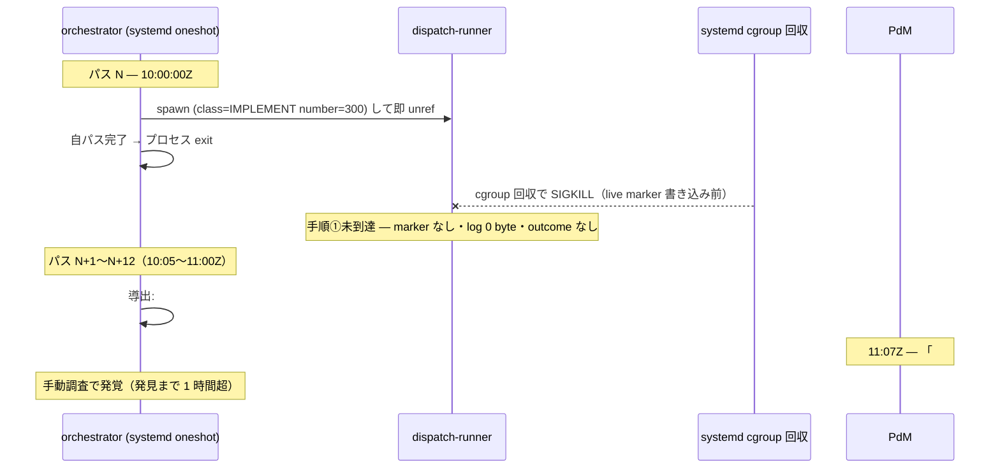
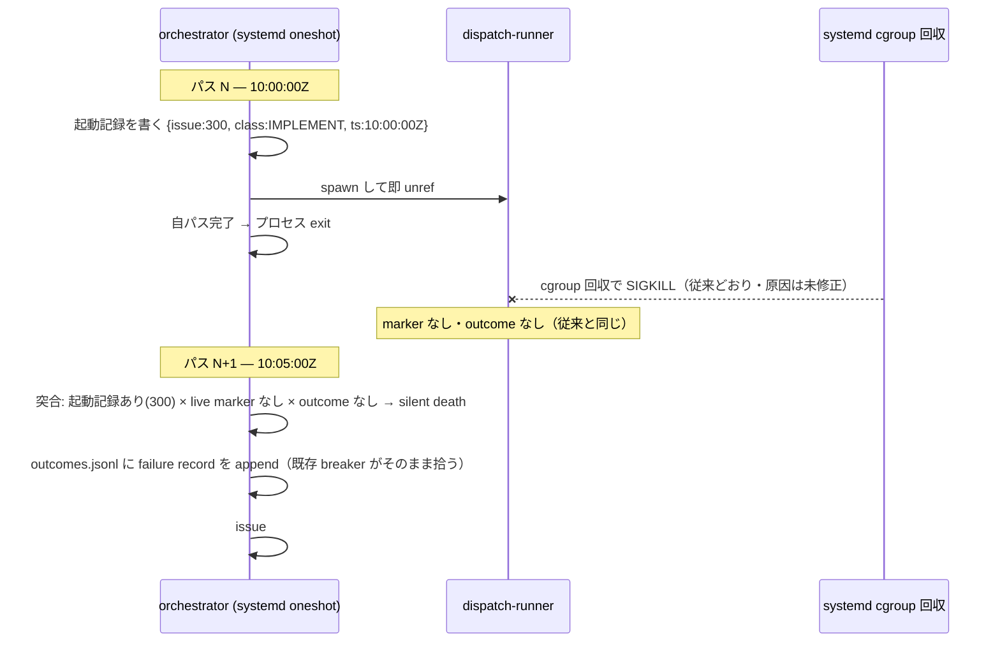
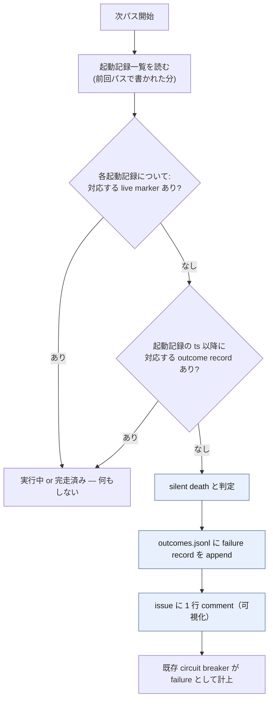

# issue #281 解説教材 — orchestrator の dispatch 即死検知

対象は lathe の issue #281（plan・実装 PR はまだ無い）。タイトルは「orchestrator: dispatch 即死検知 — 起動記録 × live marker × outcome の突合で silent death を 1 パス以内に可視化」である。本教材は要約ではなく展開であり、読者が前提知識ゼロから issue #281 の世界を組み立てられることを目標とする。

## 目次

- [1. Background](#1-background)
- [2. Intuition](#2-intuition)
- [3. Code](#3-code)
- [4. Quiz](#4-quiz)
- [接地資料](#接地資料)

---

## 1. Background

issue #281 は、lathe の自動 dispatch 機構（orchestrator）に生じた「子プロセスが産まれた直後に全滅し、誰も気づけない」という障害を根本原因とする plan である。理解には、誰が・何を・なぜ行うかを 1 つずつ押さえる必要がある。前提知識を仮定せず順に説明する。

### orchestrator — 5 分間隔の配車係

**orchestrator**（`scripts/orchestrator.mjs`）は、lathe の自動開発ループを回すために **1 プロセス 1 パス**で動く配車係である。常駐せず、スケジューラ（後述）が一定間隔で起動しては終了する。1 パスの中身は次の 4 段階である（`design/loops.md`）。

1. **derive**: GitHub（gh）から全 open issue・全 open PR・盤面の Status を導出する（`orchestrator-derive.mjs`）。lathe は状態をどこにも保存せず、常に gh の現在の姿から都度計算し直す（ADR 0031）。
2. **classify**: 導出結果を仕事クラス（IMPLEMENT / PLAN / EXPLAIN / PR_REVIEW）または待機クラス（WAIT_PR・WAIT_HOLD 等）に分類する（`orchestrator-classify.mjs`）。
3. **dispatch**: 仕事クラスに分類された対象を並列 spawn する（上限 5）。
4. **盤面投影**: 盤面・label を実状態へ同期する（非致命）。

dispatch は **fire-and-forget** である。orchestrator は子プロセスを spawn したら完走を待たずに `unref()` して自分のパスを終える。子の生死・完走はどこか別の場所が引き継ぐ必要がある——それが次に説明する dispatch-runner である。

### dispatch-runner — 子ライフサイクルの一括管理者

orchestrator が直接起動するのは実コマンド（`inner-loop.mjs` や `claude -p` 等）ではなく、`scripts/dispatch-runner.mjs` という 1 段のラッパである。dispatch-runner は 1 回の dispatch につき次の 5 手順を**順番に**実行する。

1. **live marker 書き込み**（`.lathe/runs/live-<class>-<n>.json` に自分の PID・class・number・startedAt を書く）
2. 実コマンドを `spawnSync` で同期実行（完走を待つ）
3. EXPLAIN 後処理（CLASS_EXPLAIN のみ）
4. **outcome 記録**（`.lathe/runs/outcomes.jsonl` に成否を 1 行 append）
5. live marker 削除

重要なのは、**この 5 手順すべてが dispatch-runner 自身のプロセスが起動して JS コードを実行し始めて初めて発生する**という点である。dispatch-runner が「起動を試みられたが JS を 1 行も実行できないまま消える」場合、手順 1 の live marker すら書かれない。

### live marker と outcomes ledger — 何のためにあるか

- **live marker**（`.lathe/runs/live-*.json`）: 「driver が今も生きている」痕跡。orchestrator は次パスで marker の PID が生存していれば「実行中」と判定し、二重 dispatch を避ける（`deriveRunningTargets`）。PID が死んでいる marker は stale として削除する。
- **outcomes.jsonl**: dispatch 1 件ごとの成否を記録する cross-pass の ledger。`breakerFromLedger` がこれを fold し、**circuit breaker**（連続 failure が閾値に達したら dispatch を止める仕組み）の状態を復元する。success はカウントをリセットし、failure は加算し、escalation は数えない（escalation は PdM の裁定待ちであり故障ではない）。

circuit breaker が存在する理由は、「壊れたパイプラインに何度も突っ込んで無駄撃ちしない」ためである。ただしこの breaker は **outcomes.jsonl に記録が append されて初めて働く**。dispatch-runner が record を書く前に消えれば、breaker はその失敗を永久に知らない。

### スケジューラの cutover — launchd（Mac）から systemd（case, 2026-07-08）へ

issue #281 の本文が「実測 2026-07-08・case cutover 直後」と記す背景がこれである。lathe の orchestrator は元々 Mac の launchd（`StartInterval` による定周期起動）で動いていたが、`design/runbooks/case-orchestrator-residency.md` の記録どおり、本日 2026-07-08 に NixOS（`case`）の systemd user timer + oneshot service へ移設された（`ops/systemd/lathe-orchestrator.service` / `.timer`）。

> [!IMPORTANT]
> systemd の `Type=oneshot` サービスは、`ExecStart` に指定したプロセス（ここでは `orchestrator.mjs`）が終了した時点で「完了」と見なされる。systemd はデフォルトで、サービスに紐づく **cgroup（control group）配下の全プロセスを、サービス完了時に回収（kill）する**。Node の `spawn(..., { detached: true })` は Unix のセッション（setsid）を新しく作るだけであり、これは cgroup とは別軸の仕組みである——明示的に別 cgroup へ移す操作（`Delegate=` 付きの `systemd-run --scope` 等）をしない限り、detached な子プロセスも親サービスと同じ cgroup に残る。orchestrator のパス自体は既に完了しているため、まだ起動中の dispatch-runner（や、その先の driver）は cgroup 回収で **産まれた直後に SIGKILL される**可能性がある。

これが issue #281 の言う「systemd の cgroup 回収により dispatch された子プロセスが産まれた直後に全滅した」の実体である。launchd では常駐プロセスとして扱われていたため顕在化しなかった問題が、systemd oneshot への移設で露出した。

### 現状の可視性の穴

dispatch-runner が手順 1（live marker 書き込み）に到達する前に死ぬと、次の 3 つがすべて「無い」状態になる。

- live marker が書かれていない（stale 掃除の対象にすらならない——そもそも marker 自体が存在しない）
- run ログが 0 byte（親が `openSync` でファイルは作るが、子が何も書かずに消える）
- outcomes.jsonl に record が無い（circuit breaker はこの失敗を一切知らない）

orchestrator の次パスから見ると、この issue は「一度も dispatch されなかった」のと区別がつかない。issue #281 の実測では、この不可視性のために発見まで **1 時間超**を要し、しかも発見の起点は機械の signal ではなく **PdM の質問**だった。

### 関連 issue #254 と再発防止の位置づけ

issue #281 は「関連: #254（途中死型の検知・実装中）・再発防止 4 層の層 1」と本文に記す。#254 は「driver が走り始めた後、API 通信断でハングして死ぬ」という**途中死**（dead-driver）を扱う（対策 2: open PR あり × 生存痕跡なし × auto-merge 未 arm で dead-driver 判定）。対して #281 は「dispatch-runner が走り始める**前・直後**に死ぬ」という**即死**（silent death）を扱う。両者はどちらも「driver の死を、痕跡の欠如から間接的に検知する」という同じ設計原理を共有するが、検知に使う痕跡の組が異なる（#254 は open PR の有無、#281 は起動記録の有無）。「再発防止 4 層」の他の 3 層が具体的に何を指すかは issue #281 の本文からは確認できない（未確認）。

---

## 2. Intuition

核心の直感は 1 文で言える。**「起動したことの記録」を、死にうる子プロセス自身でなく、死ににくい orchestrator 自身の手で先に残しておけば、その後どこで何が死んでも「起動したのに何も痕跡が無い」という矛盾から死を逆算できる**。

以下、実際に起きた事象の形を toy データで追う（issue 番号 300・タイムスタンプは架空だが実形式）。

### before — 起動記録が無いので死が消える



toy の run ログ・live marker・outcomes.jsonl はこうなる。

```
$ cat .lathe/runs/issue-300.log
$                                        # 0 byte

$ ls .lathe/runs/ | grep 300
$                                        # 何も無い（live-implement-300.json は存在しない）

$ grep '"number":300' .lathe/runs/outcomes.jsonl
$                                        # 該当行なし
```

### after — 起動記録が死を逆算する



起動記録は次のような toy JSON になる。

```json
{ "issueNumber": 300, "class": "IMPLEMENT", "ts": "2026-07-08T10:00:00.000Z" }
```

10:05Z のパスでこれを読み、「live marker が無い」「outcomes.jsonl にこの起動以降の record が無い」の 2 つを確認できれば、原因を問わず「この dispatch は死んだ」と結論できる。結果として append される outcome record は次のような形になる（フィールド名は既存 `buildOutcomeRecord` のスキーマに揃える）。

```json
{ "finishedAt": "2026-07-08T10:05:00.000Z", "class": "IMPLEMENT", "kind": "issue", "number": 300, "outcome": "failure", "exitCode": null }
```

この record は**既存の** `breakerFromLedger` がそのまま fold する——新しい breaker を作る必要がない。silent death も「1 回の failure」として、通常の driver failure と同じ扱いで連続カウントされ、閾値に達すれば dispatch が止まる（3 章で詳述）。

3 条件の突合を flowchart で見ると次のようになる。



> [!NOTE]
> 検知は原因非依存である（issue #281 本文）。cgroup 回収・認証切れ・未知の理由のいずれで死んでも、「起動記録あり × marker なし × outcome なし」という形は同じになる。原因ごとに分岐を作る必要がない。

> [!TIP]
> #254（途中死＝dead-driver）は「open PR はあるのに生存痕跡が無い」を見る。#281（即死＝silent death）は「起動記録はあるのに live marker も outcome も無い」を見る。どちらも「本来あるはずの後続痕跡が欠けている」ことから死を逆算する同じ原理だが、#281 は #254 よりさらに手前——PR どころか live marker すら生まれない段階——を対象にする。

---

## 3. Code

issue #281 は plan であり実装 PR はまだ無い。ここでは diff ではなく、plan が触る現行コードの現状抜粋と、plan の変更方針を理解できる順に歩く。

### 現状①: 起動記録が存在しない — `spawnDecision`（`scripts/orchestrator.mjs`）

orchestrator が dispatch-runner を spawn する箇所は次のとおりである。

```js
function spawnDecision(decision) {
  mkdirSync(RUNS_DIR, { recursive: true });
  const spec = buildDispatchSpec(decision);
  const logPath = join(RUNS_DIR, `${spec.logKey}.log`);
  let outFd = null;
  try { outFd = openSync(logPath, 'a'); } catch { /* 開けなくても spawn は試みる */ }
  let child;
  try {
    child = spawn(process.execPath, [
      DISPATCH_RUNNER, decision.class, decision.kind, String(decision.number),
    ], {
      cwd: REPO_ROOT,
      env: process.env,
      stdio: ['ignore', outFd ?? 'ignore', outFd ?? 'ignore'],
      detached: true,
    });
  } catch (err) {
    if (outFd !== null) closeSync(outFd);
    log(`warning: spawn dispatch-runner failed for ${decision.class} #${decision.number}: ${err.message}`);
    return;
  }
  child.unref();
  if (outFd !== null) closeSync(outFd);
}
```

現状の性質は、**この関数がログファイルを開く以外、何も永続記録を残さない**点である。`spawn` が成功したという事実そのものは、dispatch-runner が実際に手順①（live marker 書き込み）へ到達するかどうかとは無関係に、orchestrator のプロセスメモリの中にしか存在しない。orchestrator 自身がこのパスの直後に exit してしまえば、「dispatch を試みた」という事実は跡形もなく消える。

### 現状②: live marker は dispatch-runner 自身が書く — `dispatch-runner.mjs`

```js
// ① live marker 書き込み（AC4）
const markerPath = join(RUNS_DIR, liveMarkerName(decision.class, decision.number));
try {
  writeFileSync(markerPath, `${JSON.stringify({
    pid: process.pid,
    class: decision.class,
    kind: decision.kind,
    number: decision.number,
    startedAt: new Date().toISOString(),
  }, null, 2)}\n`, 'utf8');
} catch (err) {
  log(`warning: live marker write failed for ${markerPath}: ${err.message}`);
}
```

この書き込みは dispatch-runner のプロセスが実際に走り始めて初めて実行される。cgroup 回収がこの行より前にプロセスを殺せば、marker は永久に生まれない。同じ理由で、末尾の outcome 記録（`appendFileSync(OUTCOMES_PATH, ...)`）も実行されない。

### 現状③: 次パスの読み取りは live marker しか見ない — `readLiveMarkerEntries` / `deriveRunningTargets`

```js
function readLiveMarkerEntries() {
  let names = [];
  try { names = readdirSync(RUNS_DIR); } catch { return []; }
  return names
    .filter((name) => name.startsWith('live-') && name.endsWith('.json'))
    .map((name) => {
      let content = '';
      try { content = readFileSync(join(RUNS_DIR, name), 'utf8'); } catch { /* stale 扱い */ }
      return { name, marker: parseLiveMarker(content) };
    });
}
```

このコードは `RUNS_DIR` の中の `live-*.json` だけを見る。silent death のケースでは対象の marker ファイル自体が存在しないため、`entries` にも現れない。次パスの orchestrator にとって、この issue は「一度も dispatch されていない issue」と完全に同じ見た目になる。

### 現状④: circuit breaker は outcomes.jsonl だけを fold する — `breakerFromLedger` / `applyBreaker`

```js
export function applyBreaker(state, outcome, maxFailures) {
  if (outcome === OUTCOME_ESCALATION) return { ...state };
  if (outcome === OUTCOME_SUCCESS) return { consecutiveFailures: 0, open: state.open };
  const consecutiveFailures = state.consecutiveFailures + 1;
  const open = state.open || (maxFailures > 0 && consecutiveFailures >= maxFailures);
  return { consecutiveFailures, open };
}

export function breakerFromLedger(records, maxFailures) {
  let state = { consecutiveFailures: 0, open: false };
  for (const rec of records ?? []) {
    if (!rec?.outcome) continue;
    state = applyBreaker(state, rec.outcome, maxFailures);
    if (state.open) return state;
  }
  return state;
}
```

`applyBreaker` は `outcome` フィールドを持つ record を渡されればそれが何によって作られたかを問わない。つまり **silent death を「outcome: 'failure' の record」として outcomes.jsonl に append できさえすれば、この breaker ロジックは一切変更せずに再利用できる**。これが 2 章で述べた「既存 breaker がそのまま拾う」の実体である。

### plan の変更方針（issue #281 の 3 ステップ）

1. **起動記録の追加** — `spawnDecision`（または dispatch-runner の起動直後）に、issue 番号・class・timestamp を記録するステップを足す。プロセスが cgroup 回収で即死しても記録が残るためには、**dispatch-runner 自身でなく、それを spawn した orchestrator 側の同期処理内で書く**のが自然である（orchestrator のプロセスは `spawn()` 呼び出し直後もまだ生きており、このタイミングでの書き込みは cgroup 回収の影響を受けない）。record の保存形式（live marker と同様の個別ファイルか、追記式 ledger か）は plan 段の設計判断として issue 本文では確定していない（未確認）。
2. **次パスの突合** — 次パスの orchestrator が、起動記録・live marker・outcomes.jsonl の 3 つを読み合わせ、「起動記録あり × live marker なし × outcome 記録なし」の 3 条件がすべて成立する対象を **silent death** と判定する。判定は `deriveRunningTargets` や `breakerFromLedger` と同じ流儀で**純関数**として切り出し、gh や fs を叩かずに unit test できる形にする（issue 本文の検証欄が明記）。
3. **failure として記録 ＋ 可視化** — 判定された silent death を outcomes.jsonl に `outcome: 'failure'` の record として append し（4 章の「現状④」がそのまま fold する）、対象 issue に 1 行 comment を投影する。comment の文面・失敗理由の記述形式は plan 段の設計判断であり未確定。

### 検証（plan 記載）

issue #281 は次の 2 種の検証手段を挙げる。

- **突合判定の純関数 unit** — 「起動記録あり × live marker なし × outcome なし」の 3 条件を入力オブジェクトだけで判定する純関数を、既存の `deriveRunningTargets` / `breakerFromLedger` と同じ流儀で unit test する。
- **fake spawn で即死を注入する統合的な unit** — 実際に spawn した子が起動記録だけ残して即死する状況を fake で再現し、次パスで failure が記録されることを確認する。

---

## 4. Quiz

中難度 5 問。実質を理解していないと解けないが、ひっかけではない。

### Q1. issue #281 が報告する「silent death」実測時に、対象の run ログ・live marker・outcomes.jsonl はどう見えたか。

- (a) run ログに `API Error: FailedToOpenSocket` が記録され、live marker は残っていた
- (b) live marker は残っていたが outcomes.jsonl に `outcome: "failure"` が記録されていた
- (c) run ログは 0 byte、live marker マーカーファイルは存在せず、outcomes.jsonl にも該当行が無い
- (d) escalation label が付き、report comment が issue に投稿されていた

<details><summary>答えと解説</summary>

**c**。issue #281 本文は「run ログ 0 byte・DONE 行なし・issue 痕跡なし」と明記する。dispatch-runner が手順①（live marker 書き込み）にすら到達せず死んだため、live marker は書かれず、outcomes.jsonl への append（手順④）も実行されない。(a) は #254 が扱う「途中死」（API 通信断でのハング）の指紋であり本件とは別の障害。(b) は矛盾する組み合わせ（outcome があるなら死は既に可視化されている）。(d) は escalation 投影が成功した場合の話で、本件は escalation の痕跡すら残らない即死である。

</details>

### Q2. cgroup 回収が detached な子プロセスまで殺しうるのはなぜか。

- (a) Node の `spawn({ detached: true })` が失敗し例外を投げるため
- (b) systemd の `Type=oneshot` は子プロセスの起動そのものを禁止するため
- (c) orchestrator.lock の PID 排他が dispatch-runner の PID と衝突するため
- (d) `detached: true` は Unix セッション（setsid）を新設するだけで systemd の cgroup とは別軸であり、明示的に別 cgroup へ移さない限り子プロセスは親サービスの cgroup に残り、サービス完了時の cgroup 回収に巻き込まれるため

<details><summary>答えと解説</summary>

**d**。cgroup と Unix プロセスセッションは別々の分類軸である。`detached: true` は親のプロセスグループから切り離す（setsid 相当）だけで、systemd が管理する cgroup からは切り離さない。`Type=oneshot` サービスは `ExecStart` のプロセスが終了すれば「完了」と見なされ、既定では紐づく cgroup 配下の残存プロセスを回収する。orchestrator 自身のパスはすぐ終わるため、まだ起動途中の dispatch-runner がこの回収に巻き込まれうる。(a) は spawn 自体は成功する（unref 後の子が消えるだけ）。(b) は誤り——子プロセスの起動自体は禁止されない。(c) は lock の話で本件の cgroup 回収とは無関係。

</details>

### Q3. plan が提案する silent death 判定の 3 条件の AND はどれか。

- (a) 起動記録が存在する × 対応する live marker が無い × 対応する outcome record が無い
- (b) escalation label が付いている × needs-review label が無い × 盤面が Ready でない
- (c) open PR が存在する × auto-merge が未 arm × live marker が無い
- (d) circuit breaker が open している × maxFailures に到達している × dry-run でない

<details><summary>答えと解説</summary>

**a**。issue #281 の方針は「起動記録あり × live marker なし × outcome 記録なし → failure として記録」である。(c) は #254 が扱う dead-driver（途中死）判定の 3 条件であり、#281 の即死判定とは対象段階が異なる（#254 は PR ができた後の死、#281 は PR どころか live marker すら生まれる前の死）。(b) は WAIT_APPROVAL 系の分類条件で無関係。(d) は breaker が open した後の挙動であり判定条件ではない。

</details>

### Q4. silent death を検知した結果は、なぜ新しい circuit breaker を作らず既存の `breakerFromLedger` にそのまま乗せられるのか。

- (a) `breakerFromLedger` が `class` フィールドで IMPLEMENT 専用の分岐を持つため
- (b) `applyBreaker` は record の `outcome` フィールドが `'failure'` であることだけを見て加算するため、silent death を通常の failure と同じ形の record として outcomes.jsonl に append すれば既存ロジックが無変更で拾えるため
- (c) `breakerFromLedger` が silent death 専用の `outcome: 'silent-death'` 値を既に受理する実装になっているため
- (d) live marker が無い record は自動的に無視されるガード節が `applyBreaker` にあるため

<details><summary>答えと解説</summary>

**b**。`applyBreaker(state, outcome, maxFailures)` は `outcome` の値（`'success'` / `'escalation'` / それ以外は failure 扱い）だけを見る純関数で、record の由来（driver の通常failureか silent death かどうか）を区別しない。したがって silent death を通常の `outcome: 'failure'` record として append するだけで、既存のロジックを一切変更せずに breaker が反応する。(a) はそのような class 分岐は現状のコードに存在しない。(c) は誤り——現状 `'silent-death'` という outcome 値は定義されていない（`'failure'` として記録する方針）。(d) のようなガード節も存在しない。

</details>

### Q5. 起動記録を dispatch-runner 自身の手順①（live marker 書き込み）でなく、orchestrator の `spawnDecision` 側で残すべき理由はどれか。

- (a) dispatch-runner は `--allowedTools` の制約で fs 書き込みが禁止されているため
- (b) live marker のファイル名規則（`liveMarkerName`）が起動記録と衝突するため
- (c) dispatch-runner は cgroup 回収などにより「起動を試みられたが JS を 1 行も実行できないまま消える」ことがあり、その場合は手順①にすら到達しないため、起動を試みた事実自体は spawn を呼んだ orchestrator 側でしか確実に記録できないため
- (d) orchestrator は systemd タイマーから直接 exec されるため fs アクセス権限が dispatch-runner より広いため

<details><summary>答えと解説</summary>

**c**。issue #281 の核心は、dispatch-runner という「死にうる側」に記録を任せると、その死に方（起動直後の即死）そのものによって記録が書かれない場合がある、という点にある。orchestrator は `spawn()` を呼び出した時点でまだ生きているプロセスであり、そのタイミングで「起動を試みた」という事実を記録すれば、その後 dispatch-runner がいつどう死んでも記録は残る。(a) の `--allowedTools` 制約は EXPLAIN dispatch（`claude -p` 呼び出し）に対するものであり、dispatch-runner 自体の fs 書き込みを禁じるものではない。(b) はファイル名衝突の懸念であり本質的な理由ではない。(d) のような権限差は本文・コードのいずれにも根拠がない。

</details>

---

## 接地資料

- **issue #281**（plan・本教材の対象。label: `task-request` ＋ `needs-review` ＋ `escalation`。PdM 承認 2026-07-08「いいだろう」）
- **issue #254**（関連・途中死＝dead-driver の検知。実装中。同じ「痕跡の欠如から死を逆算する」原理を open PR × 生存痕跡 × auto-merge arm の 3 条件で扱う。[[explains/2026-07-08-issue254-driver-api-resilience.md]] に既存の解説教材あり）
- `scripts/orchestrator.mjs`（`spawnDecision`・`readLiveMarkerEntries`・`deriveRunningTargets`・`readOutcomeLedger`・`breakerFromLedger`・`applyBreaker`・`OUTCOMES_PATH`）
- `scripts/dispatch-runner.mjs`（子ライフサイクル 5 手順＝live marker 書き込み→実コマンド実行→EXPLAIN 後処理→outcome 記録→live marker 削除／`buildOutcomeRecord`・`classifyChildOutcome`）
- `design/loops.md`（orchestrator の 4 段パス・live マーカー・cross-pass breaker の位置づけ）
- `design/runbooks/case-orchestrator-residency.md`（2026-07-08 実施・Mac launchd → NixOS case systemd への cutover 記録。live marker・outcomes.jsonl の実例出力を含む）
- `ops/systemd/lathe-orchestrator.service` / `.timer`（`Type=oneshot`・5 分間隔 timer の実定義）
- **ADR 0031**（issues as task substrate・状態は保存せず gh から導出する原則）
- **ADR 0037**（hold label — dispatch 一時停止は故障に数えない。circuit breaker が何を「故障」と扱うかの隣接文脈）
