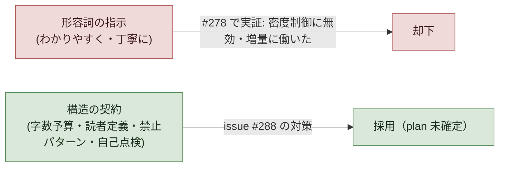

# issue #288 解説 — 教材の 2 段化: plan 段は TL;DR＋図中心、PR 段で詳細を同一 Discussion に追記

目次: [1. Background](#1-background) ／ [2. Intuition](#2-intuition) ／ [3. Code](#3-code) ／ [4. Quiz](#4-quiz)

この教材の対象は GitHub issue #288（label: `task-request`, `needs-review`, `escalation`。「教材の 2 段化 — plan 段は TL;DR＋図中心の意思決定用に薄く、PR 作成時に同じ Discussion へ詳細解説を自動追記」）である。issue #288 は 2026-07-08 時点で `needs-review`（人間キュー）かつ `escalation`（裁定待ち）であり、設計論点はまだ確定していない。本教材は issue #288 の**現行版**の解説 loop 契約（`.claude/skills/explain-diff/SKILL.md`、4 節構成: Background/Intuition/Code/Quiz）に従って作成する——issue #288 が提案する「2 段化・TL;DR＋図中心」の新フォーマットそのものではない。

> [!IMPORTANT]
> issue #288 は自らを検証する材料として、既存教材 2 本（issue #278・#279 の解説）を「旧書式（詳細すぎる）」の実例として名指しする。本教材（issue #288 自身の解説）も同じ現行 4 節フォーマットで作られるため、「詳細すぎる教材を批判する issue の解説自体が詳細フォーマットで作られる」という状況が生じるが、これは issue #288 の新フォーマットが未承認であるための構造上の帰結であり、演出ではない。

---

## 1. Background

前提知識をゼロと仮定して、issue #288 が触る系を主体ごとに組み立てる。

### 1.1 解説 loop 自体（explain-diff skill・ADR 0032・ADR 0033）

**何をするか**: `.claude/skills/explain-diff/SKILL.md` は、理解対象（PR/commit の diff・issue 上の plan・ADR/設計文書・概念）について、Background/Intuition/Code/Quiz の 4 節からなる GFM 教材を 1 本生成し、`explains/YYYY-MM-DD-<slug>.md` に保存した上で GitHub Discussion（category: Explain）へ配信する仕組みである。**なぜ存在するか**: 「理解は新しいボトルネック」（Geoffrey Litt、2026-07-02 の記事を lathe 向けに適応）という診断への一次対応であり、要約（圧縮）ではなく教材（展開）を作る——読者が前提知識ゼロから世界を組み立てられることを目標にする。

ADR 0032（2026-07-06 accepted）は対象を「コード変更」から「理解対象への参照一般」に一般化し、起動条件を `needs-explain` label の到着とした。ADR 0033（2026-07-07 accepted）は配信基盤を md ネイティブ化し、正本を対象プロジェクト内 `explains/` ファイル、配信を GitHub Discussions に確定した（教材 repo・gist・Cloudflare 案はいずれも廃案）。**publish 後は不変**——改訂は新版・別ファイル・別 Discussion、追補はスレッド comment という規約もこの ADR に由来する。

### 1.2 issue-as-task 基盤（ADR 0031）

**何をするか**: ADR 0031（2026-07-05 accepted）は task の正本を GitHub issue そのものと定める（TASK-N = issue #N）。状態は保存せず導出する——To Do = open issue、In Progress = 参照 PR が open、Done = PR merge で issue close。**なぜ存在するか**: git/GitHub が既に知っている事実を repo 内ファイルへ二重記録すると同期事故が起きる（2026-07-05 の backlog 編集事故）ため、保存するのは「導出できないもの」（plan 本文＝issue body、裁定＝issue comment、label）だけに絞る。issue #288 自身もこの基盤の上にある task（issue #288 = TASK-288）である。

### 1.3 needs-review → Ready の人間ゲート（ADR 0035・Projects 盤面）

**何をするか**: ADR 0035（2026-07-07 accepted）は全 issue 共通のライフサイクルを定める——起票 → plan loop（自動で plan 作成）→ 機械 plan review → 分岐。`needs-review` label が無ければ人手ゼロで実装まで進む。`needs-review` label があれば、**plan 完了後に教材を自動生成**（解説 loop）→ PdM が読む → GitHub Projects 盤面で Backlog → Ready へ移動することが承認＝実装解禁の条件になる。**なぜ存在するか**: 重要な task の実装着手を、PdM が読んで判断した上での能動的操作に紐付けるため。issue #288 が問題視するのはまさにこの「plan 完了後に自動生成される教材」の中身が意思決定の役に立っていない、という点である。

`design/loops.md` の loop 台帳は解説 loop の起動条件を次のように記す。

```md
| **教材（explain）** | orchestrator が runner（`claude -p`・最小権限）を dispatch | needs-review × 読み物なし | skill（explain-diff）で教材生成 → Discussion（Explain）投稿 → done-explain 冪等付与 → **explains/ 正本の自動 PR** | **publish**（対象へのリンク comment 込み） |
```

つまり `needs-review` が付き、かつまだ教材が無い issue に対して、orchestrator が解説 loop を自動 dispatch する。これが issue #288 の言う「plan 段階の教材」の生成経路である。

### 1.4 driver / LAND 段（PR 作成の主体）

**何をするか**: driver（`scripts/inner-loop.mjs`）は 1 issue の実装を TASK_PLAN → PLAN_REVIEW → IMPLEMENT → LAND の状態機械で進める（`design/agent-workflow.md`）。LAND 段は「push → `gh pr create`（arm しない）→ reviewer を spawn → PASS なら auto-merge を arm／CHANGES なら IMPLEMENT へ差し戻し」という順序を担う（ADR 0035 追記）。**なぜ存在するか**: task の実装を人手ゼロで main まで運ぶ機構であり、PR の作成は driver が担う唯一の主体である。issue #288 の要件 2（PR 段の解説）は、この LAND 段での PR 作成イベントを新しい教材生成の発火点にしようとしている。

### 1.5 Discussion カテゴリ Explain と label 状態機械（needs-explain/done-explain）

**何をするか**: 解説対象の issue/PR には `needs-explain`（未処理キュー）→ `done-explain`（教材あり・comment にリンク）という label 遷移が付く。教材本体は Discussion カテゴリ **Explain**（無ければ General）に投稿される。GraphQL で確認すると、本 repo には既に `Explain` カテゴリ（id: `DIC_kwDOSv62Qc4DAqE8`）が存在する（2026-07-08 実測）。**なぜ存在するか**: label が「未処理／処理済み」の機械可読な状態を担い、Discussion が教材本体と註釈スレッドの器を担う、という役割分担である。

なお issue #288 自身には `needs-explain` label は付いていない——本教材は SKILL.md の「直接要求」経路（PdM がセッション内で依頼）に該当し、終端処理は教材リンクの comment のみで、label 変更・close は行わない。

---

## 2. Intuition

核心の直感は次の 1 行である。

> **現行は「1 回の生成で plan 段の意思決定材料と実装の詳細解説を両方まかなおうとする」設計であり、実装がまだ存在しない plan 段では詳細解説の部分が書けるはずのない情報（採用しなかった案、diff の構造）を無理に埋めようとして、既存文書の言い換えや「未確認」ヘッジで水増しされる。issue #288 はこれを 2 回の生成（plan 段は薄く・PR 段で詳細を追記）に分離することを提案する。**

### 2.1 toy 例（架空・実形式）: issue #500 の教材が Discussion #900 上でどう変わるか

架空の issue #500（`needs-review`）を例に、現行（1 段）と issue #288 が提案する形（2 段・**未承認**）を対比する。

**現行（1 段。issue #278/#279 で実証済みの形）**:

1. issue #500 が `needs-review` で起票され、plan loop が plan を書く。
2. 解説 loop が自動 dispatch され、Background/Intuition/Code/Quiz の 4 節フル教材を 1 回で生成する。Code 節では issue 本文にまだ存在しない実装の詳細（採用しなかった案、diff 構造）まで埋めようとする——しかし実装はまだ無いので、埋める材料は既存 ADR の再叙述や「〜と読めるが未確認である」ヘッジにならざるを得ない。
3. Discussion #900 に投稿。PdM は Ready に動かすかどうかの判断に必要な TL;DR 相当の情報を、長い教材全体から自分で抽出しなければならない。

**issue #288 が提案する形（2 段・未承認）**:

1. issue #500 が `needs-review` で起票され、plan loop が plan を書く。
2. 解説 loop（plan 段版）が、TL;DR＋図中心の薄い教材を生成する。Code 節相当の実装詳細は**書かない**。
3. Discussion #900 に投稿。PdM は数分で読み、Projects 盤面で Ready へ移動する。
4. driver が IMPLEMENT → LAND 段で PR #642 を作成する。
5. **新設の発火点**（issue #288 の設計論点: driver の LAND 段組み込み or orchestrator の別 class）が、同じ Discussion #900 に PR 解説 comment を自動追記する。ここで初めて diff の構造・採用しなかった案が書かれる——このとき実装は実在するので、材料は接地済みの事実になる。

```mermaid
sequenceDiagram
    participant Issue as issue500["issue #500 (needs-review)"]
    participant Plan as planLoop["plan loop"]
    participant Explain as explainLoop["解説 loop"]
    participant Disc as discussion900["Discussion #900"]
    participant PdM as pdm["PdM"]
    participant Driver as driver["driver (LAND 段)"]

    Note over Issue,Disc: 現行 (1 段)
    Issue->>Plan: plan 完了
    Plan->>Explain: needs-review かつ読み物なし
    Explain->>Disc: フル教材 1 回 (Background/Intuition/Code/Quiz 全部詳細)
    Disc->>PdM: 長文から TL;DR 相当を自力抽出
    PdM->>Issue: Ready 判断（材料が薄い）
```

```mermaid
sequenceDiagram
    participant Issue as issue500b["issue #500 (needs-review)"]
    participant Plan as planLoopB["plan loop"]
    participant Explain as explainLoopB["解説 loop (plan 段版)"]
    participant Disc as discussion900b["Discussion #900"]
    participant PdM as pdmB["PdM"]
    participant Driver as driverB["driver (LAND 段)"]
    participant ExplainPR as explainLoopPR["解説 loop (PR 段版・新設)"]

    Note over Issue,ExplainPR: issue #288 提案 (2 段・未承認)
    Issue->>Plan: plan 完了
    Plan->>Explain: needs-review かつ読み物なし
    Explain->>Disc: TL;DR + 図中心 (Code 節相当は書かない)
    Disc->>PdM: 数分で読了
    PdM->>Issue: Ready へ移動
    Issue->>Driver: 実装解禁 → PR #642 作成
    Driver->>ExplainPR: PR 作成イベント (発火点は設計論点)
    ExplainPR->>Disc: 同じ Discussion #900 に詳細解説を追記
```

### 2.2 密度制御は「形容詞」でなく「構造」で行う

issue #288 の追加要件 5（教訓）は「わかりやすさ重視で丁寧に」のような形容詞の指示が密度制御に無効であること——むしろ issue #278 の教材でこの指示が増量に働いたこと——を明記する。issue #288 の対策は形容詞でなく構造の契約（長さ予算・読者定義・禁止パターン・自己点検）である。



---

## 3. Code

issue #288 本文を、ファイル順（問題→要件→設計論点→検証→実物指定→追加要件）でなく、理解できる順にグループ化してウォークスルーする。

### 3.1 問題認識（PdM 提起）

issue #288 冒頭は次のように診断する。

> plan 段階の教材が詳細すぎて情報密度が高すぎる。「本質的にその計画によって何が起きるのか・なぜその task が必要なのか」が読み取れず、意思決定（Ready 移動）の材料として機能していない。一方、実装の詳細説明は PR ができるまで書けないのに、現状は plan 段で全部を語ろうとしている。

これは §1.3 で見た現行フロー（plan 完了後に解説 loop が 1 回だけ発火する）が抱える構造的な制約——実装が存在しない段階で実装の詳細を語ろうとする——を PdM が名指ししたものである。

### 3.2 要件 1: plan 段の教材（needs-review → Approval 用）

issue #288 は plan 段教材の要求を 3 点に絞る。

1. 冒頭に TL;DR 必須（何が起きるか／なぜ必要か／PdM に何の判断を求めるか、を数行で）
2. 意思決定につながる**図の比重**を高める——ただし「図の数を増やす」のでなく「冗長な散文説明を削る方向」が主眼（情報密度の適正化であり、絶対的な図の追加ではない）
3. 詳細（code 項目・実装手順の逐条解説）は**書かない**——PR 段に送る

### 3.3 要件 2: PR 段の解説（新設）

driver 産 PR が作られたタイミングで、同じ Discussion に解説 comment を自動追記する。ここが detail 担当——code の項目・diff の構造・**なぜその実装になったのか**（採用しなかった案を含む）を理解できるようにする。

### 3.4 設計論点（plan 段で確定すべきこと。issue #288 は未確定のまま）

issue #288 本文が明示する未確定の論点は 4 点である。

- **PR 解説の発火点**: driver の LAND 段（§1.4 参照）に組み込むか、orchestrator の別 class にするか。既存の explain dispatch（`needs-review × 読み物なし`、§1.3 参照）との重複防止・issue⇄discussion の対応をどう引くか
- **explains/ 正本の形**: plan 版ファイルに PR 節を追記するか、別ファイルにするか
- **SKILL.md の書式契約の分割**: plan 版／PR 版の 2 形態に分け、既存の禁則・mermaid 規則・自己点検は両形態に継承する
- **既存契約との整合**: 正解位置規則（issue #258 由来。本教材の Quiz もこの規則に従っている、§4 参照）等

これらはいずれも「未確定」と issue 本文が明記しており、本教材はこれらに断定的な答えを与えない。

### 3.5 検証（issue #288 の受け入れ条件）

> 次の needs-review issue 1 件で: plan 教材が TL;DR＋図中心で生成される／driver 産 PR 作成後に同 Discussion へ PR 解説が自動で追記される — の実弾一巡。

備考として、生成中の issue #278/#279 教材（本教材が Background で参照した 2 本）は旧書式のまま残るため、着地までは監査役が TL;DR を Discussion に手動で先付けする暫定運用が明記されている。

### 3.6 実物指定の接地（負例 = Discussion #284 の実物）

issue #288 は「負例の実物 = Discussion #284 の §1.4「ADR 0031 が延長する原理」・§1.5「ADR 0036 が接続する先」」と名指しし、PdM 評価を「やばすぎる。なんの意味がある説明なんだこれ」と引用する。批判点は 3 つ: ADR の既存内容の再叙述／issue 本文の引用の言い換え／「〜と読めるが未確認である」型のヘッジ。

実際に Discussion #284（= `explains/2026-07-08-issue278-loop-domain-design.md` の配信先）を取得すると、§1.4「ADR 0031 が延長する原理」は次の内容である（原文引用）。

```md
### 1.4 ADR 0031「task 状態は保存せず導出」— issue #278 が延長する原理

ADR 0031（issues-as-task-substrate、2026-07-05 accepted）は「task の正本 = GitHub issue
（TASK-N = issue #N）」と定め、状態を保存せず導出する原則を確立した。

> To Do = open issue／In Progress = 参照 PR が open／Done = PR merge で issue close。
> 保存するのは導出できないものだけ（plan 本文 = issue body、裁定・申し送り = issue comment、
> needs-plan／escalation／優先度 = label）

この原則が生まれた背景は「git/GitHub が既に知っている事実を repo 内ファイルへ二重記録して
いること」が事故（未コミット backlog 編集による FF 保全失敗、2026-07-05）の根本原因だった、
という反省である。
```

ADR 0031 の決定事項を直接引用（block quote）した直後に、その内容を散文で言い換えている——issue #288 が言う「ADR の既存内容の再叙述」「出典の言い換え引用」がここに具体的に現れている。§1.5「ADR 0036 が接続する先」は次のように結ばれる（原文引用）。

```md
issue #278 が言う「LoopDefinition（版つき・ADR 0036 の版固定に対応）」は、この ADR 0036 の
「版」という**運用上の概念**を、DB の**データモデル**として持たせるという意味である。版そのものの
計画・承認・切替の手順は ADR 0036 が既に規定しており、issue #278 はその版を「テーブルとして
保持する側」を新設する、という関係になる。版の切替タイミングでどの LoopDefinition が有効かを
機械的に問い合わせられるようにする、というのが接続の意図だと読めるが、スキーマの具体形
（バージョン番号か、issue 番号を鍵にするか等）は**未確認**である。
```

末尾の「接続の意図だと読めるが……は**未確認**である」が、issue #288 の言う「『〜と読めるが未確認である』型のヘッジ」の実物である。いずれの一節も、Ready 移動の判断材料（この task で何が起き、なぜ必要か）には寄与しない——ADR の内容確認と issue 本文の言い換えに紙幅を使っている。

### 3.7 追加要件（構造の契約。形容詞の指示は禁止）

issue #288 は 2026-07-08 の本文追記で 5 点の構造契約を追加する。

1. **長さ予算**: plan 段教材は本文全体で読了 3 分以内（目安上限を字数で契約に明記。超過は自己点検で RED）
2. **読者定義**: 「Ready に入れるか判断する PdM」only。実装者向け情報は PR 段へ
3. **ADR 整合の扱い**: 関連 ADR との整合確認は**生成時の内部検証**とし、教材には「矛盾を発見した場合のみ」書く。整合している事実の叙述は禁止（§3.6 で引用した §1.4 のような「整合していることの説明」自体を書かせない、という意味）
4. **禁止パターンの明文化**: 既存文書の再叙述／出典の言い換え引用／「未確認である」型ヘッジ／原理・接続の解説節
5. **教訓**: 「わかりやすさ重視で丁寧に」等の形容詞注文は密度制御に無効（issue #278 教材で実証・むしろ増量に働いた）。契約は構造（予算・節・禁則・自己点検）で書く

いずれも issue 本文が「変更は ESCALATE」と明記する PdM 指定事項であり、本教材はこれらの是非を評価しない。

---

## 4. Quiz

中難度 5 問。選択肢から 1 つ選び、`<details>` を開いて答え合わせをする（クリック採点は持たない）。

### Q1. issue #288 が診断する現行の問題は何か。

- (a) plan 段の教材が生成されず、PdM が判断材料を全く得られていない
- (b) plan 段の教材が詳細すぎて情報密度が高く、意思決定（Ready 移動）の材料として機能していない
- (c) PR 段の解説が長すぎて実装者が読み切れない
- (d) 解説 loop 自体が `needs-explain` label を認識しなくなっている

<details><summary>答えと解説</summary>

**b**。issue #288 冒頭は「plan 段階の教材が詳細すぎて情報密度が高すぎる」「意思決定（Ready 移動）の材料として機能していない」と明記する。教材が生成されないこと（a）や PR 段の解説の長さ（c）、label 認識の不具合（d）は issue 本文のどこにも記載がない。
</details>

### Q2. issue #288 の要件 2「PR 段の解説（新設）」が担当する内容として明記されているものはどれか。

- (a) TL;DR の 3 行要約のみ
- (b) 意思決定につながる図のみで、散文は一切書かない
- (c) code の項目・diff の構造・なぜその実装になったのか（採用しなかった案を含む）
- (d) Ready 移動の可否判断そのもの

<details><summary>答えと解説</summary>

**c**。issue #288 は「ここが詳細担当: code の項目・diff の構造・**なぜその実装になったのか**（採用しなかった案を含む）を理解できるように」と明記する。TL;DR（a）と図中心（b）は plan 段（要件 1）の要求であり PR 段の要求ではない。Ready 移動の可否判断（d）は PdM が Projects 盤面で行う操作（ADR 0035）であり、解説 loop の役割ではない。
</details>

### Q3. Discussion #284 §1.4・§1.5 について、issue #288 が名指しする批判点として本文に明記されていないものはどれか。

- (a) ADR の既存内容の再叙述
- (b) issue 本文の引用の言い換え
- (c) 「〜と読めるが未確認である」型のヘッジ
- (d) mermaid 図の構文エラーによる描画失敗

<details><summary>答えと解説</summary>

**d**。issue #288 が明記する批判点は「ADR の既存内容の再叙述／issue 本文の引用の言い換え／『〜と読めるが未確認である』型のヘッジ」の 3 点であり（a・b・c はいずれも本文に明記）、mermaid 描画の技術的な失敗については issue #288 本文に記載がない。実際に Discussion #284 §1.4・§1.5 の mermaid ブロックの描画可否は本教材の接地範囲外である。
</details>

### Q4. issue #288 の追加要件（構造の契約）のうち、「読者定義」として明記されているものはどれか。

- (a) 「Ready に入れるか判断する PdM」only。実装者向け情報は PR 段へ
- (b) driver・orchestrator を含むすべての機械読者
- (c) 教材を読む可能性のある全 lathe 開発者
- (d) 読者定義は不要（誰が読んでも同じ教材でよい）

<details><summary>答えと解説</summary>

**a**。issue #288 の追加要件 2「読者定義」は「『Ready に入れるか判断する PdM』only。実装者向け情報は PR 段へ」と明記する。機械読者（b）や全開発者（c）への言及は無く、読者定義自体を追加要件として明示している時点で（d）は本文と矛盾する。
</details>

### Q5. issue #288 が「設計論点（plan 段で確定）」として明示する、PR 解説の発火点の候補はどれか。

- (a) issue の `needs-review` label が付与された瞬間
- (b) driver の LAND 段に組み込むか、orchestrator の別 class にするか
- (c) PdM が Discussion を close した瞬間
- (d) explains/ ファイルが git commit された瞬間

<details><summary>答えと解説</summary>

**b**。issue #288 の設計論点は「PR 解説の発火点: driver の LAND 段に組み込むか orchestrator の別 class にするか（既存の explain dispatch との重複防止・discussion への紐付け方法 = issue⇄discussion の対応をどう引くか）」と明記する。`needs-review` 付与（a）は plan 段教材の起動条件（§1.3）であり PR 段の発火点ではない。Discussion close（c）は ADR 0034 で一度は承認シグナルとされたが ADR 0035 で Ready 移動への一本化により置き換えられており、PR 解説の発火点として issue #288 本文に記載はない。commit イベント（d）も本文に記載がない。
</details>
