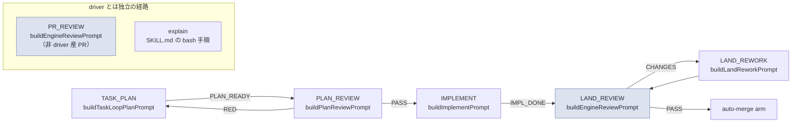

# issue #301 解説 — stage 起動時の情報注入契約の設計

目次: [1. Background](#1-background) ／ [2. Intuition](#2-intuition) ／ [3. Code](#3-code) ／ [4. Quiz](#4-quiz)

この教材の対象は GitHub issue #301（「stage 起動時の情報注入契約の設計 — 機械が既に知っている情報を agent に再発掘させない」）である。対象は diff ではなく、PdM 指示（2026-07-08）に基づく**設計 task**であり、issue 本文が明記する検証条件は「対照表が全 stage を網羅／設計 review（機械＋PdM）。コード変更なし」である。本教材の仕事は、issue #301 が名指しする 7 stage（TASK_PLAN / PLAN_REVIEW / IMPLEMENT / LAND_REVIEW / LAND_REWORK / explain / PR_REVIEW）それぞれについて、実際の driver コード（`scripts/*.mjs`）が「dispatch 時点で機械的に知っている情報」と「実際に prompt へ注入している情報」を具体的に対照し、issue #301 が根拠として挙げる 1 実例（LAND reviewer の rubric scope 自力照合）をコードで裏付けることである。issue 自体が実装ゼロの棚卸し・設計段階であるため、実装の細部（本 issue の後続子 issue が扱う範囲）は「未確認」と明記する。

> [!IMPORTANT]
> issue #301 は 2026-07-08 時点でオープンの設計 task であり、成果物（stage ごとの対照表・注入契約の設計文書）はまだ存在しない。本教材が引用する関数名・行番号・prompt 文言は 2026-07-08 時点の repo 実体であり、対照表や注入契約そのものの実装が着地して初めて設計の正本になる。

---

## 1. Background

前提知識をゼロと仮定して、issue #301 が触る系を組み立てる。

### 1.1 driver と stage — `design/loops.md` の「実装（task loop）」行

lathe 自身の開発は `design/loops.md` に定義された loop の集合として回っており、そのうち issue #301 が扱うのは「実装（task loop）」の行である。

```md
| **実装（task loop）** | driver `scripts/inner-loop.mjs <n>` | ... | TASK_PLAN（plan-format 注入）→ PLAN_REVIEW（機械・RED は所見注入で再試行 2）→ IMPLEMENT（worktree）→ **LAND**＝PR 作成（arm しない）→ review 周回（PASS で arm／CHANGES 差し戻し 2 周・全周回所見は PR コメント） | **CI GREEN → merge → issue close（Done 導出）**、または **escalation label 投函** |
```

driver（`scripts/inner-loop.mjs`）は GitHub issue（task の正本、ADR 0031）を受け取り、TASK_PLAN → PLAN_REVIEW → IMPLEMENT の 3 段を named agent（`claude -p "<prompt>" --agent <name>`）で順に起動する状態機械である。IMPLEMENT の後は driver 直属の LAND（PR 作成 → review 前置 → auto-merge arm）が続く。review 前置が CHANGES を返すと LAND_REWORK（差し戻し修正）に入る。この 5 つに、driver とは別経路の PR_REVIEW（非 driver 産 PR の記録レビュー）と explain（教材生成）を加えた 7 つが issue #301 が棚卸し対象とする stage である。

### 1.2 7 stage と実装モジュールの対応

issue #301 本文の stage 名は、実際には次のモジュール・関数に実装されている。

| issue #301 の stage | 起動する場所 | prompt を組み立てる関数 |
|---|---|---|
| TASK_PLAN | `scripts/inner-loop.mjs`（driver、repo root） | `buildTaskLoopPlanPrompt`（`scripts/inner-loop-prompts.mjs`） |
| PLAN_REVIEW | `scripts/inner-loop.mjs`（driver、repo root） | `buildPlanReviewPrompt`（同上） |
| IMPLEMENT | `scripts/inner-loop.mjs`（driver、worktree） | `buildImplementPrompt`（同上） |
| LAND_REVIEW | `scripts/inner-loop-land.mjs` の `landBranchWithReview`（driver 直属） | `buildEngineReviewPrompt`（`scripts/review-engine.mjs`。LAND と PR_REVIEW が**同じ関数を共有**） |
| LAND_REWORK | `scripts/inner-loop-land.mjs` の `landBranchWithReview`（CHANGES 差し戻し） | `buildLandReworkPrompt`（`scripts/inner-loop-prompts.mjs`） |
| explain | orchestrator が dispatch する runner（本教材自身が従う skill） | `.claude/skills/explain-diff/SKILL.md`（構造化 ctx でなく prompt 内の bash 手順として self-fetch を指示） |
| PR_REVIEW | `scripts/review-engine.mjs` の `reviewOnePr`（非 driver 産 PR） | `buildEngineReviewPrompt`（LAND_REVIEW と共有） |

`scripts/inner-loop-core.mjs`（491 行）はこれらの状態遷移を担う純関数群を持つ。task loop の遷移テーブルはこうである。

```js
// scripts/inner-loop-core.mjs
export const TASK_LOOP_STAGES = ['TASK_PLAN', 'PLAN_REVIEW', 'IMPLEMENT'];
export const TASK_LOOP_TERMINAL = 'LAND';
const TASK_LOOP_OK_VERDICTS = { TASK_PLAN: 'PLAN_READY', PLAN_REVIEW: 'PASS', IMPLEMENT: 'IMPL_DONE' };
```

`nextState(state, verdict)` はこの表を見て次の stage を決めるだけで、prompt の中身には関与しない。prompt の組み立ては `scripts/inner-loop-prompts.mjs`・`scripts/review-engine.mjs` が別途担っており、両者の間に「stage が何を受け取るべきか」という共通契約は存在しない——これが issue #301 の核心の指摘である。

### 1.3 「機械が既に知っている情報」とは何か — 具体例 2 つ

issue #301 の問題設定を理解する鍵は「dispatch 時点で harness が機械的に計算済みの事実」という概念である。2 つの具体例がある。

第一に、task の状態（labels・comments・body・open/closed）は `gh issue view` で機械的に取得できる（ADR 0031「保存せず導出」）。driver は実際に stage 開始前にこれを取得している。

```js
// scripts/inner-loop.mjs — 119-124 行
// Fetch the task (= the GitHub issue, ADR 0031): body = plan, comments =
// 裁定・申し送り, labels = run-type selection, state = open guard.
const r = spawnSync('gh', ['issue', 'view', String(issueNumber), '--json', 'number,title,body,labels,state,comments'], ...);
```

第二に、「今回の変更がどの rubric を発火させるか」も `rubrics/run.mjs --changed <paths>` が既に決定的に計算できる。

```js
// rubrics/run.mjs — 74-92 行（コメントは筆者要約でなく原文）
if (args[0] === '--changed') {
  changed = args.slice(1);
  // 選定層（rubrics/select.mjs、ADR 0021 前線 D）: 影響集合 = changed ∪ 逆依存の推移閉包。
  // 発火 = invariant ∨ (scope ∩ 影響集合 ≠ ∅) ∨ declared-edge。旧規則（direct-scope）は上位集合として保持。
  const graph = buildReverseGraph(changed);
  selection = selectRubrics({ changed, graph, rubrics: all });
  ...
}
```

`selectRubrics`（`rubrics/select.mjs`）は grep でも LLM 推測でもなく、scope 配列と変更パスの集合演算で発火 rubric を確定する。さらに `--receipt <path>` フラグを使えば、この選定結果（発火 rubric とその根拠規則・not-run 一覧）を JSON として書き出せる。つまり「どの rubric がこの PR に効くか」は agent が探索する前に機械が既に答えを持っている。

### 1.4 issue #301 が名指しする実例 — LAND reviewer の rubric 自力照合

issue #301 本文はこの「機械が既に持っている答えを agent に再計算させている」実例として、LAND reviewer の prompt を挙げる。実際にその文言は `scripts/review-engine.mjs` の `buildEngineReviewPrompt` にある。

```js
// scripts/review-engine.mjs — 192-193 行
'`.claude/skills/review/SKILL.md` の観点（設計/plan 遵守・抜け・risk）に従い、下記の PR diff を PR 本文（plan に相当）＋該当 rubric に照らしてレビューしてください。',
'該当 rubric は `node rubrics/run.mjs --changed <paths>` が選ぶのと同じ scope の rubric 群（`rubrics/`）を読んで判断すること。',
```

この 2 行は「`run.mjs --changed` が選ぶのと同じもの」と reviewer に**文章で説明**しているが、実際に `run.mjs --changed` を実行した結果（発火 rubric の id 一覧）は prompt のどこにも注入されていない。reviewer は毎回、この説明文だけを頼りに `rubrics/` ディレクトリを自力で探索し、scope 照合を再現する必要がある——これが issue #301 が引く「LAND reviewer が…毎回自力でやっている」の具体的な中身である。§3.4 でこの実装をさらに詳しく追う。

### 1.5 rubric harness/structural-guarantee-before-prompts — issue #301 が適用対象とする原則

issue #301 と同日（2026-07-08）に新設された rubric `rubrics/harness/structural-guarantee-before-prompts/rubric.json`（commit 81776b7、issue #291 由来、PdM 裁定）は、issue #301 が土台にする一般原則そのものを既に成文化している。

```json
"origin": "PdM 裁定(2026-07-08): 「プロンプトに頼る前に、それを他の機械的な方法で既存の harness に組み込む形で保証できないかどうかを考えること。これはレビュー観点の一つだ」。契機: PLAN_REVIEW の差分審査不能事故で『planner に全文再掲をプロンプトで強制する』案が最初に提案された設計不良。正解は reviewer への issue スレッド再取得（配管の修正・決定的・遵守概念が不要）だった。原則: プロンプトは判断の質を託す場所であり、情報の完全性・成果物の構造・検証可能性を担保する場所ではない — 後者は配管（データ取得/正本からの導出）・機械検証・構造変更で保証する（ADR 0031「状態は gh から導出」の一般化、#189 の教訓「散文契約は silent に壊れる」）。"
```

pass/fail の具体例も rubric に明記されている。

```json
"pass": ["reviewer に issue スレッドを再取得して注入する配管を追加（prompt 指示でなく機械が情報を渡す）", ...],
"fail": ["『再試行では plan 全文を再掲せよ』と prompt に足すだけ（スレッド再取得という配管で構造的に保証できるのに検討痕跡なし）", ...]
```

§1.4 で見た「該当 rubric は run.mjs --changed が選ぶのと同じ scope の rubric 群を読んで判断すること」という一文は、この rubric の fail 例（「指示を足すだけで配管を足さない」）と同型である。ただしこの一文自体はこの rubric 新設（2026-07-08）より前から存在するコードであり、rubric が事後的に照らす対象になる、という関係である（rubric は scripts/・ops/ の**今後の変更**を審査する恒久観点であり、既存コードへの遡及適用は本 rubric の scope 外・未確認）。issue #301 はこの原則を「stage 起動時の情報注入」という切り口で prompt 全体に横展開する task である。

### 1.6 ADR 0038（loop-domain）との接続 — prompt は散文でなく構造化契約にする

issue #301 は「注入契約は将来 loop-domain の contracts（構造化データ）に載る前提で設計する」と明記する。`adr/0038-loop-domain-and-context-boundaries.md` は既にこの方向を決定として書いている。

```md
### 2. `packages/loop-domain` は I/O ゼロの純ドメイン

- 何も import しない: `node:fs` / `node:child_process` / `pg` / gh CLI 起動経路のいずれも禁止。
- 内容は型・状態機械・prompt 契約（構造化データとして。散文の埋め込み文字列テンプレートではない）・
  見積り規則。
```

さらに ADR 0038 の背景節は、現行の prompt が散文であることを既存の課題として明示している。

```md
- prompt は散文（テンプレート文字列）であり、#189 のような型事故（書式クラッシュ）の温床になっている。
```

つまり issue #301 の「注入契約の設計」は、ADR 0038 が定義する `packages/loop-domain` の中身（型・状態機械・prompt 契約）のうち「prompt 契約」の具体的な中身を先取りして設計する task である、という位置づけになる。ADR 0038 の実装（`packages/loop-domain` パッケージそのものの新設）は harness-release loop（版計画・bootstrap 一括実装）の対象であり、issue #301 はそれより前の設計段階に立つ（実装は issue #301 の scope 外・後続子 issue）。

---

## 2. Intuition

核心の直感は次の 1 行である。

> **driver は stage ごとに「issue の再取得」「rubric 選定」「diff 取得」を個別に、しかも一貫しない範囲でやっている——それぞれの stage が独立に car を組み立て直しているので、同じ部品（issue comments・発火 rubric リスト）が或る stage には載り、別の stage には載らない。**

### 2.1 toy 例: 架空 issue #900 の LAND_REVIEW で何が起きているか

架空の issue #900（`scripts/foo.mjs` を変更する task）を例に、現状の LAND_REVIEW prompt 構築と、注入契約が導入された場合の対比を toy データで示す。

**現状（`buildEngineReviewPrompt` が実際に組み立てる内容、実コードに準拠）**:

```text
PR #1234 / stage: REVIEW (review engine)

`.claude/skills/review/SKILL.md` の観点（設計/plan 遵守・抜け・risk）に従い、
下記の PR diff を PR 本文（plan に相当）＋該当 rubric に照らしてレビューしてください。
該当 rubric は `node rubrics/run.mjs --changed <paths>` が選ぶのと同じ scope の
rubric 群（`rubrics/`）を読んで判断すること。
...
## diff（`gh pr diff 1234`）
--- a/scripts/foo.mjs
+++ b/scripts/foo.mjs
...
```

reviewer はこの文面を読んだ時点では「`scripts/` を変更したので `rubrics/harness/*` のどれかが効きそうだ」という**推測**しか持てない。実際に効く rubric の確定id一覧を得るには、reviewer 自身が `rubrics/` 配下を Read/Grep して scope 配列を集め、変更パスと突き合わせる必要がある——これは `rubrics/select.mjs` の `selectRubrics` が既に純関数としてやっている計算の再現である。

**注入契約導入後（未実装・issue #301 が設計する対象。架空のスキーマ）**:

```json
// driver が `node rubrics/run.mjs --changed scripts/foo.mjs --receipt -` 相当を
// 実行し、その出力を prompt 冒頭に構造化データとして注入する（架空）
{
  "fired_rubrics": [
    { "id": "harness/structural-guarantee-before-prompts", "rule": "scope", "via": "scripts/foo.mjs" }
  ],
  "not_run": ["harness/some-other-rubric"]
}
```

この JSON が prompt に載っていれば、reviewer は `rubrics/harness/structural-guarantee-before-prompts/rubric.json` **だけ**を Read すればよく、`rubrics/` 全体を探索する必要がなくなる。これが issue #301 の「機械が既に知っている情報を agent に再発掘させない」の具体的な効果である。

### 2.2 現状の注入マトリクス（対照表の骨格・本教材が実コードから作成した速報版）

issue #301 が要求する「対照表」の骨格を、実コードの grep 結果から組み立てる（issue 本文の成果物そのものではなく、本教材が独自に作成した速報版。正式な対照表は issue #301 の設計成果物として別途確定する）。

| stage | issue body 注入 | issue comments 注入 | plan 注入 | 発火 rubric 一覧の注入 | diff 注入 |
|---|---|---|---|---|---|
| TASK_PLAN | あり | あり（run 開始時スナップショット） | — (自身が plan を作る) | なし | — |
| PLAN_REVIEW | あり | あり（**再取得**、`tryFetchIssueComments`） | あり（`planText`） | なし | — |
| IMPLEMENT | あり | あり（run 開始時スナップショット、再取得なし） | 暗黙（body が plan） | なし | — |
| LAND_REVIEW | あり | **なし**（`buildEngineReviewPrompt` は body のみ抽出） | あり（`planText`） | なし（文章指示のみ） | あり（`gh pr diff`、truncate あり） |
| LAND_REWORK | あり | あり（landing 開始時の `issue.comments`、再取得なし） | — (所見が主) | なし | — (前回 head からの delta diff) |
| PR_REVIEW | あり（`fetchLinkedIssue` が number/title/body のみ取得） | **なし**（そもそも issue.comments を取得していない） | なし | なし（文章指示のみ） | あり（`gh pr diff`、truncate あり） |
| explain | 主経路: issue label 起点で本文取得。直接要求: agent が `gh issue view` を自力実行 | 同上 | — | なし | 対象が diff の場合は agent が `gh`/`git` で自力取得 |

この表だけでも「何が注入済みで何が欠けているかが stage ごとにバラバラ」という issue #301 の主張が具体的に裏付けられる。特に LAND_REVIEW と PR_REVIEW は同じ `buildEngineReviewPrompt` を共有しているにもかかわらず、TASK_PLAN/PLAN_REVIEW/IMPLEMENT/LAND_REWORK が例外なく注入している「issue comments（裁定・申し送り）」を注入していない——reviewer は plan 本文は読めても、その plan に対する後続の裁定コメントを読めない可能性がある（詳細は §3.5）。

### 2.3 stage の遷移と、各 stage が prompt を組み立てる場所



`LAND_REVIEW` と `PR_REVIEW` を同じ色でマークしたのは、両者が `buildEngineReviewPrompt` という同一関数を共有しているためである（§3.4）。

---

## 3. Code

接地資料を、issue #301 の主張（① 実例＝rubric 自力照合、② 注入のバラつき）を裏付ける順にウォークスルーする。引用はすべて 2026-07-08 時点の repo 実体である。

### 3.1 `inner-loop-prompts.mjs` — TASK_PLAN/PLAN_REVIEW/IMPLEMENT/LAND_REWORK の prompt builder

4 つの builder はいずれも `ctx` オブジェクトを受け取って文字列を組み立てるだけの純関数であり、`STAGE_PROMPT_BUILDERS` で一覧化されている。

```js
// scripts/inner-loop-prompts.mjs — 398-403 行
export const STAGE_PROMPT_BUILDERS = {
  PLAN: buildPlanTaskPrompt,
  TASK_PLAN: buildTaskLoopPlanPrompt,
  PLAN_REVIEW: buildPlanReviewPrompt,
  IMPLEMENT: buildImplementPrompt,
};
```

`buildImplementPrompt` の引数型注釈を見ると、IMPLEMENT が受け取るのは `issueNumber, issueTitle, issueBody, comments` の 4 つだけである。

```js
// scripts/inner-loop-prompts.mjs — 130-134 行
/**
 * @param {{ issueNumber: number, issueTitle: string, issueBody: string, comments?: Array<object> }} ctx
 * @returns {string}
 */
export function buildImplementPrompt(ctx) {
```

一方 `buildPlanReviewPrompt` はこれに `planText`（検査対象の plan 本文）を加える。

```js
// scripts/inner-loop-prompts.mjs — 358 行
 * @param {{ issueNumber: number, issueTitle: string, issueBody: string, comments?: Array<object>, planText: string }} ctx
```

各 builder が受け取る ctx の形はそれぞれ手で書かれた別の型注釈であり、共通の「stage 契約」型は存在しない。これが issue #301 が「stage ごとに情報注入がバラバラ」と呼ぶものの型レベルの現れである。

### 3.2 `inner-loop.mjs` — driver がどう ctx を組み立てるか（IMPLEMENT と PLAN_REVIEW の非対称）

driver 本体（`scripts/inner-loop.mjs`）は stage ごとに ctx を組み立てる際、issue comments の扱いが stage によって異なる。

```js
// scripts/inner-loop.mjs — 405-406 行
const stageCtx = { issueNumber, issueTitle: issue.title, issueBody: issue.body, comments: issue.comments,
  ...(state === 'TASK_PLAN' && { planFormat: readPlanFormatOrDie(), reviewFeedback: planReviewFeedback }), ...(state === 'PLAN_REVIEW' && { planText, comments: tryFetchIssueComments(issueNumber, issue.comments) }) };
```

ベースの `comments: issue.comments` は run 開始時に一度だけ取得したスナップショットである。`state === 'PLAN_REVIEW'` のときだけ `tryFetchIssueComments` で**再取得**した最新の comments に上書きされる。IMPLEMENT や TASK_PLAN はこの再取得を受けない——run の途中で issue に新しい裁定コメントが付いても、IMPLEMENT の prompt には反映されない可能性がある。この非対称はコードコメントにも明記されている。

```js
// scripts/inner-loop-escalation.mjs — 25-27 行
/**
 * PLAN_REVIEW 直前などで issue comments の現在形を再取得する（run 中に投函された
 * plan comment・RED 所見・改訂差分を reviewer に見せるため）。失敗は非致命 — fallback を返す。
 */
export function tryFetchIssueComments(issueNumber, fallback, deps = {}) {
```

つまり「PLAN_REVIEW だけ最新の comments が要る」という判断は個別に下されているが、この判断が「なぜ IMPLEMENT には要らないのか」「なぜ LAND_REWORK には要らないのか」を横断的に説明する契約は存在しない——stage を追加・変更するたびに、この要否をまた個別に判断し直すことになる。

### 3.3 `inner-loop-core.mjs` — 状態遷移は契約化されているが、prompt 内容は契約化されていない

対比として、状態遷移（「次にどの stage へ行くか」）は既に契約化されていることを確認する。

```js
// scripts/inner-loop-core.mjs — 149-155 行
export function nextState(state, verdict) {
  if (verdict === null) return { next: 'ESCALATE' };
  const idx = TASK_LOOP_STAGES.indexOf(state);
  if (idx < 0) return { next: 'ESCALATE' };
  if (verdict !== TASK_LOOP_OK_VERDICTS[state]) return { next: 'ESCALATE' };
  return { next: TASK_LOOP_STAGES[idx + 1] ?? TASK_LOOP_TERMINAL };
}
```

`nextState` はテーブル駆動の純関数であり、stage の追加や verdict の妥当性判定はこの 1 箇所を触るだけで済む（ファイル冒頭のコメントが「an inspection stage can be inserted later without reshaping the driver」と明言する設計意図）。issue #301 が要求する「注入契約」は、この `nextState` に相当する構造を **prompt の内容**（何を ctx に入れるか）に対しても作る、という提案だと読める——現状は「次にどの stage か」は契約化されているが「その stage に何を持たせるか」は契約化されていない、という非対称が issue #301 の問題設定そのものである。

### 3.4 `review-engine.mjs` の `buildEngineReviewPrompt` — LAND_REVIEW と PR_REVIEW が共有する reviewer prompt

issue #301 が名指しする実例をコードで確認する。`buildEngineReviewPrompt` は LAND_REVIEW（`inner-loop-land.mjs` 経由）と PR_REVIEW（`review-engine.mjs` の `reviewOnePr` 経由）の両方から呼ばれる共有関数である。

```js
// scripts/review-engine.mjs — 188-196 行
export function buildEngineReviewPrompt({ pr, diffText, diffTruncated, issue = null, planText = null, rereview = null }) {
  const lines = [
    `PR #${pr.number} / stage: REVIEW (review engine)`,
    '',
    '`.claude/skills/review/SKILL.md` の観点（設計/plan 遵守・抜け・risk）に従い、下記の PR diff を PR 本文（plan に相当）＋該当 rubric に照らしてレビューしてください。',
    '該当 rubric は `node rubrics/run.mjs --changed <paths>` が選ぶのと同じ scope の rubric 群（`rubrics/`）を読んで判断すること。',
    ...
```

この関数のシグネチャには `firedRubrics` や `rubricReceipt` のような引数は存在しない。呼び出し元（`landBranchWithReview`）を見ても、`rubrics/run.mjs --changed` を実行して結果を渡すコードはない——`landBranchWithReview` が実際に取得するのは PR diff（`fetchPrDiff`）・issue・plan comment だけである。

```js
// scripts/inner-loop-land.mjs — 243-247 行
const prompt = buildEngineReviewPrompt({
  pr, diffText, diffTruncated,
  issue: issue ? { number: issueNumber, title: issue.title, body: issue.body } : null,
  planText, rereview,
});
```

この `issue: { number, title, body }` という抽出が第二の発見である——呼び出し元がその時点で保持している `issue` オブジェクトには `issue.comments`（裁定・申し送り）が含まれているにもかかわらず（`landBranchWithReview` は `issue?.comments` を `extractLatestPlanCommentText` に渡して読んでいる、`inner-loop.mjs` 489 行）、`buildEngineReviewPrompt` に渡す際は `comments` フィールドがそもそも抽出されず落ちる。TASK_PLAN・PLAN_REVIEW・IMPLEMENT・LAND_REWORK がいずれも `formatIssueComments` で comments ブロックを prompt に足している（§3.1 の各 builder 参照）のに対し、LAND_REVIEW/PR_REVIEW にはこの経路が無い。reviewer は「該当 rubric を rubrics/ から自力で読め」という指示に加えて、「issue の裁定コメント」というもう一つの機械的に取得可能な情報も渡されていない。

`reviewOnePr`（PR_REVIEW 経路）はさらに issue 取得の範囲が狭い。

```js
// scripts/review-engine.mjs — 344-351 行
export function fetchLinkedIssue(pr, deps = {}) {
  const refs = extractIssueRefs(`${pr.title ?? ''}\n${pr.body ?? ''}`);
  if (refs.length === 0) return null;
  const issue = ghJson(['issue', 'view', String(refs[0]), '--json', 'number,title,body'], deps);
  return issue ?? null;
}
```

`--json number,title,body` であり、そもそも `labels` も `comments` も取得していない。LAND_REVIEW（driver 経由、issue は labels・comments込みで既に手元にある）と PR_REVIEW（review engine 単独実行、issue は body までしか取らない）とで、同じ `buildEngineReviewPrompt` を呼ぶのに手元の情報量が異なる——この非対称も「stage ごとにバラバラ」の一部である。

### 3.5 `rubrics/run.mjs` / `rubrics/select.mjs` — 「機械が既に知っている」の実体

§1.3/1.4 で触れた `selectRubrics` の呼び出し元をもう一度見る。

```js
// rubrics/run.mjs — 60-92 行
if (args[0] === '--changed') {
  changed = args.slice(1);
  const graph = buildReverseGraph(changed);
  selection = selectRubrics({ changed, graph, rubrics: all });
  const firedIds = new Set(selection.fired.map((f) => f.id));
  selected = all.filter((r) => firedIds.has(r.id));
  console.log(`changed: ${changed.join(' ')}`);
  console.log(`→ 発火するルーブリック:`);
  ...
  console.log(`→ not-run（未実施、silent skip でなく明示）: ${selection.notRun.join(', ') || '(なし)'}`);
}
```

さらに `--receipt <path>` フラグがこの選定結果を JSON として書き出す経路も既に存在する（ADR 0021 前線 D）。つまり「PR の変更パスに対してどの rubric が効くか」を機械的に確定し、しかも構造化データとして取り出す配管はコード上**既に存在する**。issue #301 が設計すべきなのは、この既存の配管の出力を LAND_REVIEW/PR_REVIEW の prompt 構築（`buildEngineReviewPrompt` の呼び出し前）に接続する、という比較的小さい配線であり、`rubrics/run.mjs` 自体の新規実装ではない（この接続自体は issue #301 の scope 外＝後続子 issue の実装対象、未確認）。

### 3.6 `design/loops.md` と `.claude/skills/explain-diff/SKILL.md` — explain stage の契約は「prompt 内の bash 手順」

explain stage には ctx 構造体を組み立てる driver コードが存在しない。orchestrator は runner を dispatch するだけで、実際の情報取得は `.claude/skills/explain-diff/SKILL.md` に書かれた手順として agent 自身が実行する。

```md
1. **主経路**: 解説してほしい **issue／PR そのものに `needs-explain` label が付く**。その本文・plan・
   diff・スレッドが接地の起点（観点の指定は label 時に comment で添えてよい）。
...
3. **直接要求**: PdM がセッション内で依頼（最軽量）
```

本教材自身がこの経路（直接要求）を辿っており、`gh issue view 301 --json body,title,comments` を agent（本教材の生成者）が自力で実行してグラウンディングした。これは issue #301 の指摘する「機械が既に知っている情報を agent に再発掘させる」という状態そのものの一例であり、explain stage が 7 stage の中でも最も注入契約から遠い（自己申告的な自力取得に依存する度合いが最も高い）ことを示す。explain stage をどこまで構造化注入の対象にするかは issue #301 の設計課題の一部であり、現状は未確定である（未確認）。

---

## 4. Quiz

中難度 5 問。選択肢から 1 つ選び、`<details>` を開いて答え合わせをする。

### Q1. issue #301 本文が「注入の契約が存在しない」ことの具体的な実例として名指ししているのはどれか。

- (a) TASK_PLAN が `design/plan-format.md` を読めていないこと
- (b) IMPLEMENT が `.claude/skills/implement/SKILL.md` に従っていないこと
- (c) LAND reviewer が「rubrics/ を読んで判定すること」とだけ指示され、発火 rubric の scope 照合（`run.mjs --changed` 相当の決定的計算）を毎回自力でやっていること
- (d) PR_REVIEW が PR の comments/reviews を読んでいないこと

<details><summary>答えと解説</summary>

**c**。issue #301 本文は「検証で確定した実例＝LAND reviewer が『rubrics/ を読んで判定すること』と指示され、発火 rubric の scope 照合（`run.mjs --changed` 相当の決定的計算）を毎回自力でやっている」と明記する。実装は `scripts/review-engine.mjs` の `buildEngineReviewPrompt`（193 行）「該当 rubric は `node rubrics/run.mjs --changed <paths>` が選ぶのと同じ scope の rubric 群を読んで判断すること」に対応する（§1.4／§3.4）。(a)(b) はいずれもコードと矛盾する（`buildTaskLoopPlanPrompt`・`buildImplementPrompt` は該当ファイルを実際に読み込む／従う設計）。(d) は事実として存在する別の gap（§2.2／§3.4）だが issue 本文が名指しした実例ではない。
</details>

### Q2. `rubrics/run.mjs --changed` が発火する rubric を確定する実際の計算はどのモジュールが担うか。

- (a) `scripts/inner-loop-core.mjs` の `nextState`
- (b) `scripts/inner-loop-prompts.mjs` の `buildEngineReviewPrompt`
- (c) `scripts/inner-loop-escalation.mjs` の `projectEscalation`
- (d) `rubrics/select.mjs` の `selectRubrics`（影響集合 = changed ∪ 逆依存の推移閉包、発火 = invariant ∨ scope ∩ 影響集合 ≠ ∅ ∨ declared-edge）

<details><summary>答えと解説</summary>

**d**。`rubrics/run.mjs` の `--changed` 経路は `buildReverseGraph(changed)` で逆依存グラフを作り、`selectRubrics({ changed, graph, rubrics: all })` に委譲する（§1.3／§3.5）。この計算は agent の判断でなく決定的な集合演算であり、`--receipt` で JSON 出力も可能である。(a) は task loop の状態遷移、(b) は reviewer prompt の文字列組み立て、(c) は escalation label/comment の投影であり、いずれも rubric 選定とは無関係。
</details>

### Q3. `rubrics/harness/structural-guarantee-before-prompts` の判定原則として正しいものはどれか。

- (a) prompt は判断の質を託す場所であり、情報の完全性・成果物の構造・検証可能性の担保は配管・機械検証・正本からの導出で保証すべきで、それを検討した痕跡（実装か理由の明記）がないまま prompt 指示だけに頼る変更は不合格
- (b) scripts/・ops/ への全ての prompt 変更は機械検証コードを同時実装しなければならず、審査観点の追加だけの変更も違反として扱われる
- (c) judge（LLM ジャッジ）による検証は非決定的で信頼できないため、この rubric は judge の使用自体を禁止し決定的 cmd への置き換えを義務づける
- (d) この rubric は IMPLEMENT stage の prompt にのみ適用される

<details><summary>答えと解説</summary>

**a**。rubric の origin は「プロンプトは判断の質を託す場所であり、情報の完全性・成果物の構造・検証可能性を担保する場所ではない — 後者は配管・機械検証・構造変更で保証する」と明記し、checks は「機械的保証が明らかに可能なのに、同じ変更セットにその実装も、不可能である理由の言及も無いもの」を違反として数える（§1.5）。(b) は誤り——rubric は「判断の質・観点を託す prompt 変更（審査観点の追加等）」を明示的に違反としない（false RED を避ける設計）。(c) は誤り——rubric 自身が「『機械化が明らかに可能か』は意味解釈が要るため決定的 cmd では書けず judge を採る」と書いており、judge の使用は禁止でなくこの rubric の検証手段そのもの。(d) は誤り——scope は `scripts` と `ops` 全体であり IMPLEMENT に限定されない。
</details>

### Q4. ADR 0038 が `packages/loop-domain` の内容として定める決定はどれか。

- (a) prompt は現行の散文（テンプレート文字列）のまま維持し、文言を充実させる方針を明記している
- (b) `packages/loop-domain` の内容は型・状態機械・prompt 契約（構造化データとして。散文の埋め込み文字列テンプレートではない）・見積り規則である
- (c) prompt 契約は `apps/web` の UI コードにのみ実装され、executor 側には持たせない
- (d) prompt 契約は GitHub API から動的に生成され、`packages/loop-domain` を経由しない

<details><summary>答えと解説</summary>

**b**。ADR 0038 §2 は「`packages/loop-domain` は I/O ゼロの純ドメイン…内容は型・状態機械・prompt 契約（構造化データとして。散文の埋め込み文字列テンプレートではない）・見積り規則」と明記する（§1.6）。同 ADR の背景節はむしろ現行の散文 prompt を「#189 のような型事故の温床」として課題視しており (a) は真逆。(c)(d) はいずれも ADR 本文に根拠がない——`apps/web` と executor（driver）は同じ `packages/loop-domain` を import する対等な消費者であり、GitHub 呼び出しは `TaskSource` port のアダプタ側にのみ存在する。
</details>

### Q5. issue #301 の検証条件・scope として正しいものはどれか。

- (a) 7 stage 全ての注入契約を本 issue 内で実装し、コード変更を PR として着地する
- (b) LAND_REVIEW stage 1 つだけを対象に、発火 rubric リストの注入をコードで実装する
- (c) 全 stage の対照表作成・注入契約の設計・ADR 0038 との整合確認までを行い、実装は設計確定後の子 issue に委ねる（検証は「対照表が全 stage を網羅／設計 review（機械＋PdM）。コード変更なし」）
- (d) driver を `packages/loop-domain` へ移設する実装まで完了させる

<details><summary>答えと解説</summary>

**c**。issue #301 本文の「検証」節は「対照表が全 stage を網羅／設計 review（機械＋PdM）。コード変更なし」と明記し、「やること」節末尾も「実装は設計確定後の子 issue（本 issue は設計文書＋対照表まで）」と明記する。(a)(b)(d) はいずれも issue 本文が明示的に scope 外とする実装（コード変更）を issue #301 自身の完了条件に含めており誤り。(d) はさらに ADR 0038 §版計画が定める harness-release loop（別途の版 issue）の作業であり、issue #301 の scope にはそもそも含まれない。
</details>
